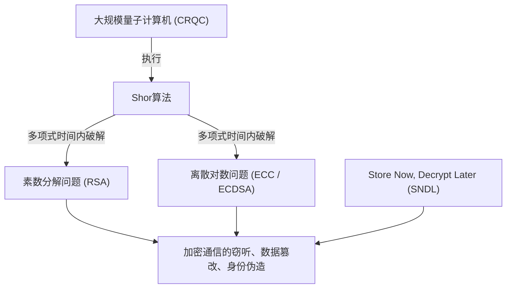
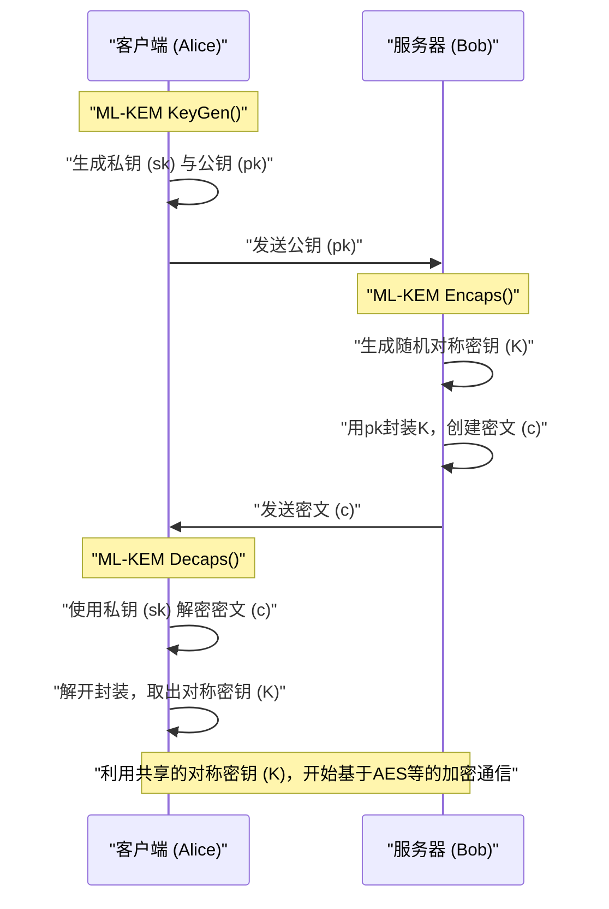
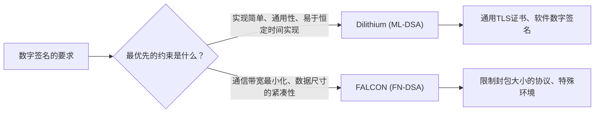

## 1. 引言：量子计算机带来的“密码危机”

在现代互联网社会中，为了保护通信的机密性和数据的完整性，公钥密码技术作为基础设施是不可或缺的。目前广泛使用的RSA加密和椭圆曲线加密（ECC），分别依赖于“大整数素数分解的困难性”和“椭圆曲线上离散对数问题的困难性”等数学壁垒来保证安全性。在经典计算机（包括超级计算机在内的我们目前使用的计算机）上，解开这些数学问题被证明需要比宇宙年龄还要长的时间，这一直是其安全性的依据。

然而，这一坚固的前提正随着**量子计算机**的理论与实用化进展而面临被彻底颠覆的危险。1994年，密码学家彼得·秀尔（Peter Shor）发表了“**Shor算法**”，理论上证明了在具备足够性能的容错通用量子计算机（CRQC: Cryptographically Relevant Quantum Computer）上运行该算法，能够在“多项式时间”内破解素数分解问题和离散对数问题。这意味着目前使用的所有公钥密码都将被使其无效化。



认为“真正的量子计算机还需要数十年才能完成，所以没有问题”是非常危险的。因为被称为**Store Now, Decrypt Later (SNDL：现在存储，稍后解密)**的攻击手法已经成为现实的威胁。这是一种恶意国家或黑客组织将当前加密的通信数据（如TLS流量等）大量存储起来，等到将来强大的量子计算机可用时，瞬间将其全部解密的攻击。国家机密、基础设施信息、需要长期保护的医疗数据等，已经暴露在这种威胁之下。

此外，针对对称密钥加密（如AES）和哈希函数（如SHA-256），1996年发现的**Grover算法**也同样存在。它能够将暴力破解（穷举攻击）的计算量减少到原来的平方根。也就是说，AES-128的安全级别实际上减半到了2的64次方，因此在量子时代，建议使用AES-256和SHA-384等更长的密钥和哈希长度。

为了应对这场前所未有的密码危机，基于即便使用量子计算机也难以破解的新数学问题的**抗量子密码学（Post-Quantum Cryptography: PQC）**应运而生。本文将基于美国国家标准与技术研究院（NIST）主导推进的PQC标准化进程的结果，从数学背景、机制到架构比较，极其详尽地解说主要的PQC算法。

---

## 2. NIST的PQC标准化项目全貌与历史

密码技术的迁移，包括协议的重新设计、系统的更新、硬件的更换等，需要数年至数十年的时间。因此，全世界的密码学家们很早就开始了PQC的研究。其中发挥核心作用的是美国的NIST（国家标准与技术研究院）。NIST在2016年公开招募了PQC的标准化流程，接受来自全世界密码学社区的全新密码算法提案。

标准化的对象主要分为以下两个类别：
1. **公钥密码 / 密钥封装机制 (KEM: Key Encapsulation Mechanism)**: 在TLS连接等场景中，为了加密通信路径，安全共享（分发）对称密钥的机制。
2. **数字签名 (Digital Signatures)**: 在软件更新或电子证书中，证明数据未被篡改且发送者身份真实（真实性）的机制。

经过大约6年非常激烈的评估、分析与密码破解竞争（Round 1〜Round 3），部分算法还进行了Round 4的追加评估。最终结果是，2024年以下算法作为正式的联邦信息处理标准（FIPS）发布，并确立为未来世界的标准。

- **FIPS 203 (ML-KEM)**: 基于CRYSTALS-Kyber的KEM
- **FIPS 204 (ML-DSA)**: 基于CRYSTALS-Dilithium的数字签名
- **FIPS 205 (SLH-DSA)**: 基于SPHINCS+的无状态基于哈希的签名
- **（未来计划制定）FN-DSA**: 基于FALCON的数字签名

这些被选定的算法所依赖的数学“困难性问题”各不相同，确保了即使某个算法将来被发现存在致命漏洞，整个系统也不会崩溃的多样性（Crypto Agility）。在标准化流程中，基于性能方面的考虑，格密码学（Lattice-based cryptography）成为了主力，而基于哈希的密码和基于编码的密码则作为强大的备份被采用。

---

## 3. PQC主要数学方法的分类

PQC算法根据其安全性依据的数学问题，主要分为以下五大类。本文将特别深入探讨前三类。

1. **格密码学 (Lattice-based Cryptography)**:
   基于多维格空间中的最短向量问题（SVP）、最近向量问题（CVP）及其衍生出的LWE问题。它是NIST标准化的核心，Kyber、Dilithium、FALCON均属于此类。处理速度、公钥大小和密文大小的平衡最出色，适合通用场景。
2. **基于哈希的密码学 (Hash-based Cryptography)**:
   仅依赖于密码学哈希函数（如SHA-2、SHAKE等）的“抗碰撞性”和“单向性”作为安全性依据。只能应用于数字签名（如SPHINCS+），但其安全性证明最为坚固，对未知的数学攻击具有极高的抵抗力。
3. **基于编码的密码学 (Code-based Cryptography)**:
   基于纠错码理论，依赖于伴随式解码问题（Syndrome Decoding Problem）的困难性。代表是20世纪70年代提出的Classic McEliece，拥有悠久的历史和已被验证的安全性，但缺点是公钥尺寸极大，达到兆字节级别。
4. **多变量多项式密码学 (Multivariate Polynomial Cryptography)**:
   基于求解有限域上多变量非线性二次方程组（MQ问题）的困难性。主要作为数字签名提出（如Rainbow等），但在NIST最后一轮评估期间，被发现只需一台普通电脑运行几天即可破解的强大攻击手段，导致许多算法退出了标准化。
5. **基于同源的密码学 (Isogeny-based Cryptography)**:
   基于椭圆曲线同源（Isogeny）图上的路径搜索问题。密钥尺寸非常小，曾被寄予厚望成为ECC的正统继任者，但最终候选者“SIKE”在2022年被利用经典数学（如Castryck-Decru攻击）在一台普通PC上仅耗时数小时就被完全破解，这场戏剧性的落幕象征着PQC设计的艰难与可怕。

---

## 4. 格密码学的深渊：LWE问题与Module-LWE的数学基础

目前最被看好并成为标准化核心的正是**格密码学**。其安全性的根基在于**LWE问题 (Learning with Errors: 带错学习问题)**。2005年由Oded Regev提出，这一划时代的成就让他获得了哥德尔奖。不理解LWE问题，就无法谈论现代PQC。

### 4.1. 什么是LWE问题 (Learning with Errors)

首先，我们来考虑一个简单的线性方程组。假设在某个模 $q$ （模 $q$）下，有一个已知的随机矩阵 $A$，一个未知的秘密向量 $\vec{s}$，并给出了它们的乘积 $\vec{b}$。

$$ \vec{b} = A\vec{s} \pmod q $$

此时，从公开信息 $A$ 和 $\vec{b}$ 求解未知的 $\vec{s}$ 是非常简单的。利用经典算法“高斯消元法”，可以在多项式时间内轻松计算出 $\vec{s}$。

但是，如果在等式中加入“微小的故意误差（噪声）”，问题的难度就会呈指数级飙升。这就是**LWE问题**。

准备一个未知的秘密向量 $\vec{s} \in \mathbb{Z}_q^n$ 和一个随机选择的矩阵 $A \in \mathbb{Z}_q^{m \times n}$。接着，准备一个按照正态分布或二项分布等选择的“元素值足够小”的误差向量 $\vec{e} \in \mathbb{Z}_q^m$，按如下方式计算 $\vec{b}$：

$$ \vec{b} = A\vec{s} + \vec{e} \pmod q $$

**Search LWE问题**就是“从公开信息 $(A, \vec{b})$ 中求出秘密信息 $\vec{s}$”的问题。由于存在这个误差 $\vec{e}$，如果尝试使用高斯消元法等代数解法，在方程的加减过程中，误差 $\vec{e}$ 会像滚雪球一样被放大，最终变得与随机值无法区分从而宣告失败。

LWE问题的伟大之处在于，存在一个强大的理论证明（规约）：除非存在能够解决格上“最坏情况复杂度问题（Worst-case hardness）”——如GapSVP（判定最短向量问题）或SIVP（最短独立向量问题）——的量子算法，否则LWE问题在平均情况（Average-case）下也是无法求解的。也就是说，即使是随机生成的加密密钥，也能保证其具有由理论上限支撑的坚固安全性。

### 4.2. Ring-LWE与Module-LWE带来的效率飞跃

普通的LWE问题（Standard LWE）安全性依据非常明确，但矩阵 $A$ 的尺寸会变得非常大，导致密钥大小达到兆字节级别，并不实用。于是有人提出了利用多项式环（Polynomial Rings）赋予代数结构的方法。

**Ring-LWE问题**中，不使用简单的向量或矩阵，而是使用某个多项式环 $R_q$ 的元素（多项式）。NIST标准中通常使用的是如下的分圆多项式环：

$$ R_q = \mathbb{Z}_q[X]/(X^n + 1) $$

这里，$n$ 是 2 的幂（例如：256），$q$ 是一个适当的素数。在这个环上，使用元素 $a, s, e \in R_q$ 计算 $b = a \cdot s + e \pmod q$。因为一个多项式 $a$ 拥有 $n$ 个系数，所以可以大幅压缩数据，并且通过使用一种称为**NTT (Number Theoretic Transform: 数论变换)** 的快速傅里叶变换（FFT）的有限域版本，可以以 $O(n \log n)$ 的计算复杂度超高速地进行多项式乘法。

但是，Ring-LWE 存在一种担忧：“起因于环的特殊代数结构，可能存在未知的漏洞”。此外，在更改安全级别（如相当于AES-128, 192, 256等）时，必须改变多项式的次数 $n$ 本身，伴随而来的是必须重写包括NTT算法在内的整个实现，这在工程上是个难题。

因此，被标准化的算法Kyber和Dilithium采用了**Module-LWE (M-LWE) 问题**。Module-LWE 是位于无结构的Standard LWE和结构性过强的Ring-LWE之间的折中方案，它使用以多项式环 $R_q$ 的元素为成分的 $k \times k$ 矩阵（模块）。

$$ \vec{b} = A\vec{s} + \vec{e} \pmod{R_q} \quad (A \in R_q^{k \times k}, \vec{s}, \vec{e} \in R_q^k) $$

Module-LWE 的最大优势在于，保持多项式的次数 $n$（NIST标准中 $n=256$）固定不变，仅通过改变矩阵的维度 $k$，就可以轻松实现安全级别的扩展。
例如，Kyber按如下方式调整维度 $k$：
- **Kyber512 (Level 1)**: $k = 2$ （相当于AES-128）
- **Kyber768 (Level 3)**: $k = 3$ （相当于AES-192）
- **Kyber1024 (Level 5)**: $k = 4$ （相当于AES-256）

这使得底层的NTT代码和多项式运算硬件电路能够在所有安全级别下实现100%的代码复用，极大地提高了实现的安全性与效率。

---

## 5. CRYSTALS-Kyber (ML-KEM)：下一代密钥封装机制

被正式标准化为 **FIPS 203 (ML-KEM)** 的 CRYSTALS-Kyber，是基于前述Module-LWE问题的密钥封装机制（KEM）。未来，它将成为TLS 1.3、SSH等协议中安全共享会话密钥的事实上的全球标准。

### 5.1. KEM (Key Encapsulation Mechanism) 的架构

在PQC时代，不再像RSA那样采用“客户端生成对称密钥，用服务器公钥加密后发送”的直接方法，而是将KEM这种封装框架作为标准。



### 5.2. Kyber的内部算法机制与藤崎-冈本变换

Kyber的设计非常优雅。首先，它构建了一个仅对CPA（选择明文攻击）安全的公钥加密方案（Kyber.CPAPKE），然后应用一种被称为**藤崎-冈本变换 (Fujisaki-Okamoto Transform)** 的极强密码学方法，将其升级为对CCA（适应性选择密文攻击）也安全的完美KEM。

CPAPKE核心的加密和解密机制如下：

1. **密钥生成 (Key Generation)**:
   - 从随机种子值在NTT域上生成矩阵 $A \in R_q^{k \times k}$。模数 $q$ 使用 $3329$。
   - 从中心二项分布（CBD）中采样具有小系数的秘密向量 $\vec{s}$ 和误差向量 $\vec{e}$。
   - 计算 $\vec{t} = A\vec{s} + \vec{e}$。公钥为 $(A, \vec{t})$，私钥为 $\vec{s}$。（实际上 $A$ 以种子值的形式公开，以节省带宽）。

2. **加密 (Encryption)**:
   - 将希望共享的32字节消息（对称密钥材料）$m$ 编码为多项式。
   - 生成新的随机向量 $\vec{r}$ 以及微小误差 $\vec{e_1}, e_2$。
   - $\vec{u} = A^T\vec{r} + \vec{e_1}$ 
   - $v = \vec{t}^T\vec{r} + e_2 + \lfloor q/2 \rceil \cdot m$
   - 密文即为 $(\vec{u}, v)$。

3. **解密 (Decryption)**:
   - 接收方计算 $v - \vec{s}^T\vec{u}$。
   - 将该式展开如下：
     $v - \vec{s}^T\vec{u} = (\vec{t}^T\vec{r} + e_2 + \lfloor q/2 \rceil \cdot m) - \vec{s}^T(A^T\vec{r} + \vec{e_1})$
   - 代入 $\vec{t} = A\vec{s} + \vec{e}$ 后，主项 $\vec{s}^TA^T\vec{r}$ 相互抵消。
   - 剩下的部分为 $\lfloor q/2 \rceil \cdot m + (\vec{e}^T\vec{r} + e_2 - \vec{s}^T\vec{e_1})$。
   - 括号内的项是“微小误差的乘积和求和”，因此整体依然是一个足够小的值（噪声）。于是，通过阈值判定每个系数是接近 $0$ 还是接近 $q/2$，即可完全无误差地还原原消息 $m$ 的每一位（0 或 1）。

Kyber最大的优势在于其压倒性的**处理速度**和**适中的密钥大小**。在Kyber768的情况下，公钥尺寸为1,184字节，密文尺寸为1,088字节，虽然相比于RSA-3072（密钥约384字节）要大，但可以无需进行数据包分割地容纳在现代互联网通信的MTU（最大传输单元）内，对网络延迟几乎没有负面影响。

---

## 6. CRYSTALS-Dilithium (ML-DSA)：基于格的通用数字签名

在数字签名的标准化过程中，同样是基于格密码学方法，拥有不同设计理念的算法相互竞争。其中，作为通用数字签名被选定为 **FIPS 204 (ML-DSA)** 的是 **CRYSTALS-Dilithium**。

### 6.1. 带有中止的Fiat-Shamir范式 (Fiat-Shamir with Aborts)

与Kyber一样，Dilithium也是一种基于Module-LWE（以及Module-SIS问题）的数字签名方案。其设计基础采用了一个极其重要的范式——“**带有中止的Fiat-Shamir变换 (Fiat-Shamir with Aborts)**”。

Fiat-Shamir变换本身是将交互式零知识证明协议转换为非交互式数字签名的一种标准方法。证明方（签名者）生成承诺 $y$，计算 $w = Ay$ 并通过哈希函数处理，获得随机挑战 $c$，随后计算响应 $z = y + cs$。

然而，在格密码学中如果简单应用这一方法，响应 $z$ 的分布会依赖于私钥 $s$ 的值而发生扭曲，导致观察到大量签名的攻击者可以一点点地泄露私钥 $s$ 的信息，这是一个致命的问题（侧信道数学泄露）。

Dilithium的设计团队（Lyubashevsky等人）引入了“**拒绝采样 (Rejection Sampling)**”方法。即如果签名计算结果 $z$ 的系数未能落入预设的安全阈值范围内，就废弃（Abort）整个签名过程，利用新的随机数 $y$ 从头开始计算。

通过这种方法，最终输出的签名 $z$ 成为完全均匀的分布，不再依赖于任何私钥信息，在数学上完美地防范了信息泄露。

### 6.2. Dilithium的优势与易实现性

Dilithium设计上的巨大优势在于，在签名生成过程中**完全不使用**复杂的“高斯分布采样”和“浮点运算”。仅需使用均匀分布采样、简单的整数模运算、NTT以及哈希函数（SHAKE）即可实现，因此无论是在嵌入式微控制器还是在云端服务器上，都能轻易地实现安全且恒定时间（Constant-time）的代码。这使得它对针对物理侧信道的定时攻击等具有极强的抵抗力。

---

## 7. FALCON (FN-DSA)：极致紧凑的格签名

NIST选择了**FALCON (Fast-Fourier Lattice-based Compact Signatures over NTRU)**作为具备与Dilithium不同特性的另一款基于格的签名标准化候选方案（目前正作为FN-DSA起草草案）。

### 7.1. NTRU格与高斯采样

FALCON最大的特点在于它不使用LWE问题，而是使用自1996年起就存在的历史悠久的**NTRU (N-th degree Truncated polynomial Ring Units) 格**。此外，它还采用了基于GPV (Gentry-Peikert-Vaikuntanathan) 框架的“**哈希与签名 (Hash-and-Sign)**”范式。

在Hash-and-Sign中，将消息的哈希值作为空间内的一个目标点，找到距离该目标点最近的格上的点（最近向量问题的近似解）作为签名。这要求使用作为私钥的“优质的短基”，按照离散高斯分布对点进行采样。

FALCON利用被称为“**快速傅里叶正交化 (Fast Fourier Orthogonalization: FFO)**”的技术，使得这种繁重的计算实现了极其显著的加速。

### 7.2. FALCON的优缺点

FALCON压倒性的优势在于其**签名尺寸和公钥尺寸极小（非常紧凑）**。相较于Dilithium3的签名尺寸约为3,309字节，FALCON-512的签名尺寸仅约666字节。公钥尺寸也非常小，为897字节，在通信带宽受限严重的环境、物联网（IoT）设备或特定网络协议中，它是无可替代的救星。

然而，它也存在一个重大缺陷。签名生成时必须进行涉及复杂**浮点运算（64位IEEE 754）**的离散高斯采样，因此要实现防止时间泄露的恒定时间实现（Constant-time implementation）极其困难，代码也会变得十分庞大。因此，相对于通用用途（Dilithium），FALCON被定位为面向特定用途的强大特化型算法。



---

## 8. SPHINCS+ (SLH-DSA)：拥有最强安全性的哈希签名

为了防范“未来某位天才数学家取得突破从而破解格密码学安全性”这一最坏情况（万一之事），NIST制定了与格密码学截然不同路径的标准——**FIPS 205 (SLH-DSA)**，即**SPHINCS+**。

SPHINCS+ 属于**基于哈希的签名**。其安全性的依据仅依赖于唯一一点：“所使用的密码学哈希函数（如SHA-2或SHAKE256等）具有抗碰撞性和单向性”。由于它不依赖于LWE或素数分解等具有特定代数结构的数学问题，因此未来无论出现多么强大的量子算法，只需单纯延长哈希函数的输出长度即可应对，夸耀着其极其坚固的安全性（最保守的安全级别）。

### 8.1. 利用WOTS+与FORS实现的无状态架构

基于哈希的签名历史悠久，可以追溯到20世纪70年代的Lamport签名和Winternitz一次性签名（WOTS）。这些是“只能安全签名一次”的用后即弃密钥。为了能多次使用，开发出了结合默克尔树（Merkle Tree）将无数次一次性密钥统一由一个根哈希来管理的XMSS（eXtended Merkle Signature Scheme）和LMS等算法。

但是，XMSS和LMS存在一个叫做“**有状态（Stateful）**”的严重缺陷。每次签名都必须在非易失性内存中严格记录“使用了第几个一次性密钥”的索引状态，如果因为虚拟机快照恢复等原因导致状态回溯，同一个一次性密钥被使用两次，私钥就会立刻泄露导致系统崩溃。

SPHINCS+则解决了这种状态管理的繁琐，是“**无状态（Stateless）**”的基于哈希的签名。
其核心技术由以下部分组合而成：
1. **WOTS+ (Winternitz One-Time Signature Plus)**: 基本的一次性签名。
2. **FORS (Forest of Random Subsets)**: 少次签名（Few-Time Signature）技术。即使重复使用该密钥数次也能保持安全。
3. **Hyper-Tree (巨大树结构)**: 将默克尔树多层叠加而成的庞大结构。

SPHINCS+在进行签名时，不再管理状态，而是利用伪随机数从Hyper-Tree底部的海量FORS密钥中随机挑选一个进行签名。由于树叶的数量属于天文数字量级，偶然两次选中同一个密钥的概率（碰撞）小到可以忽略不计，从而实现了无状态化。

SPHINCS+唯一也是最大的弱点在于，**签名尺寸非常庞大**。根据参数不同，签名尺寸可达17千字节至49千字节，签名生成速度也远慢于格密码学。因此，相比于日常网络浏览，它更适合被用于软件更新签名或根证书颁发机构（CA）证书等不需频繁签名，且强烈要求长期绝对安全的场景。

---

## 9. 基于编码的密码学：Classic McEliece这个古老而优秀的巨人

在NIST标准化进程中，作为Round 4的最终候选仍在继续评估的一个重要方案是，**基于编码的密码学**中的**Classic McEliece**。

1978年由Robert McEliece提出的这一算法，是公钥密码学历史中与RSA并肩最古老的算法之一。它利用了被称为“Goppa码（哥帕码）”的代数几何码，在消息中故意加入错误（噪声向量）进行加密，只有拥有作为私钥的Goppa码奇偶校验矩阵的人，才能利用其强大的纠错能力消除错误，从而解密出原始消息。这基于“**伴随式解码问题 (Syndrome Decoding Problem)**”。

$$ \vec{c} = \vec{m} G + \vec{e} $$
（$G$ 是公开的被置换过的生成矩阵，$\vec{e}$ 是汉明重量为 $t$ 的错误向量）

Classic McEliece令人惊叹之处在于，**它提出已逾40年，经历了全世界密码学界猛烈的破解研究，却从未被发现存在根本性的漏洞**，展示了压倒性的实绩。在PQC中，它是最具“时间证明之坚固安全性”的算法。

此外，它的密文尺寸非常小（仅有约100至200字节）。然而，它存在一个致命的缺点：**公钥的尺寸达到了兆字节（MB）级别**。即便是最低的安全级别（相当于AES-128），公钥也有约250KB，高安全级别下更是超过1MB。

正因如此，它完全无法适用于诸如TLS握手等每次通信都需要在网络上传输公钥的场景。不过，在预共享VPN密钥交换、将公钥硬编码至固件、或者是卫星通信等可以提前将公钥部署到系统中的特殊用例中，因其强大的安全性，它仍作为一个极具希望的选项被持续探讨。

---

## 10. 各PQC算法的性能比较与权衡

对于前面解说的各主要算法，在一般安全级别（相当于NIST Level 2〜3、AES-128〜192）下的性能特征，总结于下表。

| 算法 (标准名) | 类别 | 数学基础 | 公钥尺寸 | 私钥尺寸 | 密文/签名尺寸 | 处理速度倾向 | 主要特征与用途 |
| :--- | :--- | :--- | :--- | :--- | :--- | :--- | :--- |
| **Kyber768**<br>(ML-KEM) | KEM | Module-LWE | 1,184 Bytes | 2,400 Bytes | 1,088 Bytes | 非常快 | 密钥尺寸与速度平衡最佳。TLS 1.3等通用KEM标准。 |
| **Dilithium3**<br>(ML-DSA) | 签名 | Module-LWE | 1,952 Bytes | 4,032 Bytes | 3,309 Bytes | 生成与验证均快 | 实现简单。通用数字签名标准。 |
| **FALCON-512**<br>(FN-DSA) | 签名 | NTRU格 | 897 Bytes | 1,281 Bytes | 666 Bytes | 签名生成偏慢，验证超快 | 签名尺寸极小。但需要浮点运算。适合嵌入式与IoT。 |
| **SPHINCS+**<br>(SLH-DSA) | 签名 | 哈希函数 | 32 Bytes | 64 Bytes | 约 17,000 Bytes | 生成非常慢 | 几乎没有数学崩溃的风险。用于根证书等高安全用途。 |
| **Classic McEliece** | KEM | Goppa码 | **约 1.04 MB** | 13,568 Bytes | **188 Bytes** | 封装很快 | 40年安全性证明。公钥巨大。适合可硬编码环境。 |

### 权衡的理解
在PQC的世界里，不存在“尺寸小、速度快、数学保证完美”的魔法般的单一算法。
- **互联网标准 (Kyber / Dilithium)**: 性能平衡最佳，最适合作为当前RSA/ECC的直接替换（Drop-in replacement）。
- **极致的保守性 (SPHINCS+)** : 即使牺牲数据大小和处理速度，也希望对未来的数学突破有一份绝对保险时的选择。
- **面向特殊环境 (FALCON / Classic McEliece)**: 通信带宽极其狭窄，或是可以提前分发公钥等，根据环境限制而选择的特化型武器。

---

## 11. 面向实际应用的挑战与“混合加密”这一现实解

随着NIST标准化的完成和FIPS规范的正式发布，全世界IT基础设施向PQC的迁移（**PQC Migration**）已经正式拉开帷幕。谷歌的Chrome浏览器、苹果的iMessage（PQ3协议）、Cloudflare等网络提供商，已经开始在协议中实现对PQC的支持，并投入实际运营。

但是，突然完全切换到新密码算法伴随着非常高的风险。假设几年后有一位天才数学家发现了针对Kyber等格密码学的致命攻击手法（甚至连经典计算机也能利用的数学缺陷），那么依赖该算法的所有系统将会瞬间裸奔。

为了减轻这种不确定性风险，一个务实且被推荐的策略是“**混合加密 (Hybrid Cryptography)**”。

混合加密中，同时使用拥有多年实际验证的现行经典加密（如X25519等椭圆曲线加密）与新的PQC（如Kyber768）来进行密钥交换。各自的算法分别生成对称密钥的成分，最后使用安全的密钥派生函数（KDF）将两个成分混合，生成最终的主密钥。

```mermaid
graph TD
    A["客户端"] -->|① 发送 X25519公钥 + Kyber公钥| B["服务器"]
    B -->|② 返回 X25519共享密钥 + Kyber封装密文| A
    A --> C{"主密钥的派生 (KDF)"}
    B --> C
    C -->|输入: (X25519对称密钥) || (Kyber对称密钥)| D["安全的通信密钥 (AES-256 / ChaCha20)"]
    D -->|"同时抵抗 量子威胁 ＆ 传统经典漏洞"| E["安全的混合加密通信 (TLS 1.3)"]
```

如此一来，就实现了坚固的双重安全保障：“万一量子计算机实现并破解了ECC，Kyber能保护通信”；反之，“万一Kyber被发现了未知的数学缺陷，ECC依然能保护通信”。作为典型代表，IETF正在推进标准化的 **X25519MLKEM768 (原 X25519Kyber768)** 草案，正是目前Web浏览器与最先进的服务器间通信所采用的混合方式。

此外，在系统设计中，构建一种“不过度依赖特定密码算法，当算法崩溃时能迅速切换到另一算法（如从Kyber切换至McEliece，从Dilithium切换至SPHINCS+）的架构”的理念，即 **Crypto Agility（密码敏捷性）**，将成为未来系统开发中的必备要求。

---

## 12. 结语：密码技术的新地平线

量子计算机这项人类梦寐以求的科技，讽刺地成为了击破我们长年信赖的“素数分解”和“离散对数问题”等数学防线的最大威胁。然而，全世界的密码学家们并未屈服，他们开拓了诸如格理论、哈希函数树、纠错码等更为复杂且深邃的多维数学领域，筑起了抗量子密码学（PQC）这座新的防御堡垒。

NIST完成了 FIPS 203 (ML-KEM)、FIPS 204 (ML-DSA)、FIPS 205 (SLH-DSA) 的标准化并不是终点。这仅仅是未来将持续数十年的PQC迁移这场宏大旅程的第一步。对于软件工程师和系统架构师来说，如何将这些新算法带来的“密钥尺寸增大”和“计算成本变化”最优地融入并适应到网络协议和系统中，将是未来重大的技术挑战。

量子计算机与密码学的较量，是人类数学探索与技术进化交锋最激烈的激动人心的领域。希望通过本文，您能对PQC背后的优美数学理论，以及塑造网络安全未来的各算法令人惊叹的机制，有更深刻的理解。

---
*References:*
* *NIST Post-Quantum Cryptography Standardization Program*
* *FIPS 203: Module-Lattice-Based Key-Encapsulation Mechanism Standard*
* *FIPS 204: Module-Lattice-Based Digital Signature Standard*
* *FIPS 205: Stateless Hash-Based Digital Signature Standard*
