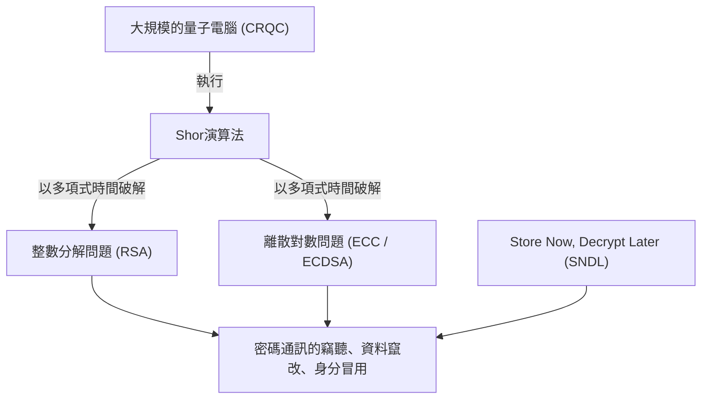
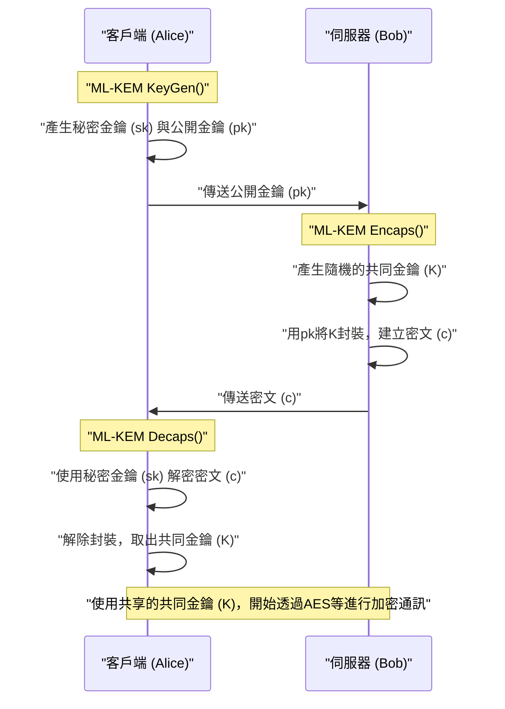
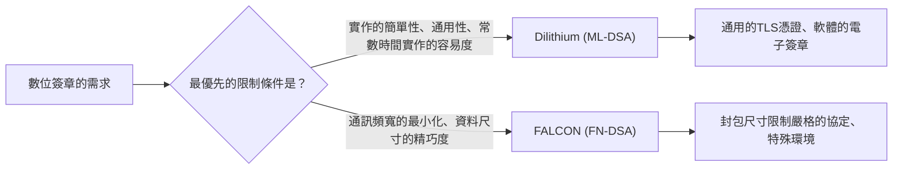

## 1. 前言：量子電腦帶來的「密碼危機」

在現代的網際網路社會中，為了保護通訊的機密性與資料的完整性，公開金鑰密碼技術是不可或缺的基礎設施。目前廣泛使用的RSA密碼與橢圓曲線密碼（ECC），分別依賴於「大質數整數分解的困難度」與「橢圓曲線上的離散對數問題的困難度」等數學壁壘來確保安全性。在古典電腦（包含超級電腦在內，我們現在正在使用的電腦）上，要解開這些數學問題所需的時間被證明比宇宙的年齡還要長，這一直以來都是安全性的依據。

然而，這個堅固的前提正因為**量子電腦**的理論與實用化進展而面臨徹底被推翻的危機。1994年，密碼學家彼得·秀爾（Peter Shor）發表的「**Shor演算法（秀爾演算法）**」在理論上證明，只要在具備足夠效能的容錯通用量子電腦（CRQC: Cryptographically Relevant Quantum Computer）上執行，就能在「多項式時間」內破解整數分解問題與離散對數問題。這意味著目前使用的公開金鑰密碼將全部失效。



認為「量子電腦真正完成還需要幾十年，所以現在沒問題」是非常危險的。因為被稱為**Store Now, Decrypt Later (SNDL：現在儲存，稍後解密)** 的攻擊手法已經成為現實的威脅。這是指惡意的國家或駭客組織將目前加密的通訊資料（如TLS流量等）大量儲存起來，等到未來強大的量子電腦可用的瞬間，再將其全部解密的攻擊。國家機密、基礎設施資訊、需要長期保護的醫療資料等，已經暴露在這個威脅之下。

此外，針對對稱金鑰密碼（如AES）與雜湊函數（如SHA-256），也存在1996年發現的**Grover演算法**。這能將暴力破解攻擊（Brute-force）的運算量減少到平方根。也就是說，AES-128的安全級別實質上將減半至2的64次方，因此在量子時代，建議使用如AES-256或SHA-384等更長長度的金鑰與雜湊值。

為對抗這場前所未有的密碼危機而誕生的，就是即使使用量子電腦也難以破解、基於全新數學問題的**抗量子密碼學（Post-Quantum Cryptography: PQC）**。本文將根據美國國家標準暨技術研究院（NIST）主導的PQC標準化流程結果，針對主要的PQC演算法，從其數學背景、機制到架構比較進行極為詳細的解說。

---

## 2. NIST的PQC標準化專案全貌與歷史

密碼技術的過渡（包含協定重新設計、系統更新、硬體更換等）需要花費數年到數十年的時間。因此，世界各地的密碼學家從很早以前就開始進行PQC的研究。其中扮演核心角色的是美國的NIST（國家標準暨技術研究院）。NIST在2016年公開徵求PQC標準化流程，接受來自全球密碼社群提出的全新密碼演算法。

標準化的對象主要分為以下兩個類別：
1. **公開金鑰密碼 / 金鑰封裝機制 (KEM: Key Encapsulation Mechanism)**：在TLS連線等情境中，為了加密通訊路徑，安全地共享（配送）共同金鑰的機制。
2. **數位簽章 (Digital Signatures)**：在軟體更新或電子憑證中，證明資料未被竄改以及發送者未被冒用（真實性）的機制。

經歷了約6年非常激烈的評估、分析與密碼破解競爭（Round 1～Round 3）後，更針對部分演算法進行了Round 4的追加評估。其結果是，在2024年，以下演算法正式成為聯邦資訊處理標準（FIPS），並確立為未來的世界標準。

- **FIPS 203 (ML-KEM)**：基於CRYSTALS-Kyber的KEM
- **FIPS 204 (ML-DSA)**：基於CRYSTALS-Dilithium的數位簽章
- **FIPS 205 (SLH-DSA)**：基於SPHINCS+的無狀態雜湊基數位簽章
- **（預計未來制定）FN-DSA**：基於FALCON的數位簽章

這些被選定的演算法所依賴的數學「困難度問題」各不相同，這是為了確保即使某一個演算法在未來被發現有致命漏洞，整個系統也不會崩潰的「密碼敏捷性 (Crypto Agility)」。在標準化過程中，雖然晶格密碼 (Lattice-based cryptography) 因為效能優勢成為主角，但雜湊基密碼與編碼基密碼也被採用作為強大的後盾。

---

## 3. PQC主要數學方法的分類

PQC演算法根據其安全性基礎的數學問題，主要可分為以下5大類。本文將特別針對前3類進行深入探討。

1. **晶格密碼 (Lattice-based Cryptography)**：
   基於多維晶格空間中的最短向量問題（SVP）與最近向量問題（CVP），以及由此衍生出的LWE問題。這是NIST標準化的核心，Kyber、Dilithium、FALCON皆屬此類。其處理速度、公開金鑰大小與密文大小的平衡最為優異，適合通用。
2. **雜湊基密碼 (Hash-based Cryptography)**：
   僅將安全性基礎建立在密碼學雜湊函數（如SHA-2或SHAKE等）的「抗碰撞性」與「單向性」上。雖然只能應用於數位簽章（如SPHINCS+等），但其安全性證明最為強固，對未知數學攻擊的抵抗力極高。
3. **編碼基密碼 (Code-based Cryptography)**：
   基於錯誤更正碼理論，依賴於症狀解碼問題（Syndrome Decoding Problem）的困難度。1970年代提出的Classic McEliece是其代表，雖然擁有非常悠久的歷史與經過驗證的安全性，但公開金鑰的尺寸會極端龐大（達到MB等級）。
4. **多變數多項式密碼 (Multivariate Polynomial Cryptography)**：
   基於在有限體上求解多變數聯立二次方程式（MQ問題）的困難度。主要被提案作為數位簽章（如Rainbow等），但在NIST最後一輪評估期間，被發現能用一台普通電腦在幾天內破解的強大攻擊手法，導致許多演算法退出了標準化。
5. **同源密碼 (Isogeny-based Cryptography)**：
   基於橢圓曲線同源（Isogeny）圖上的路徑搜尋問題。金鑰尺寸非常小，曾被期待作為ECC的正統繼承者，但在2022年，最終候選者「SIKE」被利用古典數學（如Castryck-Decru攻擊）在一般PC上僅花幾小時就完全破解，以戲劇性的方式落幕，象徵了PQC設計的困難與可怕。

---

## 4. 晶格密碼的深淵：LWE問題與Module-LWE的數學基礎

目前最被看好且成為標準化核心的**晶格密碼**，其安全性根基在於**LWE問題 (Learning with Errors: 帶誤差學習問題)**。2005年由Oded Regev提出，他並憑藉這項劃時代的貢獻獲得了哥德爾獎（Gödel Prize）。若不了解LWE問題，就無法談論現代的PQC。

### 4.1. 什麼是LWE問題 (Learning with Errors)

首先，讓我們考慮一個簡單的聯立一次方程式。假設在某個模數 $q$ （modulo $q$）下，有一個已知的隨機矩陣 $A$ ，與一個未知的秘密向量 $\vec{s}$ ，並給定兩者的乘積 $\vec{b}$ 。

$$ \vec{b} = A\vec{s} \pmod q $$

此時，從公開資訊 $A$ 與 $\vec{b}$ 中，要找出未知的 $\vec{s}$ 非常簡單。只要使用古典的演算法「高斯消去法」，就能在多項式時間內輕鬆計算出 $\vec{s}$ 。

然而，如果在方程式中加入「微小的刻意誤差（雜訊）」，問題的難度就會劇烈攀升。這就是**LWE問題**。

準備一個未知的秘密向量 $\vec{s} \in \mathbb{Z}_q^n$ ，與一個隨機挑選的矩陣 $A \in \mathbb{Z}_q^{m \times n}$ 。接著，再準備一個依照常態分佈或二項分佈挑選、且「元素值足夠小」的誤差向量 $\vec{e} \in \mathbb{Z}_q^m$ ，然後以下列方式計算 $\vec{b}$ ：

$$ \vec{b} = A\vec{s} + \vec{e} \pmod q $$

**Search LWE問題**是指「從公開資訊 $(A, \vec{b})$ 中求出秘密資訊 $\vec{s}$ 」的問題。由於存在這個誤差 $\vec{e}$ ，當我們嘗試使用高斯消去法等代數解法時，在方程式加減的過程中，誤差 $\vec{e}$ 會像雪球一樣越滾越大，最終與隨機值無法區分而導致解法失敗。

LWE問題的厲害之處在於，它具有強大的理論證明（歸約）：除非存在能夠解開晶格上「最壞情況複雜度問題 (Worst-case hardness)」如GapSVP（判定最短向量問題）或SIVP（最短獨立向量問題）的量子演算法，否則LWE問題在「平均情況 (Average-case)」下也無法被解開。也就是說，即使是隨機產生的加密金鑰，也能保證擁有由理論上限作為後盾的強固安全性。

### 4.2. 透過Ring-LWE與Module-LWE帶來的劇烈效率提升

一般的LWE問題（Standard LWE）雖然安全性基礎非常明確，但矩陣 $A$ 的尺寸會變得非常大，導致金鑰尺寸達到MB等級，因此不具實用性。於是提出了利用多項式環（Polynomial Rings）來賦予代數結構的方法。

在**Ring-LWE問題**中，不再使用單純的向量或矩陣，而是使用某個多項式環 $R_q$ 的元素（多項式）。NIST標準中一般使用的是如下的分圓多項式環：

$$ R_q = \mathbb{Z}_q[X]/(X^n + 1) $$

這裡，$n$ 是2的次方（例如：256），$q$ 是適當的質數。在這個環上，使用元素 $a, s, e \in R_q$ 來計算 $b = a \cdot s + e \pmod q$ 。因為一個多項式 $a$ 就有 $n$ 個係數，這能大幅壓縮資料，且透過稱為**NTT (Number Theoretic Transform: 數論轉換)** 的有限體版本快速傅立葉轉換（FFT），能以 $O(n \log n)$ 的運算量超高速地進行多項式乘法。

然而，Ring-LWE存在「可能因為環的特殊代數結構而存在未知漏洞」的隱憂。此外，當需要變更安全級別（例如相當於AES-128、192、256等）時，必須改變多項式的次數 $n$ 本身，這會伴隨著必須重寫NTT演算法等整個實作的工程問題。

因此，被標準化演算法Kyber與Dilithium所採用的，就是**Module-LWE (M-LWE) 問題**。Module-LWE是位於無結構的Standard LWE與過度結構化的Ring-LWE之間的一種折衷方案，它使用以多項式環 $R_q$ 的元素為成分的 $k \times k$ 矩陣（模組）。

$$ \vec{b} = A\vec{s} + \vec{e} \pmod{R_q} \quad (A \in R_q^{k \times k}, \vec{s}, \vec{e} \in R_q^k) $$

Module-LWE最大的優點在於，可以保持多項式的次數 $n$ 固定（在NIST標準中 $n=256$），只需改變矩陣的維度 $k$ ，就能輕易地擴展安全級別。
例如在Kyber中，維度 $k$ 調整如下：
- **Kyber512 (Level 1)**: $k = 2$ （相當於 AES-128）
- **Kyber768 (Level 3)**: $k = 3$ （相當於 AES-192）
- **Kyber1024 (Level 5)**: $k = 4$ （相當於 AES-256）

這使得底層的NTT程式碼或多項式運算的硬體電路可以在所有安全級別中達到100%的重複使用，讓實作的安全性與效率都獲得了劇烈提升。

---

## 5. CRYSTALS-Kyber (ML-KEM)：次世代的金鑰封裝機制

正式被標準化為**FIPS 203 (ML-KEM)** 的CRYSTALS-Kyber，是基於前述Module-LWE問題的金鑰封裝機制 (KEM)。未來，它將成為在TLS 1.3或SSH等協議中安全共享會話金鑰 (Session Key) 的實質世界標準。

### 5.1. KEM (Key Encapsulation Mechanism) 的架構

在PQC時代，標準將不再是像RSA那樣「由客戶端建立共同金鑰並用伺服器的公開金鑰加密傳送」的直接作法，而是採用KEM這種封裝框架。



### 5.2. Kyber的內部演算法機制與藤崎-岡本轉換

Kyber的設計非常精練。首先，建構出只對CPA（選擇明文攻擊）安全的公開金鑰密碼系統（Kyber.CPAPKE），然後對其套用被稱為**藤崎-岡本轉換 (Fujisaki-Okamoto Transform)** 的密碼學強大手法，將其升級為對CCA（適應性選擇密文攻擊）也安全的完整KEM設計。

CPAPKE核心的加密與解密機制如下：

1. **金鑰生成 (Key Generation)**：
   - 從隨機的種子值，在NTT網域上產生矩陣 $A \in R_q^{k \times k}$ 。模數 $q$ 使用 $3329$ 。
   - 從中心二項分佈（CBD）中，取樣出具有微小係數的秘密向量 $\vec{s}$ 與誤差向量 $\vec{e}$ 。
   - 計算 $\vec{t} = A\vec{s} + \vec{e}$ 。公開金鑰為 $(A, \vec{t})$ ，秘密金鑰為 $\vec{s}$ 。（實際上 $A$ 是作為種子值公開，以節省頻寬）。

2. **加密 (Encryption)**：
   - 將想要共享的32位元組訊息（共同金鑰材料） $m$ 編碼為多項式。
   - 產生新的隨機向量 $\vec{r}$ 與微小誤差 $\vec{e_1}, e_2$ 。
   - $\vec{u} = A^T\vec{r} + \vec{e_1}$ 
   - $v = \vec{t}^T\vec{r} + e_2 + \lfloor q/2 \rceil \cdot m$
   - 密文為 $(\vec{u}, v)$ 。

3. **解密 (Decryption)**：
   - 接收者計算 $v - \vec{s}^T\vec{u}$ 。
   - 將這個算式展開如下：
     $v - \vec{s}^T\vec{u} = (\vec{t}^T\vec{r} + e_2 + \lfloor q/2 \rceil \cdot m) - \vec{s}^T(A^T\vec{r} + \vec{e_1})$
   - 這裡將 $\vec{t} = A\vec{s} + \vec{e}$ 代入，主項 $\vec{s}^TA^T\vec{r}$ 就會互相抵銷。
   - 剩下的部分為 $\lfloor q/2 \rceil \cdot m + (\vec{e}^T\vec{r} + e_2 - \vec{s}^T\vec{e_1})$ 。
   - 括號內的項目是「微小誤差之間的乘積與和」，所以整體來說也只是一個夠小的值（雜訊）。因此，只要透過閾值判定各係數是接近 $0$ 還是接近 $q/2$ ，就能完美、毫無錯誤地還原出原始訊息 $m$ 的位元（0或1）。

Kyber最大的優勢在於其壓倒性的**處理速度**與**適中的金鑰尺寸**。以Kyber768為例，公開金鑰尺寸為1,184位元組，密文尺寸為1,088位元組，雖然與RSA-3072（金鑰尺寸約384位元組）等相比來得大，但可以不用切割封包，直接容納在現代網際網路通訊的MTU（Maximum Transmission Unit）內，對網路的延遲幾乎沒有不良影響。

---

## 6. CRYSTALS-Dilithium (ML-DSA)：基於晶格的通用數位簽章

在數位簽章的標準化過程中，即使在同樣的晶格密碼方法中，也有著不同設計理念的演算法互相競爭。其中被選為通用數位簽章**FIPS 204 (ML-DSA)** 的，就是**CRYSTALS-Dilithium**。

### 6.1. Fiat-Shamir with Aborts 典範

Dilithium與Kyber同樣是基於Module-LWE（以及Module-SIS問題）的數位簽章機制。其設計基礎採用了名為「**Fiat-Shamir with Aborts (伴隨中斷的Fiat-Shamir轉換)**」的極為重要之典範 (Paradigm)。

Fiat-Shamir轉換本身是將互動式零知識證明協定轉換為非互動式數位簽章的標準手法。證明者（簽章者）產生承諾 (Commitment) $y$ ，計算 $w = Ay$ 並輸入雜湊函數，從而獲得隨機的挑戰 $c$ ，再計算回應 $z = y + cs$ 。

然而，如果將其單純地應用在晶格密碼上，回應 $z$ 的分佈將會依賴於秘密金鑰 $s$ 的值而產生扭曲。這會導致觀察了大量簽章的攻擊者能一點一滴地取得秘密金鑰 $s$ 的資訊，這是一個致命的問題（側信道般的數學外洩）。

Dilithium的設計團隊（Lyubashevsky等人）導入了一種名為「**拒絕取樣 (Rejection Sampling)**」的手法：如果簽章的計算結果 $z$ 的係數沒有落在預先設定的安全閾值範圍內，就將整個簽章過程作廢（Abort），並使用新的亂數 $y$ 從頭開始計算。

透過這種方式，最終輸出的簽章 $z$ 會呈現完全獨立於秘密金鑰的均勻分佈，在數學上完美地防止了資訊外洩。

### 6.2. Dilithium的優點與實作的容易度

Dilithium在設計上的一大優勢是，在簽章生成過程中**完全不使用**複雜的「高斯分佈取樣」或「浮點數運算」。因為只需透過均勻分佈取樣、單純的整數模數運算、NTT以及雜湊函數（SHAKE）就能實作，這讓它在從嵌入式微控制器到雲端伺服器等廣泛的環境中，都很容易進行安全且常數時間（Constant-time）的實作。這使得它對計時攻擊（Timing Attack）等物理側信道攻擊也擁有強大的抵抗力。

---

## 7. FALCON (FN-DSA)：極致精巧的晶格簽章

NIST選擇了與Dilithium具備不同特性的另一個晶格基簽章——**FALCON (Fast-Fourier Lattice-based Compact Signatures over NTRU)**，作為標準化候選者（目前正作為FN-DSA制定草案中）。

### 7.1. NTRU晶格與高斯取樣

FALCON最大的特徵在於，它使用的不是LWE問題，而是從1996年就存在、歷史悠久的**NTRU (N-th degree Truncated polynomial Ring Units) 晶格**。此外，它採用了基於GPV (Gentry-Peikert-Vaikuntanathan) 框架的「**雜湊與簽章 (Hash-and-Sign)**」典範。

在Hash-and-Sign中，會將訊息的雜湊值作為空間內的目標點，並尋找晶格上最接近該點的點（最近向量問題的近似解）來作為簽章。為此，必須使用作為秘密金鑰的「高品質的短基底」，並依據離散高斯分佈進行點的取樣。

FALCON利用被稱為「**快速傅立葉正交化 (Fast Fourier Orthogonalization: FFO)**」的手法，將這種繁重的計算進行了劇烈的加速。

### 7.2. FALCON的優缺點

FALCON壓倒性的優勢在於其**簽章尺寸與公開金鑰尺寸極為精巧（Compact）**。相較於Dilithium3的簽章尺寸約為3,309位元組，FALCON-512的簽章尺寸僅有約666位元組。公開金鑰也非常小，只有897位元組，在通訊頻寬極度受限的環境、IoT裝置，或是特定的網路協定中，它將成為救星。

然而，它存在一個重大的缺點。由於生成簽章時必須進行伴隨著複雜**浮點數運算（64-bit IEEE 754）**的離散高斯取樣，使得要防止計時外洩的常數時間實作（Constant-time implementation）變得極為困難，程式碼也會變得龐大。因此，FALCON相對於通用型（Dilithium），定位為專為特定用途設計的強大特化型演算法。



---

## 8. SPHINCS+ (SLH-DSA)：擁有最強安全性的雜湊基簽章

為了防範未來晶格密碼的安全性被天才數學家的突破所瓦解的最壞情況（萬一發生），NIST制定了與晶格密碼方法完全不同的標準 **FIPS 205 (SLH-DSA)**，也就是 **SPHINCS+**。

SPHINCS+被分類為**雜湊基簽章**。其安全性基礎僅依賴於「所使用的密碼學雜湊函數（如SHA-2或SHAKE256等）具備抗碰撞性與單向性」這一點上。因為它不依賴如LWE或整數分解等具有特定代數結構的數學問題，所以未來無論出現多麼強大的量子演算法，只需單純增加雜湊函數的輸出長度就能對抗，擁有極度強固的安全性（最保守的安全等級）。

### 8.1. WOTS+ 與 FORS 的無狀態架構

雜湊基簽章的歷史悠久，可追溯至1970年代的Lamport簽章與Winternitz單次簽章（WOTS）。這些都是「只能安全簽章1次」的拋棄式金鑰。為了使其能使用多次，開發了結合默克爾樹（Merkle Tree），將無數的單次金鑰透過一個根雜湊來管理的XMSS（eXtended Merkle Signature Scheme）與LMS等演算法。

然而，XMSS與LMS有一個致命的缺點，那就是它們是「**有狀態的 (Stateful)**」。每次簽章時，都必須將「使用了第幾個單次金鑰」的索引狀態嚴格記錄在非揮發性記憶體中。如果因為虛擬機器的快照還原等原因導致狀態回溯，而不小心使用了同一個單次金鑰兩次，秘密金鑰就會立刻外洩，導致系統崩潰。

SPHINCS+解決了這種狀態管理的麻煩，是一種「**無狀態 (Stateless)**」的雜湊基簽章。
其核心技術是以下技術的組合：
1. **WOTS+ (Winternitz One-Time Signature Plus)**：基本的單次簽章。
2. **FORS (Forest of Random Subsets)**：少次簽章（Few-Time Signature）技術。同一個金鑰重複使用幾次仍能保持安全。
3. **Hyper-Tree (巨大樹狀結構)**：將默克爾樹多層疊加的巨大結構。

在進行簽章時，SPHINCS+不進行狀態管理，而是從Hyper-Tree底層數量龐大的FORS金鑰中，利用偽亂數隨機挑選一個來進行簽章。由於樹葉的數量達到天文數字，不小心挑選到同一個金鑰的機率（碰撞）小到可以忽略，結果成功實現了無狀態設計。

SPHINCS+唯一也是最大的弱點在於，**簽章尺寸非常巨大**。依據參數不同，簽章尺寸會達到17KB～49KB，且簽章生成速度與晶格密碼相比也壓倒性地慢。因此，相較於日常的網頁瀏覽，它更適合用於軟體更新簽章或根憑證授權單位（CA）憑證等，不需頻繁簽章且強烈要求長期絕對安全性的用途。

---

## 9. 編碼基密碼：Classic McEliece這位美好的老巨人

在NIST的標準化流程中，目前作為Round 4最終候選者持續接受評估的重要方法，是**編碼基密碼**的**Classic McEliece**。

這個由Robert McEliece於1978年提出的演算法，在公開金鑰密碼的歷史中與RSA並列為最古老的演算法之一。它利用了被稱為「Goppa碼（戈帕碼）」的代數幾何碼，刻意在訊息中加入錯誤（雜訊向量）進行加密，只有擁有Goppa碼同位檢查矩陣作為秘密金鑰的人，才能利用強大的錯誤更正能力去除錯誤，解密出原始訊息，這是基於「**症狀解碼問題 (Syndrome Decoding Problem)**」。

$$ \vec{c} = \vec{m} G + \vec{e} $$
（$G$ 為公開金鑰，即打亂後的生成矩陣，$\vec{e}$ 為權重為 $t$ 的錯誤向量）

Classic McEliece令人驚訝之處在於，**從提出至今已經超過40年，歷經全球密碼學家猛烈的破解研究，卻從未被發現有本質上的漏洞**，擁有壓倒性的實績。它是PQC中擁有「最經過時間考驗的強固安全性」的演算法。

此外，它還具備密文尺寸非常小（僅約100～200位元組）的優點。然而，它存在一個致命的缺點，就是**公開金鑰的尺寸會達到MB (Megabyte) 等級**。即便是最低的安全級別（相當於AES-128），公開金鑰也大約有250KB，而在更高的安全級別中會超過1MB。

因此，它完全無法適用於像TLS交握這種每次通訊都需要在網路上傳送公開金鑰的用途。不過，在VPN的預先共享金鑰交換、將公開金鑰硬編碼到韌體中，或是衛星通訊等可以預先將公開金鑰部署在系統中的特殊使用案例裡，由於其強固的安全性，它仍持續被視為極具潛力的選擇。

---

## 10. 各PQC演算法的效能比較與取捨

針對目前為止解說過的主要演算法，在一般安全級別（相當於NIST Level 2〜3，AES-128〜192級別）下的效能特性整理如下表。

| 演算法 (標準名稱) | 類別 | 數學基礎 | 公開金鑰尺寸 | 秘密金鑰尺寸 | 密文/簽章尺寸 | 處理速度傾向 | 主要特徵與用途 |
| :--- | :--- | :--- | :--- | :--- | :--- | :--- | :--- |
| **Kyber768**<br>(ML-KEM) | KEM | Module-LWE | 1,184 Bytes | 2,400 Bytes | 1,088 Bytes | 非常快 | 金鑰尺寸與速度平衡最佳。TLS 1.3等的通用KEM標準。 |
| **Dilithium3**<br>(ML-DSA) | 簽章 | Module-LWE | 1,952 Bytes | 4,032 Bytes | 3,309 Bytes | 生成與驗證皆快 | 實作簡單。通用的數位簽章標準。 |
| **FALCON-512**<br>(FN-DSA) | 簽章 | NTRU晶格 | 897 Bytes | 1,281 Bytes | 666 Bytes | 簽章生成偏慢，驗證超快 | 簽章尺寸極小。但需要浮點數運算。適合嵌入式、IoT。 |
| **SPHINCS+**<br>(SLH-DSA) | 簽章 | 雜湊函數 | 32 Bytes | 64 Bytes | 約 17,000 Bytes | 生成非常慢 | 數學破綻風險幾乎為零。根憑證等高安全需求用途。 |
| **Classic McEliece** | KEM | Goppa碼 | **約 1.04 MB** | 13,568 Bytes | **188 Bytes** | 封裝快 | 40年安全性實績。公開金鑰巨大。適合可硬編碼的環境。 |

### 理解取捨 (Trade-offs)
在PQC的世界裡，不存在「尺寸小、速度快且數學保證完美」這種魔法般的單一演算法。
- **網際網路標準 (Kyber / Dilithium)**：效能平衡最好，最適合目前RSA/ECC的直接替換（Drop-in replacement）。
- **極致的保守性 (SPHINCS+)**：在犧牲資料尺寸與處理速度的情況下，為了防範未來的數學突破而選擇的絕對保險。
- **針對特殊環境 (FALCON / Classic McEliece)**：為了適應通訊頻寬極度狹窄，或是可以預先派發金鑰等環境限制所選擇的特化型武器。

---

## 11. 邁向實用化的課題與「混合密碼」的現實解方

隨著NIST完成標準化並正式發布FIPS標準，全球IT基礎設施的PQC過渡（**PQC轉移 (PQC Migration)**）已正式展開。Google的Chrome瀏覽器、Apple的iMessage（PQ3協定）以及Cloudflare等網路供應商，已經將PQC的支援實作到協定中並開始實際上線運作。

然而，突然完全切換到新的密碼演算法伴隨著極高的風險。假設幾年後有天才數學家對Kyber等晶格密碼發現了致命的攻擊手法（如在古典電腦上也能解開的數學缺陷），那麼依賴該演算法的整個系統就會在一瞬間形同裸奔。

為減輕這種不確定性風險，既現實又被推薦的方法就是「**混合密碼 (Hybrid Cryptography)**」。

在混合密碼中，會同時使用擁有長年實績的現行古典密碼（例如：X25519等橢圓曲線密碼）與新的PQC（例如：Kyber768）來進行金鑰交換。各演算法分別生成共同金鑰成分，最後再使用安全的金鑰衍生函數（KDF）將兩個成分混合，生成最終的主秘密金鑰 (Master Secret)。

```mermaid
graph TD
    A["客戶端"] -->|① 傳送 X25519 的公開金鑰 + Kyber 的公開金鑰| B["伺服器"]
    B -->|② 回傳 X25519 的共享金鑰 + Kyber 的封裝密文| A
    A --> C{"衍生主秘密金鑰 (KDF)"}
    B --> C
    C -->|輸入: (X25519 的共同金鑰) || (Kyber 的共同金鑰)| D["安全的通訊金鑰 (AES-256 / ChaCha20)"]
    D -->|"同時抵抗 量子威脅 ＆ 古典漏洞"| E["安全的混合密碼通訊 (TLS 1.3)"]
```

透過這種方式，就能實現「萬一量子電腦實現且ECC被破解，還有Kyber能保護通訊」，反之「萬一Kyber被發現有未知數學缺陷，還有ECC能保護通訊」這種堅固的雙重防護安全性。代表性的例子就是IETF正在進行標準化的 **X25519MLKEM768 (舊稱 X25519Kyber768)** 草案，目前網頁瀏覽器與最先進的伺服器之間的通訊，正是採用這種混合方式。

此外，在系統設計時，建立「不過度依賴特定密碼演算法，當演算法崩潰時能迅速切換到另一個演算法（如從Kyber切換到McEliece，從Dilithium切換到SPHINCS+）的架構」，這種被稱為 **密碼敏捷性 (Crypto Agility)** 的概念，將成為未來系統開發中不可或缺的需求。

---

## 12. 總結：密碼技術的新視野

量子電腦這項人類夢想中的科技，諷刺地成為了打破我們長年信賴的「整數分解」與「離散對數問題」等數學防壁的最大威脅。然而，世界各地的密碼學家並沒有因此屈服，反而開拓了晶格理論、雜湊函數樹、錯誤更正碼等更複雜深奧的多維數學領域，築起了名為抗量子密碼學（PQC）的新防線。

NIST完成 FIPS 203 (ML-KEM)、FIPS 204 (ML-DSA)、FIPS 205 (SLH-DSA) 的標準化並非終點，這只是接下來將持續數十年的PQC轉移這趟壯闊旅程的第一步。對軟體工程師與系統架構師而言，如何將這些新演算法帶來的「金鑰尺寸增加」與「運算成本改變」最佳地適應到網路協定與系統中，將是未來的重大技術課題。

量子電腦與密碼的戰爭，是人類數學探索與科技進化最激烈交會的刺激領域。希望透過本文，能讓您深入了解PQC背後優美的數學理論，以及形塑網路安全未來的各演算法令人驚嘆的機制。

---
*參考文獻 (References):*
* *NIST Post-Quantum Cryptography Standardization Program*
* *FIPS 203: Module-Lattice-Based Key-Encapsulation Mechanism Standard*
* *FIPS 204: Module-Lattice-Based Digital Signature Standard*
* *FIPS 205: Stateless Hash-Based Digital Signature Standard*
