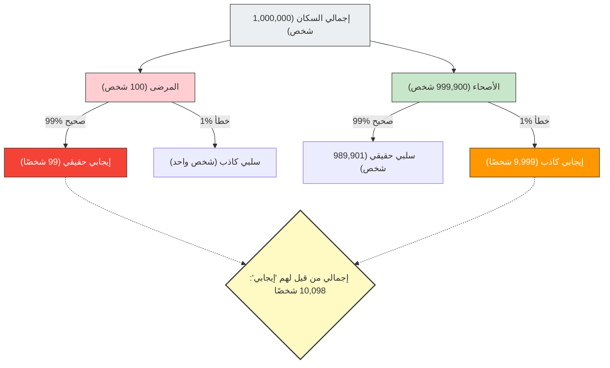

إذا ظهرت نتيجة "إيجابية (يوجد خلل)" في الفحص الطبي أو فحص السرطان، فمن المؤكد أن أي شخص سيصاب بالذعر.
ولكن، إذا كانت لديك معرفة بالإحصاء والاحتمالات، فقد تتمكن من أخذ نفس عميق والهدوء. لأنه **"حتى لو كانت نتيجة الفحص عالي الدقة إيجابية"، فهذا لا يعني بالضرورة أن "احتمالية إصابتك بالمرض بالفعل عالية"**.

هذا ما يسمى **"مغالطة معدل الأساس (Base Rate Fallacy)"** أو "إهمال الاحتمال القبلي"، وهو انحياز معرفي نموذجي حيث تخطئ فيه البديهة البشرية بشكل كبير في حساب الاحتمالات.

## مسألة الفحص الطبي المرعبة

تخيل الموقف التالي.

في مدينة ما، يوجد مرض مجهول يصيب شخصًا واحدًا من بين كل 10,000 شخص (0.01%).
لاكتشاف هذا المرض، تم تطوير مجموعة فحص ممتازة بـ **"دقة 99%"**.
(* دقة 99% تعني أنه إذا خضع شخص مريض للفحص، فسيتم تشخيصه بشكل صحيح على أنه "إيجابي" باحتمال 99%، وإذا خضع شخص سليم للفحص، فسيتم تشخيصه بشكل صحيح على أنه "سلبي" باحتمال 99%).

إذا خضعت أنت لهذا الفحص بالصدفة، وكانت النتيجة **"إيجابية"**.
الآن، ما هو **الاحتمال الحقيقي لإصابتك بهذا المرض بالفعل**؟

سيجيب الكثير من الناس ببديهية: "بما أن دقة الفحص هي 99%، فإن احتمال أن أكون مريضًا هو 99% أيضًا".
ومع ذلك، فإن الإجابة الرياضية الصحيحة هي **"حوالي 0.98% (أقل من 1%)"**.

لماذا إذن، على الرغم من دقة الـ 99%، يصبح الاحتمال الفعلي أقل من 1%؟

## مبرهنة بايز وتصور الصورة الكاملة

المفتاح لحل هذه المسألة لا يكمن فقط في دقة الفحص، بل في الأخذ بعين الاعتبار **"مدى ندرة هذا المرض في الأصل (معدل الأساس / الاحتمال القبلي)"**.
دعونا نتصور هذه الظاهرة التي تتعارض مع البديهة باستخدام مجموعة كبيرة تتكون من مليون شخص.

- **إجمالي عدد الأشخاص**: 1,000,000 شخص
- **المرضى الفعليون** (1 من كل 10,000): 100 شخص
- **الأشخاص الأصحاء**: 999,900 شخص

سنجري الفحص بـ "دقة 99%" على جميع هؤلاء المليون شخص.

### 1. عند فحص المرضى الفعليين (100 شخص)
بما أن الدقة هي 99%، فإن عدد الذين سيتم تشخيصهم بشكل صحيح على أنهم "إيجابيون" هو:
100 شخص × 99% = **99 شخصًا** (إيجابي حقيقي)

### 2. عند فحص الأشخاص الأصحاء (999,900 شخص)
بما أن الدقة هي 99%، هناك احتمال 1% بأن يتم تشخيص أشخاص بشكل خاطئ على أنهم "إيجابيون" (إيجابي كاذب):
999,900 شخص × 1% = **9,999 شخصًا** (إيجابي كاذب)

## الاحتمال الحقيقي لكونك مريضًا

الآن، أخبرك الطبيب أن النتيجة "إيجابية".
هذا يعني أنك دخلت في مجموعة "إجمالي من قيل لهم 'إيجابي' (10,098 شخصًا)" الموجودة في أسفل يمين المخطط.

ضمن هذه المجموعة، ما هي نسبة **"الأشخاص المرضى بالفعل (إيجابي حقيقي)"**؟

$$ \text{احتمالية أن تكون مريضًا بالفعل} = \frac{\text{إيجابي حقيقي}}{\text{جميع من قيل لهم إيجابي}} = \frac{99}{99 + 9,999} = \frac{99}{10,098} \approx 0.0098 $$

نتيجة الحساب هي **حوالي 0.98%**.
على الرغم من أنه قيل لك إن النتيجة "إيجابية"، إلا أن احتمالية أن تكون بصحة جيدة (إيجابي كاذب) أعلى بكثير (حوالي 99%).

## لماذا تخطئ البديهة؟

هذه الظاهرة تُشرح رياضيًا بواسطة **"مبرهنة بايز"** التي تحسب الاحتمال الشرطي، لكن الدماغ البشري سيء جدًا في إجراء هذا الحساب.

السبب وراء ارتكابنا للأخطاء هو تشتت انتباهنا بالمعلومات الفردية والقوية المقدمة أمامنا ("نتيجة فحصك إيجابية! والدقة 99%!")، وتجاهلنا للبيانات الإحصائية الضخمة والمملة الموجودة في الخلفية ("في المقام الأول، لا يصاب بهذا المرض سوى شخص واحد من كل 10,000 شخص (معدل الأساس)").

**نظرًا لأن "ندرة المرض (0.01%)" أكثر تطرفًا بكثير من "عدم دقة الفحص (1%)"، فإن الأخطاء الطفيفة في الفحص تبتلع أعداد المرضى الحقيقيين بسرعة.**

## "مغالطة معدل الأساس" الكامنة في المجتمع

هذا الوهم لا يسبب الذعر والقرارات الخاطئة في المجال الطبي فحسب، بل في مواقف مختلفة أيضًا.

- **أنظمة التعرف على الوجوه والإرهابيون**:
  حتى لو التقطت كاميرا للتعرف على الوجوه بدقة 99.9% "إرهابيًا" في المطار، نظرًا لأن الاحتمال الأساسي لوجود إرهابي منخفض للغاية، فإن معظم الذين سيتم القبض عليهم هم أشخاص أبرياء عاديون تتشابه وجوههم (إيجابي كاذب).
- **حوادث المرور والسائقون المسنون**:
  حتى لو شعرت بالخطر عند مشاهدة أخبار تقول "〇〇% من السيارات التي تسببت في حوادث كان يقودها مسنون"، إذا لم تأخذ في الاعتبار "نسبة السائقين المسنين من بين جميع السائقين على الطريق في المقام الأول (معدل الأساس)"، فلا يمكنك معرفة ما إذا كانت فئة عمرية معينة أكثر عرضة للتسبب في حوادث المرور بالفعل.

تُعلّمنا "مغالطة معدل الأساس" أهمية التفكير الإحصائي، وتحديدًا عندما نرى أرقامًا صادمة أو حالات فردية، يجب علينا العودة إلى السؤال: **"ما مدى احتمالية حدوث ذلك في الإجمالي في المقام الأول؟ (معدل الأساس)"**.
