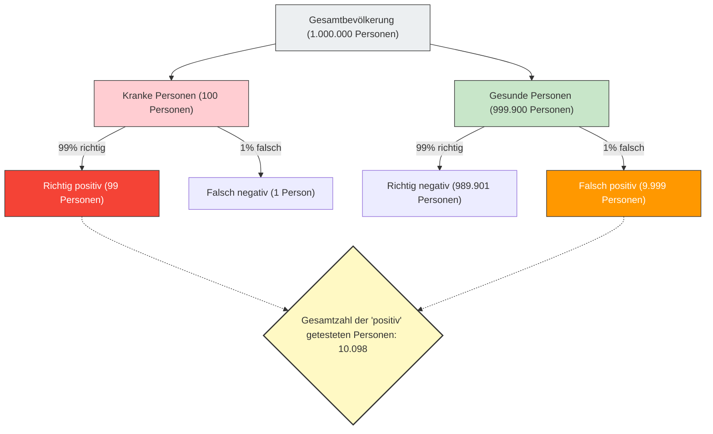

---
title: "„Positiv getestet“ = „Krank“? : Der Basisratenfehler"
description: "Selbst bei einem zu 99% genauen Test und einem positiven Ergebnis liegt die Wahrscheinlichkeit, tatsächlich krank zu sein, bei nur 9%? Eine Erklärung des „Basisratenfehlers“, bei dem die menschliche Intuition von statistischen Daten getäuscht wird."
date: 2026-09-10T21:00:00+09:00
draft: false
slug: "base-rate-fallacy"
image: "img/base_rate_fallacy.jpg"
math: true
mermaid: true
categories: ["Mathematisches Paradoxon", "Statistik", "Psychologie"]
tags: ["Paradoxon", "Satz von Bayes", "Wahrscheinlichkeit", "Kognitive Verzerrung", "Basisratenfehler"]
---

Jeder würde wohl in Panik geraten, wenn er bei einer Gesundheits- oder Krebsvorsorgeuntersuchung ein „positives“ (abnormales) Ergebnis erhält.
Wenn man jedoch Kenntnisse in Statistik und Wahrscheinlichkeitsrechnung hat, kann man tief durchatmen und ruhig bleiben. Der Grund dafür ist: **Nur weil ein hochgenauer Test positiv ausfällt, bedeutet das nicht unbedingt, dass die Wahrscheinlichkeit, tatsächlich krank zu sein, hoch ist.**

Dies ist eine typische kognitive Verzerrung, die als **„Basisratenfehler“ (Base Rate Fallacy)** oder „Vernachlässigung der A-priori-Wahrscheinlichkeit“ bekannt ist, bei der die menschliche Intuition die Wahrscheinlichkeitsrechnung stark fehleinschätzt.

## Das furchteinflößende Problem der Gesundheitsuntersuchung

Stellen Sie sich die folgende Situation vor:

In einer bestimmten Stadt gibt es eine unbekannte Krankheit, mit der 1 von 10.000 Personen (0,01%) infiziert ist.
Um diese Krankheit zu erkennen, wurde ein hervorragendes Testkit mit einer **„Genauigkeit von 99%“** entwickelt.
(*Eine Genauigkeit von 99% bedeutet, dass bei einer kranken Person, die den Test macht, das Ergebnis mit 99%iger Wahrscheinlichkeit korrekterweise „positiv“ ist und bei einer gesunden Person mit 99%iger Wahrscheinlichkeit korrekterweise „negativ“.)

Sie machen diesen Test zufällig und das Ergebnis ist **„positiv“**.
Nun, wie hoch ist die **Wahrscheinlichkeit, dass Sie tatsächlich mit dieser Krankheit infiziert sind**?

Viele Menschen würden intuitiv antworten: „Da die Genauigkeit des Tests 99% beträgt, liegt die Wahrscheinlichkeit, dass ich krank bin, ebenfalls bei 99%.“
Die mathematisch korrekte Antwort lautet jedoch: **„ca. 0,98% (weniger als 1%)“**.

Warum in aller Welt liegt die tatsächliche Wahrscheinlichkeit bei unter 1%, obwohl die Genauigkeit 99% beträgt?

## Der Satz von Bayes und die Visualisierung des Ganzen

Der Schlüssel zur Lösung dieses Problems liegt darin, nicht nur die Genauigkeit des Tests zu berücksichtigen, sondern auch **„wie selten die Krankheit ursprünglich ist (Basisrate/A-priori-Wahrscheinlichkeit)“**.
Lassen Sie uns dieses kontraintuitive Phänomen anhand einer großen Gruppe von 1.000.000 Menschen visualisieren.

- **Gesamtanzahl der Personen**: 1.000.000
- **Tatsächlich kranke Personen** (1 von 10.000): 100
- **Gesunde Personen**: 999.900

Wir führen bei all diesen 1.000.000 Personen den Test mit „99% Genauigkeit“ durch.

### 1. Wenn tatsächlich kranke Personen (100) getestet werden
Da die Genauigkeit 99% beträgt, werden korrekterweise als „positiv“ beurteilt:
100 Personen × 99% = **99 Personen** (Richtig positiv)

### 2. Wenn gesunde Personen (999.900) getestet werden
Da die Genauigkeit 99% beträgt, gibt es eine 1%ige Wahrscheinlichkeit, dass jemand fälschlicherweise als „positiv“ beurteilt wird (falsch positiv):
999.900 Personen × 1% = **9.999 Personen** (Falsch positiv)

## Die wahre Wahrscheinlichkeit, dass Sie krank sind

Nun hat Ihnen der Arzt mitgeteilt: „Sie sind positiv.“
Das bedeutet, dass Sie zur Gruppe unten rechts im Diagramm gehören, der „Gesamtzahl der 'positiv' getesteten Personen (10.098)“.

Wie hoch ist der Anteil der **„tatsächlich kranken Personen (richtig positiv)“** innerhalb dieser Gruppe?

$$ \text{Wahrscheinlichkeit, wirklich krank zu sein} = \frac{\text{Richtig positiv}}{\text{Alle positiv Getesteten}} = \frac{99}{99 + 9.999} = \frac{99}{10.098} \approx 0,0098 $$

Das berechnete Ergebnis ist **ca. 0,98%**.
Obwohl Sie „positiv“ getestet wurden, ist die Wahrscheinlichkeit, dass Sie gesund sind (falsch positiv), überwältigend höher (ca. 99%).

## Warum irrt sich unsere Intuition?

Dieses Phänomen wird mathematisch durch den **„Satz von Bayes“** zur Berechnung der bedingten Wahrscheinlichkeit erklärt, aber das menschliche Gehirn ist sehr schlecht darin, diese Berechnung durchzuführen.

Der Grund für unseren Fehler ist, dass wir von den unmittelbaren, spezifischen und eindringlichen Informationen („Ihr Testergebnis ist positiv! Die Genauigkeit beträgt 99%!“) abgelenkt werden und die riesigen, langweiligen statistischen Daten im Hintergrund ignorieren („Von vornherein ist nur 1 von 10.000 Personen an dieser Krankheit erkrankt (Basisrate)“).

**Da die „Seltenheit der Krankheit (0,01%)“ weitaus extremer ist als die „Ungenauigkeit des Tests (1%)“, schluckt ein winziger Testfehler im Handumdrehen die tatsächliche Anzahl der kranken Personen.**

## Der in der Gesellschaft lauernde „Basisratenfehler“

Diese Illusion führt nicht nur in der Medizin, sondern auch in vielen anderen Situationen zu Panik und Fehleinschätzungen.

- **Gesichtserkennungssysteme und Terroristen**:
  Selbst wenn eine Gesichtserkennungskamera mit 99,9%iger Genauigkeit einen „Terroristen“ am Flughafen identifiziert, ist die Basiswahrscheinlichkeit von Terroristen so extrem niedrig, dass die meisten der Gefassten unschuldige Zivilisten mit ähnlich aussehenden Gesichtern (falsch positiv) sein werden.
- **Verkehrsunfälle und ältere Fahrer**:
  Auch wenn man in den Nachrichten hört: „〇〇% der Autos, die einen Unfall verursacht haben, wurden von älteren Menschen gefahren“, und man dies als gefährlich empfindet, kann man nicht wissen, ob eine bestimmte Altersgruppe wirklich anfälliger für Unfälle ist, ohne „den Anteil der älteren Menschen an allen Fahrern auf der Straße überhaupt (Basisrate)“ zu berücksichtigen.

Der „Basisratenfehler“ lehrt uns die Wichtigkeit des statistischen Denkens: Gerade wenn wir schockierende Zahlen oder Einzelfälle sehen, müssen wir uns fragen, **„wie wahrscheinlich es überhaupt ist, dass dies im Gesamtzusammenhang passiert (Basisrate)“**.
