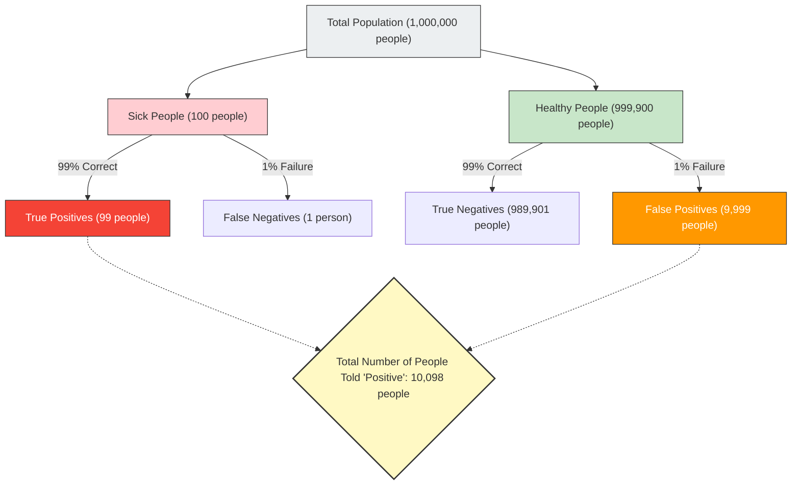

Anyone would panic if they received a "positive (abnormal)" result on a health checkup or cancer screening.
However, with knowledge of statistics and probability, you might be able to take a deep breath and stay calm. This is because **"testing positive on a highly accurate test" does not necessarily mean "there is a high probability of actually having the disease."**

This is a typical cognitive bias called the **"Base Rate Fallacy"** or "Base Rate Neglect," where human intuition significantly misjudges probability calculations.

## The Terrifying Health Checkup Problem

Imagine the following situation.

In a certain town, there is an unknown disease that infects 1 in 10,000 people (0.01%).
To detect this disease, an excellent test kit with **"99% accuracy"** has been developed.
(* 99% accuracy means that if a sick person takes the test, there is a 99% chance it will correctly determine "positive," and if a healthy person takes the test, there is a 99% chance it will correctly determine "negative.")

You happen to take this test, and the result is **"positive."**
Now, what is the **actual probability that you are infected with this disease**?

Many people intuitively answer, "Since the test accuracy is 99%, the probability that I am sick must also be 99%."
However, the mathematically correct answer is **"about 0.98% (less than 1%)."**

Why on earth does the actual probability become less than 1% even with 99% accuracy?

## Bayes' Theorem and Visualizing the Whole

The key to solving this problem lies in considering not only the accuracy of the test but also **"how rare the disease originally is (base rate / prior probability)."**
Let's visualize this counter-intuitive phenomenon using a large population of 1 million people.

- **Total Population**: 1,000,000 people
- **Actually Sick People** (1 in 10,000): 100 people
- **Healthy People**: 999,900 people

We administer the "99% accurate" test to all 1 million of these people.

### 1. When Actually Sick People (100) Take the Test
Since the accuracy is 99%, those correctly determined as "positive" are:
100 people × 99% = **99 people** (True Positives)

### 2. When Healthy People (999,900) Take the Test
Since the accuracy is 99%, there are people who are incorrectly determined as "positive" with a 1% probability (false positives):
999,900 people × 1% = **9,999 people** (False Positives)

## The Real Probability That You Are Sick

Now, you have been told by the doctor, "You are positive."
This means that you have entered the group "Total Number of People Told 'Positive' (10,098 people)" at the bottom right of the diagram.

What is the proportion of **"people who are actually sick (True Positives)"** within this group?

$$ \text{Probability of actually being sick} = \frac{\text{True Positives}}{\text{Everyone told they are positive}} = \frac{99}{99 + 9,999} = \frac{99}{10,098} \approx 0.0098 $$

The calculated result is **about 0.98%**.
Despite being told "positive," the probability that you are healthy (False Positive) is overwhelmingly higher (about 99%).

## Why Does Intuition Make Mistakes?

This phenomenon is mathematically explained by **"Bayes' Theorem,"** which calculates conditional probability, but the human brain is very poor at this calculation.

The reason we make mistakes is that we are distracted by the specific, intense information provided right in front of us ("Your test result is positive! The accuracy is 99%!"), and we ignore the vast, boring statistical background data ("In the first place, only 1 in 10,000 people has this disease (base rate)").

**Because the "rarity of the disease (0.01%)" is much more extreme than the "inaccuracy of the test (1%)," the slight testing errors quickly swallow up the actual number of sick people.**

## The "Base Rate Fallacy" Hidden in Society

This illusion causes panic and incorrect judgments not only in medical care but in various situations.

- **Facial Recognition Systems and Terrorists**:
  Even if a facial recognition camera with 99.9% accuracy finds a "terrorist" at an airport, because the base probability of terrorists is extremely low, almost everyone caught will be innocent civilians with similar faces (False Positives).
- **Traffic Accidents and Elderly Drivers**:
  Even if you feel it's dangerous seeing news that "XX% of cars that caused accidents were driven by elderly people," unless you consider the "proportion of elderly people among all drivers on the road in the first place (base rate)," you cannot know if a specific age group is truly more prone to causing accidents.

The "Base Rate Fallacy" teaches us the importance of statistical thinking: especially when we see shocking numbers or individual cases, we should step back and consider **"how likely is that to happen within the whole in the first place (base rate)."**
