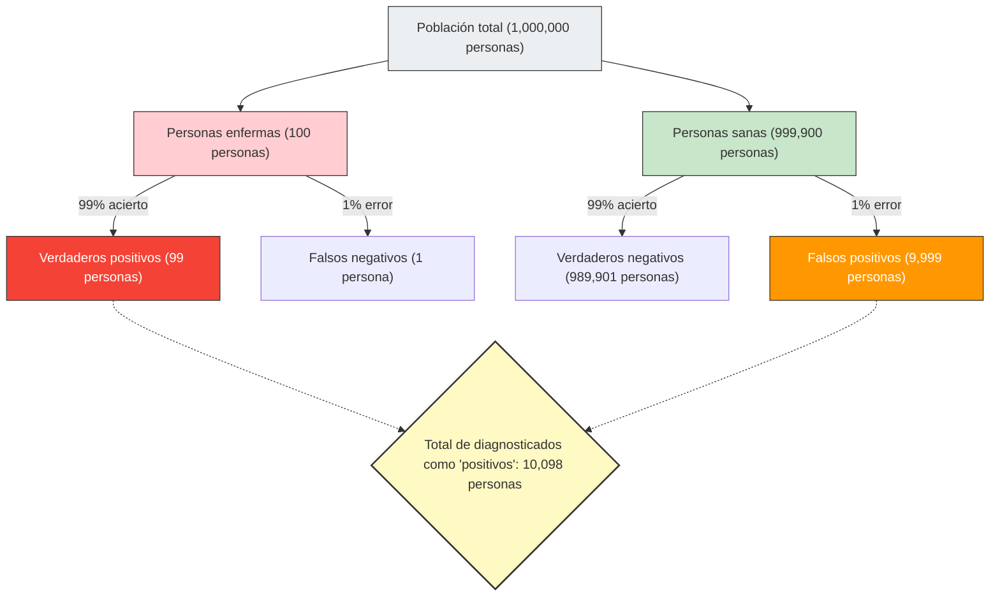

Cualquiera entraría en pánico si recibe un resultado "positivo (anormal)" en un chequeo médico o en las pruebas de detección de cáncer.
Sin embargo, con conocimientos de estadística y probabilidad, es posible que pueda respirar hondo y mantener la calma. Esto se debe a que **"dar positivo en una prueba de alta precisión" no significa necesariamente que "la probabilidad de estar realmente enfermo sea alta"**.

Este es un sesgo cognitivo típico en el que la intuición humana se equivoca enormemente en los cálculos de probabilidad, conocido como **"falacia de la tasa base (Base Rate Fallacy)"** o "negligencia de la probabilidad previa".

## El aterrador problema del chequeo médico

Imagina la siguiente situación:

En una ciudad, existe una enfermedad desconocida que infecta a 1 de cada 10.000 personas (0,01%).
Para detectar esta enfermedad, se ha desarrollado un excelente kit de prueba con una **"precisión del 99%"**.
(*Una precisión del 99% significa que si una persona enferma se somete a la prueba, hay un 99% de probabilidad de que sea diagnosticada correctamente como "positiva", y si una persona sana se somete a ella, hay un 99% de probabilidad de que sea diagnosticada correctamente como "negativa".)

Casualmente, te sometes a esta prueba y el resultado es **"positivo"**.
Ahora bien, ¿cuál es **la probabilidad real de que estés infectado** con esta enfermedad?

Muchas personas responderán intuitivamente: "Dado que la precisión de la prueba es del 99%, la probabilidad de que yo esté enfermo también debe ser del 99%".
Sin embargo, la respuesta matemática correcta es **"aproximadamente 0,98% (menos del 1%)"**.

¿Por qué, a pesar de tener una precisión del 99%, la probabilidad real termina siendo menor al 1%?

## El Teorema de Bayes y la visualización del total

La clave para resolver este problema no es solo la precisión de la prueba, sino considerar **"qué tan rara es originalmente esa enfermedad (tasa base / probabilidad previa)"**.
Visualicemos este fenómeno contraintuitivo utilizando una gran población de 1 millón de personas.

- **Población total**: 1.000.000 de personas
- **Personas realmente enfermas** (1 de cada 10.000): 100 personas
- **Personas sanas**: 999.900 personas

A este millón de personas se les aplica la prueba con una "precisión del 99%".

### 1. Cuando las personas realmente enfermas (100 personas) se hacen la prueba
Dado que la precisión es del 99%, quienes son diagnosticados correctamente como "positivos" son:
100 personas × 99% = **99 personas** (Verdaderos positivos)

### 2. Cuando las personas sanas (999.900 personas) se hacen la prueba
Dado que la precisión es del 99%, hay personas que son diagnosticadas incorrectamente como "positivas" con una probabilidad del 1% (falsos positivos):
999.900 personas × 1% = **9.999 personas** (Falsos positivos)

## Tu verdadera probabilidad de estar enfermo

Ahora, el médico te ha informado que "eres positivo".
Esto significa que has entrado en el grupo en la parte inferior derecha del diagrama: "Total de diagnosticados como 'positivos' (10,098 personas)".

Dentro de este grupo, ¿cuál es la proporción de **"personas que realmente están enfermas (verdaderos positivos)"**?

$$ \text{Probabilidad de estar realmente enfermo} = \frac{\text{Verdaderos positivos}}{\text{Total de diagnosticados como positivos}} = \frac{99}{99 + 9,999} = \frac{99}{10,098} \approx 0.0098 $$

El resultado del cálculo es **aproximadamente 0,98%**.
A pesar de que te hayan dicho "positivo", la probabilidad de que estés sano (falso positivo) es abrumadoramente mayor (alrededor del 99%).

## ¿Por qué se equivoca la intuición?

Este fenómeno se explica matemáticamente por el **"Teorema de Bayes"**, que calcula probabilidades condicionales, pero el cerebro humano es muy malo en este cálculo.

La razón por la que cometemos errores es que nos distraemos con la información individual e intensa que se nos proporciona de inmediato ("¡El resultado de tu prueba es positivo! ¡La precisión es del 99%!"), e ignoramos los enormes y aburridos datos estadísticos de fondo ("Para empezar, solo 1 de cada 10.000 personas tiene esta enfermedad (tasa base)").

**Debido a que la "rareza de la enfermedad (0,01%)" es mucho más extrema que la "imprecisión de la prueba (1%)", un pequeño error en la prueba abruma rápidamente el número real de personas enfermas.**

## La "falacia de la tasa base" oculta en la sociedad

Esta ilusión causa pánico y juicios erróneos no solo en la atención médica, sino en diversas situaciones.

- **Sistemas de reconocimiento facial y terroristas**:
  Incluso si una cámara de reconocimiento facial con una precisión del 99,9% encuentra a un "terrorista" en un aeropuerto, la probabilidad base de que haya terroristas es extremadamente baja, por lo que la mayoría de los atrapados serán personas inocentes comunes y corrientes con caras similares (falsos positivos).
- **Accidentes de tráfico y conductores mayores**:
  Incluso si sientes que es peligroso después de ver en las noticias que "el 〇〇% de los coches que causaron accidentes eran conducidos por personas mayores", no puedes saber si un grupo de edad en particular es realmente propenso a causar accidentes a menos que consideres "la proporción de conductores mayores entre todos los conductores que circulan por las carreteras para empezar (tasa base)".

La "falacia de la tasa base" nos enseña la importancia del pensamiento estadístico: exactamente cuando vemos números impactantes o casos individuales, debemos volver a preguntarnos **"¿qué tan probable es que esto suceda dentro del panorama general en primer lugar? (tasa base)"**.
