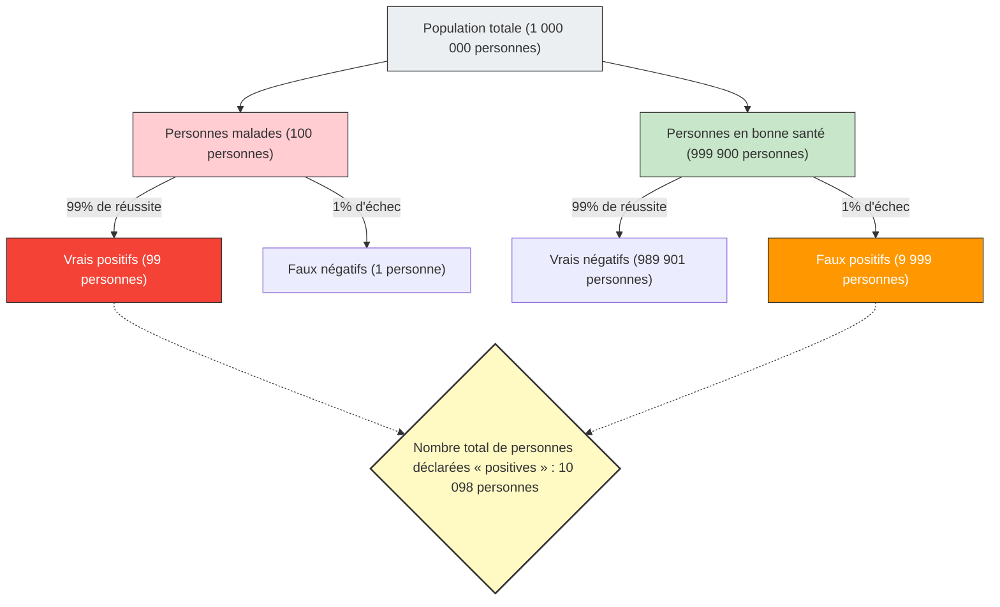

Si vous recevez un résultat « positif (anormal) » lors d'un bilan de santé ou d'un dépistage du cancer, il est naturel de paniquer.
Cependant, avec des connaissances en statistiques et en probabilités, vous pourriez prendre une grande inspiration et garder votre calme. En effet, **« un test de haute précision positif » ne signifie pas nécessairement que « la probabilité d'être réellement malade est élevée »**.

C'est ce qu'on appelle l'**« erreur du taux de base (Base Rate Fallacy) »** ou « négligence de la probabilité a priori », un biais cognitif typique où l'intuition humaine se trompe lourdement dans le calcul des probabilités.

## Le problème terrifiant du bilan de santé

Imaginez la situation suivante.

Dans une ville, il existe une maladie inconnue qui infecte 1 personne sur 10 000 (0,01 %).
Pour détecter cette maladie, un excellent kit de dépistage avec une **« précision de 99 % »** a été développé.
(* Une précision de 99 % signifie que si une personne malade passe le test, elle a 99 % de chances d'être correctement diagnostiquée « positive », et si une personne en bonne santé le passe, elle a 99 % de chances d'être correctement diagnostiquée « négative ».)

Vous passez ce test par hasard, et le résultat est **« positif »**.
Maintenant, quelle est la **probabilité que vous soyez réellement infecté** par cette maladie ?

Beaucoup de gens répondent intuitivement : « Puisque la précision du test est de 99 %, la probabilité que je sois malade doit aussi être de 99 % ».
Cependant, la bonne réponse mathématique est **« environ 0,98 % (moins de 1 %) »**.

Pourquoi, avec une précision de 99 %, la probabilité réelle tombe-t-elle à moins de 1 % ?

## Le théorème de Bayes et la visualisation de l'ensemble

La clé pour résoudre ce problème ne réside pas seulement dans la précision du test, mais aussi dans la prise en compte de **« la rareté de la maladie à l'origine (taux de base / probabilité a priori) »**.
Visualisons ce phénomène contre-intuitif en utilisant une grande population de 1 000 000 de personnes.

- **Population totale** : 1 000 000 personnes
- **Personnes réellement malades** (1 sur 10 000) : 100 personnes
- **Personnes en bonne santé** : 999 900 personnes

Nous faisons passer le test d'une « précision de 99 % » à ces 1 000 000 de personnes.

### 1. Lorsque les personnes réellement malades (100 personnes) passent le test
Avec une précision de 99 %, celles qui seront correctement diagnostiquées « positives » sont :
100 personnes × 99 % = **99 personnes** (Vrais positifs)

### 2. Lorsque les personnes en bonne santé (999 900 personnes) passent le test
Avec une précision de 99 %, il y a des personnes qui seront incorrectement diagnostiquées « positives » avec une probabilité de 1 % (Faux positifs) :
999 900 personnes × 1 % = **9 999 personnes** (Faux positifs)

## Votre probabilité réelle d'être malade

Vous avez donc été informé par le médecin que vous êtes « positif ».
Cela signifie que vous avez rejoint le groupe en bas à droite de la figure, « Nombre total de personnes déclarées "positives" (10 098 personnes) ».

Parmi ce groupe, quelle est la proportion de **« personnes réellement malades (vrais positifs) »** ?

$$ \text{Probabilité d'être réellement malade} = \frac{\text{Vrais positifs}}{\text{Toutes les personnes déclarées positives}} = \frac{99}{99 + 9999} = \frac{99}{10098} \approx 0,0098 $$

Le résultat du calcul est d'**environ 0,98 %**.
Bien qu'on vous ait déclaré « positif », la probabilité que vous soyez en bonne santé (faux positif) est massivement plus élevée (environ 99 %).

## Pourquoi notre intuition se trompe-t-elle ?

Ce phénomène est expliqué mathématiquement par le **« théorème de Bayes »**, qui calcule les probabilités conditionnelles, mais le cerveau humain est très mauvais pour ce type de calcul.

La raison pour laquelle nous faisons des erreurs est que nous sommes distraits par les informations spécifiques et frappantes fournies dans l'immédiat (« Votre résultat de test est positif ! La précision est de 99 % ! ») et ignorons les données statistiques de fond massives et ennuyeuses (« À l'origine, seule 1 personne sur 10 000 est atteinte de cette maladie (taux de base) »).

**Étant donné que la « rareté de la maladie (0,01 %) » est beaucoup plus extrême que l'« inexactitude du test (1 %) », une petite erreur de test submerge rapidement le nombre de personnes réellement malades.**

## L'« erreur du taux de base » cachée dans la société

Cette illusion provoque des paniques et de mauvais jugements non seulement en médecine, mais aussi dans diverses situations.

- **Systèmes de reconnaissance faciale et terroristes** :
  Même si une caméra de reconnaissance faciale précise à 99,9 % détecte un « terroriste » dans un aéroport, comme la probabilité de base qu'une personne soit un terroriste est extrêmement faible, la plupart des personnes arrêtées seront des civils innocents avec des visages similaires (faux positifs).
- **Accidents de la route et conducteurs âgés** :
  Même si vous vous sentez en danger après avoir vu aux informations que « XX % des voitures impliquées dans des accidents étaient conduites par des personnes âgées », à moins de prendre en compte la « proportion de personnes âgées parmi tous les conducteurs sur la route à l'origine (taux de base) », il est impossible de savoir si un groupe d'âge spécifique est réellement plus enclin à causer des accidents.

L'« erreur du taux de base » nous enseigne l'importance de la pensée statistique : face à des chiffres choquants ou à des cas individuels, il faut toujours revenir à la question **« dans quelle mesure cela est-il susceptible de se produire dans l'ensemble à l'origine (taux de base) ? »**.
