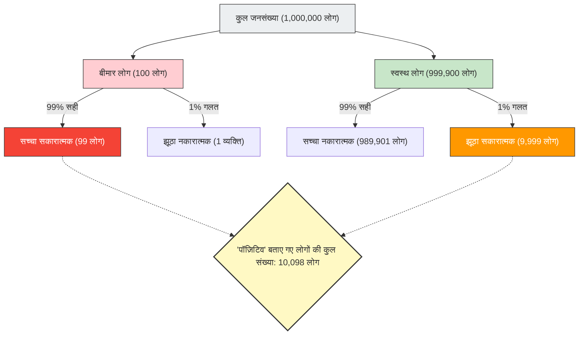

स्वास्थ्य जांच (हेल्थ चेकअप) या कैंसर स्क्रीनिंग में अगर परिणाम "पॉज़िटिव (असामान्यता)" आता है, तो किसी का भी घबरा जाना स्वाभाविक है।
लेकिन, यदि आपको सांख्यिकी और प्रायिकता का ज्ञान है, तो आप गहरी सांस लेकर शांत हो सकते हैं। ऐसा इसलिए है क्योंकि **"उच्च सटीकता वाले टेस्ट में पॉज़िटिव आने" का मतलब यह नहीं है कि "वास्तव में बीमार होने की संभावना भी अधिक है"**।

इसे **"बेस रेट फैलेसी (Base Rate Fallacy - आधार दर भ्रांति)"** या "पूर्व प्रायिकता की उपेक्षा (Base rate neglect)" कहा जाता है। यह एक विशिष्ट संज्ञानात्मक पूर्वाग्रह (cognitive bias) है, जहां हमारा अंतर्ज्ञान प्रायिकता की गणना को समझने में भारी भूल करता है।

## स्वास्थ्य जांच की डरावनी समस्या

निम्नलिखित स्थिति की कल्पना करें:

एक शहर में, एक अज्ञात बीमारी है जिससे 10,000 में से 1 व्यक्ति (0.01%) संक्रमित है।
इस बीमारी का पता लगाने के लिए, एक बेहतरीन टेस्ट किट विकसित की गई है जिसकी **"सटीकता 99%"** है।
(※ 99% सटीकता का मतलब है कि अगर कोई बीमार व्यक्ति यह टेस्ट लेता है, तो 99% संभावना है कि परिणाम सही रूप से "पॉज़िटिव" आएगा, और यदि कोई स्वस्थ व्यक्ति इसे लेता है, तो 99% संभावना है कि परिणाम सही रूप से "नेगेटिव" आएगा।)

आपने संयोग से यह टेस्ट करवाया और परिणाम **"पॉज़िटिव"** आया।
अब, आपके **वास्तव में इस बीमारी से संक्रमित होने की क्या संभावना है**?

ज्यादातर लोग सहज रूप से जवाब देते हैं, "चूंकि टेस्ट की सटीकता 99% है, इसलिए मेरे बीमार होने की संभावना भी 99% होगी।"
हालांकि, इसका गणितीय रूप से सही उत्तर **"लगभग 0.98% (1% से कम)"** है।

आखिर ऐसा क्यों है कि 99% सटीकता होने के बावजूद, वास्तविक संभावना 1% से भी कम रह जाती है?

## बेज़ का प्रमेय और समग्र दृश्य

इस समस्या को सुलझाने की कुंजी न केवल टेस्ट की सटीकता पर ध्यान देना है, बल्कि यह भी विचार करना है कि **"वह बीमारी मूल रूप से कितनी दुर्लभ है (बेस रेट/पूर्व प्रायिकता)"**।
आइए 10 लाख लोगों के एक बड़े समूह का उपयोग करके इस सहज ज्ञान के विपरीत होने वाली घटना की कल्पना करें।

- **कुल जनसंख्या**: 1,000,000 लोग
- **वास्तव में बीमार लोग** (10,000 में से 1): 100 लोग
- **स्वस्थ लोग**: 999,900 लोग

इन सभी 10 लाख लोगों पर "99% सटीकता" वाला टेस्ट किया जाता है।

### 1. जब वास्तव में बीमार लोग (100 लोग) टेस्ट करवाते हैं
चूंकि सटीकता 99% है, इसलिए जिन्हें सही रूप से "पॉज़िटिव" के रूप में पहचाना जाएगा:
100 लोग × 99% = **99 लोग** (सच्चा सकारात्मक)

### 2. जब स्वस्थ लोग (999,900 लोग) टेस्ट करवाते हैं
चूंकि सटीकता 99% है, इसलिए 1% संभावना है कि किसी को गलती से "पॉज़िटिव" मान लिया जाए (झूठा सकारात्मक):
999,900 लोग × 1% = **9,999 लोग** (झूठा सकारात्मक)

## आपके वास्तव में बीमार होने की वास्तविक संभावना

अब, डॉक्टर ने आपको बताया कि आप "पॉज़िटिव" हैं।
इसका मतलब है कि आप चित्र के निचले-दाएं भाग में "'पॉज़िटिव' बताए गए लोगों की कुल संख्या (10,098 लोग)" वाले समूह में शामिल हो गए हैं।

इस समूह के भीतर, **"वास्तव में बीमार लोगों (सच्चा सकारात्मक)"** का प्रतिशत क्या है?

$$ \text{वास्तव में बीमार होने की संभावना} = \frac{\text{सच्चा सकारात्मक}}{\text{पॉज़िटिव बताए गए कुल लोग}} = \frac{99}{99 + 9,999} = \frac{99}{10,098} \approx 0.0098 $$

गणना का परिणाम **लगभग 0.98%** है।
"पॉज़िटिव" बताए जाने के बावजूद, आपके स्वस्थ होने की संभावना (झूठा सकारात्मक) कहीं अधिक (लगभग 99%) है।

## हमारा अंतर्ज्ञान गलत क्यों होता है?

इस घटना को **"बेज़ के प्रमेय (Bayes' Theorem)"** द्वारा गणितीय रूप से समझाया जा सकता है, जो सशर्त प्रायिकता की गणना करता है, लेकिन मानव मस्तिष्क इस तरह की गणनाओं में बहुत कमज़ोर है।

हमसे गलती इसलिए होती है क्योंकि हम तत्काल दी गई व्यक्तिगत और प्रभावशाली जानकारी ("आपका टेस्ट परिणाम पॉज़िटिव है! सटीकता 99% है!") पर ध्यान केंद्रित कर लेते हैं और पृष्ठभूमि में मौजूद विशाल और उबाऊ सांख्यिकीय डेटा ("शुरू में ही इस बीमारी से संक्रमित लोगों की संख्या केवल 10,000 में से 1 है (बेस रेट)") को नज़रअंदाज़ कर देते हैं।

**चूंकि "बीमारी की दुर्लभता (0.01%)", "टेस्ट की अशुद्धता (1%)" की तुलना में बहुत अधिक चरम है, इसलिए टेस्ट की एक छोटी सी गलती भी मूल बीमार लोगों की संख्या को आसानी से निगल जाती है।**

## समाज में छिपी "बेस रेट फैलेसी"

यह भ्रांति केवल चिकित्सा क्षेत्र में ही नहीं, बल्कि विभिन्न स्थितियों में घबराहट और गलत निर्णय का कारण बनती है।

- **चेहरा पहचान प्रणाली और आतंकवादी**:
  भले ही 99.9% सटीकता वाला चेहरा पहचान कैमरा हवाई अड्डे पर किसी "आतंकवादी" को पहचान ले, लेकिन आतंकवादियों की मूल प्रायिकता (बेस रेट) बहुत कम होने के कारण, पकड़े जाने वाले ज़्यादातर लोग केवल चेहरे से मिलते-जुलते निर्दोष आम नागरिक (झूठा सकारात्मक) ही होंगे।
- **यातायात दुर्घटनाएं और बुजुर्ग ड्राइवर**:
  खबरों में यह देखकर कि "दुर्घटना करने वाली कारों का 〇〇% बुजुर्गों द्वारा चलाया जा रहा था", आप इसे खतरनाक मान सकते हैं। लेकिन अगर आप इस बात पर विचार नहीं करते कि "सड़कों पर चलने वाले कुल ड्राइवरों में बुजुर्गों का प्रतिशत (बेस रेट) कितना है", तो आप यह तय नहीं कर सकते कि कोई विशिष्ट आयु वर्ग वास्तव में दुर्घटनाओं के प्रति अधिक प्रवृत्त है या नहीं।

"बेस रेट फैलेसी" हमें यह सिखाती है कि जब भी हम चौंकाने वाले आंकड़े या व्यक्तिगत मामले देखें, तो हमें सांख्यिकीय सोच के महत्व को याद करते हुए इस बुनियादी सवाल पर लौटना चाहिए: **"समग्र रूप से इसके घटित होने की संभावना वास्तव में कितनी है (बेस रेट)?"**
