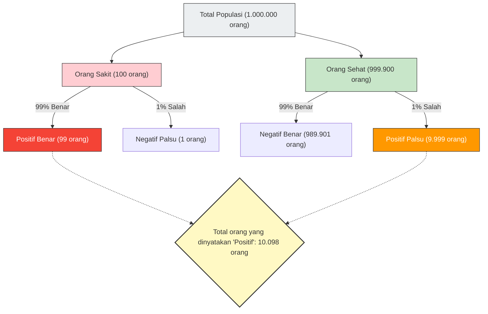

---
title: "Apakah 'Positif dalam Tes' = 'Sakit'? Memahami Kekeliruan Tingkat Dasar"
description: "Meskipun tes dengan akurasi 99% menunjukkan hasil positif, mungkinkah peluang Anda benar-benar sakit hanya 9%? Penjelasan tentang 'kekeliruan tingkat dasar' di mana intuisi manusia tertipu oleh data statistik."
date: 2026-09-10T21:00:00+09:00
draft: false
slug: "base-rate-fallacy"
image: "img/base_rate_fallacy.jpg"
math: true
mermaid: true
categories: ["Paradoks Matematika", "Statistika", "Psikologi"]
tags: ["Paradoks", "Teorema Bayes", "Peluang", "Bias Kognitif", "Kekeliruan Tingkat Dasar"]
---

Jika hasil "positif (ada kelainan)" keluar dalam pemeriksaan kesehatan atau skrining kanker, siapa pun pasti akan panik.
Namun, jika Anda memiliki pengetahuan tentang statistika dan peluang, Anda mungkin dapat menarik napas dalam-dalam dan tetap tenang. Ini karena, **hanya karena "dinyatakan positif dalam tes yang sangat akurat" tidak berarti "peluang benar-benar menderita penyakit tersebut tinggi"**.

Ini adalah bias kognitif khas di mana intuisi manusia melakukan kesalahan besar dalam perhitungan peluang, yang disebut **"Kekeliruan Tingkat Dasar (Base Rate Fallacy)"** atau "Pengabaian Peluang Prior".

## Masalah Pemeriksaan Kesehatan yang Menakutkan

Bayangkan situasi berikut ini.

Di sebuah kota, terdapat penyakit tak dikenal yang menginfeksi 1 dari 10.000 orang (0,01%).
Untuk mendeteksi penyakit ini, alat tes yang sangat baik dengan **"akurasi 99%"** telah dikembangkan.
(*Akurasi 99% berarti jika orang yang sakit menjalani tes, ada peluang 99% untuk dinilai secara benar sebagai "positif", dan jika orang sehat menjalani tes, ada peluang 99% untuk dinilai secara benar sebagai "negatif".)

Ketika Anda kebetulan menjalani tes ini, hasilnya adalah **"positif"**.
Nah, seberapa besarkah **peluang Anda benar-benar terinfeksi penyakit ini**?

Banyak orang secara intuitif akan menjawab, "Karena akurasi tesnya 99%, peluang saya sakit pasti 99% juga."
Namun, jawaban matematis yang benar adalah **"sekitar 0,98% (kurang dari 1%)"**.

Mengapa dengan akurasi 99%, peluang sebenarnya bisa menjadi kurang dari 1%?

## Teorema Bayes dan Visualisasi Keseluruhan

Kunci untuk memecahkan masalah ini adalah dengan mempertimbangkan bukan hanya akurasi tes, tetapi juga **"seberapa langka penyakit itu pada awalnya (tingkat dasar/peluang prior)"**.
Mari kita visualisasikan fenomena yang berlawanan dengan intuisi ini menggunakan populasi besar sebanyak 1.000.000 orang.

- **Total populasi**: 1.000.000 orang
- **Orang yang benar-benar sakit** (1 dari 10.000 orang): 100 orang
- **Orang sehat**: 999.900 orang

Kita melakukan tes dengan "akurasi 99%" kepada seluruh 1.000.000 orang ini.

### 1. Jika Orang yang Benar-Benar Sakit (100 Orang) Menjalani Tes
Karena akurasinya 99%, yang dengan benar dinilai sebagai "positif" adalah:
100 orang × 99% = **99 orang** (Positif Benar)

### 2. Jika Orang Sehat (999.900 Orang) Menjalani Tes
Karena akurasinya 99%, terdapat orang-orang yang secara keliru dinilai sebagai "positif" (positif palsu) dengan peluang 1%:
999.900 orang × 1% = **9.999 orang** (Positif Palsu)

## Peluang Sebenarnya Anda Sakit

Sekarang, Anda diberitahu oleh dokter bahwa Anda "positif".
Ini berarti Anda termasuk dalam kelompok di kanan bawah diagram, yaitu "Total orang yang dinyatakan 'Positif' (10.098 orang)".

Dalam kelompok ini, berapakah persentase **"orang yang benar-benar sakit (Positif Benar)"**?

$$ \text{Peluang Benar-Benar Sakit} = \frac{\text{Positif Benar}}{\text{Total Dinyatakan Positif}} = \frac{99}{99 + 9.999} = \frac{99}{10.098} \approx 0,0098 $$

Hasil perhitungannya adalah **sekitar 0,98%**.
Meskipun dinyatakan "positif", peluang Anda sebenarnya sehat (positif palsu) jauh lebih tinggi (sekitar 99%).

## Mengapa Intuisi Bisa Salah?

Fenomena ini dijelaskan secara matematis melalui **"Teorema Bayes"** yang menghitung peluang bersyarat, tetapi otak manusia sangat buruk dalam melakukan perhitungan ini.

Alasan kita membuat kesalahan adalah karena kita terganggu oleh informasi individu yang kuat dan langsung di depan mata ("Hasil tes Anda positif! Akurasinya 99%!"), dan mengabaikan data statistik yang luas dan membosankan di latar belakang ("Sejak awal, hanya 1 dari 10.000 orang yang menderita penyakit ini (tingkat dasar)").

**Karena "kelangkaan penyakit (0,01%)" jauh lebih ekstrem dibandingkan "ketidakakuratan tes (1%)", sedikit saja kesalahan tes akan dengan cepat melampaui jumlah orang yang benar-benar sakit.**

## "Kekeliruan Tingkat Dasar" yang Tersembunyi dalam Masyarakat

Ilusi ini menyebabkan kepanikan dan penilaian yang salah tidak hanya dalam medis, tetapi juga dalam berbagai situasi lainnya.

- **Sistem Pengenalan Wajah dan Teroris**:
  Bahkan jika kamera pengenal wajah dengan akurasi 99,9% menemukan "teroris" di bandara, karena peluang dasar keberadaan teroris sangat rendah, yang tertangkap sebagian besar adalah warga sipil tak berdosa yang wajahnya mirip (positif palsu).
- **Kecelakaan Lalu Lintas dan Pengemudi Lansia**:
  Meskipun Anda merasa bahaya saat melihat berita bahwa "XX% dari mobil yang menyebabkan kecelakaan dikemudikan oleh lansia", jika Anda tidak mempertimbangkan "proporsi lansia dari total pengemudi di jalan (tingkat dasar)", Anda tidak dapat mengetahui apakah kelompok usia tertentu benar-benar lebih rentan menyebabkan kecelakaan.

"Kekeliruan Tingkat Dasar" mengajarkan kita pentingnya pemikiran statistik: justru ketika kita melihat angka yang mengejutkan atau kasus individual, kita harus kembali pada pertanyaan **"Seberapa besar kemungkinan hal itu terjadi dalam populasi secara keseluruhan pada awalnya? (tingkat dasar)"**.
