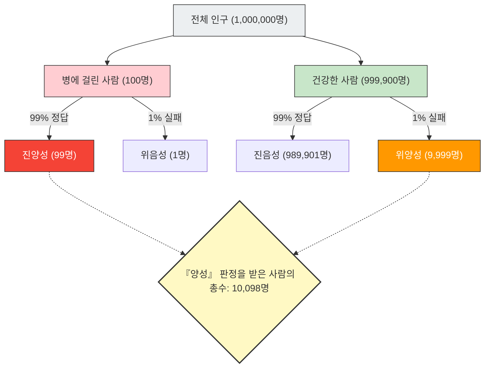

---
title: "'검사 양성' = '질병'일까?: 기준 비율의 오류"
description: "정확도 99%의 검사에서 양성이 나와도 실제로 병에 걸렸을 확률은 불과 9%? 인간의 직관이 통계 데이터에 속는 '기준 비율의 오류'를 해설합니다."
date: 2026-09-10T21:00:00+09:00
draft: false
slug: "base-rate-fallacy"
image: "img/base_rate_fallacy.jpg"
math: true
mermaid: true
categories: ["수학 패러독스", "통계학", "심리학"]
tags: ["패러독스", "베이즈 정리", "확률", "인지 편향", "기준 비율의 오류"]
---

건강 검진이나 암 검진에서 "양성(이상 있음)"이라는 결과가 나오면 누구나 패닉에 빠질 것입니다.
하지만 통계학과 확률에 대한 지식이 있다면, 심호흡을 하고 침착해질 수 있을지도 모릅니다. 왜냐하면 **"정확도 높은 검사에서 양성이 나왔다"고 해서 "실제로 병에 걸렸을 확률이 높다"는 것을 의미하지는 않기** 때문입니다.

이것은 **"기준 비율의 오류(Base Rate Fallacy)"** 또는 "사전 확률의 무시"라고 불리는, 인간의 직관이 확률 계산을 크게 착각하는 전형적인 인지 편향입니다.

## 공포의 건강 검진 문제

다음과 같은 상황을 상상해 보세요.

어느 마을에 1만 명 중 1명(0.01%)이 감염되는 미지의 질병이 있습니다.
이 병을 발견하기 위해 **"정확도 99%"**의 뛰어난 검사 키트가 개발되었습니다.
(※ 정확도 99%란, 병에 걸린 사람이 검사를 받았을 때 99%의 확률로 올바르게 '양성'이라고 판정하고, 건강한 사람이 받았을 때 99%의 확률로 올바르게 '음성'이라고 판정한다는 의미입니다.)

당신이 우연히 이 검사를 받았는데, 결과는 **"양성"**이었습니다.
자, 당신이 **정말로 이 병에 감염되었을 확률**은 얼마나 될까요?

대부분의 사람은 "검사 정확도가 99%이니까, 내가 병에 걸렸을 확률도 99%일 것이다"라고 직관적으로 대답합니다.
하지만 수학적인 정답은 **"약 0.98%(1% 미만)"**입니다.

도대체 왜 99%의 정확도가 있는데 실제 확률은 1% 미만이 되어버리는 것일까요?

## 베이즈 정리와 전체의 시각화

이 문제를 푸는 열쇠는 검사의 정확도뿐만 아니라, **"그 병이 원래 얼마나 희귀한가(기준 비율·사전 확률)"**를 고려하는 데 있습니다.
직관에 반하는 이 현상을, 100만 명이라는 큰 집단을 사용하여 시각화해 보겠습니다.

- **전체 인원**: 1,000,000명
- **실제로 병에 걸린 사람**(1만 명 중 1명): 100명
- **건강한 사람**: 999,900명

이 100만 명 전원에게 "정확도 99%"의 검사를 실시합니다.

### 1. 실제로 병에 걸린 사람(100명)이 검사를 받은 경우
정확도가 99%이므로, 올바르게 "양성"으로 판정되는 사람은:
100명 × 99% = **99명**(진양성)

### 2. 건강한 사람(999,900명)이 검사를 받은 경우
정확도가 99%이므로, 1%의 확률로 잘못 "양성"으로 판정되는 사람(위양성)이 발생합니다:
999,900명 × 1% = **9,999명**(위양성)

## 당신이 병에 걸렸을 진짜 확률

자, 당신은 의사로부터 "양성입니다"라는 통보를 받았습니다.
이것은 당신이 그림의 오른쪽 아래에 있는 "『양성』 판정을 받은 사람의 총수(10,098명)" 그룹에 들어갔음을 의미합니다.

이 그룹 안에서 **"정말로 병에 걸린 사람(진양성)"**의 비율은 얼마나 될까요?

$$ \text{정말로 병에 걸렸을 확률} = \frac{\text{진양성}}{\text{양성 판정을 받은 전원}} = \frac{99}{99 + 9,999} = \frac{99}{10,098} \approx 0.0098 $$

계산 결과는 **약 0.98%**입니다.
"양성" 판정을 받았음에도 불구하고, 당신이 건강할 확률(위양성)이 압도적으로 높습니다(약 99%).

## 왜 직관은 틀리는 것일까?

이 현상은 조건부 확률을 구하는 **"베이즈 정리"**에 의해 수학적으로 설명되지만, 인간의 뇌는 이 계산에 매우 서툽니다.

우리가 실수를 하는 이유는, 눈앞에 제공된 개별적이고 강렬한 정보("당신의 검사 결과는 양성! 정확도는 99%!")에 정신이 팔려, 배경에 있는 방대하고 지루한 통계 데이터("애초에 이 병에 걸린 사람은 1만 명 중 1명밖에 없다(기준 비율)")를 무시해 버리기 때문입니다.

**"병의 희소성(0.01%)"이 "검사의 부정확성(1%)"보다 훨씬 극단적이기 때문에, 아주 작은 검사 오류가 원래의 환자 수를 순식간에 삼켜버리는 것입니다.**

## 사회에 숨어 있는 "기준 비율의 오류"

이 착각은 의료뿐만 아니라 다양한 상황에서 패닉이나 잘못된 판단을 일으킵니다.

- **안면 인식 시스템과 테러리스트**:
  정확도 99.9%의 안면 인식 카메라가 공항에서 "테러리스트"를 발견했다 하더라도, 테러리스트의 기본 확률이 극히 낮기 때문에, 잡히는 사람은 대부분 얼굴이 비슷한 무고한 일반인(위양성)이 됩니다.
- **교통사고와 고령 운전자**:
  "사고를 낸 자동차의 〇〇%가 고령자였다"는 뉴스를 보고 위험하다고 느껴도, "애초에 도로를 달리고 있는 전체 운전자 중 고령자가 차지하는 비율(기준 비율)"을 고려하지 않으면, 특정 연령층이 정말로 사고를 일으키기 쉬운지 알 수 없습니다.

"기준 비율의 오류"는 충격적인 수치나 개별 사례를 보았을 때일수록, **"애초에 전체 중에서 그것이 얼마나 일어나기 쉬운 일인가(기준 비율)"**로 되돌아가는 통계적 사고의 중요성을 우리에게 가르쳐 줍니다.
