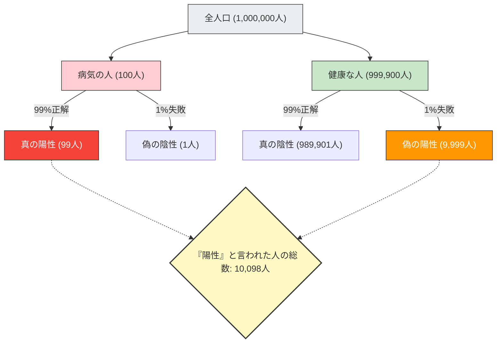

健康診断やがん検診で「陽性（異常あり）」という結果が出たら、誰でもパニックになるでしょう。
しかし、統計学と確率の知識があれば、深呼吸をして冷静になることができるかもしれません。なぜなら、**「精度の高い検査で陽性になった」からといって「実際に病気である確率が高い」とは限らない**からです。

これは**「基準値の錯誤（Base Rate Fallacy）」**または「事前確率の無視」と呼ばれる、人間の直感が確率の計算を大きく見誤る典型的な認知バイアスです。

## 恐怖の健康診断問題

次のような状況を想像してみてください。

ある町で、1万人に1人（0.01%）が感染している未知の病気があります。
この病気を発見するために、**「精度99%」**の優れた検査キットが開発されました。
（※精度99%とは、病気の人が検査を受けた場合に99%の確率で正しく「陽性」と判定し、健康な人が受けた場合に99%の確率で正しく「陰性」と判定するという意味です）

あなたがたまたまこの検査を受けたところ、結果は**「陽性」**でした。
さて、あなたが**本当にこの病気に感染している確率**はどれくらいでしょうか？

多くの人は「検査の精度が99%なんだから、自分が病気である確率も99%だろう」と直感的に答えます。
しかし、数学的な正解は**「約0.98%（1%未満）」**です。

一体なぜ、99%の精度があるのに、実際の確率は1%未満になってしまうのでしょうか？

## ベイズの定理と全体の可視化

この問題を解き明かすカギは、検査の精度だけでなく、**「その病気がもともとどれくらい珍しいのか（基準値・事前確率）」**を考慮することにあります。
直感に反するこの現象を、100万人という大きな集団を使って可視化してみましょう。

- **全体の人数**：1,000,000人
- **実際に病気の人**（1万人に1人）：100人
- **健康な人**：999,900人

この100万人全員に「精度99%」の検査を実施します。

### 1. 実際に病気の人（100人）が検査を受けた場合
精度99%なので、正しく「陽性」と判定されるのは：
100人 × 99% = **99人**（真の陽性）

### 2. 健康な人（999,900人）が検査を受けた場合
精度99%なので、1%の確率で間違って「陽性」と判定されてしまう人（偽陽性）がいます：
999,900人 × 1% = **9,999人**（偽の陽性）

## あなたが病気である本当の確率

さて、あなたは医者から「陽性です」と告げられました。
これは、あなたが図の右下にある「『陽性』と言われた人の総数（10,098人）」のグループに入ったことを意味します。

このグループの中で、**「本当に病気の人（真の陽性）」**の割合はどれくらいでしょうか？

$$ \text{本当に病気である確率} = \frac{\text{真の陽性}}{\text{陽性と言われた全員}} = \frac{99}{99 + 9,999} = \frac{99}{10,098} \approx 0.0098 $$

計算結果は**約0.98%**です。
「陽性」と言われたにもかかわらず、あなたが健康である確率（偽陽性）の方が圧倒的に高い（約99%）のです。

## なぜ直感は間違えるのか？

この現象は、条件付き確率を求める**「ベイズの定理」**によって数学的に説明されますが、人間の脳はこの計算が非常に苦手です。

私たちが間違いを犯す理由は、目先で提供された個別で強烈な情報（「あなたの検査結果は陽性！精度は99%！」）に気を取られ、背景にある膨大で退屈な統計データ（「そもそもこの病気にかかっている人は1万人に1人しかいない（基準値）」）を無視してしまうからです。

**「病気の希少性（0.01%）」が、「検査の不正確さ（1%）」よりもはるかに極端であるため、わずかな検査のミスが、本来の病人の数をあっという間に飲み込んでしまうのです。**

## 社会に潜む「基準値の錯誤」

この錯覚は、医療だけでなく様々な場面でパニックや誤った判断を引き起こします。

- **顔認証システムとテロリスト**：
  精度99.9%の顔認証カメラが空港で「テロリスト」を見つけたとしても、テロリストの基本確率が極めて低いため、捕まるのはほとんどが顔の似た無実の一般人（偽陽性）になります。
- **交通事故と高齢者ドライバー**：
  「事故を起こした車の〇〇%が高齢者だった」というニュースを見て危険だと感じても、「そもそも道路を走っている全ドライバーのうち、高齢者が占める割合（基準値）」を考慮しなければ、特定の年齢層が本当に事故を起こしやすいかは分かりません。

「基準値の錯誤」は、ショッキングな数字や個別事例を見たときこそ、**「そもそも全体の中で、それはどれくらい起きやすいことなのか（基準値）」**に立ち返るという、統計的思考の重要性を私たちに教えてくれます。
