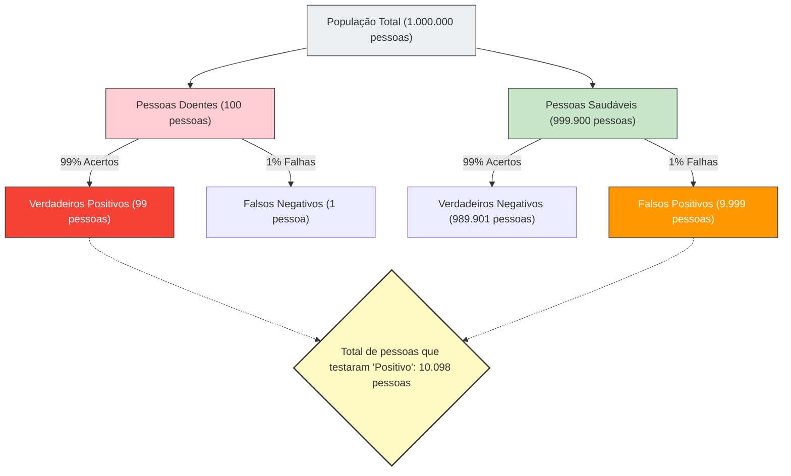

---
title: "Um 'teste positivo' não significa necessariamente 'doença'? A Falácia da Taxa Base"
description: "Mesmo que um teste com 99% de precisão dê positivo, a probabilidade real de ter a doença é de apenas 9%? Uma explicação da 'Falácia da Taxa Base', onde a intuição humana é enganada por dados estatísticos."
date: 2026-09-10T21:00:00+09:00
draft: false
slug: "base-rate-fallacy"
image: "img/base_rate_fallacy.jpg"
math: true
mermaid: true
categories: ["Paradoxos Matemáticos", "Estatística", "Psicologia"]
tags: ["Paradoxo", "Teorema de Bayes", "Probabilidade", "Viés Cognitivo", "Falácia da Taxa Base"]
---

Se você receber um resultado "positivo" (anormal) em um exame de rotina ou de câncer, qualquer um entraria em pânico.
No entanto, com conhecimento de estatística e probabilidade, você pode respirar fundo e manter a calma. Isso ocorre porque **"testar positivo em um teste altamente preciso" não significa necessariamente que "há uma alta probabilidade de você realmente ter a doença"**.

Isso é conhecido como a **"Falácia da Taxa Base (Base Rate Fallacy)"** ou "Negligência da Probabilidade Prévia", um viés cognitivo típico onde a intuição humana julga erroneamente os cálculos de probabilidade.

## O Assustador Problema dos Exames de Saúde

Imagine a seguinte situação.

Em uma determinada cidade, há uma doença desconhecida que infecta 1 em cada 10.000 pessoas (0,01%).
Para detectar essa doença, foi desenvolvido um excelente kit de teste com **"99% de precisão"**.
(*99% de precisão significa que se uma pessoa doente fizer o teste, há 99% de chance de ser avaliada corretamente como "positiva", e se uma pessoa saudável fizer o teste, há 99% de chance de ser avaliada corretamente como "negativa".)

Se por acaso você fez esse teste e o resultado foi **"positivo"**.
Agora, qual é a **probabilidade de você realmente estar infectado com esta doença**?

Muitas pessoas respondem intuitivamente: "Já que a precisão do teste é de 99%, a probabilidade de eu estar doente também deve ser de 99%."
Porém, a resposta matemática correta é **"aproximadamente 0,98% (menos de 1%)"**.

Por que, apesar de uma precisão de 99%, a probabilidade real acaba sendo inferior a 1%?

## Teorema de Bayes e a Visualização do Todo

A chave para desvendar esse problema está em considerar não apenas a precisão do teste, mas também **"quão rara é a doença em primeiro lugar (taxa base/probabilidade prévia)"**.
Vamos visualizar esse fenômeno contraintuitivo usando uma grande população de 1 milhão de pessoas.

- **População Total**: 1.000.000 de pessoas
- **Pessoas Realmente Doentes** (1 em 10.000): 100 pessoas
- **Pessoas Saudáveis**: 999.900 pessoas

Aplicaremos o teste com "99% de precisão" a todas essas 1 milhão de pessoas.

### 1. Quando Pessoas Realmente Doentes (100 pessoas) Fazem o Teste
Com 99% de precisão, aquelas avaliadas corretamente como "positivas" são:
100 pessoas × 99% = **99 pessoas** (Verdadeiros Positivos)

### 2. Quando Pessoas Saudáveis (999.900 pessoas) Fazem o Teste
Com 99% de precisão, há pessoas (falsos positivos) que serão incorretamente avaliadas como "positivas" com uma probabilidade de 1%:
999.900 pessoas × 1% = **9.999 pessoas** (Falsos Positivos)

## A Verdadeira Probabilidade de Você Estar Doente

Agora, o médico informou a você que o resultado "é positivo".
Isso significa que você se juntou ao grupo no canto inferior direito do diagrama, "Total de pessoas que testaram 'Positivo' (10.098 pessoas)".

Dentro deste grupo, qual é a proporção de **"pessoas que estão realmente doentes (verdadeiros positivos)"**?

$$ \text{Probabilidade de estar realmente doente} = \frac{\text{Verdadeiros Positivos}}{\text{Total de positivos}} = \frac{99}{99 + 9.999} = \frac{99}{10.098} \approx 0,0098 $$

O resultado do cálculo é de **aproximadamente 0,98%**.
Apesar de ser informado de que testou "positivo", a probabilidade de você estar saudável (falso positivo) é esmagadoramente maior (cerca de 99%).

## Por Que a Intuição Erra?

Embora esse fenômeno seja explicado matematicamente pelo **"Teorema de Bayes"**, que calcula a probabilidade condicional, o cérebro humano é muito ruim em lidar com esse tipo de cálculo.

O motivo pelo qual cometemos erros é que nos distraímos com as informações individuais e fortes fornecidas imediatamente diante de nós ("O resultado do seu teste é positivo! A precisão é de 99%!"), e ignoramos os imensos e monótonos dados estatísticos ao fundo ("Em primeiro lugar, apenas 1 em 10.000 pessoas contrai essa doença (taxa base)").

**Como a "raridade da doença (0,01%)" é muito mais extrema do que a "imprecisão do teste (1%)", até o menor erro no teste engole rapidamente o número original de pessoas doentes.**

## A "Falácia da Taxa Base" Escondida na Sociedade

Essa ilusão causa pânico e julgamentos equivocados não apenas na medicina, mas em várias outras situações.

- **Sistemas de Reconhecimento Facial e Terroristas**:
  Mesmo que uma câmera de reconhecimento facial com 99,9% de precisão encontre um "terrorista" em um aeroporto, como a probabilidade base de terroristas é extremamente baixa, a maioria das pessoas detidas será de cidadãos comuns inocentes (falsos positivos) com rostos parecidos.
- **Acidentes de Trânsito e Motoristas Idosos**:
  Mesmo que você sinta que há perigo ao ver as notícias de que "〇〇% dos carros que causaram acidentes eram de idosos", a menos que considere a "proporção de motoristas idosos entre todos os motoristas que trafegam nas estradas (taxa base)", você não saberá se essa faixa etária específica tem mais probabilidade real de causar acidentes.

A "Falácia da Taxa Base" nos ensina a importância do pensamento estatístico, ou seja, voltar a refletir sobre **"quão provável é que isso aconteça na totalidade em primeiro lugar (taxa base)"** precisamente quando vemos números chocantes e casos individuais.
