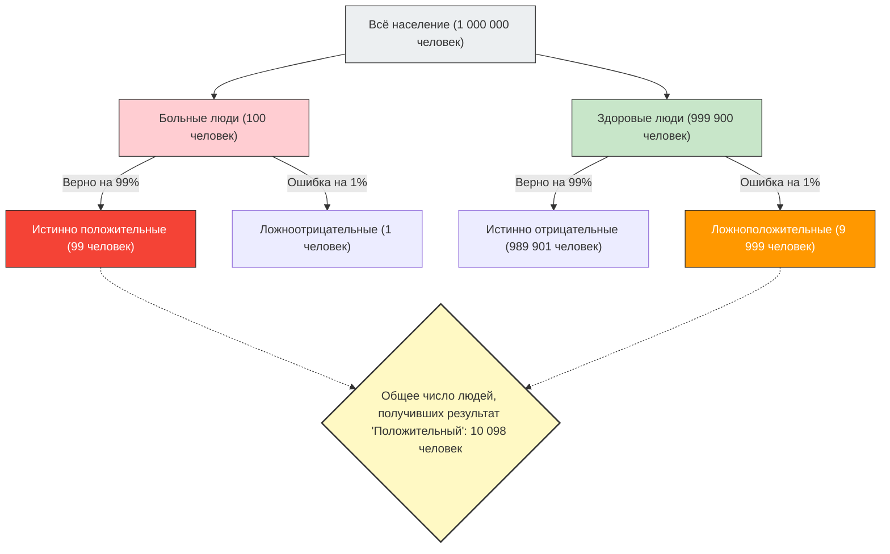

---
title: "«Положительный результат теста» не всегда означает «болезнь»? Ошибка базового процента"
description: "Даже если тест с точностью 99% дает положительный результат, вероятность того, что вы действительно больны, составляет всего 9%? Объясняем «ошибку базового процента», когда человеческая интуиция обманывается статистическими данными."
date: 2026-09-10T21:00:00+09:00
draft: false
slug: "base-rate-fallacy"
image: "img/base_rate_fallacy.jpg"
math: true
mermaid: true
categories: ["Математические парадоксы", "Статистика", "Психология"]
tags: ["Парадокс", "Теорема Байеса", "Вероятность", "Когнитивное искажение", "Ошибка базового процента"]
---

Если на медицинском или онкологическом обследовании вы получите результат «положительно (есть отклонения)», любой человек впадет в панику.
Однако, если у вас есть знания в области статистики и теории вероятностей, возможно, вы сможете сделать глубокий вдох и успокоиться. Все потому, что **«положительный результат высокоточного теста» вовсе не означает, что «вероятность того, что вы действительно больны, высока»**.

Это типичное когнитивное искажение, при котором человеческая интуиция сильно ошибается в расчетах вероятности, называемое **«ошибкой базового процента (Base Rate Fallacy)»** или «игнорированием априорной вероятности».

## Пугающая проблема медицинского обследования

Представьте себе следующую ситуацию.

В одном городе есть неизвестная болезнь, которой заражен 1 человек из 10 000 (0,01%).
Для выявления этой болезни был разработан отличный набор для тестирования с **«точностью 99%»**.
(*Точность 99% означает, что если тест проходит больной человек, то с вероятностью 99% результат будет правильно определен как «положительный», а если здоровый человек — с вероятностью 99% он будет правильно определен как «отрицательный».)

Вы случайно прошли этот тест, и результат оказался **«положительным»**.
Итак, какова вероятность того, что вы **действительно заражены этой болезнью**?

Многие люди интуитивно ответят: «Раз точность теста 99%, значит, вероятность того, что я болен, тоже 99%».
Однако математически правильный ответ — **«около 0,98% (менее 1%)»**.

Почему же при точности 99% фактическая вероятность оказывается меньше 1%?

## Теорема Байеса и визуализация картины в целом

Ключ к разгадке этой проблемы заключается в учете не только точности теста, но и того, **«насколько эта болезнь изначально редка (базовый процент / априорная вероятность)»**.
Давайте визуализируем это противоречащее интуиции явление на примере большой группы из 1 000 000 человек.

- **Общее количество людей**: 1 000 000 человек
- **Действительно больные люди** (1 на 10 000): 100 человек
- **Здоровые люди**: 999 900 человек

Всем этим 1 миллиону человек проводится тест с «точностью 99%».

### 1. Если тест проходят действительно больные люди (100 человек)
Так как точность 99%, правильно определены как «положительные» будут:
100 человек × 99% = **99 человек** (истинно положительные)

### 2. Если тест проходят здоровые люди (999 900 человек)
Так как точность 99%, есть люди, которые с вероятностью 1% будут ошибочно определены как «положительные» (ложноположительные):
999 900 человек × 1% = **9 999 человек** (ложноположительные)

## Истинная вероятность того, что вы больны

Итак, врач сообщил вам: «У вас положительный результат».
Это означает, что вы попали в группу «Общее число людей, получивших результат 'Положительный' (10 098 человек)», расположенную в правой нижней части схемы.

Какова доля **«действительно больных людей (истинно положительных)»** в этой группе?

$$ \text{Вероятность того, что вы действительно больны} = \frac{\text{Истинно положительные}}{\text{Все получившие положительный результат}} = \frac{99}{99 + 9,999} = \frac{99}{10,098} \approx 0.0098 $$

Результат расчета — **около 0,98%**.
Несмотря на то, что вам сказали о «положительном» результате, вероятность того, что вы здоровы (ложноположительный результат), подавляюще выше (около 99%).

## Почему интуиция ошибается?

Это явление математически объясняется **«теоремой Байеса»** для вычисления условной вероятности, но человеческий мозг очень плохо справляется с такими вычислениями.

Причина, по которой мы совершаем ошибку, заключается в том, что мы отвлекаемся на индивидуальную и яркую информацию, предоставленную нам прямо сейчас («Ваш результат теста положительный! Точность 99%!»), и игнорируем огромные и скучные статистические данные на заднем плане («Изначально этой болезнью болеет только 1 из 10 000 человек (базовый процент)»).

**Поскольку «редкость болезни (0,01%)» гораздо более экстремальна, чем «неточность теста (1%)», незначительные ошибки тестирования мгновенно поглощают истинное число больных.**

## «Ошибка базового процента», скрывающаяся в обществе

Эта иллюзия вызывает панику и ошибочные суждения не только в медицине, но и в различных других ситуациях.

- **Системы распознавания лиц и террористы**:
  Даже если камера с распознаванием лиц с точностью 99,9% обнаружит «террориста» в аэропорту, поскольку базовая вероятность наличия террориста крайне мала, задержанными окажутся в основном невинные обычные люди с похожими лицами (ложноположительный результат).
- **Дорожно-транспортные происшествия и пожилые водители**:
  Даже если вы почувствуете опасность, увидев новости о том, что «〇〇% автомобилей, попавших в аварии, управлялись пожилыми людьми», если не учесть «долю пожилых людей среди всех водителей на дорогах (базовый процент)», будет непонятно, действительно ли эта конкретная возрастная группа более склонна к авариям.

«Ошибка базового процента» учит нас важности статистического мышления: когда мы видим шокирующие цифры или отдельные случаи, нам следует возвращаться к вопросу: **«Насколько вообще вероятно, что это произойдет в целом (базовый процент)»**.
