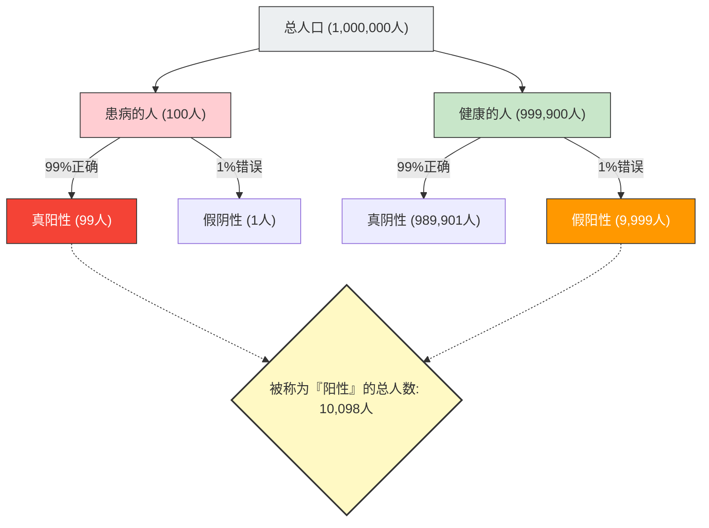

在健康检查或癌症筛查中，如果出现“阳性（异常）”的结果，任何人都会感到恐慌。
但是，如果你具备统计学和概率知识，也许就能深呼吸并保持冷静。这是因为，**“在精准度极高的检查中呈阳性”并不意味着“实际生病的概率很高”**。

这被称为**“基准率谬误（Base Rate Fallacy）”**或“忽视先验概率”，是人类直觉在计算概率时产生严重误判的典型认知偏差。

## 令人恐惧的健康体检问题

请想象以下情况。

在某个城镇中，有一种未知疾病，每1万人中有1人（0.01%）感染。
为了发现这种疾病，开发了一种**“准确率99%”**的优秀检测试剂盒。
（※准确率99%意味着，当患病者接受检查时，有99%的概率正确判定为“阳性”，而健康人接受检查时，有99%的概率正确判定为“阴性”）

你碰巧接受了这项检查，结果为**“阳性”**。
那么，你**真正感染这种疾病的概率**是多少呢？

许多人会直觉地回答：“既然检查的准确率是99%，那么自己生病的概率也是99%吧。”
然而，数学上的正确答案是**“约0.98%（不到1%）”**。

究竟为什么即使有99%的准确率，实际生病的概率却不到1%呢？

## 贝叶斯定理与整体可视化

解开这个问题的关键，不仅在于检查的准确率，还要考虑**“这种疾病本来有多罕见（基准率・先验概率）”**。
让我们用100万人的庞大群体，将这个违反直觉的现象可视化。

- **总人数**：1,000,000人
- **实际患病的人**（1万人中1人）：100人
- **健康的人**：999,900人

对这100万所有人进行“准确率99%”的检查。

### 1. 实际患病的人（100人）接受检查时
因为准确率是99%，所以被正确判定为“阳性”的人数是：
100人 × 99% = **99人**（真阳性）

### 2. 健康的人（999,900人）接受检查时
因为准确率是99%，所以有1%的概率会被错误判定为“阳性”（假阳性）：
999,900人 × 1% = **9,999人**（假阳性）

## 你患病的真实概率

好了，医生告诉你：“结果是阳性。”
这意味着，你进入了图中右下角的“被称为『阳性』的总人数（10,098人）”群体。

在这个群体中，**“真正患病的人（真阳性）”**的比例是多少呢？

$$ \text{真正患病的概率} = \frac{\text{真阳性}}{\text{被称为阳性的所有人}} = \frac{99}{99 + 9,999} = \frac{99}{10,098} \approx 0.0098 $$

计算结果为**约0.98%**。
尽管被告知“阳性”，你健康的概率（假阳性）反而具有压倒性的优势（约99%）。

## 为什么直觉会出错？

这种现象可以由计算条件概率的**“贝叶斯定理”**在数学上进行解释，但人类大脑非常不擅长进行这种计算。

我们犯错的原因是，被眼前提供的个别且强烈的信息（“你的检查结果是阳性！准确率是99%！”）分散了注意力，从而忽略了背景中庞大而枯燥的统计数据（“原来感染这种疾病的人只有1万分之1（基准率）”）。

**由于“疾病的罕见性（0.01%）”比“检查的不准确性（1%）”要极端得多，因此即使是微小的检查误差，也会迅速吞没原本就很少的患者数量。**

## 潜伏在社会中的「基准率谬误」

这种错觉不仅在医疗领域，在各种场合都会引发恐慌或错误判断。

- **面部识别系统与恐怖分子**：
  即使准确率为99.9%的面部识别摄像头在机场发现了“恐怖分子”，由于恐怖分子的基本概率极低，被抓的几乎都是长相相似的无辜平民（假阳性）。
- **交通事故与老年驾驶员**：
  即使看到新闻说“发生事故的车辆中有〇〇%是老年人”而感到危险，但如果不考虑“原来在道路上行驶的所有驾驶员中，老年人所占的比例（基准率）”，就无法知道某个特定年龄段是否真的容易发生事故。

“基准率谬误”告诉我们，越是在看到令人震惊的数字或个别案例时，越需要回归到**“原本在整体中，这有多容易发生（基准率）”**，体现了统计学思维的重要性。
