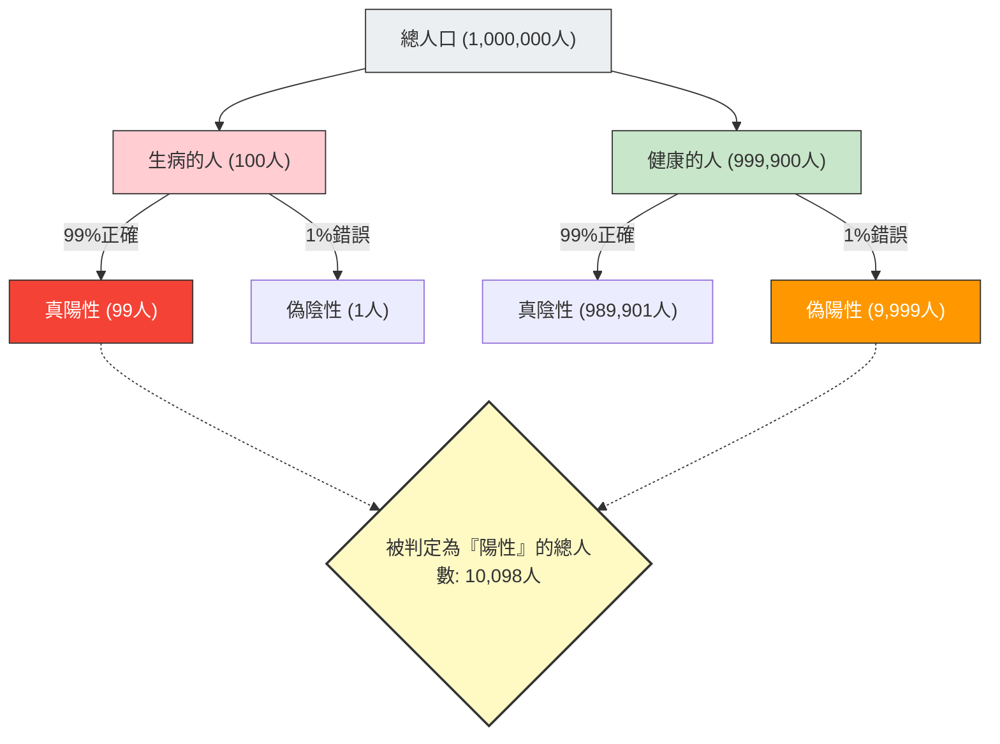

---
title: "「檢驗陽性」＝「生病」？：基準率謬誤"
description: "即使在準確率高達 99% 的檢驗中呈陽性，實際罹病的機率竟然只有 9%？本文帶您了解人類直覺如何被統計數據欺騙的「基準率謬誤」。"
date: 2026-09-10T21:00:00+09:00
draft: false
slug: "base-rate-fallacy"
image: "img/base_rate_fallacy.jpg"
math: true
mermaid: true
categories: ["數學悖論", "統計學", "心理學"]
tags: ["悖論", "貝氏定理", "機率", "認知偏誤", "基準率謬誤"]
---

在健康檢查或癌症篩檢中，如果出現「陽性（有異常）」的結果，任何人大概都會感到恐慌。
然而，如果具備統計學與機率的知識，或許就能深呼吸並冷靜下來。因為，**「在準確率高的檢驗中呈陽性」，並不代表「實際罹病的機率就一定很高」**。

這被稱為**「基準率謬誤（Base Rate Fallacy）」**或「忽略事前機率」，是人類直覺在計算機率時產生嚴重誤判的典型認知偏誤。

## 恐怖的健康檢查問題

請想像一下以下的情況。

在某個城鎮中，有一種未知疾病，每 1 萬人中會有 1 人（0.01%）感染。
為了發現這種疾病，人們開發出了一款**「準確率 99%」**的優良檢驗試劑。
（※準確率 99% 的意思是：如果生病的人接受檢驗，有 99% 的機率會正確判定為「陽性」；如果健康的人接受檢驗，有 99% 的機率會正確判定為「陰性」。）

你碰巧接受了這項檢驗，而結果是**「陽性」**。
那麼，你**真正感染這種疾病的機率**是多少呢？

許多人會直覺地回答：「既然檢驗準確率是 99%，那我生病的機率應該也是 99% 吧。」
然而，數學上的正確答案是**「約 0.98%（不到 1%）」**。

究竟為什麼明明有 99% 的準確率，實際罹病的機率卻不到 1% 呢？

## 貝氏定理與整體的視覺化

解開這個問題的關鍵在於，除了檢驗準確率之外，還必須考量**「這種疾病原本有多罕見（基準率・事前機率）」**。
讓我們用 100 萬人這個龐大的群體，將這個違反直覺的現象視覺化吧。

- **總人數**：1,000,000 人
- **實際生病的人**（1 萬人中的 1 人）：100 人
- **健康的人**：999,900 人

我們對這 100 萬人全部進行「準確率 99%」的檢驗。

### 1. 實際生病的人（100 人）接受檢驗的情況
因為準確率是 99%，所以被正確判定為「陽性」的人數是：
100 人 × 99% = **99 人**（真陽性）

### 2. 健康的人（999,900 人）接受檢驗的情況
因為準確率是 99%，所以有 1% 的機率會被錯誤判定為「陽性」（偽陽性）：
999,900 人 × 1% = **9,999 人**（偽陽性）

## 你罹患疾病的真實機率

那麼，醫生告訴你：「你是陽性」。
這意味著你進入了圖表右下方「被判定為『陽性』的總人數（10,098 人）」這個群體。

在這個群體中，**「真正生病的人（真陽性）」**的比例是多少呢？

$$ \text{真正生病的機率} = \frac{\text{真陽性}}{\text{被判定為陽性的總人數}} = \frac{99}{99 + 9,999} = \frac{99}{10,098} \approx 0.0098 $$

計算結果是**約 0.98%**。
儘管被判定為「陽性」，但你其實很健康（偽陽性）的機率卻壓倒性地高（約 99%）。

## 為什麼直覺會出錯？

這個現象可以透過計算條件機率的**「貝氏定理」**來進行數學上的解釋，但人類的大腦非常不擅長進行這種計算。

我們會犯錯的原因在於，我們被眼前提供的強烈個別資訊（「你的檢驗結果是陽性！準確率 99%！」）轉移了注意力，從而忽略了背景中龐大而枯燥的統計數據（「原本罹患這種疾病的人就只有 1 萬人中的 1 人（基準率）」）。

**因為「疾病的罕見程度（0.01%）」比「檢驗的不準確度（1%）」還要極端得多，所以些微的檢驗誤差，就會瞬間淹沒原本真正生病的人數。**

## 潛藏在社會中的「基準率謬誤」

這種錯覺不僅在醫療領域，在各種場合都會引發恐慌或錯誤的判斷。

- **臉部辨識系統與恐怖分子**：
  即使準確率高達 99.9% 的臉部辨識攝影機在機場發現了「恐怖分子」，但由於恐怖分子的基本機率極低，因此被抓到的幾乎都會是長相相似的無辜平民（偽陽性）。
- **交通事故與高齡駕駛**：
  即使看到「發生事故的車輛中有 〇〇% 是高齡者」的新聞而感到危險，但如果不考慮「原本在道路上行駛的所有駕駛中，高齡者所佔的比例（基準率）」，就無法得知特定的年齡層是否真的更容易引發事故。

「基準率謬誤」告訴我們統計思考的重要性：越是看到令人震驚的數字或個別案例時，我們就越應該回頭去思考**「這在整體中原本發生的機率有多高（基準率）」**。
