Ketika saya mengingat game favorit saya, ternyata sebagian besar adalah game klasik yang legendaris.
Karena banyak game lama, bagi yang belum memainkannya silakan coba mainkan.

## Game Boy
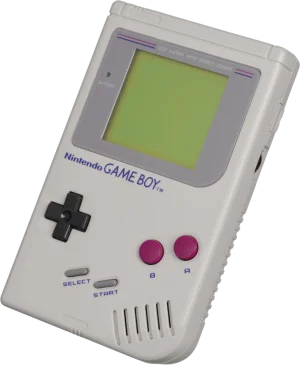
Game Boy pertama adalah konsol game portabel yang dirilis oleh Nintendo pada tahun 1989.
Setelah itu, penerusnya seperti Game Boy Color dan Game Boy Advance dirilis.

### ① Sa・Ga2 Hihou Densetsu
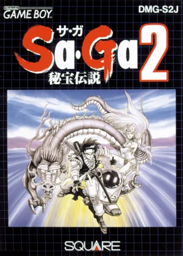
Game RPG yang dirilis oleh Square (sekarang Square Enix) pada tahun 1990.
Ceritanya adalah mengumpulkan harta karun di berbagai stage,
dan ini adalah game RPG pertama yang pernah saya mainkan.

### ② Kirby's Dream Land (Hoshi no Kirby)
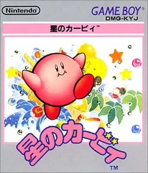
Game aksi yang dirilis oleh Nintendo pada tahun 1992. Pengembangnya adalah HAL Laboratory.
Game di mana Anda maju dengan menyedot musuh atau menghirup udara untuk melayang di udara.
Musik dan efek suaranya dibuat dengan sangat baik sehingga menjadi karya yang bisa dimainkan dengan ritmis.

### ③ Pokémon Red dan Green
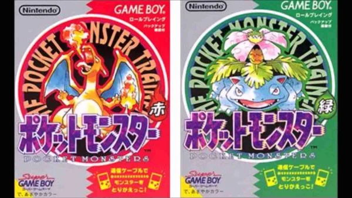
Game RPG yang dirilis oleh Nintendo pada tahun 1996. Dikembangkan oleh Nintendo EAD, Game Freak, dan Creatures.
Setelah itu diadaptasi menjadi anime dan mendapatkan popularitas yang luar biasa, tetapi saya hanya pernah memainkan generasi pertama ini.

## Super Famicom (SNES)
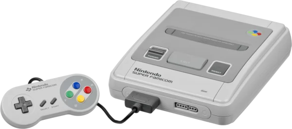
Konsol game rumahan yang dirilis oleh Nintendo pada tahun 1990. Di luar negeri juga dikenal sebagai SNES (Super Nintendo Entertainment System).

### ④ Super Mario Kart
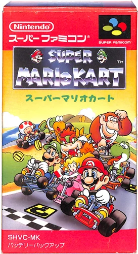
Perangkat lunak untuk Super Famicom yang dirilis oleh Nintendo pada tahun 1992.
Game balap di mana Anda bersaing untuk posisi sambil mengganggu lawan dengan melempar item tempurung atau pisang.
Saya ingat memainkannya bersama keluarga dan teman-teman.

### ⑤ Dragon Quest V: Hand of the Heavenly Bride
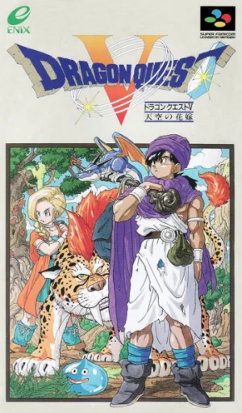
Game RPG yang dirilis oleh Enix pada tahun 1992.
Ini adalah game yang memiliki elemen memilih pasangan hidup, dan elemen di mana monster yang dikalahkan dapat dijadikan rekan.
Saya memainkannya dengan tekun sampai saya berhasil merekrut beberapa Metal Slime sebagai rekan.

### ⑥ Final Fantasy V
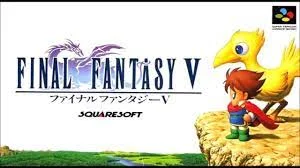
Game RPG yang dirilis oleh Square pada tahun 1992.
Memiliki elemen mendalam yaitu memilih pekerjaan (job) dan menguasai skill.
Sama seperti Dragon Quest, saya ingat terus-menerus menaikkan level di dalam gua.

### ⑦ Torneko's Great Adventure: Mystery Dungeon
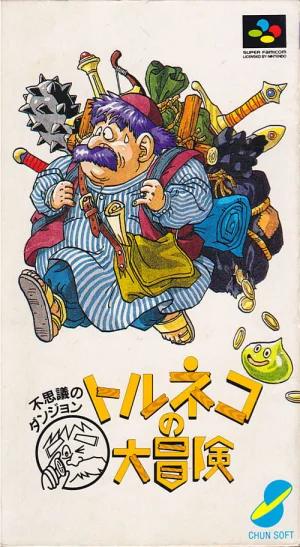
Game roguelike yang dirilis oleh Chunsoft pada tahun 1993.
Pendahulu seri Mystery Dungeon.
Ciri khasnya adalah bentuk dungeon berubah secara acak setiap kali dimainkan.
Slogan iklannya adalah "RPG yang bisa dimainkan 1000 kali".

### ⑧ Mystery Dungeon 2: Shiren the Wanderer
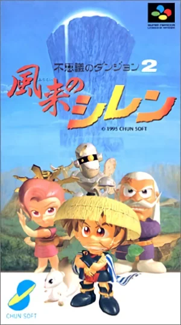
Game roguelike yang dirilis oleh Chunsoft pada tahun 1995.
Sekuel dari seri Mystery Dungeon "Torneko's Great Adventure".
Terdapat toko di dalam dungeon, dan Anda dapat membeli item.
(Jika Anda keluar dari toko tanpa membeli, penjaga toko akan mengejar Anda.)

### ⑨ MOTHER2 (EarthBound)
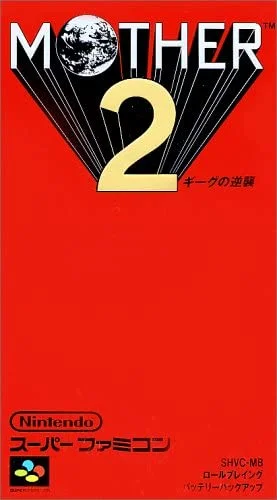
Karya kedua dalam seri MOTHER yang dirilis oleh Nintendo pada tahun 1994. Pengembangnya adalah Ape dan HAL Laboratory.
Kemudian pada tahun 2006, MOTHER3 dirilis. Karya yang diproduseri oleh Shigesato Itoi ini,
dipenuhi dengan pandangan dunia yang unik dan kata-kata filosofis.

### ⑩ The Legend of Zelda: A Link to the Past
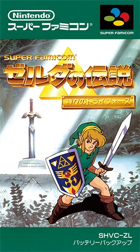
Game aksi-petualangan yang dirilis oleh Nintendo pada tahun 1991.
Game di mana Anda maju sambil mengumpulkan berbagai item dan memecahkan teka-teki kecil.
Setelah itu, berbagai sekuel telah dirilis. ([Referensi](https://ja.wikipedia.org/wiki/%E3%82%BC%E3%83%AB%E3%83%80%E3%81%AE%E4%BC%9D%E8%AA%AC%E3%82%B7%E3%83%AA%E3%83%BC%E3%82%BA%E3%81%AE%E4%BD%9C%E5%93%81%E3%83%BB%E9%96%A2%E9%80%A3%E4%BD%9C%E5%93%81%E3%81%AE%E4%B8%80%E8%A6%A7))

## Nintendo Switch
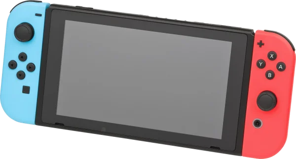
Konsol game rumahan yang dirilis oleh Nintendo pada tahun 2017.

### ⑪ Splatoon 2
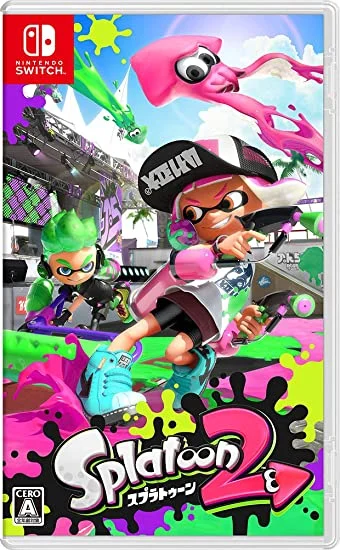
Game aksi-menembak yang dirilis oleh Nintendo pada tahun 2017.
Game di mana Anda bertujuan untuk menang dengan mengamankan wilayah menggunakan tinta atau mengalahkan lawan.
Pada tahun 2022, sekuelnya, Splatoon 3, telah dirilis.
