回想起喜歡的遊戲，結果全都是殿堂級的作品。
因為老遊戲居多，還沒玩過的朋友請務必嘗試看看。

## Game Boy
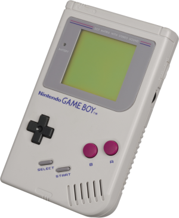
初代 Game Boy 是由任天堂於1989年發售的掌上型遊戲機。
隨後也發售了 Game Boy Color 和 Game Boy Advance 等後繼機種。

### ① Sa・Ga2 秘寶傳說
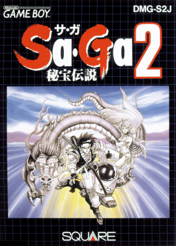
1990年由史克威爾（現為史克威爾艾尼克斯）發售的RPG遊戲。
這是一個在各個關卡中不斷收集被稱為秘寶的寶物的故事，
這是我第一次玩的RPG遊戲。

### ② 星之卡比
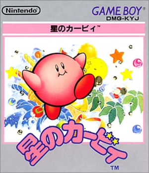
1992年由任天堂發售的動作遊戲。開發商為 HAL 研究所。
這是一款透過吸入敵人或吸入空氣漂浮在空中來推進的遊戲。
音樂和音效也做得相當好，成為一款玩起來很有節奏感的作品。

### ③ 精靈寶可夢 紅・綠
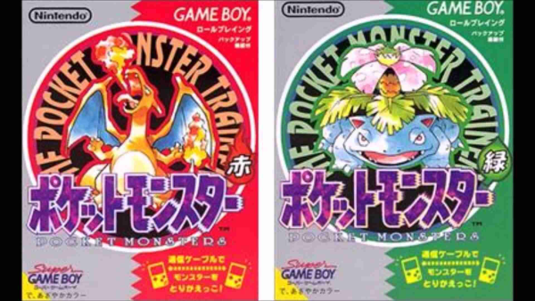
1996年由任天堂發售的RPG遊戲。開發商為任天堂情報開發本部、Game Freak、Creatures。
之後雖然改編成動畫並獲得了爆炸性的人氣，但我只玩過這個初代。

## 超級任天堂 (Super Famicom)
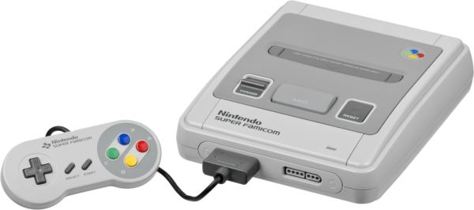
1990年由任天堂發售的家用遊戲機。在海外也被稱為 SNES (Super Nintendo Entertainment System)。

### ④ 超級瑪利歐賽車
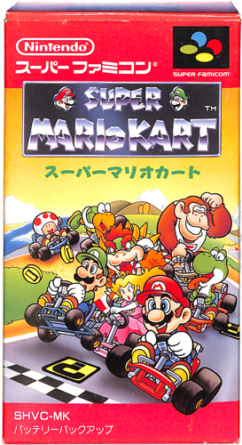
1992年由任天堂發售的超級任天堂軟體。
這是一款一邊丟龜殼或香蕉皮等道具妨礙對手，一邊競爭名次的競速遊戲。
我還記得以前常和家人朋友一起玩。

### ⑤ 勇者鬥惡龍V 天空的新娘
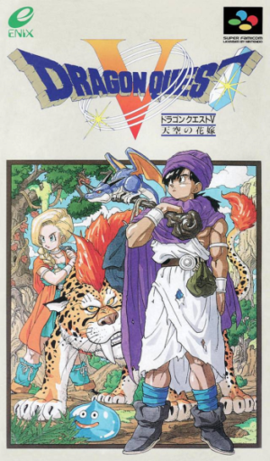
1992年由艾尼克斯發售的RPG遊戲。
這款遊戲包含了選擇結婚對象的元素，以及能將打倒的怪物變成同伴的元素。
我沉迷到直到收服了多隻迷路金屬史萊姆成為同伴才罷休。

### ⑥ 最終幻想V (Final Fantasy V)
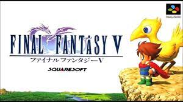
1992年由史克威爾發售的RPG遊戲。
具有選擇職業並將技能練到極致的耐玩元素。
跟勇者鬥惡龍一樣，我記得以前總是死命地在洞穴裡練等。

### ⑦ 特魯內克大冒險 不可思議的迷宮
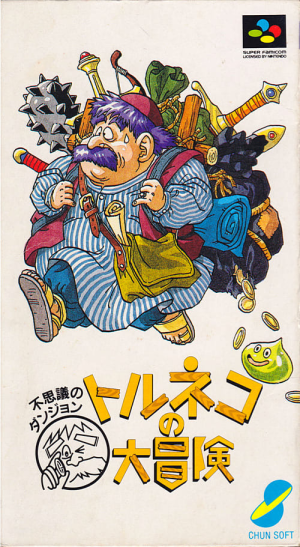
1993年由 Chunsoft 發售的 Roguelike 遊戲。
不可思議的迷宮系列的前身。
其特色是每次迷宮的形狀都會隨機改變。
宣傳語是「可以玩1000次的RPG」。

### ⑧ 不可思議的迷宮2 風來的希煉
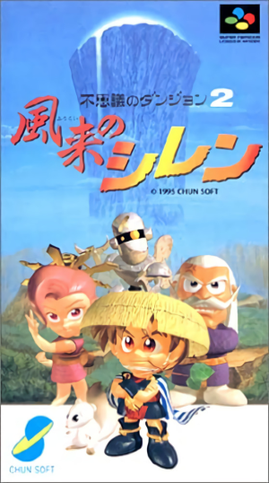
1995年由 Chunsoft 發售的 Roguelike 遊戲。
不可思議的迷宮系列《特魯內克大冒險》的續作。
迷宮內有商店，可以在裡面購買道具。
（如果不付錢就走出商店，店主會追上來。）

### ⑨ MOTHER2 (地球冒險2)
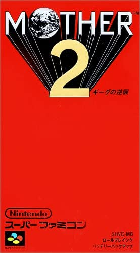
1994年由任天堂發售的 MOTHER 系列第二作。開發商為 Ape 和 HAL 研究所。
之後在2006年發售了 MOTHER3。這是一部由糸井重里先生製作的作品，
裡面點綴著獨特的世界觀和充滿哲理的話語。

### ⑩ 薩爾達傳說 眾神的三角神力
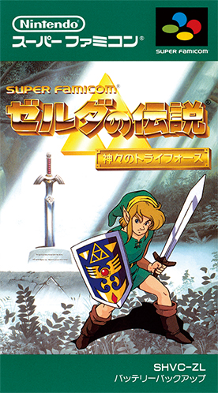
1991年由任天堂發售的動作冒險遊戲。
這是一款一邊收集各種道具、解開一些小謎題一邊推進的遊戲。
之後發售了各種續作。（[參考](https://ja.wikipedia.org/wiki/%E3%82%BC%E3%83%AB%E3%83%80%E3%81%AE%E4%BC%9D%E8%AA%AC%E3%82%B7%E3%83%AA%E3%83%BC%E3%82%BA%E3%81%AE%E4%BD%9C%E5%93%81%E3%83%BB%E9%96%A2%E9%80%A3%E4%BD%9C%E5%93%81%E3%81%AE%E4%B8%80%E8%A6%A7)）

## 任天堂 Switch
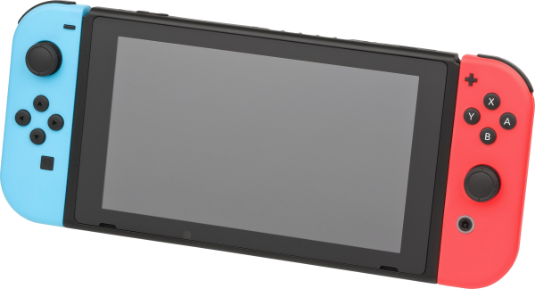
2017年由任天堂發售的家用遊戲機。

### ⑪ 斯普拉遁2 (Splatoon 2)
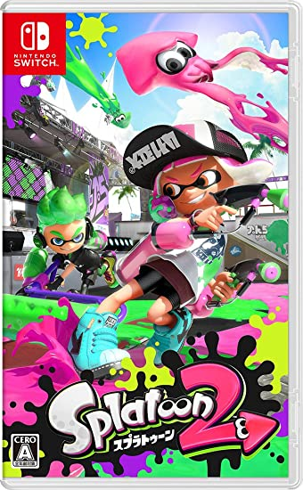
2017年由任天堂發售的動作射擊遊戲。
這是一款使用墨汁來佔領地盤、或是打倒對手以取得勝利的遊戲。
2022年發售了續作斯普拉遁3。
