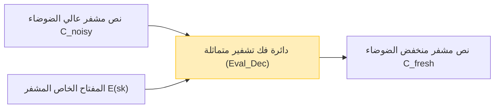

مع ترسخ الحوسبة السحابية وتقنيات الذكاء الاصطناعي كبنية تحتية للمجتمع، أصبحت المفاضلة بين "خصوصية البيانات" و "استخدام البيانات" واحدة من أهم التحديات. يتزايد الطلب على جعل الذكاء الاصطناعي يحلل البيانات شديدة السرية مثل البيانات الطبية والمعلومات المالية والمعلومات الحيوية الشخصية على السحابة، لكن العديد من الشركات تتردد في إرسال البيانات إلى الخارج بسبب مخاوف أمنية.

تتفوق تقنيات التشفير التقليدية (مثل AES و RSA) في حماية البيانات المخزنة (Data at Rest) والبيانات المرسلة عبر الشبكة (Data in Transit). ومع ذلك، **عند إجراء عمليات (حسابات) مثل البحث أو التعلم الآلي على البيانات من جانب الخادم (Data in Use)، يجب فك تشفيرها وإعادتها إلى نص صريح**. إذا تم اختراق الخادم في وقت فك التشفير هذا، أو إذا قام مسؤول داخلي خبيث بالاطلاع على البيانات، فسيؤدي ذلك مباشرة إلى تسريب المعلومات.

التقنية الحلم التي تتغلب على نقطة الضعف الأساسية المتمثلة في "فك التشفير أثناء المعالجة" هي **التشفير المتماثل بالكامل (Fully Homomorphic Encryption: FHE)**. باستخدام FHE، يصبح من الممكن إجراء عمليات المعالجة الحسابية مع إبقاء البيانات مشفرة دون فك تشفيرها على الإطلاق، وإرجاع النص المشفر الناتج فقط إلى العميل.

في هذه المقالة، سنشرح بعمق FHE، والذي يمثل جوهر أمن الجيل القادم، بدءًا من مفاهيمه وتاريخه، والاختراق الثوري الذي حققه كريج جينتري (Craig Gentry)، والأسس الرياضية (مثل Ring-LWE)، والتحدي الأكبر "الضوضاء" وحله (Bootstrapping)، وصولاً إلى أحدث مكتبات التنفيذ.

---

## 1. ما هو التشفير المتماثل؟ المفاهيم الأساسية

"المتماثل" (Homomorphic) هو مصطلح في الجبر يشير إلى خاصية إمكانية التعيين بين المجموعات التي لها بنية معينة مع الحفاظ على بنية العمليات. "التماثل" في نظرية التشفير هو خاصية أن **العمليات في مساحة النص الصريح تتوافق مع العمليات في مساحة النص المشفر**.

بصيغة رياضية بسيطة، لتكن دالة التشفير للنصوص الصريحة $m_1$ و $m_2$ هي $E(\cdot)$ ودالة فك التشفير هي $D(\cdot)$. إذا كانت العمليات (مثل الجمع والضرب) على النص الصريح هي $\circ$، والعمليات على النص المشفر هي $\diamond$، فإن العلاقة التالية تتحقق:

$$ D(E(m_1) \diamond E(m_2)) = m_1 \circ m_2 $$

بمعنى آخر، فك تشفير نتيجة تطبيق بعض العمليات $\diamond$ على النصوص المشفرة $E(m_1)$ و $E(m_2)$ يتطابق مع نتيجة تطبيق العملية $\circ$ على النصوص الصريحة الأصلية.

### تدفق البيانات في الحوسبة السحابية

تختلف بنية المعالجة السحابية باستخدام FHE تمامًا عن البنية التقليدية. يوضح الشكل التالي تدفق معالجة البيانات الآمنة باستخدام FHE.

```mermaid
graph TD
    A["العميل (يحتفظ بالمفتاح الخاص)"] -->|1. تشفير النص الصريح x: E(x)| B["الخادم السحابي (بيانات مشفرة فقط)"]
    B -->|2. تطبيق الدالة f على النص المشفر: E(f(x))| B
    B -->|3. النص المشفر لنتيجة الحساب E(y)| A
    A -->|4. فك التشفير بالمفتاح الخاص: y = f(x)| A
    
    style A fill:#d4edda,stroke:#28a745
    style B fill:#f8d7da,stroke:#dc3545
```

يتلقى الخادم البيانات المشفرة $E(x)$، ولكنه لا يمتلك المفتاح الخاص، لذا لا يمكنه مطلقًا معرفة محتوى البيانات. ومع ذلك، من خلال الاستفادة من خصائص FHE، يمكنه تطبيق الدالة $f$ (على سبيل المثال، نموذج استدلال التعلم الآلي) على النص المشفر وتوليد $E(f(x))$. يتلقى العميل هذا ويفك تشفيره باستخدام مفتاحه الخاص للحصول على النتيجة المطلوبة $y = f(x)$.

---

## 2. تاريخ تطور التشفير المتماثل: PHE و SHE و FHE

لم يصل التشفير المتماثل إلى شكله "الكامل" الحالي دفعة واحدة. يُصنف بشكل عام إلى ثلاث مراحل بناءً على أنواع وعدد العمليات التي يمكن تنفيذها.

### التشفير المتماثل جزئيًا (PHE: Partially Homomorphic Encryption)
PHE هو نظام تشفير يمكنه إجراء **إما** الجمع أو الضرب بعدد غير محدود من المرات. في الواقع، فإن أنظمة التشفير التي تتمتع بهذه الخاصية موجودة منذ فترة طويلة.

*   **تشفير RSA (التماثل بالنسبة للضرب)**
    يمتلك تشفير RSA عن غير قصد خاصية التماثل بالنسبة للضرب. بافتراض أن النصوص الصريحة هي $m_1, m_2$ والمفتاح العام هو $(e, N)$:
    $$ E(m_1) = m_1^e \pmod N $$
    $$ E(m_2) = m_2^e \pmod N $$
    عند ضربهما معًا:
    $$ E(m_1) \times E(m_2) = (m_1 \cdot m_2)^e \pmod N = E(m_1 \times m_2) $$
    وهكذا، يتوافق ضرب النصوص المشفرة مع ضرب النصوص الصريحة.
*   **تشفير Paillier (التماثل بالنسبة للجمع)**
    يمتلك تشفير Paillier، الذي تم ابتكاره في عام 1999، التماثل بالنسبة للجمع. وقد تم وضعه موضع التنفيذ في مجالات مثل التصويت الإلكتروني (حيث يتم فرز الأصوات المشفرة وفك تشفير النتيجة النهائية فقط).

### التشفير المتماثل المحدود (SHE: Somewhat Homomorphic Encryption)
يمكنه تنفيذ **كلا** عمليتي الجمع والضرب، ولكنه نظام يوجد فيه **قيود على عدد العمليات (عمق الدائرة)** التي يمكن إجراؤها. بسبب تراكم "الضوضاء" الموضح أدناه، يصبح فك التشفير مستحيلاً إذا تم إجراء عدد معين من عمليات الضرب. يندرج تشفير BGN (Boneh-Goh-Nissim) لعام 2005 ضمن هذه الفئة، ولكن كانت هناك حدود لإجراء الحسابات المعقدة العملية (مثل التعلم العميق).

### التشفير المتماثل بالكامل (FHE: Fully Homomorphic Encryption)
إنه نظام تشفير يمكنه إجراء عمليتي الجمع والضرب بعدد **غير محدود** من المرات. تمامًا مثل اكتمال تورينج (Turing completeness) في نظرية المعلومات، إذا أمكن الجمع (بما يعادل XOR) والضرب (بما يعادل AND) بشكل غير محدود، فهذا يعني نظريًا أن أي دالة أو خوارزمية قابلة للحساب يمكن تنفيذها مع بقاء البيانات مشفرة.

لفترة طويلة، أُطلق على FHE اسم "الكأس المقدسة للتشفير"، وقيل إنه قد يكون من المستحيل تحقيقه. ومع ذلك، في عام 2009، اقترح **كريج جينتري (Craig Gentry)**، الذي كان حينها طالب دكتوراه في جامعة ستانفورد، أول نظام FHE باستخدام الشبكات المثالية (Ideal Lattices)، وصدم العالم.

---

## 3. الأساس الرياضي لـ FHE: مشكلة LWE و Ring-LWE

تستند العديد من أنظمة FHE السائدة حاليًا إلى **مشكلة التعلم مع الأخطاء (LWE: Learning With Errors)**، وهي مشكلة رياضية صعبة في "التشفير القائم على الشبكات" (Lattice-based Cryptography)، والمعروفة أيضًا باسم تشفير ما بعد الكم (Post-Quantum Cryptography).

### فهم بديهي لمشكلة LWE
من السهل حل نظام من المعادلات الخطية باستخدام طرق مثل الحذف الغاوسي (Gaussian elimination).

$$ \begin{cases} 3s_1 + 4s_2 + 2s_3 \equiv 12 \pmod{17} \\ 1s_1 + 9s_2 + 5s_3 \equiv 8 \pmod{17} \\ \vdots \end{cases} $$

ولكن ماذا يحدث إذا أضفنا "خطأ عشوائي (ضوضاء)" $e$ صغير جدًا لنتيجة هذه المعادلات؟

$$ \begin{cases} 3s_1 + 4s_2 + 2s_3 + e_1 \equiv 13 \pmod{17} \\ 1s_1 + 9s_2 + 5s_3 + e_2 \equiv 7 \pmod{17} \\ \vdots \end{cases} $$

بمجرد إضافة هذا الخطأ $e$، تتحول مشكلة إيجاد متجه المتغيرات السري $\vec{s}$ إلى مشكلة NP صعبة من الصعب فك تشفيرها حتى باستخدام أجهزة الكمبيوتر العملاقة الحالية أو أجهزة الكمبيوتر الكمومية. هذه هي مشكلة LWE.

### مشكلة Ring-LWE (RLWE)
نظرًا لأن مشكلة LWE القياسية تتضمن عمليات على المصفوفات، فقد كانت هناك مشكلة تتمثل في أن حجم المفتاح كبير جدًا (أحيانًا يصل إلى الجيجابايت) وكفاءة الحساب ضعيفة. ولحل هذه المشكلة تم إدخال **مشكلة Ring-LWE (RLWE)**، والتي تستخدم عمليات على حلقات متعددات الحدود.

في RLWE، تنتمي العناصر إلى حلقة متعددات الحدود $R_q = \mathbb{Z}_q[x] / (x^N + 1)$ (حيث $N$ هي قوة للعدد 2، و $q$ عدد أولي هو المعيار (modulo)).
بافتراض أن المفتاح الخاص هو متعدد الحدود $s(x)$، ومتعدد الحدود العشوائي $a(x)$، ومتعدد حدود للضوضاء الصغيرة $e(x)$، فإن المفتاح العام يصبح الزوج التالي:

$$ (a(x), b(x)) \quad \text{where} \quad b(x) = -a(x) \cdot s(x) + e(x) \pmod q $$

عند التشفير، تُستخدم خصائص هذه المتعددات الحدود لتشفير النص الصريح $m(x)$ وتوليد النص المشفر.

---

## 4. أكبر عائق "الضوضاء" و Bootstrapping الخاص بجينتري

يُعد مفهوم **"إدارة الضوضاء"** هو الأهم في فهم FHE.

في أنظمة التشفير القائمة على LWE/RLWE، يتم تضمين "ضوضاء (خطأ)" صغيرة عمدًا لضمان الأمان.
يمكن التعبير عن عملية فك تشفير النص المشفر $c$ الخاص بالنص الصريح $m$ بشكل تقريبي باستخدام المعادلة التالية.

$$ D(c) = (c \cdot s) \pmod q = m + \text{noise} $$

عند فك التشفير، تتم إزالة هذا الـ `noise` (الضوضاء) عن طريق عمليات التقريب للحصول على النص الصريح الصحيح $m$. ومع ذلك، عند إجراء عمليات متماثلة (خاصة الضرب) بين النصوص المشفرة، تتضخم هذه الضوضاء بشكل كبير.

*   **الجمع المتماثل**: تزداد الضوضاء بشكل جمعي ($e_1 + e_2$). هذه زيادة تدريجية نسبيًا.
*   **التعبير الرياضي للتماثل عبر الجمع المتماثل**:
    $$ E(m_1) \oplus E(m_2) = E(m_1 + m_2) $$
*   **الضرب المتماثل**: تنفجر الضوضاء بشكل مضاعف (لأنها تتضمن $e_1 \times e_2$ وما إلى ذلك). بعد عدة عمليات ضرب فقط، تتجاوز الضوضاء العتبة $q/2$، وتفشل عملية التقريب الصحيحة، مما يجعل فك التشفير مستحيلاً.
*   **التعبير الرياضي للتماثل عبر الضرب المتماثل**:
    $$ E(m_1) \otimes E(m_2) = E(m_1 \times m_2) $$

هذا هو السبب وراء عدم إمكانية تحقيق FHE لفترة طويلة، وبقائه عند مستوى SHE (بعدد محدود من العمليات).

### سحر Bootstrapping
كانت مساهمة كريج جينتري العبقرية هي ابتكار طريقة لتقليل الضوضاء تُسمى **"Bootstrapping" (التمهيد)**. كان هذا تحولاً نموذجياً في علم التشفير.

بشكل بديهي، هذه عملية "قبل أن يُصبح النص المشفر ممتلئًا بالضوضاء ويفسد، يتم 'فك تشفيره' وهو في حالة التشفير لتنظيفه، ثم إعادته إلى نص مشفر جديد".

1. افترض أن لدينا نصًا مشفرًا عالي الضوضاء $C_{noisy}$.
2. يزود العميل الخادم مسبقًا بـ المفتاح الخاص $sk$ "المشفر بالمفتاح العام" $E_{pk}(sk)$ (يُطلق على هذا مفتاح Bootstrapping).
3. يقوم الخادم بتنفيذ **دائرة فك التشفير (Decryption Circuit)** بشكل متماثل على $C_{noisy}$.
4. على وجه التحديد، يتم إجراء "فك التشفير داخل المساحة المشفرة" على $E_{pk}(C_{noisy})$ باستخدام $E_{pk}(sk)$.
5. تُنتج دائرة فك التشفير هذه ضوضاء جديدة لأنها في حد ذاتها عملية متماثلة، ولكن ضوضاء النص المشفر الجديد الناتج $C_{fresh}$ يتم إعادة تعيينها إلى "مستوى ثابت".



من خلال تنفيذ Bootstrapping هذا بانتظام أثناء الحساب، أصبح من الممكن نظريًا حساب دوائر ذات عمق لا نهائي (تحقيق FHE). ومع ذلك، كانت طريقة جينتري الأولية تتطلب تكلفة حسابية باهظة ومحبطة، حيث تستغرق عملية Bootstrapping الواحدة من عدة عشرات من الدقائق إلى عدة ساعات.

---

## 5. أجيال FHE وتطور الأنظمة الرئيسية

نحو وضع FHE موضع التنفيذ، تنافس علماء التشفير في جميع أنحاء العالم لتحسين الخوارزميات. حاليًا، يُصنف FHE بشكل رئيسي إلى أربعة أجيال / عائلات.

### الجيل الثاني: العمليات الدقيقة على الأعداد الصحيحة (BGV, BFV)
نظاما **BGV (Brakerski-Gentry-Vaikuntanathan)** و **BFV (Brakerski/Fan-Vercauteren)** اللذان ظهرا بين عامي 2011 و 2012. يعتمدان على RLWE، وهما مناسبان للعمليات المعيارية للأعداد الصحيحة (الحسابات الدقيقة).
وهي تدعم تقنيات التجميع (Batching) مثل SIMD (تعليمة واحدة، بيانات متعددة)، وتتميز بإمكانية تعبئة آلاف فتحات البيانات داخل نص مشفر لمتعدد حدود عملاق واحد وإجراء حسابات متوازية دفعة واحدة.

### الجيل الثالث: تسريع Bootstrapping (GSW, FHEW, TFHE)
جعل نظام **GSW (Gentry-Sahai-Waters)** لعام 2013 بنية FHE أبسط. وما طور هذا النظام هو أحد الأنظمة السائدة الحالية، **TFHE (Fast Fully Homomorphic Encryption over the Torus)**.
تتمثل ميزة TFHE في أن Bootstrapping سريع جدًا (في نطاق الملي ثانية). إنه قوي في العمليات على مستوى البوابات المنطقية (مثل دوائر AND و XOR)، وحجم النص المشفر صغير نسبيًا، مما يجعله مناسبًا للتقييم السريع لأي دوائر منطقية.

### الجيل الرابع: التخصص في الحساب التقريبي والتعلم الآلي (CKKS)
نظام **CKKS (Cheon-Kim-Kim-Song)** الذي اقترحه تشيون (Cheon) وآخرون في عام 2017 هو التكنولوجيا التي يمكن اعتبارها الإصدار النهائي في حماية الخصوصية للذكاء الاصطناعي والتعلم الآلي الحاليين.
في حين ركزت أنظمة FHE السابقة على "الحساب الدقيق للأعداد الصحيحة"، فإن CKKS يدعم **"الحساب التقريبي لأرقام الفاصلة العائمة"** مع الحفاظ عليها مشفرة. يُظهر أداءً ساحقًا في الحسابات على الأعداد الحقيقية حيث يُسمح بأخطاء صغيرة، مثل تدريب واستدلال الشبكات العصبية.

يلخص الجدول التالي كيفية اختيار الأنظمة بناءً على الغرض.

| اسم النظام | نوع البيانات المفضل | حالة الاستخدام الموصى بها | الميزات |
| :--- | :--- | :--- | :--- |
| **BFV / BGV** | أعداد صحيحة (Integer) | حسابات إحصائية دقيقة، تجميع البيانات المالية، البحث في قواعد البيانات | إنتاجية عالية بفضل تجميع SIMD |
| **CKKS** | أعداد حقيقية/مركبة (Real/Complex) | التعلم الآلي (DNN، الانحدار اللوجستي)، معالجة الإشارات | تسريع عبر الحساب التقريبي، إعادة القياس |
| **TFHE** | قيم منطقية (Boolean) | أي دائرة منطقية، البحث في السلاسل النصية، تقييم الدوال غير الخطية | Bootstrapping فائق السرعة (مستوى الملي ثانية) |

---

## 6. التطبيق العملي: مكتبات FHE ورمز برمجي مفاهيمي

حاليًا، يتم توفير العديد من المكتبات مفتوحة المصدر التي تتيح لك استخدام FHE دون معرفة عميقة بالتشفير.

*   **Microsoft SEAL (Simple Encrypted Arithmetic Library)**: مكتبة C++ تدعم BFV و BGV و CKKS. إنها واحدة من معايير الصناعة. واجهة بايثون **TenSEAL** تحظى بشعبية بين مهندسي الذكاء الاصطناعي.
*   **Zama (Concrete)**: إطار عمل يعتمد على TFHE. يمكن كتابته بـ Rust/Python، ويوفر القدرة على تجميع نماذج PyTorch الحالية وتشغيلها على FHE (Concrete ML).
*   **OpenFHE**: خليفة PALISADE، وهي مكتبة C++ شاملة تدعم جميع الأنظمة الرئيسية.

### مثال على برمجة FHE باستخدام Python (TenSEAL)

هنا، سنعرض مثالاً على كود Python مفاهيمي يستخدم نظام CKKS لإضافة وضرب متجهات الأعداد الحقيقية وهي مشفرة.

```python
import tenseal as ts

# 1. إعداد السياق (بما في ذلك توليد المفاتيح)
# استخدام نظام CKKS وتعيين درجة المعيار لمتعددة الحدود إلى 8192
context = ts.context(
    ts.SCHEME_TYPE.CKKS,
    poly_modulus_degree=8192,
    coeff_mod_bit_sizes=[60, 40, 40, 60]
)
context.generate_galois_keys()
context.global_scale = 2**40 # عامل القياس للأعداد الحقيقية

# 2. جانب العميل: تشفير البيانات
vector1 = [1.5, 2.5, 3.5]
vector2 = [2.0, 3.0, 4.0]

# تحويل متجهات النص الصريح إلى نصوص مشفرة (عادةً يُنفذ في جانب العميل)
enc_v1 = ts.ckks_vector(context, vector1)
enc_v2 = ts.ckks_vector(context, vector2)

# 3. جانب الخادم: العمليات أثناء التشفير (حماية Data in Use)
# الخادم لا يعرف النصوص الصريحة، لكنه يمكنه تنفيذ الجمع والضرب
enc_add = enc_v1 + enc_v2
enc_mul = enc_v1 * enc_v2

# 4. جانب العميل: فك تشفير النتائج
# العميل الذي يمتلك المفتاح الخاص هو الوحيد الذي يمكنه رؤية النتائج
res_add = enc_add.decrypt()
res_mul = enc_mul.decrypt()

print(f"نتيجة الجمع مفكوكة التشفير: {res_add}")
# مثال المخرجات: [3.5000001, 5.5000001, 7.5000002] (تتضمن أخطاء ضئيلة بسبب الحساب التقريبي)

print(f"نتيجة الضرب مفكوكة التشفير: {res_mul}")
# مثال المخرجات: [3.0000002, 7.5000005, 14.0000003]
```

كما يتضح من الكود أعلاه، يمكنك ببساطة زيادة تحميل العوامل (operator overloading) في بايثون العادية مثل `enc_v1 + enc_v2` لوصف الحسابات بين النصوص المشفرة بشكل بديهي. من جانب الخادم، يكتمل حساب المتجهات دون معرفة محتوى المتجهات.

---

## 7. تحديات FHE: الأداء وتسريع الأجهزة

يوفر FHE أمانًا مثاليًا من الناحية النظرية، ولكن التحدي الأكبر في التنفيذ العملي هو **"عبء الأداء (Overhead)"**.

1.  **عبء الحساب**: مقارنة بالحساب في النص الصريح، يكون الحساب في النص المشفر أبطأ بآلاف إلى عشرات الآلاف من المرات على وحدات المعالجة المركزية (CPUs). تتطلب عملية ضرب متعددات الحدود و Bootstrapping عمليات حسابية ضخمة مثل FFT (تحويل فورييه السريع) و NTT (تحويل نظرية الأعداد).
2.  **تضخم حجم البيانات (Ciphertext Expansion)**: يمكن أن تتحول عدة بايتات من النص الصريح إلى عدة ميغابايتات عند التشفير. وهذا يضع ضغطًا كبيرًا على النطاق الترددي للذاكرة والشبكة.

### نُهج الحلول عبر الأجهزة
للتغلب على هذا العبء، يجري تطوير مسرعات أجهزة (Hardware Accelerators) مخصصة لـ FHE (متوافقة مع ASIC, FPGA, GPU) في جميع أنحاء العالم.

*   **تسريع وحدة معالجة الرسومات (GPU Acceleration)**: تجري الجهود لتوازي عمليات NTT و Bootstrapping باستخدام وحدات معالجة رسومات قوية مثل تلك من NVIDIA، وتم الإبلاغ عن تسريع بعشرات المرات مقارنة بتنفيذ البرامج (مثال: 100x.ai، واجهة TFHE-rs CUDA من Zama).
*   **مشروع DARPA DPRIVE**: تعزز وكالة مشاريع الأبحاث المتقدمة للدفاع الأمريكية (DARPA) مشروع تطوير الأجهزة المخصصة "DPRIVE (Data Protection in Virtual Environments)" لرفع سرعة حساب FHE إلى مستوى مكافئ لسرعة تنفيذ معالجة النص الصريح (عبء أقل من 10 أضعاف)، وتشارك فيه شركات مثل Intel و Microsoft و Intellectual Ventures.
*   **ظهور FPU (FHE Processing Unit)**: بدأت شركات ناشئة مثل Cornami و Optalysys في تطوير شرائح مخصصة لـ FHE باستخدام الحوسبة الضوئية وهياكل السيليكون المتخصصة.

في المستقبل القريب، مثل NPU (وحدة المعالجة العصبية) في الذكاء الاصطناعي، قد يأتي عصر تصبح فيه "FPU" مجهزة بشكل قياسي في الخوادم والبنى التحتية السحابية.

---

## 8. حالات الاستخدام المتوقعة

الآن بعد أن وصل FHE إلى سرعة عملية، يُتوقع حدوث ابتكارات جذرية في المجالات التالية:

1.  **حماية الخصوصية في الرعاية الصحية والتحليل الجينومي**:
    من خلال جعل الذكاء الاصطناعي السحابي يتدرب على بيانات سجلات المرضى أو بيانات الحمض النووي (DNA) التي تحتفظ بها مستشفيات متعددة وهي مشفرة بواسطة FHE، يمكن تطوير نماذج تشخيص السرطان عالية الدقة وأدوية جديدة دون انتهاك قوانين الخصوصية (HIPAA و GDPR).
2.  **كشف الاحتيال ومكافحة غسيل الأموال (AML) في المؤسسات المالية**:
    يمكن للبنوك المتنافسة إجراء تحليل عبر البنوك للكشف عن شبكات التحويلات الاحتيالية الضخمة عن طريق مطابقة بيانات بعضها البعض في حالة مشفرة، دون الكشف عن معلومات حسابات العملاء أو سجل معاملاتهم.
3.  **واجهة برمجة تطبيقات استدلال الذكاء الاصطناعي الآمنة (MaaS: Model as a Service)**:
    يقوم المستخدمون بتشفير أصواتهم وصور وجوههم ومطالباتهم وإرسالها إلى خدمة الذكاء الاصطناعي (مثل النماذج اللغوية الكبيرة كـ ChatGPT). يقوم مزود الذكاء الاصطناعي بإنشاء إجابة دون معرفة مدخلات المستخدم على الإطلاق وإعادتها كنص مشفر. هذا يزيل تمامًا المخاوف من "التعلم أو التلصص على المعلومات الشخصية بواسطة الذكاء الاصطناعي".

---

## 9. الخلاصة: مستقبل التشفير يتجه نحو "الحساب غير المرئي"

تمامًا كما تم اختراع تشفير المفتاح العام (RSA) في سبعينيات القرن العشرين ومكّن الاتصال الآمن على الإنترنت (مثل HTTPS)، فإن اختراع FHE من قبل كريج جينتري يعد واحدًا من أهم المعالم في تاريخ التشفير.

حاليًا، خرج التشفير المتماثل بالكامل (FHE) من نظرية المختبر إلى مرحلة تتنافس فيها Microsoft و IBM و Intel و Google والعديد من الشركات الناشئة لوضعه موضع التنفيذ. على الرغم من استمرار تحديات التكلفة الحسابية وحجم البيانات، يستمر تحسين الأداء بوتيرة تتجاوز قانون مور بفضل تحسين الخوارزميات وتطور مسرعات الأجهزة.

في غضون بضع سنوات، لن يكون "الحساب مع إبقاء البيانات مشفرة" شيئًا مميزًا، بل سيصبح ممارسة معيارية فضلى لحماية البيانات في الخدمات السحابية. يمثل FHE جوهر أمن الجيل القادم الذي يدرك **التعايش المثالي بين الخصوصية المطلقة واستخدام البيانات** في مجتمع يعتمد على البيانات.

