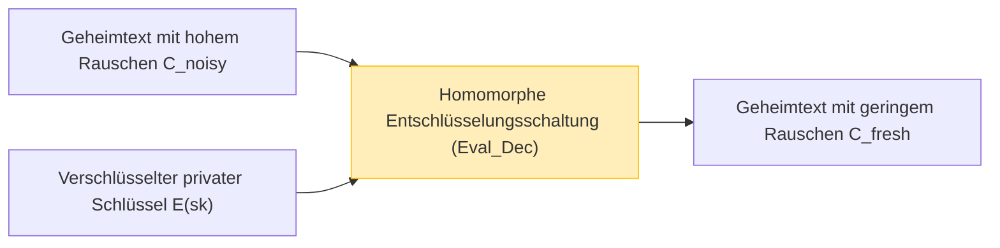

Während Cloud-Computing und KI-Technologien als Grundlage unserer Gesellschaft fest etabliert sind, ist der Kompromiss zwischen "Datenschutz" und "Datennutzung" zu einer der wichtigsten Herausforderungen geworden. Es gibt eine wachsende Nachfrage danach, dass KI hochsensible Daten wie medizinische Daten, Finanzinformationen und persönliche biometrische Daten in der Cloud analysiert. Dennoch zögern viele Unternehmen aus Sicherheitsbedenken, Daten nach außen zu senden.

Herkömmliche Verschlüsselungstechnologien (wie AES und RSA) eignen sich hervorragend zum Schutz von gespeicherten Daten (Data at Rest) oder Daten, die über ein Netzwerk übertragen werden (Data in Transit). **Wenn der Server jedoch Verarbeitungen (Berechnungen) wie Suchen oder maschinelles Lernen an den Daten durchführt (Data in Use), müssen die Daten zuerst entschlüsselt und wieder in Klartext umgewandelt werden.** Wenn der Server in diesem Moment der Entschlüsselung gehackt wird oder ein böswilliger interner Administrator die Daten einsieht, führt dies direkt zu einem Informationsleck.

Die **vollständig homomorphe Verschlüsselung (Fully Homomorphic Encryption: FHE)** ist eine Traumtechnologie, die diese fundamentale Schwäche der "Entschlüsselung während der Verarbeitung" überwindet. Mit FHE ist es möglich, Berechnungen an Daten durchzuführen, während sie verschlüsselt bleiben, ohne sie jemals zu entschlüsseln, und nur das verschlüsselte Ergebnis an den Client zurückzusenden.

In diesem Artikel werden wir FHE, den Schlüssel zur Sicherheit der nächsten Generation, detailliert untersuchen – von seinen Konzepten und seiner Geschichte über den bahnbrechenden Durchbruch von Craig Gentry, die mathematischen Grundlagen (wie Ring-LWE), die größte Herausforderung des "Rauschens" und deren Lösung (Bootstrapping) bis hin zu den neuesten Implementierungsbibliotheken.

---

## 1. Was ist homomorphe Verschlüsselung? Grundkonzepte

"Homomorph" ist ein Begriff aus der Algebra, der sich auf die Eigenschaft bezieht, dass zwischen Mengen mit einer bestimmten Struktur Abbildungen vorgenommen werden können, während die Struktur der Operationen erhalten bleibt. In der Kryptographie bedeutet die "homomorphe" Eigenschaft, dass **Operationen im Klartextraum den Operationen im Geheimtextraum entsprechen**.

Ausgedrückt in einer einfachen Formel: Sei $E(\cdot)$ die Verschlüsselungsfunktion und $D(\cdot)$ die Entschlüsselungsfunktion für die Klartexte $m_1$ und $m_2$. Wenn wir die Operation auf dem Klartext (wie Addition oder Multiplikation) als $\circ$ und die Operation auf dem Geheimtext als $\diamond$ bezeichnen, gilt die folgende Beziehung:

$$ D(E(m_1) \diamond E(m_2)) = m_1 \circ m_2 $$

Das bedeutet, wenn wir das Ergebnis einer Operation $\diamond$ auf die Geheimtexte $E(m_1)$ und $E(m_2)$ entschlüsseln, stimmt es mit dem Ergebnis der Operation $\circ$ auf die ursprünglichen Klartexte überein.

### Datenfluss im Cloud Computing

Die Architektur der Cloud-Verarbeitung mit FHE unterscheidet sich völlig von herkömmlichen Methoden. Das folgende Diagramm zeigt den Ablauf einer sicheren Datenverarbeitung unter Verwendung von FHE.

```mermaid
graph TD
    A["Client (hält privaten Schlüssel)"] -->|1. Klartext x verschlüsseln: E(x)| B["Cloud-Server (nur verschlüsselte Daten)"]
    B -->|2. Funktion f auf Geheimtext anwenden: E(f(x))| B
    B -->|3. Berechnetes Geheimtextergebnis E(y)| A
    A -->|4. Mit privatem Schlüssel entschlüsseln: y = f(x)| A
    
    style A fill:#d4edda,stroke:#28a745
    style B fill:#f8d7da,stroke:#dc3545
```

Der Server empfängt die verschlüsselten Daten $E(x)$, aber da er den privaten Schlüssel nicht besitzt, kann er unmöglich den Inhalt der Daten kennen. Durch Ausnutzung der Eigenschaften von FHE kann er jedoch eine Funktion $f$ (zum Beispiel ein maschinelles Lern-Inferenzmodell) auf den Geheimtext anwenden und $E(f(x))$ erzeugen. Der Client empfängt dies und entschlüsselt es mit seinem eigenen privaten Schlüssel, um das gewünschte Ergebnis $y = f(x)$ zu erhalten.

---

## 2. Die Evolutionsgeschichte der homomorphen Verschlüsselung: PHE, SHE, FHE

Die homomorphe Verschlüsselung hat ihre aktuelle "vollständige" Form nicht auf einmal erreicht. Sie wird je nach Art und Anzahl der durchführbaren Operationen grob in drei Phasen eingeteilt.

### Partially Homomorphic Encryption (PHE: Partiell homomorphe Verschlüsselung)
PHE ist ein Verschlüsselungsschema, das es erlaubt, **entweder** Addition oder Multiplikation unbegrenzt durchzuführen. Tatsächlich existieren Verschlüsselungen mit dieser Eigenschaft schon seit langer Zeit.

*   **RSA-Verschlüsselung (Homomorphismus bezüglich Multiplikation)**
    Die RSA-Verschlüsselung hatte unbeabsichtigt eine multiplikative homomorphe Eigenschaft. Seien $m_1, m_2$ Klartexte und $(e, N)$ der öffentliche Schlüssel:
    $$ E(m_1) = m_1^e \pmod N $$
    $$ E(m_2) = m_2^e \pmod N $$
    Wenn wir diese multiplizieren:
    $$ E(m_1) \times E(m_2) = (m_1 \cdot m_2)^e \pmod N = E(m_1 \times m_2) $$
    Auf diese Weise entspricht die Multiplikation von Geheimtexten der Multiplikation von Klartexten.
*   **Paillier-Verschlüsselung (Homomorphismus bezüglich Addition)**
    Die 1999 erfundene Paillier-Verschlüsselung besitzt eine additive homomorphe Eigenschaft. Sie wird in der Praxis für elektronische Wahlen (Zählen von verschlüsselten Stimmen und Entschlüsseln nur des Endergebnisses) verwendet.

### Somewhat Homomorphic Encryption (SHE: Etwas homomorphe Verschlüsselung)
Dieses Schema kann **sowohl** Addition als auch Multiplikation ausführen, aber es gibt **eine Grenze für die Anzahl der Operationen (die Tiefe der Schaltung)**, die durchgeführt werden können. Aufgrund der Ansammlung von "Rauschen", das später erläutert wird, wird die Entschlüsselung nach einer bestimmten Anzahl von Multiplikationen unmöglich. Die BGN (Boneh-Goh-Nissim)-Verschlüsselung von 2005 ist ein solches Beispiel, aber sie hatte Einschränkungen bei der Durchführung komplexer praktischer Berechnungen (wie Deep Learning).

### Fully Homomorphic Encryption (FHE: Vollständig homomorphe Verschlüsselung)
Ein Verschlüsselungsschema, das sowohl Addition als auch Multiplikation **unbegrenzt oft** ausführen kann. Ähnlich der Turing-Vollständigkeit in der Informationstheorie bedeutet dies: Wenn Addition (entspricht XOR) und Multiplikation (entspricht AND) unendlich oft kombiniert werden können, kann theoretisch jede berechenbare Funktion oder jeder Algorithmus in einem verschlüsselten Zustand ausgeführt werden.

FHE wurde lange Zeit als der "Heilige Gral der Kryptographie" bezeichnet und man hielt es sogar für unmöglich, dies zu erreichen. Im Jahr 2009 schlug **Craig Gentry**, der damals Doktorand an der Stanford University war, jedoch das erste FHE-Schema vor, das ideale Gitter (Ideal Lattices) nutzte und die Welt schockierte.

---

## 3. Mathematische Grundlagen von FHE: Das LWE-Problem und Ring-LWE

Viele der heutigen Mainstream-FHE-Schemata basieren auf dem **LWE (Learning With Errors)-Problem**, einer mathematischen Herausforderung der "gitterbasierten Kryptographie" (Lattice-based Cryptography), die auch als Post-Quanten-Kryptographie (Post-Quantum Cryptography) bekannt ist.

### Intuitives Verständnis des LWE-Problems
Das Lösen von linearen Gleichungssystemen ist mit Methoden wie der Gaußschen Elimination einfach.

$$ \begin{cases} 3s_1 + 4s_2 + 2s_3 \equiv 12 \pmod{17} \\ 1s_1 + 9s_2 + 5s_3 \equiv 8 \pmod{17} \\ \vdots \end{cases} $$

Was passiert jedoch, wenn wir den Ergebnissen dieser Gleichungen einen sehr kleinen "zufälligen Fehler (Rauschen)" $e$ hinzufügen?

$$ \begin{cases} 3s_1 + 4s_2 + 2s_3 + e_1 \equiv 13 \pmod{17} \\ 1s_1 + 9s_2 + 5s_3 + e_2 \equiv 7 \pmod{17} \\ \vdots \end{cases} $$

Nur durch Hinzufügen dieses Fehlers $e$ verwandelt sich das Problem, den geheimen Variablenvektor $\vec{s}$ zu finden, in ein NP-schweres Problem, das selbst mit aktuellen Supercomputern oder Quantencomputern schwer zu knacken ist. Dies ist das LWE-Problem.

### Das Ring-LWE-Problem (RLWE)
Das Standard-LWE-Problem beinhaltet Matrixoperationen, was zu dem Problem führt, dass die Schlüsselgrößen sehr groß sind (manchmal in der Größenordnung von Gigabyte) und die Berechnungseffizienz gering ist. Um dies zu lösen, wurde das **Ring-LWE (RLWE)-Problem** eingeführt, welches Operationen über Polynomringen verwendet.

In RLWE gehören die Elemente zum Polynomring $R_q = \mathbb{Z}_q[x] / (x^N + 1)$ (wobei $N$ eine Zweierpotenz und $q$ eine Primzahl als Modul ist).
Wenn der private Schlüssel ein Polynom $s(x)$, $a(x)$ ein zufälliges Polynom und $e(x)$ ein kleines Rauschpolynom ist, ist der öffentliche Schlüssel das folgende Paar:

$$ (a(x), b(x)) \quad \text{where} \quad b(x) = -a(x) \cdot s(x) + e(x) \pmod q $$

Während der Verschlüsselung werden die Eigenschaften dieser Polynome genutzt, um den Klartext $m(x)$ zu kodieren und den Geheimtext zu erzeugen.

---

## 4. Das größte Hindernis "Rauschen" und Gentrys Bootstrapping

Das wichtigste Konzept für das Verständnis von FHE ist das **"Rauschmanagement"**.

In LWE/RLWE-basierter Kryptographie wird absichtlich ein kleines "Rauschen (Fehler)" eingeschlossen, um die Sicherheit zu gewährleisten.
Der Prozess der Entschlüsselung des Geheimtextes $c$ eines Klartextes $m$ wird grob durch die folgende Formel ausgedrückt:

$$ D(c) = (c \cdot s) \pmod q = m + \text{noise} $$

Bei der Entschlüsselung wird dieses `noise` durch Prozesse wie Rundung entfernt, um den richtigen Klartext $m$ zu erhalten. Wenn Sie jedoch homomorphe Operationen (insbesondere Multiplikation) zwischen Geheimtexten durchführen, wird dieses Rauschen dramatisch verstärkt.

*   **Homomorphe Addition**: Rauschen nimmt additiv zu ($e_1 + e_2$). Dies ist eine relativ langsame Zunahme.
*   **Mathematischer Ausdruck der homomorphen Eigenschaft für homomorphe Addition**:
    $$ E(m_1) \oplus E(m_2) = E(m_1 + m_2) $$
*   **Homomorphe Multiplikation**: Rauschen explodiert multiplikativ (weil es Ausdrücke wie $e_1 \times e_2$ enthält). Nach nur wenigen Multiplikationen überschreitet das Rauschen den Schwellenwert $q/2$, was eine korrekte Rundung unmöglich macht und die Entschlüsselung fehlschlägt.
*   **Mathematischer Ausdruck der homomorphen Eigenschaft für homomorphe Multiplikation**:
    $$ E(m_1) \otimes E(m_2) = E(m_1 \times m_2) $$

Aus diesem Grund war FHE lange Zeit nicht realisierbar und blieb auf SHE (mit einer begrenzten Anzahl von Operationen) beschränkt.

### Die Magie des Bootstrapping
Craig Gentrys genialer Beitrag war die Erfindung einer Rauschreduzierungstechnik namens **"Bootstrapping"**. Dies war ein Paradigmenwechsel in der Kryptographie.

Intuitiv ist es die Operation: "Bevor der Geheimtext mit Rauschen bedeckt und zerstört wird, 'entschlüsseln' wir ihn im verschlüsselten Zustand, bereinigen ihn und legen ihn in einen neuen Geheimtext."

1. Angenommen, wir haben einen Geheimtext $C_{noisy}$ mit hohem Rauschen.
2. Der Client übergibt im Voraus an den Server seinen privaten Schlüssel $sk$, der "mit dem öffentlichen Schlüssel verschlüsselt" ist, nämlich $E_{pk}(sk)$ (dies wird als Bootstrapping-Schlüssel bezeichnet).
3. Der Server führt homomorph eine **Entschlüsselungsschaltung (Decryption Circuit)** auf $C_{noisy}$ aus.
4. Insbesondere führt er eine "Entschlüsselung innerhalb des verschlüsselten Raums" durch, indem er $E_{pk}(sk)$ auf $E_{pk}(C_{noisy})$ anwendet.
5. Da diese Entschlüsselungsschaltung selbst eine homomorphe Operation ist, erzeugt sie neues Rauschen, aber das Rauschen des ausgegebenen neuen Geheimtextes $C_{fresh}$ wird auf ein bestimmtes "festes Niveau" zurückgesetzt.



Durch die regelmäßige Ausführung dieses Bootstrappings während der Berechnung ist es theoretisch möglich, eine Schaltung unendlicher Tiefe zu berechnen (Erreichen von FHE). Die frühe Methode von Gentry hatte jedoch einen so hohen Rechenaufwand, dass ein einziger Bootstrapping-Prozess zig Minuten bis Stunden in Anspruch nahm.

---

## 5. FHE-Generationen und die Evolution der wichtigsten Schemata

Um FHE in die Praxis umzusetzen, haben Kryptographen auf der ganzen Welt darum gewetteifert, die Algorithmen zu verbessern. Gegenwärtig wird FHE hauptsächlich in vier Generationen/Familien eingeteilt.

### Zweite Generation: Exakte Berechnung von Ganzzahlen (BGV, BFV)
Die **BGV (Brakerski-Gentry-Vaikuntanathan)** und **BFV (Brakerski/Fan-Vercauteren)** Schemata tauchten in den Jahren 2011-2012 auf. Diese basieren auf RLWE und eignen sich gut für modulare Arithmetik (exakte Berechnungen) mit ganzen Zahlen.
Sie unterstützen Batching-Technologien wie SIMD (Single Instruction, Multiple Data), die es ermöglichen, Tausende von Datensteckplätzen in einen einzigen riesigen Polynom-Geheimtext zu packen und sie alle auf einmal parallel zu berechnen.

### Dritte Generation: Beschleunigung des Bootstrapping (GSW, FHEW, TFHE)
Das **GSW (Gentry-Sahai-Waters)** Schema von 2013 vereinfachte die Struktur von FHE. Dies wurde weiterentwickelt zu einem der heutigen Mainstream-Schemata, **TFHE (Fast Fully Homomorphic Encryption over the Torus)**.
Das Besondere an TFHE ist, dass sein Bootstrapping extrem schnell (im Millisekundenbereich) ist. Es ist stark bei Operationen auf Gatterebene (Logikschaltungen wie AND, XOR) und hat eine relativ kleine Geheimtextgröße, wodurch es sich zur schnellen Auswertung beliebiger Logikschaltungen eignet.

### Vierte Generation: Spezialisierung auf Näherungsberechnungen und maschinelles Lernen (CKKS)
Das 2017 von Cheon et al. vorgeschlagene **CKKS (Cheon-Kim-Kim-Song)** Schema ist die definitive Technologie für den Schutz der Privatsphäre in der heutigen KI und beim maschinellen Lernen.
Während sich bisherige FHE auf "exakte Ganzzahlberechnungen" konzentrierten, unterstützt CKKS **"Näherungsberechnungen von Fließkommazahlen"** im verschlüsselten Zustand. Es zeigt eine überwältigende Leistung bei Berechnungen mit reellen Zahlen, bei denen kleine Fehler toleriert werden, wie z.B. das Training und die Inferenz von neuronalen Netzen.

Die folgende Tabelle fasst zusammen, wie Sie ein Schema basierend auf Ihrem Zweck auswählen.

| Schema-Name | Bevorzugter Datentyp | Empfohlene Anwendungsfälle | Merkmale |
| :--- | :--- | :--- | :--- |
| **BFV / BGV** | Ganzzahlen (Integer) | Genaue statistische Berechnungen, Aggregation von Finanzdaten, DB-Suche | Hoher Durchsatz durch SIMD-Batching |
| **CKKS** | Reelle Zahlen (Real/Complex) | Maschinelles Lernen (DNN, logistische Regression), Signalverarbeitung | Beschleunigung durch Näherungsberechnungen, Reskalierung |
| **TFHE** | Boolesche Werte (Boolean) | Beliebige Logikschaltungen, String-Suche, Auswertung nichtlinearer Funktionen | Ultraschnelles Bootstrapping (Millisekundenbereich) |

---

## 6. Praxis: FHE-Bibliotheken und konzeptioneller Code

Heutzutage gibt es viele Open-Source-Bibliotheken, mit denen man FHE nutzen kann, ohne fundierte Kenntnisse der Kryptographie zu besitzen.

*   **Microsoft SEAL (Simple Encrypted Arithmetic Library)**: Eine C++-Bibliothek, die BFV, BGV und CKKS unterstützt. Einer der Industriestandards. Die Python-Anbindung **TenSEAL** ist bei KI-Ingenieuren sehr beliebt.
*   **Zama (Concrete)**: Ein Framework basierend auf TFHE. Es kann in Rust/Python geschrieben werden und bietet die Funktion (Concrete ML), bestehende PyTorch-Modelle zu kompilieren und auf FHE auszuführen.
*   **OpenFHE**: Der Nachfolger von PALISADE, eine umfassende C++-Bibliothek, die alle gängigen Schemata unterstützt.

### Beispiel für FHE-Programmierung in Python (TenSEAL)

Hier ist ein konzeptionelles Python-Codebeispiel unter Verwendung des CKKS-Schemas, das Vektoren aus reellen Zahlen addiert und multipliziert, während sie verschlüsselt bleiben.

```python
import tenseal as ts

# 1. Kontext-Setup (inklusive Schlüsselerzeugung)
# Verwendung des CKKS-Schemas, Polynomgrad auf 8192 gesetzt
context = ts.context(
    ts.SCHEME_TYPE.CKKS,
    poly_modulus_degree=8192,
    coeff_mod_bit_sizes=[60, 40, 40, 60]
)
context.generate_galois_keys()
context.global_scale = 2**40 # Skalierungsfaktor für reelle Zahlen

# 2. Client-Seite: Daten verschlüsseln
vector1 = [1.5, 2.5, 3.5]
vector2 = [2.0, 3.0, 4.0]

# Klartext-Vektoren in Geheimtexte umwandeln (wird normalerweise auf der Client-Seite ausgeführt)
enc_v1 = ts.ckks_vector(context, vector1)
enc_v2 = ts.ckks_vector(context, vector2)

# 3. Server-Seite: Operationen in verschlüsseltem Zustand (Schutz von Data in Use)
# Der Server kennt den Klartext nicht, kann aber Addition und Multiplikation ausführen
enc_add = enc_v1 + enc_v2
enc_mul = enc_v1 * enc_v2

# 4. Client-Seite: Ergebnisse entschlüsseln
# Nur der Client mit dem privaten Schlüssel kann das Ergebnis sehen
res_add = enc_add.decrypt()
res_mul = enc_mul.decrypt()

print(f"Entschlüsseltes Additionsergebnis: {res_add}")
# Beispielausgabe: [3.5000001, 5.5000001, 7.5000002] (enthält aufgrund der Näherungsberechnung einen winzigen Fehler)

print(f"Entschlüsseltes Multiplikationsergebnis: {res_mul}")
# Beispielausgabe: [3.0000002, 7.5000005, 14.0000003]
```

Wie aus dem obigen Code ersichtlich ist, können Sie Berechnungen zwischen Geheimtexten intuitiv schreiben, indem Sie Standard-Python-Operatoren wie in `enc_v1 + enc_v2` überladen. Auf der Serverseite werden Vektoroperationen abgeschlossen, ohne den Inhalt der Vektoren zu kennen.

---

## 7. Herausforderungen von FHE: Leistung und Hardware-Beschleunigung

Während FHE theoretisch perfekte Sicherheit bietet, ist die größte Herausforderung bei seiner praktischen Anwendung der **"Leistungs-Overhead"**.

1.  **Rechenaufwand**: Im Vergleich zu Berechnungen mit Klartexten sind Berechnungen mit Geheimtexten auf CPUs Tausende bis Zehntausende Male langsamer. Polynommultiplikation und Bootstrapping erfordern massive Mengen an FFT- (Fast Fourier Transform) oder NTT- (Number Theoretic Transform) Berechnungen.
2.  **Datenexpansion (Ciphertext Expansion)**: Ein paar Byte Klartext können im verschlüsselten Zustand zu mehreren Megabyte werden. Dies übt großen Druck auf die Speicherbandbreite und die Netzwerkbandbreite aus.

### Ansätze für Hardware-Lösungen
Um diesen Overhead zu überwinden, treibt man weltweit die Entwicklung von FHE-spezifischen Hardware-Beschleunigern (ASIC, FPGA, GPU-Unterstützung) voran.

*   **GPU-Beschleunigung**: Die Bemühungen schreiten voran, um NTT-Berechnungen und Bootstrapping mit leistungsstarken GPUs wie denen von NVIDIA zu parallelisieren, was eine zigfache Beschleunigung gegenüber Softwareimplementierungen meldet (z. B. 100x.ai, Zamas TFHE-rs CUDA-Backend).
*   **DARPA DPRIVE-Projekt**: Die US-amerikanische Defense Advanced Research Projects Agency (DARPA) fördert "DPRIVE (Data Protection in Virtual Environments)", ein Projekt zur Entwicklung dedizierter Hardware, um die Berechnungsgeschwindigkeit von FHE auf ein Niveau anzuheben, das dem der Klartextverarbeitung entspricht (innerhalb des 10-fachen Overheads). Unternehmen wie Intel, Microsoft und Intellectual Ventures sind daran beteiligt.
*   **Aufkommen der FPU (FHE Processing Unit)**: Start-ups wie Cornami und Optalysys haben mit der Entwicklung von FHE-spezifischen Chips begonnen, die optisches Computing oder spezielle Siliziumarchitekturen nutzen.

In naher Zukunft wird es möglicherweise eine Zeit geben, in der "FPUs" standardmäßig in Servern und Cloud-Infrastrukturen installiert sind, ähnlich wie NPUs (Neural Processing Units) in der KI.

---

## 8. Erwartete Anwendungsfälle

Da FHE mittlerweile praktische Geschwindigkeiten erreicht, werden bahnbrechende Innovationen in den folgenden Bereichen erwartet.

1.  **Schutz der Privatsphäre in der medizinischen und genomischen Analyse**:
    Indem die von mehreren Krankenhäusern gehaltenen Patientenakten und DNA-Daten mit FHE verschlüsselt und von der Cloud-KI trainiert werden, können hochpräzise Krebsdiagnosemodelle und die Entwicklung neuer Medikamente durchgeführt werden, ohne gegen Datenschutzgesetze (wie HIPAA oder DSGVO) zu verstoßen.
2.  **Betrugserkennung und Anti-Geldwäsche (AML) für Finanzinstitute**:
    Konkurrierende Banken können gegenseitig ihre Daten in verschlüsselter Form abgleichen, um riesige illegale Überweisungsnetzwerke zu erkennen (Cross-Bank-Analyse), ohne Kundenkontoinformationen oder Transaktionshistorien preiszugeben.
3.  **Sichere KI-Inferenz-API (MaaS: Model as a Service)**:
    Benutzer verschlüsseln ihre eigene Stimme, Gesichtsbilder oder Prompts und senden sie an einen KI-Dienst (z.B. ein LLM wie ChatGPT). Der KI-Anbieter generiert Antworten, ohne die Eingabe des Benutzers jemals zu kennen, und gibt sie als Geheimtext zurück. Dies beseitigt vollständig die Sorge, dass "die KI persönliche Informationen lernt oder einsehen kann".

---

## 9. Fazit: Die Zukunft der Kryptographie geht hin zu "unsichtbaren Berechnungen"

Genauso wie die Erfindung der Public-Key-Kryptographie (RSA) in den 1970er Jahren die sichere Kommunikation (wie HTTPS) über das Internet ermöglichte, ist die Erfindung von FHE durch Craig Gentry einer der wichtigsten Meilensteine in der Geschichte der Kryptographie.

Heute verlässt die vollständig homomorphe Verschlüsselung (FHE) die Forschungslabors und tritt in ein Stadium ein, in dem Microsoft, IBM, Intel, Google und viele Start-ups um die Kommerzialisierung wetteifern. Herausforderungen hinsichtlich der Rechenkosten und der Datengröße bestehen weiterhin, aber durch die Verfeinerung von Algorithmen und die Entwicklung von Hardware-Beschleunigern wird die Leistung in einem Tempo verbessert, das das Mooresche Gesetz übertrifft.

In wenigen Jahren wird es nichts Besonderes mehr sein, "zu rechnen, während die Daten verschlüsselt bleiben", sondern es wird eine Standard-Best-Practice für den Datenschutz bei Cloud-Diensten werden. FHE ist der Schlüssel zur Sicherheit der nächsten Generation und realisiert die **ultimative Balance zwischen Datenschutz und Datennutzung** in unserer datengesteuerten Gesellschaft.

