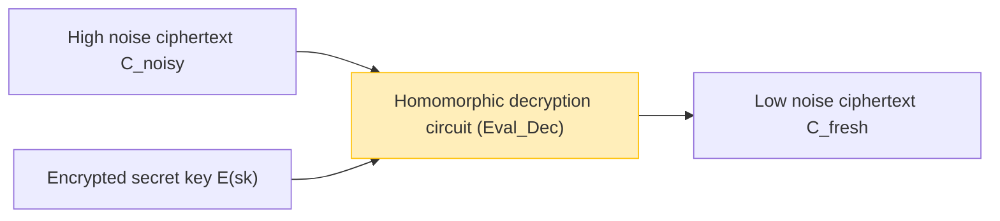

As cloud computing and AI technologies become established as societal infrastructure, the tradeoff between "data privacy" and "data utilization" has become one of the most critical challenges. While there is a growing demand to have AI analyze highly sensitive data—such as medical records, financial information, and personal biometric data—on the cloud, many companies hesitate to send data externally due to security concerns.

Traditional encryption technologies (like AES and RSA) excel at protecting data stored in storage (Data at Rest) and data flowing over networks (Data in Transit). However, **when performing processing (computations) such as searching or machine learning on the server side (Data in Use), the ciphertext must first be decrypted back into plaintext**. If the server is hacked at this decrypted moment, or if a malicious internal administrator peeks at the data, it directly leads to information leakage.

The dream technology that overcomes this fundamental weakness of "decryption during processing" is **Fully Homomorphic Encryption (FHE)**. By using FHE, it becomes possible to perform computational processing while keeping the data encrypted, without ever decrypting it, and returning only the resulting ciphertext to the client.

In this article, we will thoroughly and deeply explain FHE, the keystone of next-generation security, covering everything from its concept and history, the groundbreaking breakthrough by Craig Gentry, mathematical foundations (such as Ring-LWE), its biggest challenge "noise" and its solution (bootstrapping), up to the latest implementation libraries.

---

## 1. What is Homomorphic Encryption? Basic Concepts

"Homomorphic" is an algebraic term referring to the property where mappings can be made between sets with a certain structure while preserving the structure of the operations. "Homomorphism" in cryptography is the property where **operations in the plaintext space correspond to operations in the ciphertext space**.

Expressed in simple formulas, let $m_1$ and $m_2$ be plaintexts, $E(\cdot)$ be the encryption function, and $D(\cdot)$ be the decryption function. If we let $\circ$ be an operation on the plaintext (such as addition or multiplication) and $\diamond$ be an operation on the ciphertext, the following relationship holds:

$$ D(E(m_1) \diamond E(m_2)) = m_1 \circ m_2 $$

In other words, if you decrypt the result of applying some operation $\diamond$ to the ciphertexts $E(m_1)$ and $E(m_2)$, it matches the result of operating $\circ$ on the original plaintexts.

### Data Flow in Cloud Computing

The architecture of cloud processing using FHE is completely different from traditional ones. The following diagram shows the flow of secure data processing utilizing FHE.

```mermaid
graph TD
    A["Client (Holds secret key)"] -->|1. Encrypt plaintext x: E(x)| B["Cloud Server (Encrypted data only)"]
    B -->|2. Apply function f to ciphertext: E(f(x))| B
    B -->|3. Ciphertext of calculation result E(y)| A
    A -->|4. Decrypt with secret key: y = f(x)| A
    
    style A fill:#d4edda,stroke:#28a745
    style B fill:#f8d7da,stroke:#dc3545
```

The server receives the encrypted data $E(x)$, but since it does not have the secret key, it can never know the contents of the data. However, by utilizing the properties of FHE, it can apply a function $f$ (for example, an inference model for machine learning) to the ciphertext and generate $E(f(x))$. The client receives this and decrypts it with their own secret key to obtain the desired result $y = f(x)$.

---

## 2. History of Homomorphic Encryption Evolution: PHE, SHE, FHE

Homomorphic encryption did not reach its current "fully" form all at once. It is broadly classified into three stages depending on the types and number of operations it can achieve.

### Partially Homomorphic Encryption (PHE)
PHE is an encryption scheme that can perform **only one of either** addition or multiplication indefinitely. In fact, ciphers with this property have existed for a long time.

*   **RSA Encryption (Homomorphism for multiplication)**
    RSA encryption unintentionally possessed a multiplicative homomorphic property. Given plaintexts $m_1, m_2$ and a public key $(e, N)$:
    $$ E(m_1) = m_1^e \pmod N $$
    $$ E(m_2) = m_2^e \pmod N $$
    Multiplying these gives:
    $$ E(m_1) \times E(m_2) = (m_1 \cdot m_2)^e \pmod N = E(m_1 \times m_2) $$
    Thus, the multiplication of ciphertexts corresponds to the multiplication of plaintexts.
*   **Paillier Encryption (Homomorphism for addition)**
    The Paillier cryptosystem, invented in 1999, has an additive homomorphic property. It has been put to practical use in applications like electronic voting (aggregating encrypted votes and decrypting only the final result).

### Somewhat Homomorphic Encryption (SHE)
This scheme can execute **both** addition and multiplication, but there is a **limit to the number of operations (circuit depth)** that can be performed. Due to the accumulation of "noise," which will be discussed later, decryption becomes impossible after a certain number of multiplications. The BGN (Boneh-Goh-Nissim) cryptosystem of 2005 falls under this category, but it had limitations in performing practical, complex computations (like deep learning).

### Fully Homomorphic Encryption (FHE)
This is an encryption scheme that can execute both addition and multiplication an **unlimited number of times**. Similar to Turing completeness in information theory, if addition (equivalent to XOR) and multiplication (equivalent to AND) can be combined infinitely, it means that in principle, any computable function or algorithm can be executed while remaining encrypted.

FHE was long called the "holy grail of cryptography" and was even said to be impossible to realize. However, in 2009, **Craig Gentry**, who was a doctoral student at Stanford University at the time, proposed the first FHE scheme using Ideal Lattices, sending shockwaves through the world.

---

## 3. Mathematical Foundations of FHE: The LWE Problem and Ring-LWE

Many of the current mainstream FHE schemes are based on the **LWE (Learning With Errors) problem**, a mathematical hard problem in "Lattice-based Cryptography," which is also known as Post-Quantum Cryptography.

### Intuitive Understanding of the LWE Problem
Solving a system of linear equations is easy if you use methods like Gaussian elimination.

$$ \begin{cases} 3s_1 + 4s_2 + 2s_3 \equiv 12 \pmod{17} \\ 1s_1 + 9s_2 + 5s_3 \equiv 8 \pmod{17} \\ \vdots \end{cases} $$

However, what happens if we add a very small "random error (noise)" $e$ to the results of these equations?

$$ \begin{cases} 3s_1 + 4s_2 + 2s_3 + e_1 \equiv 13 \pmod{17} \\ 1s_1 + 9s_2 + 5s_3 + e_2 \equiv 7 \pmod{17} \\ \vdots \end{cases} $$

With just the addition of this error $e$, the problem of finding the secret variable vector $\vec{s}$ transforms into an NP-hard problem that is difficult to decipher even using current supercomputers or quantum computers. This is the LWE problem.

### Ring-LWE Problem (RLWE)
The standard LWE problem involves matrix operations, which means the key size is extremely large (sometimes in gigabytes) and computational efficiency is poor. To solve this, the **Ring-LWE (RLWE) problem**, which uses operations over polynomial rings, was introduced.

In RLWE, elements belong to the polynomial ring $R_q = \mathbb{Z}_q[x] / (x^N + 1)$ (where $N$ is a power of 2, and $q$ is the modulus prime).
Let the secret key be a polynomial $s(x)$, and with a random polynomial $a(x)$ and a small noise polynomial $e(x)$, the public key becomes the following pair:

$$ (a(x), b(x)) \quad \text{where} \quad b(x) = -a(x) \cdot s(x) + e(x) \pmod q $$

During encryption, the plaintext $m(x)$ is encoded using the properties of this polynomial to generate the ciphertext.

---

## 4. The Biggest Barrier "Noise" and Gentry's Bootstrapping

The most important concept in understanding FHE is **"noise management."**

In LWE/RLWE-based cryptography, small "noise (errors)" are intentionally included to ensure security.
The process of decrypting a ciphertext $c$ of a plaintext $m$ can be roughly represented by the following formula:

$$ D(c) = (c \cdot s) \pmod q = m + \text{noise} $$

During decryption, this `noise` is removed through rounding processes or similar to obtain the correct plaintext $m$. However, when homomorphic operations (especially multiplication) are performed between ciphertexts, this noise is dramatically amplified.

*   **Homomorphic Addition**: Noise increases additively ($e_1 + e_2$). This is a relatively gradual increase.
*   **Mathematical Representation of Homomorphism by Homomorphic Addition**:
    $$ E(m_1) \oplus E(m_2) = E(m_1 + m_2) $$
*   **Homomorphic Multiplication**: Noise explodes multiplicatively (because it includes terms like $e_1 \times e_2$). After just a few multiplications, the noise exceeds the threshold $q/2$, preventing correct rounding and causing decryption to fail.
*   **Mathematical Representation of Homomorphism by Homomorphic Multiplication**:
    $$ E(m_1) \otimes E(m_2) = E(m_1 \times m_2) $$

This is the reason why FHE could not be realized for a long time and remained at the level of SHE (with a limited number of operations).

### The Magic of Bootstrapping
Craig Gentry's genius contribution was inventing a noise reduction technique called **"bootstrapping."** This was a paradigm shift in cryptography.

Intuitively, it is the operation of "'decrypting' the ciphertext to clean it while it remains encrypted, and putting it into a new ciphertext before it becomes too noisy and breaks."

1. Suppose we have a highly noisy ciphertext $C_{noisy}$.
2. The client provides the server in advance with the secret key $sk$ "encrypted with the public key," $E_{pk}(sk)$ (this is called the bootstrapping key).
3. The server runs a **Decryption Circuit** homomorphically on $C_{noisy}$.
4. Specifically, it performs a "decryption within the encrypted space" on $E_{pk}(C_{noisy})$ using $E_{pk}(sk)$.
5. Since this decryption circuit itself is a homomorphic operation, it generates new noise, but the noise of the newly output ciphertext $C_{fresh}$ is reset to a fixed "constant level."



By executing this bootstrapping periodically during computation, it theoretically became possible to compute circuits of infinite depth (achieving FHE). However, Gentry's early scheme was desperately expensive computationally, with a single bootstrapping operation taking anywhere from tens of minutes to hours.

---

## 5. Generations of FHE and the Evolution of Major Schemes

In the race toward practical FHE, cryptographers around the world have competed to improve the algorithms. Currently, FHE is mainly classified into four generations or families.

### 2nd Generation: Exact Integer Arithmetic (BGV, BFV)
The **BGV (Brakerski-Gentry-Vaikuntanathan)** and **BFV (Brakerski/Fan-Vercauteren)** schemes appeared between 2011 and 2012. These are based on RLWE and are suitable for integer modular arithmetic (exact calculations).
They support batching techniques like SIMD (Single Instruction, Multiple Data), characterized by the ability to pack thousands of data slots into a single large polynomial ciphertext and compute them in parallel all at once.

### 3rd Generation: Accelerated Bootstrapping (GSW, FHEW, TFHE)
The **GSW (Gentry-Sahai-Waters)** scheme of 2013 made the structure of FHE simpler. This was developed further into **TFHE (Fast Fully Homomorphic Encryption over the Torus)**, one of the mainstream schemes today.
The hallmark of TFHE is its extremely fast bootstrapping (on the order of milliseconds). It excels at gate-level operations (logic circuits like AND, XOR), and since the ciphertext size is relatively small, it is suited for fast evaluation of arbitrary logic circuits.

### 4th Generation: Specialization for Approximate Calculation and Machine Learning (CKKS)
The **CKKS (Cheon-Kim-Kim-Song)** scheme proposed by Cheon et al. in 2017 can be called the definitive technology for privacy protection in current AI and machine learning.
While previous FHEs insisted on "exact integer calculations," CKKS supports **"approximate calculations of floating-point numbers"** while remaining encrypted. It demonstrates overwhelming performance in real number calculations where small errors are tolerable, such as the training and inference of neural networks.

The table below summarizes how to choose a scheme by purpose.

| Scheme Name | Preferred Data Type | Recommended Use Cases | Features |
| :--- | :--- | :--- | :--- |
| **BFV / BGV** | Integer | Exact statistical calculations, financial data aggregation, DB queries | High throughput via SIMD batching |
| **CKKS** | Real/Complex | Machine learning (DNN, logistic regression), signal processing | Acceleration via approximate calculation, rescaling |
| **TFHE** | Boolean | Arbitrary logic circuits, string search, evaluation of non-linear functions | Ultra-fast bootstrapping (millisecond range) |

---

## 6. Practice: FHE Libraries and Conceptual Code

Today, many open-source libraries are provided that allow you to use FHE without deep cryptographic knowledge.

*   **Microsoft SEAL (Simple Encrypted Arithmetic Library)**: A C++ library supporting BFV, BGV, and CKKS. One of the industry standards. Its Python binding, **TenSEAL**, is popular among AI engineers.
*   **Zama (Concrete)**: A framework based on TFHE. You can write in Rust/Python, and it provides functionality (Concrete ML) to compile existing PyTorch models and run them on FHE.
*   **OpenFHE**: The successor to PALISADE, a comprehensive C++ library supporting all major schemes.

### Example of FHE Programming using Python (TenSEAL)

Here, we show a conceptual Python code example using the CKKS scheme to add and multiply real number vectors while they remain encrypted.

```python
import tenseal as ts

# 1. Context setup (including key generation)
# Use CKKS scheme, set polynomial degree to 8192
context = ts.context(
    ts.SCHEME_TYPE.CKKS,
    poly_modulus_degree=8192,
    coeff_mod_bit_sizes=[60, 40, 40, 60]
)
context.generate_galois_keys()
context.global_scale = 2**40 # Scaling factor for real numbers

# 2. Client side: Data encryption
vector1 = [1.5, 2.5, 3.5]
vector2 = [2.0, 3.0, 4.0]

# Convert plaintext vectors to ciphertexts (should be executed on the client side)
enc_v1 = ts.ckks_vector(context, vector1)
enc_v2 = ts.ckks_vector(context, vector2)

# 3. Server side: Computations while encrypted (Protection of Data in Use)
# The server does not know the plaintexts but can perform addition and multiplication
enc_add = enc_v1 + enc_v2
enc_mul = enc_v1 * enc_v2

# 4. Client side: Decryption of results
# Only the client with the secret key can view the results
res_add = enc_add.decrypt()
res_mul = enc_mul.decrypt()

print(f"Decrypted addition result: {res_add}")
# Example output: [3.5000001, 5.5000001, 7.5000002] (Includes minute errors due to approximate calculation)

print(f"Decrypted multiplication result: {res_mul}")
# Example output: [3.0000002, 7.5000005, 14.0000003]
```

As you can see from the code above, you can intuitively describe computations between ciphertexts by overloading normal Python operators, such as `enc_v1 + enc_v2`. On the server side, vector operations are completed without knowing the contents of the vectors.

---

## 7. FHE Challenges: Performance and Hardware Acceleration

While FHE provides theoretically perfect security, its biggest challenge for practical use is **"performance overhead."**

1.  **Computational Overhead**: Compared to computing in plaintext, computing in ciphertext is thousands to tens of thousands of times slower on a CPU. Polynomial multiplications and bootstrapping require massive amounts of FFT (Fast Fourier Transform) or NTT (Number Theoretic Transform) calculations.
2.  **Ciphertext Expansion**: A few bytes of plaintext can expand to several megabytes when encrypted. This puts severe pressure on memory bandwidth and network bandwidth.

### Approaches to Hardware Solutions
To overcome this overhead, the development of dedicated FHE hardware accelerators (ASIC, FPGA, GPU support) is progressing worldwide.

*   **GPU Acceleration**: Efforts are underway to parallelize NTT operations and bootstrapping using powerful GPUs from NVIDIA and others, with reports of speeds tens of times faster than software implementations (e.g., 100x.ai, Zama's TFHE-rs CUDA backend).
*   **DARPA DPRIVE Project**: The US Defense Advanced Research Projects Agency (DARPA) is promoting the "DPRIVE (Data Protection in Virtual Environments)" project to develop dedicated hardware to bring the computational speed of FHE to parity with plaintext processing (within a 10x overhead). Intel, Microsoft, and Intellectual Ventures are participating.
*   **Emergence of FPUs (FHE Processing Units)**: Startups like Cornami and Optalysys are embarking on the development of FHE-specific chips using optical computing and specialized silicon architectures.

In the near future, an era may come where "FPUs" become a standard feature in server and cloud infrastructure, just like NPUs (Neural Processing Units) in AI.

---

## 8. Expected Use Cases

Now that FHE is approaching practical speeds, disruptive innovations are expected in areas such as:

1.  **Privacy Protection in Medical and Genomic Analysis**:
    By having a cloud AI learn from patients' medical records and DNA data held by multiple hospitals while keeping it encrypted with FHE, highly accurate cancer diagnostic models and new drug development can be performed without violating privacy laws (like HIPAA or GDPR).
2.  **Fraud Detection and Anti-Money Laundering (AML) for Financial Institutions**:
    Competing banks can cross-analyze data in an encrypted state to detect massive illegal money transfer networks, without revealing customer account information or transaction histories to each other.
3.  **Secure AI Inference APIs (MaaS: Model as a Service)**:
    Users encrypt their voice, facial images, and prompts before sending them to AI services (like LLMs such as ChatGPT). The AI provider generates the answer without ever knowing the user's input and returns it as a ciphertext. This completely dispels the concern of "AI learning or peeking at personal information."

---

## 9. Conclusion: The Future of Cryptography is "Unseen Computation"

Just as the invention of public key cryptography (RSA) in the 1970s enabled secure communication on the Internet (such as HTTPS), Craig Gentry's invention of FHE is one of the most important milestones in the history of cryptography.

Today, Fully Homomorphic Encryption (FHE) has leapt from the theories of laboratories into the stage where Microsoft, IBM, Intel, Google, and many startups are fiercely competing toward practical application. While challenges regarding computational cost and data size still exist, thanks to the refinement of algorithms and the evolution of hardware accelerators, performance improvements continue at a pace exceeding Moore's Law.

In a few years, "computing data while keeping it encrypted" will not be something special, but will likely become the standard data protection best practice in cloud services. FHE is the keystone of next-generation security, realizing the **ultimate combination of privacy and data utilization** in a data-driven society.
