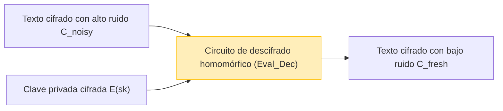

A medida que la computación en la nube y la tecnología de IA se establecen como la base de la sociedad, la compensación entre la "privacidad de los datos" y la "utilización de los datos" se ha convertido en uno de los problemas más importantes. Aunque existe una demanda creciente para que la IA en la nube analice datos altamente confidenciales como datos médicos, información financiera e información biométrica personal, muchas empresas dudan en enviar datos externamente debido a preocupaciones de seguridad.

Las tecnologías de cifrado tradicionales (como AES y RSA) son excelentes para proteger los datos almacenados en disco (Data at Rest) y los datos que fluyen por la red (Data in Transit). Sin embargo, **cuando el servidor realiza un procesamiento (cálculo) en los datos, como una búsqueda o aprendizaje automático (Data in Use), es necesario descifrar el cifrado y devolverlo a texto plano**. Si el servidor es hackeado en este momento de descifrado, o si un administrador malicioso interno husmea en los datos, esto conduce directamente a una fuga de información.

La tecnología soñada para superar esta debilidad fundamental del "descifrado durante el procesamiento" es el **Cifrado Totalmente Homomórfico (Fully Homomorphic Encryption: FHE)**. Al usar FHE, es posible realizar cálculos en datos mientras permanecen cifrados, sin descifrarlos en absoluto, y devolver solo el texto cifrado resultante al cliente.

En este artículo, explicaremos en profundidad el FHE, la clave de la seguridad de próxima generación, desde el concepto y la historia del FHE, el avance revolucionario de Craig Gentry, los fundamentos matemáticos (como Ring-LWE), el mayor desafío del "ruido" y su solución (bootstrapping), hasta las bibliotecas de implementación más recientes.

---

## 1. ¿Qué es el cifrado homomórfico? Conceptos básicos

"Homomórfico" es un término en álgebra que se refiere a la propiedad de mapear entre conjuntos con una determinada estructura preservando la estructura de las operaciones. En criptografía, la "propiedad homomórfica" es la propiedad de que **las operaciones en el espacio de texto plano corresponden a operaciones en el espacio de texto cifrado**.

Expresado en una fórmula matemática simple, sean $m_1$ y $m_2$ los textos planos, $E(\cdot)$ la función de cifrado y $D(\cdot)$ la función de descifrado. Si la operación (como suma o multiplicación) en el texto plano es $\circ$ y la operación en el texto cifrado es $\diamond$, se cumple la siguiente relación:

$$ D(E(m_1) \diamond E(m_2)) = m_1 \circ m_2 $$

En otras palabras, el resultado de aplicar alguna operación $\diamond$ a los textos cifrados $E(m_1)$ y $E(m_2)$ y luego descifrarlo coincide con el resultado de operar los textos planos originales con $\circ$.

### Flujo de datos en la computación en la nube

La arquitectura del procesamiento en la nube usando FHE es completamente diferente a la tradicional. La siguiente figura muestra el flujo de procesamiento de datos seguro utilizando FHE.

```mermaid
graph TD
    A["Cliente (Posee la clave privada)"] -->|1. Cifrar texto plano x: E(x)| B["Servidor en la nube (Solo datos cifrados)"]
    B -->|2. Aplicar función f manteniendo el cifrado: E(f(x))| B
    B -->|3. Texto cifrado del resultado E(y)| A
    A -->|4. Descifrar con clave privada: y = f(x)| A
    
    style A fill:#d4edda,stroke:#28a745
    style B fill:#f8d7da,stroke:#dc3545
```

El servidor recibe los datos cifrados $E(x)$, pero como no tiene la clave privada, le es absolutamente imposible conocer el contenido de los datos. Sin embargo, al utilizar las propiedades del FHE, es posible aplicar una función $f$ (por ejemplo, un modelo de inferencia de aprendizaje automático) al texto cifrado y generar $E(f(x))$. El cliente recibe esto y lo descifra con su propia clave privada para obtener el resultado deseado $y = f(x)$.

---

## 2. Historia de la evolución del cifrado homomórfico: PHE, SHE, FHE

El cifrado homomórfico no alcanzó su forma "completa" actual de una sola vez. Se clasifica a grandes rasgos en tres etapas dependiendo de los tipos y el número de operaciones que se pueden realizar.

### Cifrado Parcialmente Homomórfico (PHE)

El PHE es un esquema de cifrado que permite un número ilimitado de operaciones de suma **o** multiplicación, pero solo una de las dos. De hecho, los cifrados con esta propiedad han existido durante mucho tiempo.

*   **Cifrado RSA (Propiedad homomórfica para la multiplicación)**
    El cifrado RSA posee de forma no intencionada una propiedad homomórfica para la multiplicación. Dados los textos planos $m_1, m_2$ y la clave pública $(e, N)$:
    $$ E(m_1) = m_1^e \pmod N $$
    $$ E(m_2) = m_2^e \pmod N $$
    Al multiplicarlos juntos:
    $$ E(m_1) \times E(m_2) = (m_1 \cdot m_2)^e \pmod N = E(m_1 \times m_2) $$
    De esta manera, la multiplicación de textos cifrados corresponde a la multiplicación de textos planos.
*   **Cifrado Paillier (Propiedad homomórfica para la suma)**
    El cifrado Paillier, inventado en 1999, posee una propiedad homomórfica para la suma. Se ha puesto en práctica en sistemas como la votación electrónica (donde los votos cifrados se suman y solo se descifra el resultado final).

### Cifrado Algo Homomórfico (SHE)

Es un esquema que puede ejecutar **tanto** sumas como multiplicaciones, pero tiene un **límite en el número de operaciones (profundidad del circuito)**. Debido a la acumulación de "ruido", que se explicará más adelante, el descifrado se vuelve imposible después de realizar un cierto número de multiplicaciones. El cifrado BGN (Boneh-Goh-Nissim) de 2005 es un ejemplo de esto, pero tenía limitaciones para realizar cálculos complejos prácticos (como el aprendizaje profundo).

### Cifrado Totalmente Homomórfico (FHE)

Es un esquema de cifrado que permite ejecutar tanto sumas como multiplicaciones un **número ilimitado de veces**. De manera similar a la integridad de Turing en la teoría de la información, si la suma (equivalente a XOR) y la multiplicación (equivalente a AND) se pueden combinar infinitamente, significa que, en principio, cualquier función o algoritmo computable puede ejecutarse mientras permanece cifrado.

El FHE fue llamado durante mucho tiempo el "Santo Grial de la criptografía", e incluso se decía que podría ser imposible de lograr. Sin embargo, en 2009, **Craig Gentry**, que entonces era estudiante de doctorado en la Universidad de Stanford, propuso el primer esquema FHE basado en redes ideales (Ideal Lattices), sorprendiendo al mundo.

---

## 3. Fundamentos matemáticos del FHE: El problema LWE y Ring-LWE

Muchos de los esquemas FHE principales actuales se basan en el **problema LWE (Learning With Errors)**, que es un problema matemático complejo en la "Criptografía basada en retículos (Lattice-based Cryptography)", también conocida como Criptografía Post-Cuántica (Post-Quantum Cryptography).

### Comprensión intuitiva del problema LWE

Resolver un sistema de ecuaciones lineales es fácil si se utiliza, por ejemplo, la eliminación de Gauss.

$$ \begin{cases} 3s_1 + 4s_2 + 2s_3 \equiv 12 \pmod{17} \\ 1s_1 + 9s_2 + 5s_3 \equiv 8 \pmod{17} \\ \vdots \end{cases} $$

Pero, ¿qué pasaría si agregamos un pequeñísimo "error aleatorio (ruido)" $e$ a los resultados de estas ecuaciones?

$$ \begin{cases} 3s_1 + 4s_2 + 2s_3 + e_1 \equiv 13 \pmod{17} \\ 1s_1 + 9s_2 + 5s_3 + e_2 \equiv 7 \pmod{17} \\ \vdots \end{cases} $$

El solo hecho de agregar este error $e$ transforma el problema de encontrar el vector de variables secretas $\vec{s}$ en un problema NP-difícil que es extremadamente complicado de resolver, incluso utilizando supercomputadoras actuales o computadoras cuánticas. Este es el problema LWE.

### El problema Ring-LWE (RLWE)

El problema LWE estándar involucra operaciones con matrices, lo que tenía el problema de que el tamaño de la clave era muy grande (a veces en gigabytes) y la eficiencia computacional era pobre. Para solucionar esto, se introdujo el **problema Ring-LWE (RLWE)**, que utiliza operaciones sobre anillos de polinomios.

En RLWE, los elementos pertenecen a un anillo de polinomios $R_q = \mathbb{Z}_q[x] / (x^N + 1)$ (donde $N$ es una potencia de 2 y $q$ es el módulo primo).
Si tomamos como clave privada un polinomio $s(x)$, y generamos un polinomio aleatorio $a(x)$ y un pequeño polinomio de ruido $e(x)$, la clave pública será el siguiente par:

$$ (a(x), b(x)) \quad \text{where} \quad b(x) = -a(x) \cdot s(x) + e(x) \pmod q $$

Durante el cifrado, las propiedades de estos polinomios se utilizan para codificar el texto plano $m(x)$ y generar el texto cifrado.

---

## 4. El mayor obstáculo: El "ruido" y el bootstrapping de Gentry

El concepto más importante para comprender el FHE es la **"gestión del ruido"**.

En los cifrados basados en LWE/RLWE, se incluye intencionalmente un pequeño "ruido (error)" para garantizar la seguridad.
El proceso de descifrado del texto cifrado $c$ para obtener el texto plano $m$ puede representarse a grandes rasgos mediante la siguiente fórmula:

$$ D(c) = (c \cdot s) \pmod q = m + \text{noise} $$

Durante el descifrado, este `noise` (ruido) se elimina mediante procesos como el redondeo para obtener el texto plano correcto $m$. Sin embargo, cuando se realizan operaciones homomórficas (especialmente multiplicaciones) entre textos cifrados, este ruido se amplifica drásticamente.

*   **Suma homomórfica**: El ruido aumenta de forma aditiva ($e_1 + e_2$). Este es un aumento relativamente leve.
*   **Expresión matemática de la propiedad homomórfica para la suma**:
    $$ E(m_1) \oplus E(m_2) = E(m_1 + m_2) $$
*   **Multiplicación homomórfica**: El ruido explota de forma multiplicativa (ya que incluye términos como $e_1 \times e_2$). Después de unas pocas multiplicaciones, el ruido excede el umbral $q/2$, lo que impide un redondeo correcto y hace que el descifrado falle.
*   **Expresión matemática de la propiedad homomórfica para la multiplicación**:
    $$ E(m_1) \otimes E(m_2) = E(m_1 \times m_2) $$

Esta es la razón por la que el FHE no se pudo realizar durante mucho tiempo y se mantuvo en el nivel de SHE (limitado en operaciones).

### La magia del Bootstrapping

La contribución genial de Craig Gentry fue la invención de una técnica de reducción de ruido llamada **"bootstrapping"**. Esto fue un cambio de paradigma en la criptografía.

Intuitivamente, es una operación de "limpiar el texto cifrado 'descifrándolo' mientras permanece en estado cifrado, antes de que se corrompa por estar lleno de ruido, y colocarlo en un nuevo texto cifrado".

1. Supongamos que hay un texto cifrado con mucho ruido $C_{noisy}$.
2. El cliente proporciona previamente al servidor su clave privada $sk$ "cifrada con su clave pública" $E_{pk}(sk)$ (a esto se le llama clave de bootstrapping).
3. El servidor ejecuta un **circuito de descifrado (Decryption Circuit)** de forma homomórfica sobre $C_{noisy}$.
4. Específicamente, realiza un "descifrado en el espacio cifrado" sobre $E_{pk}(C_{noisy})$ utilizando $E_{pk}(sk)$.
5. Dado que este circuito de descifrado es en sí mismo una operación homomórfica, genera nuevo ruido, pero el ruido del nuevo texto cifrado resultante $C_{fresh}$ se restablece a un "nivel fijo" constante.



Al ejecutar regularmente este bootstrapping durante el cálculo, en teoría se hizo posible calcular circuitos de profundidad infinita (logrando el FHE). Sin embargo, en el esquema original de Gentry, este proceso de bootstrapping tenía un costo computacional desesperadamente alto, tardando de decenas de minutos a horas por cada ejecución.

---

## 5. Generaciones de FHE y evolución de los esquemas principales

En busca de la aplicación práctica del FHE, criptógrafos de todo el mundo han estado compitiendo para mejorar los algoritmos. Actualmente, el FHE se clasifica principalmente en cuatro generaciones o familias.

### 2ª Generación: Operaciones exactas con enteros (BGV, BFV)

Estos son los esquemas **BGV (Brakerski-Gentry-Vaikuntanathan)** y **BFV (Brakerski/Fan-Vercauteren)** que aparecieron entre 2011 y 2012. Se basan en RLWE y son adecuados para la aritmética modular de enteros (cálculos exactos).
Soportan técnicas de procesamiento por lotes (Batching) similares a SIMD (Single Instruction, Multiple Data), lo que permite empaquetar miles de ranuras de datos dentro de un solo texto cifrado polinomial gigante y realizar cálculos en paralelo a la vez.

### 3ª Generación: Aceleración del bootstrapping (GSW, FHEW, TFHE)

El esquema **GSW (Gentry-Sahai-Waters)** de 2013 simplificó aún más la estructura del FHE. Un desarrollo basado en esto es el **TFHE (Fast Fully Homomorphic Encryption over the Torus)**, que es una de las opciones principales en la actualidad.
La característica del TFHE es que su bootstrapping es extremadamente rápido (en el orden de milisegundos). Es fuerte en operaciones a nivel de puertas (circuitos lógicos como AND, XOR) y tiene un tamaño de texto cifrado relativamente pequeño, por lo que es adecuado para evaluar rápidamente circuitos lógicos arbitrarios.

### 4ª Generación: Especialización en cálculos aproximados y aprendizaje automático (CKKS)

El esquema **CKKS (Cheon-Kim-Kim-Song)**, propuesto por Cheon et al. en 2017, es la tecnología definitiva para la protección de la privacidad en la IA y el aprendizaje automático actuales.
Mientras que las versiones anteriores de FHE se centraban en "cálculos de enteros exactos", el CKKS admite **"cálculos aproximados de números de coma flotante"** mientras los datos permanecen cifrados. Muestra un rendimiento abrumador en cálculos de números reales donde se permiten pequeños errores, como el entrenamiento y la inferencia de redes neuronales.

La siguiente tabla resume cómo elegir un esquema según su propósito.

| Nombre del Esquema | Tipo de datos preferido | Casos de uso recomendados | Características |
| :--- | :--- | :--- | :--- |
| **BFV / BGV** | Enteros (Integer) | Cálculos estadísticos exactos, agregación de datos financieros, búsquedas en bases de datos | Alto rendimiento a través del procesamiento por lotes SIMD |
| **CKKS** | Números reales (Real/Complex) | Aprendizaje automático (DNN, regresión logística), procesamiento de señales | Aceleración mediante cálculos aproximados, reescalado |
| **TFHE** | Valores booleanos (Boolean) | Circuitos lógicos arbitrarios, búsqueda de cadenas, evaluación de funciones no lineales | Bootstrapping ultrarrápido (en milisegundos) |

---

## 6. Práctica: Bibliotecas FHE y código conceptual

Actualmente, existen muchas bibliotecas de código abierto disponibles que permiten usar el FHE sin requerir un conocimiento profundo en criptografía.

*   **Microsoft SEAL (Simple Encrypted Arithmetic Library)**: Biblioteca en C++ que admite BFV, BGV y CKKS. Es uno de los estándares de la industria. Su enlace en Python, **TenSEAL**, es popular entre los ingenieros de IA.
*   **Zama (Concrete)**: Un framework basado en TFHE. Puede escribirse en Rust/Python y ofrece la capacidad de compilar modelos PyTorch existentes para ejecutarlos sobre FHE (Concrete ML).
*   **OpenFHE**: Sucesor de PALISADE, es una biblioteca integral en C++ que soporta todos los esquemas principales.

### Ejemplo de programación FHE usando Python (TenSEAL)

Aquí presentamos un ejemplo de código conceptual en Python usando el esquema CKKS para sumar y multiplicar vectores de números reales mientras se mantienen cifrados.

```python
import tenseal as ts

# 1. Configuración del contexto (incluye generación de claves)
# Usando el esquema CKKS, establecer el grado del polinomio en 8192
context = ts.context(
    ts.SCHEME_TYPE.CKKS,
    poly_modulus_degree=8192,
    coeff_mod_bit_sizes=[60, 40, 40, 60]
)
context.generate_galois_keys()
context.global_scale = 2**40 # Factor de escala para números reales

# 2. Lado del cliente: Cifrado de datos
vector1 = [1.5, 2.5, 3.5]
vector2 = [2.0, 3.0, 4.0]

# Convertir vectores de texto plano a texto cifrado (normalmente ejecutado en el lado del cliente)
enc_v1 = ts.ckks_vector(context, vector1)
enc_v2 = ts.ckks_vector(context, vector2)

# 3. Lado del servidor: Operaciones con datos cifrados (Protección de Data in Use)
# El servidor no conoce el texto plano, pero puede realizar sumas y multiplicaciones
enc_add = enc_v1 + enc_v2
enc_mul = enc_v1 * enc_v2

# 4. Lado del cliente: Descifrado de los resultados
# Solo el cliente que posee la clave privada puede ver los resultados
res_add = enc_add.decrypt()
res_mul = enc_mul.decrypt()

print(f"Resultado de la suma descifrado: {res_add}")
# Ejemplo de salida: [3.5000001, 5.5000001, 7.5000002] (Contiene un ligero error debido al cálculo aproximado)

print(f"Resultado de la multiplicación descifrado: {res_mul}")
# Ejemplo de salida: [3.0000002, 7.5000005, 14.0000003]
```

Como se puede ver en el código anterior, los operadores normales de Python como `enc_v1 + enc_v2` están sobrecargados, lo que permite escribir cálculos entre textos cifrados de forma muy intuitiva. En el lado del servidor, las operaciones con vectores se completan sin conocer su contenido.

---

## 7. Desafíos del FHE: Rendimiento y aceleración de hardware

Aunque el FHE proporciona una seguridad teóricamente perfecta, el mayor desafío en su implementación práctica es la **"sobrecarga de rendimiento (overhead)"**.

1.  **Sobrecarga computacional**: Comparado con los cálculos en texto plano, los cálculos en texto cifrado son de miles a decenas de miles de veces más lentos en una CPU. La multiplicación de polinomios y el bootstrapping requieren cálculos masivos de FFT (Transformada Rápida de Fourier) o NTT (Transformada Teórica de Números).
2.  **Expansión del tamaño de los datos (Ciphertext Expansion)**: Unos pocos bytes de texto plano pueden convertirse en megabytes una vez cifrados. Esto ejerce una fuerte presión sobre el ancho de banda de la memoria y la red.

### Enfoques para soluciones a través del hardware

Para superar esta sobrecarga, se están desarrollando en todo el mundo aceleradores de hardware dedicados al FHE (con soporte para ASIC, FPGA y GPU).

*   **Aceleración por GPU**: Se están realizando esfuerzos para paralelizar las operaciones NTT y el bootstrapping utilizando potentes GPUs como las de NVIDIA, habiéndose reportado velocidades decenas de veces mayores en comparación con las implementaciones por software (por ejemplo, 100x.ai, el backend CUDA de TFHE-rs de Zama).
*   **Proyecto DARPA DPRIVE**: La Agencia de Proyectos de Investigación Avanzados de Defensa de EE. UU. (DARPA) está promoviendo el proyecto de desarrollo de hardware dedicado "DPRIVE (Data Protection in Virtual Environments)" para llevar la velocidad de cálculo del FHE a un nivel equivalente al de procesamiento de texto plano (dentro de un margen de sobrecarga de 10 veces), con la participación de Intel, Microsoft, Intellectual Ventures, entre otros.
*   **La llegada de la FPU (FHE Processing Unit)**: Startups como Cornami y Optalysys se están embarcando en el desarrollo de chips dedicados al FHE utilizando computación óptica o arquitecturas de silicio especiales.

En un futuro cercano, puede que llegue una era en la que las "FPU" vengan integradas de serie en servidores e infraestructuras en la nube, al igual que ocurre con las NPU (Neural Processing Unit) en el campo de la IA.

---

## 8. Casos de uso esperados

A medida que el FHE se acerca a velocidades prácticas, se esperan innovaciones disruptivas en los siguientes campos:

1.  **Protección de la privacidad en análisis médicos y genómicos**:
    Al permitir que la IA en la nube aprenda de los historiales médicos o los datos de ADN de los pacientes en poder de múltiples hospitales mientras se mantienen cifrados con FHE, es posible desarrollar modelos de diagnóstico de cáncer de alta precisión o nuevos fármacos sin violar las leyes de privacidad (como HIPAA o GDPR).
2.  **Detección de fraudes y prevención de lavado de dinero (AML) en instituciones financieras**:
    Bancos de la competencia pueden cotejar datos entre sí de forma cifrada, sin revelar la información de las cuentas de los clientes o el historial de transacciones, lo que permite realizar análisis interbancarios para detectar enormes redes de transferencias ilícitas.
3.  **API de inferencia de IA segura (MaaS: Model as a Service)**:
    Los usuarios envían su propia voz, imágenes faciales o indicaciones (prompts) de forma cifrada a servicios de IA (como un LLM tipo ChatGPT). El proveedor de IA genera la respuesta sin conocer en absoluto los datos introducidos por el usuario y la devuelve como texto cifrado. Esto elimina por completo la preocupación de que "la IA aprenda o espíe la información personal".

---

## 9. Conclusión: El futuro de la criptografía avanza hacia el "cálculo invisible"

Al igual que la invención de la criptografía de clave pública (RSA) en la década de 1970 hizo posible la comunicación segura en Internet (como HTTPS), la invención del FHE por parte de Craig Gentry es uno de los hitos más importantes en la historia de la criptografía.

Hoy en día, el cifrado totalmente homomórfico (FHE) ha saltado de la teoría de los laboratorios y ha entrado en una fase en la que Microsoft, IBM, Intel, Google y muchas startups compiten ferozmente por su aplicación práctica. Aunque los desafíos del coste computacional y el tamaño de los datos aún persisten, el rendimiento continúa mejorando a un ritmo que supera la Ley de Moore, gracias al refinamiento de los algoritmos y la evolución de los aceleradores de hardware.

En unos pocos años, "calcular datos mientras están cifrados" ya no será algo extraordinario, sino que se convertirá en una de las mejores prácticas estándar de protección de datos en los servicios en la nube. El FHE es verdaderamente la clave de la seguridad de la próxima generación, al materializar **el equilibrio definitivo entre la privacidad y la utilización de los datos** en nuestra sociedad impulsada por los datos.

