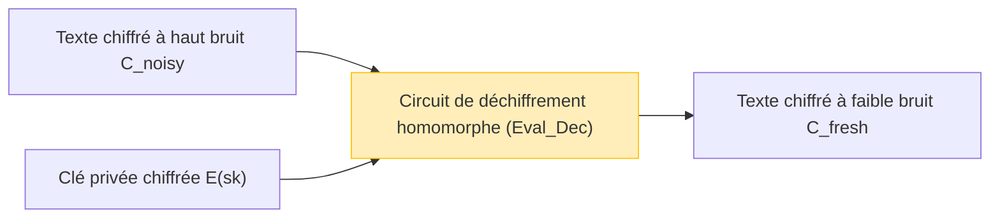

Alors que le cloud computing et les technologies d'IA s'imposent comme les fondations de notre société, le compromis entre la « confidentialité des données » et l'« utilisation des données » est devenu l'un des défis les plus importants. Bien qu'il y ait une demande croissante pour que les IA analysent des données hautement confidentielles dans le cloud, telles que des données médicales, des informations financières ou des données biométriques personnelles, de nombreuses entreprises hésitent à envoyer leurs données à l'extérieur en raison de préoccupations liées à la sécurité.

Les technologies de chiffrement traditionnelles (telles qu'AES et RSA) excellent à protéger les données stockées (Data at Rest) et les données en transit sur le réseau (Data in Transit). Cependant, **lorsque le serveur effectue des traitements (calculs)** sur les données, comme des recherches ou de l'apprentissage automatique (Data in Use), **il est nécessaire de déchiffrer au préalable les données pour les ramener en texte clair**. Si le serveur est piraté au moment du déchiffrement, ou si un administrateur interne malveillant jette un coup d'œil aux données, cela conduit directement à une fuite d'informations.

La technologie de rêve qui surmonte cette faiblesse fondamentale du « déchiffrement lors du traitement » est le **Chiffrement Homomorphe Complet (Fully Homomorphic Encryption : FHE)**. L'utilisation du FHE permet d'effectuer des calculs sur les données tout en les gardant chiffrées, sans jamais les déchiffrer, et de renvoyer uniquement le texte chiffré du résultat au client.

Dans cet article, nous expliquerons en profondeur le FHE, clé de la sécurité de nouvelle génération, de son concept à son histoire, en passant par la percée révolutionnaire de Craig Gentry, ses bases mathématiques (comme le Ring-LWE), son plus grand défi qu'est le « bruit » et sa solution (le bootstrapping), jusqu'aux dernières bibliothèques d'implémentation.

---

## 1. Qu'est-ce que le chiffrement homomorphe ? Concepts de base

« Homomorphe » est un terme d'algèbre qui désigne la propriété de pouvoir mapper des ensembles ayant une certaine structure tout en préservant la structure de leurs opérations. Dans la théorie de la cryptographie, l'« homomorphisme » est la propriété selon laquelle **les opérations dans l'espace du texte clair correspondent aux opérations dans l'espace du texte chiffré**.

Exprimé par une formule mathématique simple, soit $E(\cdot)$ la fonction de chiffrement et $D(\cdot)$ la fonction de déchiffrement pour les textes clairs $m_1$ et $m_2$. Si $\circ$ est une opération (comme l'addition ou la multiplication) sur les textes clairs, et $\diamond$ une opération sur les textes chiffrés, la relation suivante est établie :

$$ D(E(m_1) \diamond E(m_2)) = m_1 \circ m_2 $$

En d'autres termes, déchiffrer le résultat de l'application d'une certaine opération $\diamond$ sur les textes chiffrés $E(m_1)$ et $E(m_2)$ donnera exactement le même résultat que l'opération $\circ$ appliquée sur les textes clairs d'origine.

### Flux de données dans le cloud computing

L'architecture de traitement dans le cloud utilisant le FHE est complètement différente des architectures traditionnelles. Le diagramme ci-dessous illustre le flux de traitement de données sécurisé tirant parti du FHE.

```mermaid
graph TD
    A["Client (Détient la clé privée)"] -->|1. Chiffre le texte clair x : E(x)| B["Serveur Cloud (Uniquement données chiffrées)"]
    B -->|2. Applique la fonction f en gardant le chiffrement : E(f(x))| B
    B -->|3. Texte chiffré du résultat du calcul E(y)| A
    A -->|4. Déchiffre avec la clé privée : y = f(x)| A
    
    style A fill:#d4edda,stroke:#28a745
    style B fill:#f8d7da,stroke:#dc3545
```

Le serveur reçoit les données chiffrées $E(x)$, mais ne possédant pas la clé privée, il lui est absolument impossible d'en connaître le contenu. Cependant, en utilisant les propriétés du FHE, il peut appliquer une fonction $f$ (par exemple, un modèle d'inférence d'apprentissage automatique) au texte chiffré pour générer $E(f(x))$. Le client le reçoit et le déchiffre avec sa propre clé privée, obtenant ainsi le résultat souhaité $y = f(x)$.

---

## 2. L'histoire de l'évolution du chiffrement homomorphe : PHE, SHE, FHE

Le chiffrement homomorphe n'a pas atteint sa forme « complète » actuelle en une seule fois. Il est largement classé en trois étapes selon le type et le nombre d'opérations réalisables.

### Chiffrement Partiellement Homomorphe (PHE : Partially Homomorphic Encryption)

Le PHE est un schéma de chiffrement permettant d'effectuer **soit des additions, soit des multiplications**, de manière illimitée. En réalité, des chiffrements possédant cette propriété existent depuis longtemps.

*   **Chiffrement RSA (homomorphisme vis-à-vis de la multiplication)**
    Le chiffrement RSA possède involontairement un homomorphisme multiplicatif. Soit les textes clairs $m_1, m_2$ et la clé publique $(e, N)$ :
    $$ E(m_1) = m_1^e \pmod N $$
    $$ E(m_2) = m_2^e \pmod N $$
    En les multipliant :
    $$ E(m_1) \times E(m_2) = (m_1 \cdot m_2)^e \pmod N = E(m_1 \times m_2) $$
    Ainsi, la multiplication des textes chiffrés correspond à la multiplication des textes clairs.
*   **Chiffrement de Paillier (homomorphisme vis-à-vis de l'addition)**
    Inventé en 1999, le chiffrement de Paillier possède un homomorphisme pour l'addition. Il est utilisé de manière pratique dans des applications telles que le vote électronique (où les votes chiffrés sont comptés, et seul le résultat final est déchiffré).

### Chiffrement Quelque Peu Homomorphe (SHE : Somewhat Homomorphic Encryption)

C'est une méthode permettant d'exécuter **à la fois** des additions et des multiplications, mais avec **une limite sur le nombre d'opérations (la profondeur du circuit)**. En raison de l'accumulation du « bruit » (expliqué plus tard), effectuer plus d'un certain nombre de multiplications rend le déchiffrement impossible. Le chiffrement BGN (Boneh-Goh-Nissim) de 2005 en est un exemple, mais il a ses limites pour effectuer des calculs pratiques complexes (comme le deep learning).

### Chiffrement Homomorphe Complet (FHE : Fully Homomorphic Encryption)

Il s'agit d'un schéma de chiffrement permettant d'effectuer à la fois l'addition et la multiplication **un nombre illimité de fois**. Semblable à la complétude de Turing en théorie de l'information, pouvoir combiner infiniment des additions (équivalentes au XOR) et des multiplications (équivalentes au AND) signifie qu'en principe, n'importe quelle fonction ou algorithme calculable peut être exécuté tout en restant chiffré.

Le FHE a longtemps été considéré comme le « Saint Graal de la cryptographie », et certains disaient même qu'il pourrait être irréalisable. Cependant, en 2009, **Craig Gentry**, alors étudiant en doctorat à l'Université de Stanford, a proposé le premier schéma FHE utilisant les réseaux idéaux (Ideal Lattices), bouleversant ainsi le monde.

---

## 3. Les bases mathématiques du FHE : le problème LWE et Ring-LWE

La plupart des schémas FHE actuellement dominants sont basés sur le **problème LWE (Learning With Errors)**, un défi mathématique de la « cryptographie fondée sur les réseaux (Lattice-based Cryptography) », également connue sous le nom de cryptographie post-quantique.

### Compréhension intuitive du problème LWE

Résoudre un système d'équations linéaires est facile en utilisant l'élimination de Gauss ou des méthodes similaires.

$$ \begin{cases} 3s_1 + 4s_2 + 2s_3 \equiv 12 \pmod{17} \\ 1s_1 + 9s_2 + 5s_3 \equiv 8 \pmod{17} \\ \vdots \end{cases} $$

Mais que se passe-t-il si l'on ajoute une très petite « erreur (bruit) aléatoire » $e$ au résultat de ces équations ?

$$ \begin{cases} 3s_1 + 4s_2 + 2s_3 + e_1 \equiv 13 \pmod{17} \\ 1s_1 + 9s_2 + 5s_3 + e_2 \equiv 7 \pmod{17} \\ \vdots \end{cases} $$

Le simple ajout de cette erreur $e$ transforme le problème de la découverte du vecteur de variables secrètes $\vec{s}$ en un problème NP-difficile, complexe à déchiffrer même en utilisant les supercalculateurs actuels ou les ordinateurs quantiques. C'est le problème LWE.

### Le problème Ring-LWE (RLWE)

Comme le problème LWE standard implique des opérations matricielles, la taille des clés est extrêmement importante (atteignant parfois des gigaoctets) et l'efficacité des calculs est faible. Pour résoudre ce problème, le **problème Ring-LWE (RLWE)** utilisant des opérations sur des anneaux de polynômes a été introduit.

Dans le RLWE, les éléments appartiennent à l'anneau polynomial $R_q = \mathbb{Z}_q[x] / (x^N + 1)$ (où $N$ est une puissance de 2 et $q$ est un nombre premier servant de modulo).
Soit $s(x)$ le polynôme représentant la clé privée, $a(x)$ un polynôme aléatoire et $e(x)$ un petit polynôme de bruit, la clé publique sera la paire suivante :

$$ (a(x), b(x)) \quad \text{where} \quad b(x) = -a(x) \cdot s(x) + e(x) \pmod q $$

Lors du chiffrement, on utilise les propriétés de ces polynômes pour encoder le texte clair $m(x)$ et générer le texte chiffré.

---

## 4. Le plus grand obstacle : le « bruit » et le Bootstrapping de Gentry

Le concept le plus important pour comprendre le FHE est la **« gestion du bruit »**.

Dans les chiffrements basés sur LWE/RLWE, on introduit intentionnellement un petit « bruit (erreur) » pour garantir la sécurité.
En termes généraux, le processus de déchiffrement d'un texte chiffré $c$ d'un texte clair $m$ peut être exprimé par l'équation suivante :

$$ D(c) = (c \cdot s) \pmod q = m + \text{noise} $$

Lors du déchiffrement, le texte clair correct $m$ est obtenu en éliminant ce `noise` par un processus tel que l'arrondi. Cependant, effectuer des opérations homomorphes (en particulier la multiplication) entre des textes chiffrés amplifie considérablement ce bruit.

*   **Addition homomorphe** : Le bruit augmente de manière additive ($e_1 + e_2$). C'est une augmentation relativement modérée.
*   **Représentation mathématique de l'homomorphisme par addition homomorphe** :
    $$ E(m_1) \oplus E(m_2) = E(m_1 + m_2) $$
*   **Multiplication homomorphe** : Le bruit explose de manière multiplicative (car il implique des termes comme $e_1 \times e_2$). Après seulement quelques multiplications, le bruit dépasse le seuil $q/2$, ce qui rend l'arrondi correct impossible et entraîne un échec de déchiffrement.
*   **Représentation mathématique de l'homomorphisme par multiplication homomorphe** :
    $$ E(m_1) \otimes E(m_2) = E(m_1 \times m_2) $$

C'est la raison pour laquelle le FHE est resté longtemps irréalisable, se limitant au SHE (avec un nombre d'opérations restreint).

### La magie du Bootstrapping

La contribution géniale de Craig Gentry a été d'inventer une méthode de réduction de bruit appelée **« bootstrapping »**. Ce fut un changement de paradigme en cryptographie.

Intuitivement, il s'agit d'une opération où l'« on 'déchiffre' le texte chiffré tout en le gardant à l'état chiffré pour le nettoyer et le placer dans un nouveau texte chiffré avant qu'il ne soit submergé de bruit et ne se corrompe ».

1. Supposons qu'il y ait un texte chiffré avec un bruit élevé, $C_{noisy}$.
2. Le client remet au préalable au serveur sa clé privée $sk$ « chiffrée avec la clé publique » $E_{pk}(sk)$ (appelée clé de bootstrapping).
3. Le serveur exécute homomorphiquement un **circuit de déchiffrement (Decryption Circuit)** sur $C_{noisy}$.
4. Concrètement, il effectue un « déchiffrement dans l'espace chiffré » sur $E_{pk}(C_{noisy})$ en utilisant $E_{pk}(sk)$.
5. Bien que ce circuit de déchiffrement lui-même soit une opération homomorphe et génère donc un nouveau bruit, le bruit du nouveau texte chiffré produit, $C_{fresh}$, est réinitialisé à un « niveau fixe » constant.



En exécutant périodiquement ce bootstrapping au cours des calculs, il est théoriquement devenu possible de calculer des circuits d'une profondeur infinie (réalisant ainsi le FHE). Cependant, dans le schéma initial de Gentry, le coût de calcul du processus de bootstrapping était désespérément élevé, prenant de quelques dizaines de minutes à plusieurs heures pour chaque exécution.

---

## 5. Générations de FHE et évolution des principaux schémas

Afin de rendre le FHE pratique, les cryptographes du monde entier ont rivalisé pour améliorer les algorithmes. Actuellement, le FHE est principalement classé en quatre générations ou familles.

### 2ème Génération : Opérations exactes sur les entiers (BGV, BFV)

Apparus entre 2011 et 2012, il s'agit des schémas **BGV (Brakerski-Gentry-Vaikuntanathan)** et **BFV (Brakerski/Fan-Vercauteren)**. Ils sont basés sur le RLWE et sont adaptés à l'arithmétique modulaire sur les nombres entiers (calculs exacts).
Leur particularité est de supporter des techniques de traitement par lots (Batching) telles que SIMD (Single Instruction, Multiple Data), ce qui permet de regrouper des milliers d'emplacements de données dans un seul énorme texte chiffré polynomial pour effectuer des calculs parallèles en une seule fois.

### 3ème Génération : Accélération du Bootstrapping (GSW, FHEW, TFHE)

Le schéma **GSW (Gentry-Sahai-Waters)** de 2013 a simplifié la structure du FHE. Et son développement a conduit au **TFHE (Fast Fully Homomorphic Encryption over the Torus)**, qui est l'un des schémas dominants aujourd'hui.
La caractéristique du TFHE est que son bootstrapping est extrêmement rapide (de l'ordre de la milliseconde). Il excelle dans les opérations au niveau des portes (circuits logiques tels que AND, XOR), et la taille de son texte chiffré étant relativement petite, il est adapté à l'évaluation rapide de n'importe quel circuit logique.

### 4ème Génération : Spécialisation dans les calculs approchés et l'apprentissage automatique (CKKS)

Le schéma **CKKS (Cheon-Kim-Kim-Song)** proposé par Cheon et al. en 2017 est actuellement considéré comme la technologie ultime pour la protection de la vie privée dans l'IA et l'apprentissage automatique.
Contrairement aux FHE précédents qui se concentraient sur les « calculs entiers exacts », CKKS supporte les **« calculs approchés de nombres à virgule flottante »** tout en conservant le chiffrement. Il offre des performances écrasantes dans les calculs de nombres réels où de petites erreurs sont tolérées, comme la formation ou l'inférence des réseaux de neurones.

Le tableau ci-dessous résume comment choisir un schéma en fonction de l'objectif.

| Nom du Schéma | Type de Données Préféré | Cas d'Utilisation Recommandés | Caractéristiques |
| :--- | :--- | :--- | :--- |
| **BFV / BGV** | Entiers (Integer) | Calculs statistiques exacts, agrégation de données financières, recherche dans des bases de données | Haut débit grâce au traitement par lots SIMD |
| **CKKS** | Nombres réels (Real/Complex) | Apprentissage automatique (DNN, régression logistique), traitement du signal | Accélération par calculs approchés, redimensionnement |
| **TFHE** | Valeurs booléennes (Boolean) | N'importe quel circuit logique, recherche de chaînes de caractères, évaluation de fonctions non linéaires | Bootstrapping ultra-rapide (de l'ordre de la milliseconde) |

---

## 6. Pratique : Bibliothèques FHE et code conceptuel

Aujourd'hui, il existe de nombreuses bibliothèques open-source permettant d'utiliser le FHE sans nécessiter une connaissance approfondie de la cryptographie.

*   **Microsoft SEAL (Simple Encrypted Arithmetic Library)** : Une bibliothèque C++ supportant BFV, BGV et CKKS. C'est l'une des normes de l'industrie. Son binding Python, **TenSEAL**, est très populaire parmi les ingénieurs en IA.
*   **Zama (Concrete)** : Un framework basé sur TFHE. Il peut être écrit en Rust/Python et fournit la fonctionnalité de compiler des modèles PyTorch existants pour les exécuter sur le FHE (Concrete ML).
*   **OpenFHE** : Le successeur de PALISADE, c'est une bibliothèque C++ complète qui supporte tous les principaux schémas.

### Exemple de programmation FHE avec Python (TenSEAL)

Ici, nous présentons un exemple conceptuel de code Python utilisant le schéma CKKS pour additionner et multiplier des vecteurs de nombres réels tout en les gardant chiffrés.

```python
import tenseal as ts

# 1. Configuration du contexte (incluant la génération des clés)
# Utilise le schéma CKKS et définit le degré du polynôme à 8192
context = ts.context(
    ts.SCHEME_TYPE.CKKS,
    poly_modulus_degree=8192,
    coeff_mod_bit_sizes=[60, 40, 40, 60]
)
context.generate_galois_keys()
context.global_scale = 2**40 # Facteur d'échelle pour les nombres réels

# 2. Côté client : Chiffrement des données
vector1 = [1.5, 2.5, 3.5]
vector2 = [2.0, 3.0, 4.0]

# Convertit les vecteurs en texte clair en textes chiffrés (initialement exécuté côté client)
enc_v1 = ts.ckks_vector(context, vector1)
enc_v2 = ts.ckks_vector(context, vector2)

# 3. Côté serveur : Opérations tout en gardant le chiffrement (Protection des Data in Use)
# Le serveur ne connaît pas le texte clair, mais peut effectuer des additions et des multiplications
enc_add = enc_v1 + enc_v2
enc_mul = enc_v1 * enc_v2

# 4. Côté client : Déchiffrement des résultats
# Seul le client possédant la clé privée peut voir le résultat
res_add = enc_add.decrypt()
res_mul = enc_mul.decrypt()

print(f"Résultat de l'addition déchiffrée : {res_add}")
# Exemple de sortie : [3.5000001, 5.5000001, 7.5000002] (Comprend de légères erreurs dues au calcul approché)

print(f"Résultat de la multiplication déchiffrée : {res_mul}")
# Exemple de sortie : [3.0000002, 7.5000005, 14.0000003]
```

Comme on peut le voir dans le code ci-dessus, les opérateurs Python normaux comme `enc_v1 + enc_v2` peuvent être surchargés pour écrire des calculs entre des textes chiffrés de manière intuitive. Du côté du serveur, l'opération vectorielle est réalisée sans jamais connaître le contenu du vecteur.

---

## 7. Les défis du FHE : Performances et Accélération Matérielle

Le FHE offre une sécurité théoriquement parfaite, mais son plus grand défi en matière d'application pratique est la **« surcharge de performances »**.

1.  **Surcharge de calcul** : Comparés aux calculs en texte clair, les calculs sur les textes chiffrés sont des milliers à des dizaines de milliers de fois plus lents sur un CPU. La multiplication de polynômes et le bootstrapping nécessitent d'énormes calculs de FFT (Transformée de Fourier Rapide) et de NTT (Transformée Théorique des Nombres).
2.  **Expansion de la taille des données (Ciphertext Expansion)** : Quelques octets de texte clair peuvent devenir plusieurs mégaoctets une fois chiffrés. Cela exerce une forte pression sur la bande passante de la mémoire et du réseau.

### Approches de résolution basées sur le matériel

Pour surmonter cette surcharge, des accélérateurs matériels dédiés au FHE (supportant ASIC, FPGA, GPU) sont en cours de développement dans le monde entier.

*   **Accélération GPU** : Des efforts sont en cours pour paralléliser les calculs NTT et le bootstrapping à l'aide de GPU puissants de NVIDIA et d'autres, rapportant des accélérations de plusieurs dizaines de fois par rapport aux implémentations logicielles (par exemple : 100x.ai, le backend CUDA TFHE-rs de Zama).
*   **Projet DARPA DPRIVE** : La Defense Advanced Research Projects Agency (DARPA) mène un projet de développement matériel dédié appelé « DPRIVE (Data Protection in Virtual Environments) » visant à ramener la vitesse de calcul du FHE à un niveau équivalent à celui du traitement en texte clair (une surcharge inférieure à 10 fois), avec la participation d'entreprises telles qu'Intel, Microsoft et Intellectual Ventures.
*   **L'émergence du FPU (FHE Processing Unit)** : Des startups comme Cornami et Optalysys se lancent dans le développement de puces dédiées au FHE utilisant l'informatique optique ou des architectures en silicium spécialisées.

Dans un avenir proche, tout comme pour les NPU (Neural Processing Unit) en IA, nous pourrions voir une époque où les « FPU » deviendront des équipements standard dans les serveurs et les infrastructures cloud.

---

## 8. Cas d'utilisation attendus

Maintenant que le FHE atteint des vitesses pratiques, des innovations disruptives sont attendues dans les domaines suivants :

1.  **Protection de la vie privée dans le domaine médical et l'analyse génomique** :
    En utilisant le FHE pour former l'IA dans le cloud sur des dossiers médicaux et des données ADN de patients provenant de plusieurs hôpitaux tout en conservant les données chiffrées, il est possible de développer des modèles de diagnostic du cancer très précis et de nouveaux médicaments sans violer les lois sur la vie privée (comme HIPAA ou le RGPD).
2.  **Détection des fraudes et lutte contre le blanchiment d'argent (AML) dans les institutions financières** :
    Des banques concurrentes pourraient effectuer des analyses interbancaires en croisant leurs données à l'état chiffré, sans révéler les informations des comptes de leurs clients ou l'historique de leurs transactions, ce qui permettrait de détecter d'énormes réseaux de transferts frauduleux.
3.  **API d'inférence d'IA sécurisée (MaaS : Model as a Service)** :
    Les utilisateurs chiffrent leur propre voix, l'image de leur visage ou leurs requêtes avant de les envoyer à des services d'IA (tels que des LLM comme ChatGPT). Le fournisseur d'IA génère une réponse sans jamais connaître l'entrée de l'utilisateur, et la renvoie sous forme de texte chiffré. Cela dissipe complètement la crainte que « l'IA apprenne ou s'approprie des informations personnelles ».

---

## 9. Conclusion : L'avenir de la cryptographie se dirige vers le « calcul invisible »

Tout comme l'invention de la cryptographie à clé publique (RSA) dans les années 1970 a rendu possible des communications sécurisées sur Internet (comme le HTTPS), l'invention du FHE par Craig Gentry constitue l'une des étapes les plus importantes de l'histoire de la cryptographie.

Aujourd'hui, le Chiffrement Homomorphe Complet (FHE) est sorti de la théorie des laboratoires, et des entreprises telles que Microsoft, IBM, Intel, Google et de nombreuses startups se font une concurrence féroce pour le rendre pratique. Bien que des défis liés aux coûts de calcul et à la taille des données subsistent, grâce au raffinement des algorithmes et à l'évolution des accélérateurs matériels, les performances continuent de s'améliorer à un rythme dépassant la loi de Moore.

Dans quelques années, « effectuer des calculs sur des données tout en les gardant chiffrées » ne sera plus quelque chose de spécial, mais deviendra une bonne pratique standard en matière de protection des données dans les services cloud. Le FHE est la clé de la sécurité de nouvelle génération qui réalise **l'équilibre ultime entre la vie privée et l'utilisation des données** dans une société axée sur les données.

