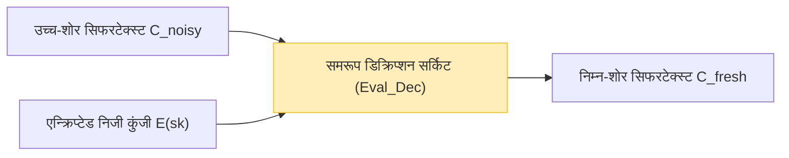

चूंकि क्लाउड कंप्यूटिंग और एआई तकनीक समाज की नींव के रूप में स्थापित हो रही है, "डेटा गोपनीयता (Data Privacy)" और "डेटा उपयोग (Data Utilization)" के बीच का ट्रेड-ऑफ सबसे महत्वपूर्ण चुनौतियों में से एक बन गया है। अत्यधिक गोपनीय डेटा, जैसे मेडिकल डेटा, वित्तीय जानकारी, और व्यक्तिगत बायोमेट्रिक जानकारी का क्लाउड पर एआई द्वारा विश्लेषण कराने की मांग बढ़ रही है, लेकिन सुरक्षा चिंताओं के कारण कई कंपनियां डेटा को बाहर भेजने में संकोच करती हैं।

पारंपरिक एन्क्रिप्शन तकनीकें (जैसे AES और RSA) स्टोरेज में सहेजे गए डेटा (Data at Rest) और नेटवर्क पर प्रवाहित होने वाले डेटा (Data in Transit) की सुरक्षा करने में उत्कृष्ट हैं। हालाँकि, जब सर्वर डेटा पर खोज या मशीन लर्निंग जैसी **प्रक्रियाएँ (गणनाएँ) करता है (Data in Use), तो एन्क्रिप्शन को डिक्रिप्ट करके उसे वापस प्लेनटेक्स्ट में बदलना आवश्यक होता है**। यदि इस डिक्रिप्शन के समय सर्वर हैक हो जाता है, या कोई दुर्भावनापूर्ण आंतरिक प्रशासक डेटा देख लेता है, तो यह सीधे सूचना रिसाव का कारण बन सकता है।

इस "प्रोसेसिंग के दौरान डिक्रिप्शन" की मूलभूत कमजोरी को दूर करने वाली सपनों की तकनीक **पूर्ण समरूप एन्क्रिप्शन (Fully Homomorphic Encryption: FHE)** है। FHE का उपयोग करके, डेटा को डिक्रिप्ट किए बिना एन्क्रिप्टेड अवस्था में ही गणना प्रक्रियाएं करना संभव है, और केवल परिणामी सिफरटेक्स्ट (ciphertext) को क्लाइंट को वापस किया जाता है।

इस लेख में, हम FHE की अवधारणा से लेकर इसके इतिहास, क्रेग जेंट्री (Craig Gentry) की ऐतिहासिक सफलता, गणितीय आधार (जैसे Ring-LWE), सबसे बड़ी चुनौती "शोर (Noise)" और इसके समाधान (बूटस्ट्रैपिंग), और नवीनतम कार्यान्वयन पुस्तकालयों (implementation libraries) तक सब कुछ कवर करेंगे, जो अगली पीढ़ी की सुरक्षा के प्रमुख तत्व FHE की गहराई से व्याख्या करता है।

---

## 1. समरूप एन्क्रिप्शन क्या है? बुनियादी अवधारणा

"समरूप (Homomorphic)" एक बीजगणितीय शब्द है, जो किसी संरचना वाले सेट के बीच एक मैपिंग को संदर्भित करता है जो ऑपरेशनों की संरचना को बरकरार रखता है। क्रिप्टोग्राफी में "समरूपता (Homomorphism)" का अर्थ यह गुण है कि **प्लेनटेक्स्ट स्पेस में ऑपरेशन्स सिफरटेक्स्ट स्पेस में ऑपरेशन्स के अनुरूप होते हैं**।

सरल गणितीय शब्दों में, मान लें कि प्लेनटेक्स्ट $m_1$ और $m_2$ के लिए एन्क्रिप्शन फ़ंक्शन $E(\cdot)$ है, और डिक्रिप्शन फ़ंक्शन $D(\cdot)$ है। प्लेनटेक्स्ट पर होने वाले ऑपरेशन (जैसे जोड़ या गुणा) को $\circ$ के रूप में, और सिफरटेक्स्ट पर होने वाले ऑपरेशन को $\diamond$ के रूप में दर्शाया गया है, तो निम्नलिखित संबंध लागू होता है:

$$ D(E(m_1) \diamond E(m_2)) = m_1 \circ m_2 $$

दूसरे शब्दों में, यदि आप सिफरटेक्स्ट $E(m_1)$ और $E(m_2)$ पर कोई ऑपरेशन $\diamond$ लागू करते हैं और परिणाम को डिक्रिप्ट करते हैं, तो यह मूल प्लेनटेक्स्ट के बीच ऑपरेशन $\circ$ लागू करने के परिणाम से मेल खाएगा।

### क्लाउड कंप्यूटिंग में डेटा प्रवाह (Data Flow in Cloud Computing)

FHE का उपयोग करने वाली क्लाउड प्रोसेसिंग का आर्किटेक्चर पारंपरिक वाले से बिल्कुल अलग है। नीचे दिया गया चित्र FHE का उपयोग करते हुए सुरक्षित डेटा प्रोसेसिंग प्रवाह को दर्शाता है।

```mermaid
graph TD
    A["क्लाइंट (निजी कुंजी रखता है)"] -->|1. प्लेनटेक्स्ट x को एन्क्रिप्ट करें: E(x)| B["क्लाउड सर्वर (केवल एन्क्रिप्टेड डेटा)"]
    B -->|2. सिफरटेक्स्ट के रूप में फ़ंक्शन f लागू करें: E(f(x))| B
    B -->|3. गणना परिणाम का सिफरटेक्स्ट E(y)| A
    A -->|4. निजी कुंजी के साथ डिक्रिप्ट करें: y = f(x)| A
    
    style A fill:#d4edda,stroke:#28a745
    style B fill:#f8d7da,stroke:#dc3545
```

सर्वर एन्क्रिप्टेड डेटा $E(x)$ प्राप्त करता है, लेकिन चूंकि उसके पास निजी कुंजी (private key) नहीं है, इसलिए वह कभी भी डेटा की सामग्री नहीं जान सकता। हालांकि, FHE के गुणों का उपयोग करके, यह सिफरटेक्स्ट पर एक फ़ंक्शन $f$ (उदाहरण के लिए, मशीन लर्निंग अनुमान मॉडल) लागू कर सकता है और $E(f(x))$ उत्पन्न कर सकता है। क्लाइंट इसे प्राप्त करता है और वांछित परिणाम $y = f(x)$ प्राप्त करने के लिए इसे अपनी निजी कुंजी के साथ डिक्रिप्ट करता है।

---

## 2. समरूप एन्क्रिप्शन के विकास का इतिहास: PHE, SHE, FHE

समरूप एन्क्रिप्शन एक ही बार में अपने वर्तमान "पूर्ण" रूप में विकसित नहीं हुआ था। इसे सक्षम किए जा सकने वाले ऑपरेशनों के प्रकार और संख्या के आधार पर मोटे तौर पर तीन चरणों में वर्गीकृत किया जाता है।

### आंशिक रूप से समरूप एन्क्रिप्शन (Partially Homomorphic Encryption - PHE)
PHE एक एन्क्रिप्शन पद्धति है जो बिना किसी सीमा के जोड़ या गुणा में से **केवल एक** को करने की अनुमति देती है। वास्तव में, इस गुण वाले एन्क्रिप्शन लंबे समय से मौजूद हैं।

*   **RSA एन्क्रिप्शन (गुणा के लिए समरूपता)**
    RSA एन्क्रिप्शन में अनजाने में गुणात्मक समरूपता थी। मान लें कि प्लेनटेक्स्ट $m_1, m_2$ है, और सार्वजनिक कुंजी $(e, N)$ है:
    $$ E(m_1) = m_1^e \pmod N $$
    $$ E(m_2) = m_2^e \pmod N $$
    यदि हम इन्हें गुणा करते हैं:
    $$ E(m_1) \times E(m_2) = (m_1 \cdot m_2)^e \pmod N = E(m_1 \times m_2) $$
    इस प्रकार, सिफरटेक्स्ट का गुणा प्लेनटेक्स्ट के गुणा के अनुरूप होता है।
*   **Paillier एन्क्रिप्शन (जोड़ के लिए समरूपता)**
    1999 में तैयार किए गए पैलिएर (Paillier) एन्क्रिप्शन में योगात्मक समरूपता (additive homomorphism) होती है। इसे इलेक्ट्रॉनिक वोटिंग (जहां एन्क्रिप्टेड वोटों को जोड़ा जाता है, और केवल अंतिम परिणाम को डिक्रिप्ट किया जाता है) जैसी चीजों में व्यावहारिक रूप से उपयोग किया गया है।

### कुछ हद तक समरूप एन्क्रिप्शन (Somewhat Homomorphic Encryption - SHE)
यह एक ऐसी विधि है जो जोड़ और गुणा **दोनों** को निष्पादित कर सकती है, लेकिन किए जा सकने वाले **ऑपरेशनों की संख्या (सर्किट की गहराई) पर एक सीमा** होती है। "शोर (noise)" के संचय के कारण (जिसकी चर्चा बाद में की गई है), यदि किसी निश्चित संख्या से अधिक गुणा किया जाता है, तो डिक्रिप्शन असंभव हो जाता है। 2005 का BGN (Boneh-Goh-Nissim) एन्क्रिप्शन इस श्रेणी में आता है, लेकिन व्यावहारिक और जटिल गणनाएं (जैसे डीप लर्निंग) करने में इसकी सीमाएं थीं।

### पूर्ण समरूप एन्क्रिप्शन (Fully Homomorphic Encryption - FHE)
यह एक एन्क्रिप्शन विधि है जहां जोड़ और गुणा दोनों को **असीमित बार** निष्पादित किया जा सकता है। सूचना सिद्धांत में ट्यूरिंग-पूर्णता के समान, यदि जोड़ (XOR के समतुल्य) और गुणा (AND के समतुल्य) को अनिश्चित काल तक जोड़ा जा सकता है, तो इसका अर्थ है कि सिद्धांत रूप में कोई भी गणना योग्य फ़ंक्शन या एल्गोरिदम एन्क्रिप्टेड अवस्था में निष्पादित किया जा सकता है।

लंबे समय तक, FHE को "क्रिप्टोग्राफी का पवित्र कंठ (Holy Grail of Cryptography)" कहा जाता था, और यहां तक कहा जाता था कि इसे साकार करना असंभव हो सकता है। हालाँकि, 2009 में, स्टैनफोर्ड विश्वविद्यालय के एक तत्कालीन पीएचडी छात्र **क्रेग जेंट्री (Craig Gentry)** ने आदर्श जालक (Ideal Lattices) का उपयोग करते हुए पहली FHE योजना प्रस्तावित की और दुनिया को चौंका दिया।

---

## 3. FHE का गणितीय आधार: LWE समस्या और Ring-LWE

कई मुख्यधारा की FHE योजनाएँ आज **LWE (Learning With Errors) समस्या** पर आधारित हैं, जो "लैटिस-आधारित क्रिप्टोग्राफी (Lattice-based Cryptography)" में एक कठिन गणितीय समस्या है, जिसे पोस्ट-क्वांटम क्रिप्टोग्राफी के रूप में भी जाना जाता है।

### LWE समस्या की सहज समझ
गॉसियन उन्मूलन (Gaussian elimination) जैसी विधियों का उपयोग करके रैखिक समीकरणों की प्रणालियों को हल करना आसान है।

$$ \begin{cases} 3s_1 + 4s_2 + 2s_3 \equiv 12 \pmod{17} \\ 1s_1 + 9s_2 + 5s_3 \equiv 8 \pmod{17} \\ \vdots \end{cases} $$

हालाँकि, क्या होगा यदि हम इस समीकरण के परिणाम में थोड़ी सी "यादृच्छिक त्रुटि (शोर)" $e$ जोड़ दें?

$$ \begin{cases} 3s_1 + 4s_2 + 2s_3 + e_1 \equiv 13 \pmod{17} \\ 1s_1 + 9s_2 + 5s_3 + e_2 \equiv 7 \pmod{17} \\ \vdots \end{cases} $$

केवल इस त्रुटि $e$ को जोड़ने से, गुप्त चर सदिश (secret variable vector) $\vec{s}$ को खोजने की समस्या एक NP-hard समस्या में बदल जाती है जिसे वर्तमान सुपर कंप्यूटर या क्वांटम कंप्यूटर का उपयोग करके भी डिक्रिप्ट करना मुश्किल है। यह LWE समस्या है।

### Ring-LWE समस्या (RLWE)
चूंकि मानक LWE समस्या में मैट्रिक्स संचालन शामिल होता है, इसलिए इसमें ऐसी समस्याएं थीं कि कुंजी का आकार बहुत बड़ा (कभी-कभी गीगाबाइट में) था और कम्प्यूटेशनल दक्षता खराब थी। इसे हल करने के लिए, **Ring-LWE (RLWE) समस्या**, जो बहुपद वलय (polynomial rings) पर संचालन का उपयोग करती है, पेश की गई थी।

RLWE में, तत्व बहुपद वलय $R_q = \mathbb{Z}_q[x] / (x^N + 1)$ से संबंधित होते हैं (जहाँ $N$ 2 की घात है, और $q$ एक अभाज्य मापांक (prime modulus) है)।
मान लें कि गुप्त कुंजी एक बहुपद $s(x)$ है, $a(x)$ एक यादृच्छिक बहुपद है, और $e(x)$ एक छोटा शोर बहुपद है, तो सार्वजनिक कुंजी (public key) निम्न जोड़ी बन जाती है:

$$ (a(x), b(x)) \quad \text{where} \quad b(x) = -a(x) \cdot s(x) + e(x) \pmod q $$

एन्क्रिप्शन के दौरान, इस बहुपद के गुणों का उपयोग प्लेनटेक्स्ट $m(x)$ को एनकोड करने और सिफरटेक्स्ट उत्पन्न करने के लिए किया जाता है।

---

## 4. सबसे बड़ी बाधा "शोर (Noise)" और जेंट्री की बूटस्ट्रैपिंग

FHE को समझने में सबसे महत्वपूर्ण अवधारणा **"शोर प्रबंधन (Noise Management)"** है।

LWE/RLWE-आधारित एन्क्रिप्शन में, सुरक्षा सुनिश्चित करने के लिए जानबूझकर एक छोटा "शोर (त्रुटि)" शामिल किया जाता है।
मोटे तौर पर कहें সমগ্র, प्लेनटेक्स्ट $m$ के सिफरटेक्स्ट $c$ को डिक्रिप्ट करने की प्रक्रिया को निम्नलिखित सूत्र द्वारा व्यक्त किया जा सकता है:

$$ D(c) = (c \cdot s) \pmod q = m + \text{noise} $$

डिक्रिप्शन के दौरान, सही प्लेनटेक्स्ट $m$ प्राप्त करने के लिए इस `noise` को राउंडिंग जैसी प्रक्रियाओं द्वारा हटा दिया जाता है। हालाँकि, जब सिफरटेक्स्ट के बीच समरूप संचालन (विशेष रूप से गुणा) किया जाता है, तो यह शोर नाटकीय रूप से बढ़ जाता है।

*   **समरूप जोड़ (Homomorphic Addition)**: शोर संयोजी रूप से बढ़ता है ($e_1 + e_2$)। यह अपेक्षाकृत क्रमिक वृद्धि है।
*   **समरूप जोड़ द्वारा समरूपता की गणितीय अभिव्यक्ति**:
    $$ E(m_1) \oplus E(m_2) = E(m_1 + m_2) $$
*   **समरूप गुणा (Homomorphic Multiplication)**: शोर गुणात्मक रूप से विस्फोटित होता है (क्योंकि इसमें $e_1 \times e_2$ आदि शामिल हैं)। केवल कुछ गुणा के बाद, शोर $q/2$ की सीमा से अधिक हो जाता है, जिससे उचित राउंडिंग प्रक्रिया विफल हो जाती है और डिक्रिप्शन असंभव हो जाता है।
*   **समरूप गुणा द्वारा समरूपता की गणितीय अभिव्यक्ति**:
    $$ E(m_1) \otimes E(m_2) = E(m_1 \times m_2) $$

यही कारण है कि FHE को लंबे समय तक महसूस नहीं किया जा सका, और यह SHE (सीमित संख्या में संचालन के साथ) तक ही सीमित रहा।

### बूटस्ट्रैपिंग (Bootstrapping) का जादू
क्रेग जेंट्री का सबसे प्रतिभाशाली योगदान **"बूटस्ट्रैपिंग"** नामक शोर कम करने वाली तकनीक का आविष्कार था। यह क्रिप्टोग्राफी में एक प्रतिमान बदलाव (paradigm shift) था।

सहज रूप से, यह एक ऐसा ऑपरेशन है जो "सिफरटेक्स्ट के शोर से भर जाने और टूटने से पहले, इसे एन्क्रिप्टेड अवस्था में ही 'डिक्रिप्ट' करके साफ करता है, और इसे एक नए सिफरटेक्स्ट में डालता है।"

1. मान लें कि हमारे पास एक उच्च-शोर वाला सिफरटेक्स्ट $C_{noisy}$ है।
2. क्लाइंट पहले से ही सर्वर को निजी कुंजी $sk$ का "सार्वजनिक कुंजी द्वारा एन्क्रिप्टेड संस्करण" $E_{pk}(sk)$ (जिसे बूटस्ट्रैपिंग कुंजी कहा जाता है) प्रदान करता है।
3. सर्वर $C_{noisy}$ पर समरूप रूप से **डिक्रिप्शन सर्किट (Decryption Circuit)** को निष्पादित करता है।
4. विशेष रूप से, यह $E_{pk}(sk)$ का उपयोग करके $E_{pk}(C_{noisy})$ पर "एन्क्रिप्टेड स्पेस के भीतर डिक्रिप्शन" करता है।
5. चूंकि यह डिक्रिप्शन सर्किट स्वयं एक समरूप संचालन है, यह नया शोर पैदा करता है, लेकिन आउटपुट के रूप में उत्पन्न नए सिफरटेक्स्ट $C_{fresh}$ का शोर एक निश्चित "निश्चित स्तर (fixed level)" पर रीसेट हो जाता है।



गणना के दौरान समय-समय पर इस बूटस्ट्रैपिंग को निष्पादित करके, सिद्धांत रूप में अनंत गहराई के सर्किट की गणना करना संभव हो गया (FHE की उपलब्धि)। हालाँकि, जेंट्री की शुरुआती पद्धति निराशाजनक रूप से महंगी थी, जिसमें बूटस्ट्रैपिंग प्रक्रिया में हर बार कई मिनटों से लेकर कई घंटों तक का समय लगता था।

---

## 5. FHE की पीढ़ियाँ और प्रमुख योजनाओं का विकास

FHE के व्यावहारिक अनुप्रयोग के लिए, दुनिया भर के क्रिप्टोग्राफर इसके एल्गोरिदम को बेहतर बनाने के लिए प्रतिस्पर्धा कर रहे हैं। वर्तमान में, FHE को मुख्य रूप से 4 पीढ़ियों/श्रेणियों में वर्गीकृत किया गया है।

### दूसरी पीढ़ी: पूर्णांकों पर सटीक संचालन (BGV, BFV)
**BGV (Brakerski-Gentry-Vaikuntanathan)** और **BFV (Brakerski/Fan-Vercauteren)** योजनाएँ 2011 से 2012 के बीच उभरीं। ये RLWE पर आधारित हैं और पूर्णांकों (सटीक गणना) के मॉड्यूलर अंकगणित के लिए उपयुक्त हैं।
वे SIMD (Single Instruction, Multiple Data) जैसी बैचिंग तकनीक का समर्थन करते हैं, जो एक ही विशाल बहुपद सिफरटेक्स्ट में हजारों डेटा स्लॉट पैक करने और एक ही समय में समानांतर गणना करने की अनुमति देता है।

### तीसरी पीढ़ी: बूटस्ट्रैपिंग का त्वरण (GSW, FHEW, TFHE)
2013 की **GSW (Gentry-Sahai-Waters)** योजना ने FHE संरचना को बहुत सरल बना दिया। इससे विकसित होकर वर्तमान मुख्यधारा की योजनाओं में से एक **TFHE (Fast Fully Homomorphic Encryption over the Torus)** बनी।
TFHE की विशेषता इसकी बहुत तेज़ बूटस्ट्रैपिंग (मिलीसेकंड में) है। यह गेट स्तर (तार्किक सर्किट जैसे AND, XOR) पर संचालन में बहुत प्रभावी है, और सिफरटेक्स्ट का आकार भी अपेक्षाकृत छोटा है, जिससे यह किसी भी तार्किक सर्किट का तेज़ी से मूल्यांकन करने के लिए उपयुक्त हो जाता है।

### चौथी पीढ़ी: अनुमानित गणना और मशीन लर्निंग पर ध्यान केंद्रित (CKKS)
2017 में चेओन एट अल. द्वारा प्रस्तावित **CKKS (Cheon-Kim-Kim-Song)** योजना को वर्तमान AI और मशीन लर्निंग गोपनीयता सुरक्षा में निश्चित तकनीक माना जा सकता है।
जबकि पिछली FHE योजनाओं ने "सटीक पूर्णांक गणना" पर ध्यान केंद्रित किया, CKKS एन्क्रिप्टेड अवस्था में **"फ़्लोटिंग-पॉइंट संख्याओं की अनुमानित गणना"** का समर्थन करता है। यह वास्तविक संख्या गणनाओं में भारी प्रदर्शन प्रदान करता है जहां छोटी त्रुटियां स्वीकार्य हैं, जैसे तंत्रिका नेटवर्क (neural networks) का प्रशिक्षण और अनुमान।

नीचे दी गई तालिका उद्देश्य के अनुसार योजनाओं को चुनने का सारांश देती है:

| योजना का नाम | डेटा प्रकार | अनुशंसित उपयोग के मामले | विशेषताएँ |
| :--- | :--- | :--- | :--- |
| **BFV / BGV** | पूर्णांक (Integer) | सटीक सांख्यिकीय गणना, वित्तीय डेटा एकत्रीकरण, DB खोज | SIMD बैचिंग के माध्यम से उच्च थ्रूपुट |
| **CKKS** | वास्तविक संख्या (Real/Complex) | मशीन लर्निंग (DNN, लॉजिस्टिक रिग्रेशन), सिग्नल प्रोसेसिंग | अनुमानित गणना के माध्यम से त्वरण, रीस्केलिंग |
| **TFHE** | बूलियन (Boolean) | मनमाना तार्किक सर्किट, स्ट्रिंग खोज, गैर-रेखीय फ़ंक्शन मूल्यांकन | अल्ट्रा-फास्ट बूटस्ट्रैपिंग (मिलीसेकंड स्तर) |

---

## 6. व्यवहार में: FHE लाइब्रेरी और वैचारिक कोड

आजकल, कई ओपन-सोर्स लाइब्रेरी उपलब्ध हैं जो आपको क्रिप्टोग्राफी के गहरे ज्ञान के बिना FHE का उपयोग करने की अनुमति देती हैं।

*   **Microsoft SEAL (Simple Encrypted Arithmetic Library)**: BFV, BGV और CKKS का समर्थन करने वाली एक C++ लाइब्रेरी। उद्योग के मानकों में से एक। इसका पायथन बाइंडिंग, **TenSEAL**, AI इंजीनियरों के बीच बहुत लोकप्रिय है।
*   **Zama (Concrete)**: TFHE पर आधारित एक फ्रेमवर्क। इसे रस्ट/पायथन (Rust/Python) में लिखा जा सकता है और यह मौजूदा PyTorch मॉडल को संकलित (compile) करने और उन्हें FHE (Concrete ML) पर चलाने की सुविधा प्रदान करता है।
*   **OpenFHE**: PALISADE का उत्तराधिकारी, एक व्यापक C++ लाइब्रेरी जो सभी प्रमुख योजनाओं का समर्थन करती है।

### पायथन (TenSEAL) का उपयोग करते हुए FHE प्रोग्रामिंग का उदाहरण

यहां एक वैचारिक पायथन कोड का उदाहरण दिया गया है जो CKKS योजना का उपयोग करके वास्तविक संख्या वैक्टरों को एन्क्रिप्टेड अवस्था में जोड़ने और गुणा करने को दर्शाता है।

```python
import tenseal as ts

# 1. संदर्भ सेटअप (कुंजी पीढ़ी सहित)
# CKKS योजना का उपयोग करें, और बहुपद की डिग्री को 8192 पर सेट करें
context = ts.context(
    ts.SCHEME_TYPE.CKKS,
    poly_modulus_degree=8192,
    coeff_mod_bit_sizes=[60, 40, 40, 60]
)
context.generate_galois_keys()
context.global_scale = 2**40 # वास्तविक संख्याओं के लिए स्केलिंग कारक

# 2. क्लाइंट पक्ष: डेटा एन्क्रिप्शन
vector1 = [1.5, 2.5, 3.5]
vector2 = [2.0, 3.0, 4.0]

# प्लेनटेक्स्ट वेक्टर को सिफरटेक्स्ट में बदलें (मूल रूप से क्लाइंट साइड पर निष्पादित)
enc_v1 = ts.ckks_vector(context, vector1)
enc_v2 = ts.ckks_vector(context, vector2)

# 3. सर्वर पक्ष: एन्क्रिप्टेड अवस्था में गणना (Data in Use की सुरक्षा)
# सर्वर प्लेनटेक्स्ट को नहीं जानता है, लेकिन जोड़ और गुणा कर सकता है
enc_add = enc_v1 + enc_v2
enc_mul = enc_v1 * enc_v2

# 4. क्लाइंट पक्ष: परिणाम डिक्रिप्शन
# केवल निजी कुंजी वाला क्लाइंट ही परिणाम देख सकता है
res_add = enc_add.decrypt()
res_mul = enc_mul.decrypt()

print(f"डिक्रिप्टेड जोड़ परिणाम: {res_add}")
# आउटपुट उदाहरण: [3.5000001, 5.5000001, 7.5000002] (अनुमानित गणना के कारण छोटी त्रुटियां शामिल हैं)

print(f"डिक्रिप्टेड गुणा परिणाम: {res_mul}")
# आउटपुट उदाहरण: [3.0000002, 7.5000005, 14.0000003]
```

जैसा कि आप उपरोक्त कोड से देख सकते हैं, आप `enc_v1 + enc_v2` जैसे नियमित पायथन ऑपरेटरों को ओवरलोड कर सकते हैं, जिससे आप सहज रूप से सिफरटेक्स्ट के बीच गणना लिख सकते हैं। सर्वर पक्ष पर, वेक्टर गणना वेक्टर की सामग्री को जाने बिना पूरी हो जाती है।

---

## 7. FHE की चुनौतियाँ: प्रदर्शन और हार्डवेयर त्वरण (Hardware Acceleration)

यद्यपि FHE सैद्धांतिक रूप से पूर्ण सुरक्षा प्रदान करता है, व्यावहारिक अनुप्रयोग में सबसे बड़ी चुनौती **"प्रदर्शन ओवरहेड (Performance Overhead)"** है।

1.  **कम्प्यूटेशनल ओवरहेड**: प्लेनटेक्स्ट में गणना की तुलना में, सीपीयू पर सिफरटेक्स्ट में गणना हजारों से दसियों हजार गुना धीमी होती है। बहुपद गुणा और बूटस्ट्रैपिंग के लिए भारी मात्रा में FFT (फास्ट फूरियर ट्रांसफॉर्म) और NTT (नंबर थ्योरेटिक ट्रांसफॉर्म) गणनाओं की आवश्यकता होती है।
2.  **डेटा आकार का विस्तार (Ciphertext Expansion)**: कुछ बाइट्स का प्लेनटेक्स्ट एन्क्रिप्ट होने पर कई मेगाबाइट का हो सकता है। यह मेमोरी बैंडविड्थ और नेटवर्क बैंडविड्थ पर बहुत अधिक दबाव डालता है।

### हार्डवेयर-आधारित समाधान का दृष्टिकोण
इस ओवरहेड को दूर करने के लिए, दुनिया भर में FHE-विशिष्ट हार्डवेयर त्वरक (ASIC, FPGA, GPU समर्थन) विकसित किए जा रहे हैं।

*   **GPU त्वरण (GPU Acceleration)**: NVIDIA जैसे शक्तिशाली GPU का उपयोग करके NTT गणनाओं और बूटस्ट्रैपिंग को समानांतर करने के प्रयास चल रहे हैं, जिसमें सॉफ्टवेयर कार्यान्वयन की तुलना में दसियों गुना गति में वृद्धि की सूचना है (उदाहरण: 100x.ai, Zama का TFHE-rs CUDA बैकएंड)।
*   **DARPA DPRIVE प्रोजेक्ट**: US डिफेंस एडवांस्ड रिसर्च प्रोजेक्ट्स एजेंसी (DARPA) "DPRIVE (Data Protection in Virtual Environments)" नामक एक समर्पित हार्डवेयर विकास परियोजना चला रही है, जिसका उद्देश्य FHE की गणना गति को प्लेनटेक्स्ट प्रोसेसिंग गति (10 गुना के ओवरहेड के भीतर) के बराबर स्तर तक बढ़ाना है, जिसमें इंटेल (Intel), माइक्रोसॉफ्ट (Microsoft), और इंटेलेक्चुअल वेंचर्स (Intellectual Ventures) भाग ले रहे हैं।
*   **FPU (FHE Processing Unit) का आगमन**: कॉर्नमी (Cornami) और ऑप्टालिसिस (Optalysys) जैसे स्टार्टअप ऑप्टिकल कंप्यूटिंग और विशेष सिलिकॉन आर्किटेक्चर का उपयोग करके समर्पित FHE चिप्स विकसित कर रहे हैं।

निकट भविष्य में, ऐसा समय आ सकता है जब AI में NPU (Neural Processing Unit) की तरह सर्वर और क्लाउड इन्फ्रास्ट्रक्चर में "FPU" मानक उपकरण के रूप में स्थापित हो जाएंगे।

---

## 8. अपेक्षित उपयोग के मामले (Expected Use Cases)

अब जब FHE व्यावहारिक गति तक पहुँच रहा है, तो निम्नलिखित क्षेत्रों में विनाशकारी नवाचारों (disruptive innovations) की उम्मीद है:

1.  **चिकित्सा और जीनोमिक विश्लेषण में गोपनीयता संरक्षण**:
    विभिन्न अस्पतालों से रोगियों के मेडिकल रिकॉर्ड और डीएनए डेटा को FHE का उपयोग करके एन्क्रिप्टेड अवस्था में क्लाउड AI द्वारा प्रशिक्षित किया जा सकता है, जो गोपनीयता कानूनों (जैसे HIPAA और GDPR) का उल्लंघन किए बिना अत्यधिक सटीक कैंसर निदान मॉडल और नई दवा के विकास को सक्षम करता है।
2.  **वित्तीय संस्थानों में धोखाधड़ी का पता लगाना और एंटी-मनी लॉन्ड्रिंग (AML)**:
    प्रतिस्पर्धी बैंक ग्राहकों के खाते की जानकारी और लेन-देन के इतिहास को प्रकट किए बिना, एन्क्रिप्टेड अवस्था में एक-दूसरे के डेटा को क्रॉस-चेक कर सकते हैं, जिससे विशाल धन शोधन नेटवर्क का पता लगाने के लिए क्रॉस-बैंक विश्लेषण संभव हो जाता है।
3.  **सुरक्षित AI अनुमान API (MaaS: Model as a Service)**:
    उपयोगकर्ता अपनी आवाज़, चेहरे की छवियों और संकेतों (prompts) को एन्क्रिप्ट कर सकते हैं और उन्हें AI सेवाओं (जैसे कि ChatGPT जैसे LLM) में भेज सकते हैं। AI प्रदाता उपयोगकर्ता के इनपुट को जाने बिना उत्तर उत्पन्न करते हैं और इसे सिफरटेक्स्ट के रूप में वापस करते हैं। यह "AI द्वारा व्यक्तिगत जानकारी सीखने या झाँकने" की चिंताओं को पूरी तरह से दूर करता है।

---

## 9. निष्कर्ष: क्रिप्टोग्राफी का भविष्य "अदृश्य गणना (Invisible Computing)" की ओर

जिस तरह 1970 के दशक में सार्वजनिक कुंजी एन्क्रिप्शन (RSA) के आविष्कार ने इंटरनेट पर सुरक्षित संचार (जैसे HTTPS) को संभव बनाया, उसी तरह क्रेग जेंट्री द्वारा FHE का आविष्कार क्रिप्टोग्राफी के इतिहास में सबसे महत्वपूर्ण मील के पत्थरों में से एक है।

वर्तमान में, पूर्ण समरूप एन्क्रिप्शन (FHE) प्रयोगशाला के सिद्धांत से बाहर आ गया है और ऐसे चरण में प्रवेश कर गया है जहां Microsoft, IBM, Intel, Google और कई स्टार्टअप इसे व्यावहारिक बनाने के लिए प्रतिस्पर्धा कर रहे हैं। हालांकि कम्प्यूटेशनल लागत और डेटा आकार की चुनौतियां अभी भी मौजूद हैं, एल्गोरिदम के शोधन और हार्डवेयर त्वरक के विकास के कारण, मूर के नियम (Moore's Law) से अधिक गति से प्रदर्शन में सुधार जारी है।

कुछ ही वर्षों में, "एन्क्रिप्टेड रहने के दौरान डेटा की गणना करना" कोई विशेष बात नहीं होगी, बल्कि यह क्लाउड सेवाओं में एक मानक डेटा सुरक्षा सर्वोत्तम अभ्यास बन जाएगा। FHE अगली पीढ़ी की सुरक्षा का प्रमुख तत्व है, जो डेटा-संचालित समाज में **परम गोपनीयता और डेटा उपयोग के बीच संतुलन** को साकार करता है।
