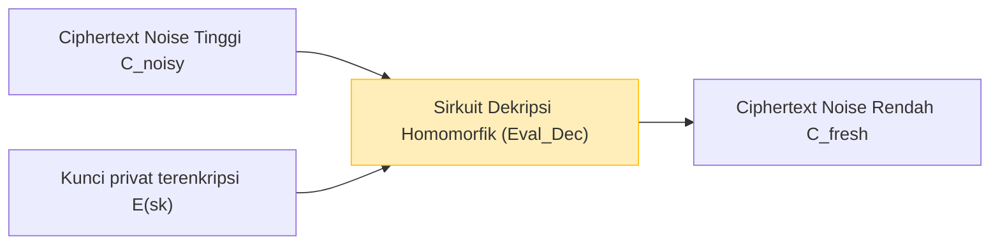

Seiring dengan cloud computing dan teknologi AI yang menjadi infrastruktur masyarakat, pertukaran antara "privasi data" dan "pemanfaatan data" telah menjadi salah satu masalah terpenting. Meskipun terdapat permintaan yang meningkat untuk membiarkan AI di cloud menganalisis data yang sangat sensitif seperti data medis, informasi keuangan, dan informasi biometrik pribadi, banyak perusahaan ragu untuk mengirimkan data ke pihak eksternal karena masalah keamanan.

Teknologi enkripsi konvensional (seperti AES dan RSA) sangat baik dalam melindungi data yang disimpan dalam penyimpanan (Data at Rest) dan data yang mengalir melalui jaringan (Data in Transit). Namun, **saat melakukan pemrosesan (komputasi) seperti pencarian dan machine learning pada data di sisi server (Data in Use), data tersebut harus didekripsi terlebih dahulu untuk kembali ke bentuk plaintext**. Jika server diretas pada saat dekripsi ini, atau jika administrator internal yang berniat jahat mengintip data tersebut, hal ini akan langsung menyebabkan kebocoran informasi.

Teknologi impian yang mengatasi kelemahan mendasar dari "dekripsi saat pemrosesan" ini adalah **Fully Homomorphic Encryption (FHE)**. Dengan menggunakan FHE, dimungkinkan untuk melakukan proses komputasi sambil menjaga data tetap terenkripsi tanpa mendekripsinya sama sekali, dan hanya mengembalikan ciphertext dari hasil komputasi tersebut kepada klien.

Artikel ini akan secara mendalam membahas tentang FHE yang merupakan kunci keamanan generasi berikutnya, mulai dari konsep FHE, sejarah, terobosan inovatif oleh Craig Gentry, dasar-dasar matematika (seperti Ring-LWE), tantangan terbesar yaitu "noise" dan solusinya (bootstrapping), hingga library implementasi terbaru.

---

## 1. Apa itu Homomorphic Encryption? Konsep Dasar

"Homomorphic" (Homomorfik) adalah istilah dalam aljabar, yang merujuk pada sifat di mana himpunan dengan struktur tertentu dapat dipetakan sambil mempertahankan struktur operasi tersebut. "Homomorfisme" dalam teori kriptografi adalah sifat di mana **operasi dalam ruang plaintext sesuai dengan operasi dalam ruang ciphertext**.

Dinyatakan dalam rumus matematika sederhana, misalkan fungsi enkripsi untuk plaintext $m_1$ dan $m_2$ adalah $E(\cdot)$, dan fungsi dekripsinya adalah $D(\cdot)$. Jika operasi (seperti penjumlahan dan perkalian) pada plaintext adalah $\circ$ dan operasi pada ciphertext adalah $\diamond$, maka hubungan berikut ini berlaku.

$$ D(E(m_1) \diamond E(m_2)) = m_1 \circ m_2 $$

Artinya, jika kita mendekripsi hasil dari penerapan operasi $\diamond$ pada ciphertext $E(m_1)$ dan $E(m_2)$, hasilnya akan sama dengan hasil operasi $\circ$ pada plaintext aslinya.

### Alur Data dalam Cloud Computing

Arsitektur pemrosesan cloud menggunakan FHE sama sekali berbeda dari arsitektur konvensional. Diagram berikut menunjukkan alur pemrosesan data yang aman menggunakan FHE.

```mermaid
graph TD
    A["Klien (Menyimpan kunci privat)"] -->|1. Enkripsi plaintext x: E(x)| B["Server Cloud (Hanya data terenkripsi)"]
    B -->|2. Terapkan fungsi f pada ciphertext: E(f(x))| B
    B -->|3. Ciphertext dari hasil perhitungan E(y)| A
    A -->|4. Dekripsi dengan kunci privat: y = f(x)| A
    
    style A fill:#d4edda,stroke:#28a745
    style B fill:#f8d7da,stroke:#dc3545
```

Server menerima data terenkripsi $E(x)$, tetapi tidak pernah dapat mengetahui isi data tersebut karena tidak memiliki kunci privat. Namun, dengan memanfaatkan properti FHE, server dapat menerapkan fungsi $f$ (misalnya, model inferensi machine learning) pada ciphertext untuk menghasilkan $E(f(x))$. Klien menerima hasil ini, dan dengan mendekripsinya menggunakan kunci privat mereka sendiri, klien mendapatkan hasil yang diinginkan $y = f(x)$.

---

## 2. Sejarah Evolusi Homomorphic Encryption: PHE, SHE, FHE

Homomorphic Encryption tidak langsung mencapai bentuk "sempurna" yang ada saat ini sekaligus. Ini secara luas diklasifikasikan ke dalam 3 tahap berdasarkan jenis dan jumlah operasi yang dapat direalisasikan.

### Partially Homomorphic Encryption (PHE)
PHE adalah skema enkripsi yang memungkinkan operasi penjumlahan atau perkalian, **salah satu dari keduanya saja**, tanpa batas. Faktanya, enkripsi dengan sifat ini telah ada sejak lama.

*   **Enkripsi RSA (Homomorfisme terhadap perkalian)**
    Enkripsi RSA secara tidak sengaja memiliki homomorfisme perkalian. Jika plaintext $m_1, m_2$ dan kunci publik $(e, N)$:
    $$ E(m_1) = m_1^e \pmod N $$
    $$ E(m_2) = m_2^e \pmod N $$
    Jika kita mengalikannya:
    $$ E(m_1) \times E(m_2) = (m_1 \cdot m_2)^e \pmod N = E(m_1 \times m_2) $$
    Dengan cara ini, perkalian ciphertext berhubungan dengan perkalian plaintext.
*   **Enkripsi Paillier (Homomorfisme terhadap penjumlahan)**
    Ditemukan pada tahun 1999, enkripsi Paillier memiliki homomorfisme terhadap penjumlahan. Ini telah digunakan secara praktis dalam e-voting (menghitung suara terenkripsi dan hanya mendekripsi hasil akhirnya).

### Somewhat Homomorphic Encryption (SHE)
Ini adalah metode di mana **baik** penjumlahan maupun perkalian dapat dilakukan, tetapi ada **batasan pada jumlah operasi (kedalaman sirkuit)** yang dapat dihitung. Karena akumulasi "noise" yang akan dibahas nanti, dekripsi menjadi mustahil setelah sejumlah perkalian tertentu dilakukan. Enkripsi BGN (Boneh-Goh-Nissim) dari tahun 2005 termasuk dalam kategori ini, tetapi memiliki keterbatasan dalam melakukan komputasi kompleks yang praktis (seperti deep learning).

### Fully Homomorphic Encryption (FHE)
Ini adalah skema enkripsi yang dapat menjalankan baik penjumlahan maupun perkalian dengan **jumlah yang tidak terbatas**. Mirip dengan Turing completeness dalam teori informasi, jika kita dapat menggabungkan penjumlahan (setara dengan XOR) dan perkalian (setara dengan AND) tanpa batas, itu berarti secara prinsip, setiap fungsi atau algoritma yang dapat dihitung dapat dieksekusi dalam keadaan terenkripsi.

FHE telah lama disebut sebagai "Cawan Suci dunia kriptografi", dan bahkan dikatakan mustahil untuk direalisasikan. Namun, pada tahun 2009, **Craig Gentry**, yang saat itu adalah seorang mahasiswa program doktor di Universitas Stanford, mengusulkan skema FHE pertama menggunakan Ideal Lattices, yang mengejutkan dunia.

---

## 3. Fondasi Matematika FHE: Masalah LWE dan Ring-LWE

Sebagian besar skema FHE utama saat ini didasarkan pada **Masalah LWE (Learning With Errors)**, yang merupakan masalah matematika sulit dalam "Lattice-based Cryptography (Kriptografi berbasis kisi)", yang juga dikenal sebagai kriptografi tahan kuantum (Post-Quantum Cryptography).

### Pemahaman Intuitif tentang Masalah LWE
Menyelesaikan persamaan linear simultan adalah mudah jika Anda menggunakan metode seperti eliminasi Gauss.

$$ \begin{cases} 3s_1 + 4s_2 + 2s_3 \equiv 12 \pmod{17} \\ 1s_1 + 9s_2 + 5s_3 \equiv 8 \pmod{17} \\ \vdots \end{cases} $$

Namun, apa yang terjadi jika Anda menambahkan "kesalahan (noise) acak" $e$ yang sangat kecil ke hasil persamaan ini?

$$ \begin{cases} 3s_1 + 4s_2 + 2s_3 + e_1 \equiv 13 \pmod{17} \\ 1s_1 + 9s_2 + 5s_3 + e_2 \equiv 7 \pmod{17} \\ \vdots \end{cases} $$

Dengan hanya menambahkan error $e$ ini, masalah untuk menemukan vektor variabel rahasia $\vec{s}$ berubah menjadi masalah NP-hard yang sulit dipecahkan bahkan jika menggunakan superkomputer saat ini atau komputer kuantum. Inilah masalah LWE.

### Masalah Ring-LWE (RLWE)
Masalah LWE standar melibatkan operasi matriks, yang menyebabkan ukuran kunci yang sangat besar (terkadang dalam gigabyte) dan efisiensi komputasi yang buruk. Untuk mengatasi hal ini, diperkenalkanlah **masalah Ring-LWE (RLWE)**, yang menggunakan operasi pada gelanggang polinomial (polynomial rings).

Pada RLWE, elemen-elemen tersebut termasuk dalam gelanggang polinomial $R_q = \mathbb{Z}_q[x] / (x^N + 1)$ (di mana $N$ adalah pangkat dari 2, dan $q$ adalah bilangan prima sebagai modulus).
Jika kunci privat adalah polinomial $s(x)$, dengan polinomial acak $a(x)$, dan polinomial noise kecil $e(x)$, maka pasangan kunci publiknya adalah sebagai berikut.

$$ (a(x), b(x)) \quad \text{dimana} \quad b(x) = -a(x) \cdot s(x) + e(x) \pmod q $$

Selama enkripsi, properti polinomial ini digunakan untuk mengenkode plaintext $m(x)$ dan menghasilkan ciphertext.

---

## 4. Hambatan Terbesar "Noise" dan Bootstrapping Gentry

Konsep paling penting dalam memahami FHE adalah **"Manajemen Noise"**.

Dalam kriptografi berbasis LWE/RLWE, "noise (error)" kecil sengaja disertakan untuk menjamin keamanan.
Proses mendekripsi ciphertext $c$ dari plaintext $m$ dapat diekspresikan secara kasar dengan rumus berikut.

$$ D(c) = (c \cdot s) \pmod q = m + \text{noise} $$

Selama dekripsi, plaintext yang benar $m$ diperoleh dengan menghilangkan `noise` ini melalui proses seperti pembulatan (rounding). Namun, ketika melakukan operasi homomorfik (terutama perkalian) di antara ciphertext, noise ini akan berlipat ganda secara dramatis.

*   **Penjumlahan Homomorfik**: Noise meningkat secara aditif ($e_1 + e_2$). Ini adalah peningkatan yang relatif lambat.
*   **Representasi matematika dari homomorfisme melalui penjumlahan homomorfik**:
    $$ E(m_1) \oplus E(m_2) = E(m_1 + m_2) $$
*   **Perkalian Homomorfik**: Noise meledak secara multiplikatif (karena mencakup komponen seperti $e_1 \times e_2$). Hanya dengan melakukan perkalian beberapa kali, noise akan melampaui ambang batas $q/2$, membuat proses pembulatan yang benar menjadi tidak mungkin, dan dekripsi akan gagal.
*   **Representasi matematika dari homomorfisme melalui perkalian homomorfik**:
    $$ E(m_1) \otimes E(m_2) = E(m_1 \times m_2) $$

Inilah sebabnya mengapa FHE tidak dapat direalisasikan untuk waktu yang lama, dan hanya terbatas pada SHE (dengan batas jumlah).

### Keajaiban Bootstrapping
Kontribusi jenius dari Craig Gentry adalah penemuan teknik pengurangan noise yang disebut **"Bootstrapping"**. Ini adalah pergeseran paradigma (paradigm shift) dalam kriptografi.

Secara intuitif, operasi ini berarti "sebelum ciphertext rusak karena dipenuhi noise, 'dekripsi' ia untuk membersihkannya selagi masih dalam kondisi terenkripsi, lalu masukkan ke dalam ciphertext baru."

1. Misalkan ada ciphertext dengan noise tinggi $C_{noisy}$.
2. Klien terlebih dahulu memberikan kepada server kunci privat $sk$ yang "dienkripsi dengan kunci publik" $E_{pk}(sk)$ (ini disebut kunci bootstrapping).
3. Server mengeksekusi **sirkuit dekripsi (Decryption Circuit)** secara homomorfik pada $C_{noisy}$.
4. Secara khusus, ia melakukan "dekripsi dalam ruang terenkripsi" pada $E_{pk}(C_{noisy})$ menggunakan $E_{pk}(sk)$.
5. Karena sirkuit dekripsi ini sendiri adalah operasi homomorfik yang menghasilkan noise baru, noise dari ciphertext baru yang dihasilkan $C_{fresh}$ akan di-reset ke "tingkat tetap" tertentu.



Dengan menjalankan bootstrapping ini secara berkala selama perhitungan, secara teoritis dimungkinkan untuk menghitung sirkuit dengan kedalaman tak terbatas (pencapaian FHE). Namun, skema awal Gentry sangat memakan biaya komputasi, dengan proses bootstrapping ini membutuhkan waktu puluhan menit hingga beberapa jam untuk sekali proses.

---

## 5. Generasi FHE dan Evolusi Skema Utama

Menuju implementasi praktis FHE, para kriptografer di seluruh dunia telah berlomba untuk meningkatkan algoritmanya. Saat ini, FHE diklasifikasikan ke dalam 4 generasi/keluarga utama.

### Generasi Kedua: Komputasi Eksak pada Bilangan Bulat (BGV, BFV)
Skema **BGV (Brakerski-Gentry-Vaikuntanathan)** dan **BFV (Brakerski/Fan-Vercauteren)** yang muncul sekitar tahun 2011-2012. Skema ini didasarkan pada RLWE dan cocok untuk aritmatika modular (perhitungan eksak) pada bilangan bulat.
Skema ini mendukung teknologi batching seperti SIMD (Single Instruction, Multiple Data), yang ditandai dengan kemampuannya untuk mengemas ribuan slot data ke dalam satu ciphertext polinomial besar dan menghitungnya secara paralel sekaligus.

### Generasi Ketiga: Akselerasi Bootstrapping (GSW, FHEW, TFHE)
Skema **GSW (Gentry-Sahai-Waters)** pada tahun 2013 menyederhanakan struktur FHE. Dan dari perkembangan ini, salah satu pendekatan utama saat ini adalah **TFHE (Fast Fully Homomorphic Encryption over the Torus)**.
Fitur dari TFHE adalah bahwa bootstrapping-nya sangat cepat (dalam urutan milidetik). Ini unggul dalam operasi tingkat gerbang logis (sirkuit logika seperti AND, XOR) dan karena ukuran ciphertext-nya relatif kecil, ia cocok untuk mengevaluasi sirkuit logika acak dengan kecepatan tinggi.

### Generasi Keempat: Spesialisasi dalam Komputasi Perkiraan dan Machine Learning (CKKS)
Skema **CKKS (Cheon-Kim-Kim-Song)** yang diusulkan oleh Cheon dkk. pada tahun 2017 adalah teknologi definitif dalam pelestarian privasi untuk AI dan machine learning saat ini.
Sementara FHE sebelumnya berfokus pada "komputasi bilangan bulat eksak", CKKS mendukung **"komputasi perkiraan floating-point"** sambil tetap terenkripsi. Skema ini menunjukkan kinerja luar biasa dalam komputasi bilangan riil di mana sedikit kesalahan (error) diperbolehkan, seperti dalam pelatihan dan inferensi neural network.

Tabel berikut merangkum cara memilih skema berdasarkan tujuan.

| Nama Skema | Tipe Data yang Dikuasai | Use Case yang Disarankan | Fitur |
| :--- | :--- | :--- | :--- |
| **BFV / BGV** | Bilangan Bulat (Integer) | Komputasi statistik eksak, agregasi data keuangan, pencarian DB | Throughput tinggi menggunakan batching SIMD |
| **CKKS** | Bilangan Riil (Real/Complex) | Machine Learning (DNN, regresi logistik), pemrosesan sinyal | Akselerasi dengan komputasi perkiraan, penskalaan ulang (rescaling) |
| **TFHE** | Nilai Boolean (Boolean) | Sirkuit logika acak, pencarian string, evaluasi fungsi non-linear | Bootstrapping ultra-cepat (tingkat milidetik) |

---

## 6. Praktik: Library FHE dan Kode Konseptual

Saat ini, terdapat banyak library open-source yang tersedia yang memungkinkan penggunaan FHE tanpa perlu memiliki pengetahuan mendalam tentang kriptografi.

*   **Microsoft SEAL (Simple Encrypted Arithmetic Library)**: Library C++ yang mendukung BFV, BGV, dan CKKS. Ini adalah salah satu standar industri. Binding Python-nya, **TenSEAL**, populer di kalangan engineer AI.
*   **Zama (Concrete)**: Framework berbasis TFHE. Dapat ditulis dengan Rust/Python, dan menyediakan fungsionalitas (Concrete ML) untuk mengompilasi model PyTorch yang ada agar berjalan pada FHE.
*   **OpenFHE**: Penerus PALISADE, library C++ komprehensif yang mendukung semua skema utama.

### Contoh Pemrograman FHE menggunakan Python (TenSEAL)

Berikut adalah contoh kode Python konseptual yang menggunakan skema CKKS untuk menambahkan dan mengalikan vektor bilangan riil yang masih dalam keadaan terenkripsi.

```python
import tenseal as ts

# 1. Setup Konteks (Termasuk pembuatan kunci)
# Menggunakan skema CKKS dan mengatur derajat polinomial modulus ke 8192
context = ts.context(
    ts.SCHEME_TYPE.CKKS,
    poly_modulus_degree=8192,
    coeff_mod_bit_sizes=[60, 40, 40, 60]
)
context.generate_galois_keys()
context.global_scale = 2**40 # Scaling factor untuk bilangan riil

# 2. Sisi Klien: Enkripsi data
vector1 = [1.5, 2.5, 3.5]
vector2 = [2.0, 3.0, 4.0]

# Mengonversi vektor plaintext menjadi ciphertext (Secara ideal dieksekusi di sisi klien)
enc_v1 = ts.ckks_vector(context, vector1)
enc_v2 = ts.ckks_vector(context, vector2)

# 3. Sisi Server: Komputasi dalam keadaan terenkripsi (Perlindungan Data in Use)
# Server tidak mengetahui plaintext, tetapi dapat melakukan penjumlahan dan perkalian
enc_add = enc_v1 + enc_v2
enc_mul = enc_v1 * enc_v2

# 4. Sisi Klien: Mendekripsi hasil
# Hanya klien yang memiliki kunci privat yang dapat melihat hasilnya
res_add = enc_add.decrypt()
res_mul = enc_mul.decrypt()

print(f"Hasil penjumlahan setelah dekripsi: {res_add}")
# Contoh Output: [3.5000001, 5.5000001, 7.5000002] (Mengandung kesalahan sangat kecil karena komputasi perkiraan)

print(f"Hasil perkalian setelah dekripsi: {res_mul}")
# Contoh Output: [3.0000002, 7.5000005, 14.0000003]
```

Seperti yang bisa dilihat dari kode di atas, perhitungan antara ciphertext dapat ditulis secara intuitif dengan melakukan overload pada operator Python biasa, seperti `enc_v1 + enc_v2`. Di sisi server, komputasi vektor diselesaikan tanpa perlu mengetahui isi dari vektor tersebut.

---

## 7. Tantangan FHE: Performa dan Akselerasi Hardware

Meskipun FHE memberikan keamanan yang secara teoritis sempurna, tantangan terbesar dalam implementasi praktisnya adalah **"overhead kinerja (performance overhead)"**.

1.  **Overhead Komputasi**: Dibandingkan dengan komputasi pada plaintext, komputasi pada ciphertext membutuhkan waktu ribuan hingga puluhan ribu kali lebih lambat di CPU. Perkalian polinomial dan bootstrapping memerlukan perhitungan FFT (Fast Fourier Transform) dan NTT (Number Theoretic Transform) dalam jumlah yang sangat besar.
2.  **Ekspansi Ukuran Data (Ciphertext Expansion)**: Plaintext yang hanya berukuran beberapa byte bisa membengkak menjadi beberapa megabyte saat dienkripsi. Ini sangat membebani bandwidth memori dan bandwidth jaringan.

### Pendekatan Solusi melalui Hardware
Untuk mengatasi overhead ini, pengembangan akselerator hardware khusus FHE (mendukung ASIC, FPGA, GPU) sedang dilakukan di seluruh dunia.

*   **Akselerasi GPU**: Upaya sedang dilakukan untuk memparalelkan komputasi NTT dan bootstrapping menggunakan GPU bertenaga seperti NVIDIA, dan akselerasi puluhan kali lipat dibandingkan dengan implementasi perangkat lunak telah dilaporkan (contoh: 100x.ai, backend TFHE-rs CUDA dari Zama).
*   **Proyek DARPA DPRIVE**: Defense Advanced Research Projects Agency (DARPA) dari AS mendorong proyek pengembangan hardware khusus "DPRIVE (Data Protection in Virtual Environments)" untuk meningkatkan kecepatan komputasi FHE ke tingkat yang setara dengan kecepatan pemrosesan plaintext (dalam overhead 10x). Intel, Microsoft, dan Intellectual Ventures berpartisipasi dalam proyek ini.
*   **Kemunculan FPU (FHE Processing Unit)**: Startup seperti Cornami dan Optalysys sedang mengembangkan chip khusus FHE yang menggunakan komputasi optik (optical computing) atau arsitektur silikon khusus.

Dalam waktu dekat, seperti halnya NPU (Neural Processing Unit) pada AI, kita mungkin akan melihat era di mana "FPU" dipasang sebagai standar pada server dan infrastruktur cloud.

---

## 8. Use Case yang Diharapkan

Sekarang setelah FHE mendekati kecepatan yang praktis, inovasi destruktif diharapkan terjadi di berbagai bidang berikut.

1.  **Perlindungan Privasi dalam Analisis Medis dan Genomik**:
    Dengan membiarkan AI di cloud melatih data rekam medis pasien atau data DNA yang dimiliki oleh banyak rumah sakit sambil tetap terenkripsi dengan FHE, pengembangan model diagnosis kanker akurasi tinggi atau penemuan obat baru dapat dilakukan tanpa melanggar undang-undang privasi (seperti HIPAA atau GDPR).
2.  **Deteksi Penipuan dan Anti-Pencucian Uang (AML) untuk Institusi Keuangan**:
    Bank-bank yang saling bersaing dapat mencocokkan data masing-masing dalam keadaan terenkripsi tanpa mengungkapkan informasi rekening pelanggan atau riwayat transaksi, sehingga memungkinkan analisis antar bank (cross-bank) untuk mendeteksi jaringan transfer penipuan yang besar.
3.  **API Inferensi AI yang Aman (MaaS: Model as a Service)**:
    Pengguna dapat mengenkripsi audio, gambar wajah, atau prompt mereka sendiri dan mengirimkannya ke layanan AI (seperti LLM seperti ChatGPT). Penyedia AI menghasilkan respons tanpa mengetahui input pengguna sama sekali, dan mengembalikannya sebagai ciphertext. Dengan ini, kekhawatiran tentang "AI yang mempelajari atau mengintip informasi pribadi" dapat sepenuhnya dihilangkan.

---

## 9. Kesimpulan: Masa Depan Kriptografi menuju "Komputasi Tak Terlihat"

Sama seperti penemuan kriptografi kunci publik (RSA) pada tahun 1970-an yang memungkinkan komunikasi aman di internet (seperti HTTPS), penemuan FHE oleh Craig Gentry adalah salah satu tonggak sejarah paling penting dalam sejarah kriptografi.

Saat ini, Fully Homomorphic Encryption (FHE) telah melompat dari teori di laboratorium, dan memasuki tahap di mana Microsoft, IBM, Intel, Google, dan banyak startup bersaing keras menuju implementasi praktisnya. Walaupun tantangan dalam biaya komputasi dan ukuran data masih ada, perbaikan kinerja terus berlanjut melampaui Hukum Moore berkat penyempurnaan algoritma dan evolusi akselerator hardware.

Beberapa tahun dari sekarang, "komputasi data sambil tetap terenkripsi" tidak akan menjadi sesuatu yang istimewa, melainkan akan menjadi praktik perlindungan data standar dalam layanan cloud. FHE adalah kunci keamanan generasi berikutnya yang merealisasikan **keseimbangan tertinggi antara privasi absolut dan pemanfaatan data** dalam masyarakat yang digerakkan oleh data.
