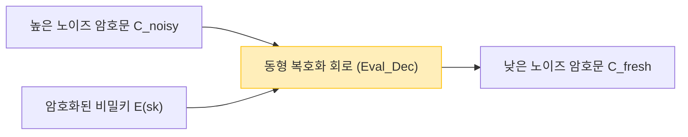

클라우드 컴퓨팅과 AI 기술이 사회의 기반으로 자리 잡은 가운데, '데이터의 프라이버시'와 '데이터의 활용'의 트레이드오프는 가장 중요한 과제 중 하나가 되었습니다. 의료 데이터, 금융 정보, 개인의 생체 정보 등 기밀성이 높은 데이터를 클라우드 상에서 AI에게 분석시키고자 하는 수요는 증가하고 있지만, 보안상의 우려로 데이터의 외부 전송을 주저하는 기업이 적지 않습니다.

기존의 암호화 기술(AES나 RSA 등)은 스토리지에 저장되어 있는 데이터(Data at Rest)나 네트워크 상을 흐르는 데이터(Data in Transit)를 보호하는 데에는 능숙합니다. 하지만, 서버 측에서 데이터에 대해 검색이나 기계 학습 등의 **처리(계산)를 수행할 때(Data in Use)에는 한 번 암호를 복호화하여 평문으로 되돌려야 합니다**. 만약 이 복호화된 타이밍에 서버가 해킹당하거나, 내부의 악의적인 관리자가 데이터를 엿본다면 정보 유출로 직결됩니다.

이 '처리 시의 복호화'라는 근본적인 약점을 극복하는 꿈의 기술이 **완전동형암호(Fully Homomorphic Encryption: FHE)**입니다. FHE를 이용하면 데이터를 암호화한 채로 일절 복호화하지 않고 계산 처리를 수행하고, 그 결과의 암호문만을 클라이언트에게 반환하는 것이 가능해집니다.

본 기사에서는 이 FHE의 개념부터 역사, Craig Gentry에 의한 획기적인 돌파구, 수학적인 기초(Ring-LWE 등), 최대 과제인 '노이즈'와 그 해결책(부트스트래핑), 그리고 최신 구현 라이브러리에 이르기까지 차세대 보안의 핵심인 FHE를 철저하고 깊이 있게 해설합니다.

---

## 1. 동형암호란 무엇인가? 기본적인 개념

'동형(Homomorphic)'이란 대수학의 용어로, 어떤 구조를 가진 집합 간에 연산의 구조를 유지한 채 사상할 수 있는 성질을 뜻합니다. 암호 이론에서의 '동형성'이란 **평문 공간에서의 연산이 암호문 공간에서의 연산에 대응한다**는 성질입니다.

단순한 수식으로 나타내면, 평문 $m_1$ 과 $m_2$ 에 대한 암호화 함수를 $E(\cdot)$ 라 하고, 복호화 함수를 $D(\cdot)$ 라 합니다. 평문 상에서의 연산(덧셈이나 곱셈 등)을 $\circ$ , 암호문 상에서의 연산을 $\diamond$ 라 했을 때, 이하의 관계가 성립합니다.

$$ D(E(m_1) \diamond E(m_2)) = m_1 \circ m_2 $$

즉, 암호문 $E(m_1)$ 과 $E(m_2)$ 에 대해 어떤 연산 $\diamond$ 를 가한 결과를 복호화하면, 원래의 평문끼리 연산 $\circ$ 를 한 결과와 일치한다는 것입니다.

### 클라우드 컴퓨팅에서의 데이터 흐름

FHE를 이용한 클라우드 처리의 아키텍처는 기존의 것과 전혀 다릅니다. 다음 그림은 FHE를 활용한 안전한 데이터 처리의 흐름을 보여줍니다.

```mermaid
graph TD
    A["클라이언트 (비밀키를 보유)"] -->|1. 평문 x 를 암호화: E(x)| B["클라우드 서버 (암호화된 데이터만 존재)"]
    B -->|2. 암호문인 채로 함수 f 를 적용: E(f(x))| B
    B -->|3. 계산 결과의 암호문 E(y)| A
    A -->|4. 비밀키로 복호화: y = f(x)| A
    
    style A fill:#d4edda,stroke:#28a745
    style B fill:#f8d7da,stroke:#dc3545
```

서버는 암호화된 데이터 $E(x)$ 를 받지만, 비밀키를 가지고 있지 않기 때문에 데이터의 내용을 아는 것은 절대 불가능합니다. 그러나 FHE의 성질을 이용함으로써, 암호문에 대해 함수 $f$(예를 들어 기계 학습의 추론 모델)를 적용하여 $E(f(x))$ 를 생성할 수 있습니다. 클라이언트는 이것을 받아 자신의 비밀키로 복호화함으로써 목적하는 결과 $y = f(x)$ 를 얻게 됩니다.

---

## 2. 동형암호의 진화 역사: PHE, SHE, FHE

동형암호는 단번에 현재의 '완전'한 형태가 된 것은 아닙니다. 실현할 수 있는 연산의 종류나 횟수에 따라 크게 3가지 단계로 분류됩니다.

### Partially Homomorphic Encryption (PHE: 부분동형암호)
PHE는 덧셈이나 곱셈 중 **어느 한쪽만**을 무제한으로 수행할 수 있는 암호 방식입니다. 사실 이 성질을 가진 암호는 예전부터 존재했습니다.

*   **RSA 암호 (곱셈에 대한 동형성)**
    RSA 암호는 의도치 않게 곱셈의 동형성을 가지고 있었습니다. 평문 $m_1, m_2$, 공개키 $(e, N)$ 이라고 하면:
    $$ E(m_1) = m_1^e \pmod N $$
    $$ E(m_2) = m_2^e \pmod N $$
    이들을 곱하면:
    $$ E(m_1) \times E(m_2) = (m_1 \cdot m_2)^e \pmod N = E(m_1 \times m_2) $$
    이와 같이 암호문끼리의 곱셈이 평문의 곱셈에 대응합니다.
*   **Paillier 암호 (덧셈에 대한 동형성)**
    1999년에 고안된 Paillier 암호는 덧셈에 대한 동형성을 가집니다. 전자투표(암호화된 표를 집계하고, 최종 결과만 복호화하는 등) 등에서 실용화되어 있습니다.

### Somewhat Homomorphic Encryption (SHE: 유한동형암호)
덧셈과 곱셈 **모두**를 실행할 수 있지만, 연산할 수 있는 **횟수(회로의 깊이)에 제한**이 있는 방식입니다. 후술할 '노이즈'의 축적으로 인해 특정 횟수 이상의 곱셈을 수행하면 복호화가 불가능해집니다. 2005년의 BGN (Boneh-Goh-Nissim) 암호 등이 이에 해당하지만, 실용적이고 복잡한 계산(딥러닝 등)을 수행하기에는 한계가 있었습니다.

### Fully Homomorphic Encryption (FHE: 완전동형암호)
덧셈과 곱셈 모두를 **횟수 제한 없이** 실행할 수 있는 암호 방식입니다. 정보 이론에서의 튜링 완전성과 마찬가지로, 덧셈(XOR에 해당)과 곱셈(AND에 해당)을 무한히 조합할 수 있다면 원리상 어떠한 계산 가능한 함수나 알고리즘도 암호화된 채로 실행할 수 있음을 의미합니다.

FHE는 오랫동안 '암호계의 성배'로 불리며 실현 불가능한 것이 아닌가 하는 이야기도 있었습니다. 하지만 2009년 당시 스탠포드 대학교 박사과정에 있던 **Craig Gentry**가 이상 격자(Ideal Lattices)를 이용한 최초의 FHE 체계를 제안하며 세계에 충격을 안겨주었습니다.

---

## 3. FHE의 수학적 기반: LWE 문제와 Ring-LWE

현재 주류가 되고 있는 FHE 체계의 대부분은 내양자 컴퓨터 암호(Post-Quantum Cryptography)로도 알려진 '격자 기반 암호(Lattice-based Cryptography)'의 수학적 난제인 **LWE (Learning With Errors) 문제**에 기반하고 있습니다.

### LWE 문제의 직관적인 이해
연립일차방정식을 푸는 것은 가우스 소거법 등을 이용하면 간단합니다.

$$ \begin{cases} 3s_1 + 4s_2 + 2s_3 \equiv 12 \pmod{17} \\ 1s_1 + 9s_2 + 5s_3 \equiv 8 \pmod{17} \\ \vdots \end{cases} $$

하지만 이 방정식의 결과에 아주 약간의 '무작위 오차(노이즈)' $e$ 를 더하면 어떻게 될까요.

$$ \begin{cases} 3s_1 + 4s_2 + 2s_3 + e_1 \equiv 13 \pmod{17} \\ 1s_1 + 9s_2 + 5s_3 + e_2 \equiv 7 \pmod{17} \\ \vdots \end{cases} $$

이 오차 $e$ 가 더해지는 것만으로 비밀 변수 벡터 $\vec{s}$ 를 찾아내는 문제는 현재의 슈퍼컴퓨터나 양자컴퓨터를 이용해도 해독하기 어려운 NP-난해(NP-hard) 문제로 변모합니다. 이것이 LWE 문제입니다.

### Ring-LWE 문제 (RLWE)
표준 LWE 문제는 행렬 연산을 포함하기 때문에 키의 크기가 매우 크고(기가바이트 단위가 되기도 함) 계산 효율도 나쁘다는 문제가 있었습니다. 이를 해결하기 위해 도입된 것이 다항식 환(Polynomial Ring) 위에서의 연산을 이용하는 **Ring-LWE (RLWE) 문제**입니다.

RLWE에서는 원소가 다항식 환 $R_q = \mathbb{Z}_q[x] / (x^N + 1)$ 에 속합니다(여기서 $N$ 은 2의 거듭제곱, $q$ 는 법이 되는 소수).
비밀키를 다항식 $s(x)$ 라 하고, 무작위 다항식 $a(x)$, 작은 노이즈 다항식 $e(x)$ 라고 하면, 공개키는 다음과 같은 쌍이 됩니다.

$$ (a(x), b(x)) \quad \text{where} \quad b(x) = -a(x) \cdot s(x) + e(x) \pmod q $$

암호화할 때는 이 다항식의 성질을 이용하여 평문 $m(x)$ 를 인코딩하고 암호문을 생성합니다.

---

## 4. 최대의 장벽 '노이즈'와 Gentry의 부트스트래핑

FHE의 이해에 있어 가장 중요한 개념이 **'노이즈의 관리'**입니다.

LWE/RLWE 기반의 암호에서는 안전성을 담보하기 위해 의도적으로 작은 '노이즈(오차)'를 포함하고 있습니다.
평문 $m$ 의 암호문 $c$ 를 복호화하는 과정은 대략적으로 말하면 다음과 같은 수식으로 표현됩니다.

$$ D(c) = (c \cdot s) \pmod q = m + \text{noise} $$

복호화 시에는 이 `noise` 를 반올림 처리 등으로 제거함으로써 올바른 평문 $m$ 을 얻습니다. 그러나 암호문끼리 동형 연산(특히 곱셈)을 수행하면 이 노이즈가 극적으로 증폭되어 버립니다.

*   **동형 덧셈**: 노이즈는 덧셈적으로 증가합니다($e_1 + e_2$). 이는 비교적 완만한 증가입니다.
*   **동형 덧셈에 의한 동형성의 수식 표현**:
    $$ E(m_1) \oplus E(m_2) = E(m_1 + m_2) $$
*   **동형 곱셈**: 노이즈는 곱셈적으로 폭발합니다($e_1 \times e_2$ 등을 포함하기 때문). 몇 번 곱셈하는 것만으로 노이즈가 임계값 $q/2$ 를 넘어버려 올바른 반올림 처리가 불가능해 복호화에 실패합니다.
*   **동형 곱셈에 의한 동형성의 수식 표현**:
    $$ E(m_1) \otimes E(m_2) = E(m_1 \times m_2) $$

이것이 오랫동안 FHE가 실현되지 못하고 SHE(횟수 제한 있음)에 머물러 있었던 이유입니다.

### 부트스트래핑(Bootstrapping)의 마법
Craig Gentry의 천재적인 공헌은 **'부트스트래핑'**이라 불리는 노이즈 감소 기법을 발명한 것입니다. 이는 암호학에 있어서 패러다임 전환이었습니다.

직관적으로는 '암호문이 노이즈 투성이가 되어 망가지기 전에, 암호화된 채로 "복호화"하여 깨끗하게 만들고 새로운 암호문에 다시 넣는다'는 조작입니다.

1. 노이즈가 커진 암호문 $C_{noisy}$ 가 있다고 가정합니다.
2. 클라이언트는 비밀키 $sk$ 를 '공개키로 암호화한 것' $E_{pk}(sk)$ (이를 부트스트래핑 키라고 부름)를 미리 서버에 건네줍니다.
3. 서버는 $C_{noisy}$ 에 대해 동형적으로 **복호화 회로(Decryption Circuit)**를 실행합니다.
4. 구체적으로는 $E_{pk}(C_{noisy})$ 에 대해 $E_{pk}(sk)$ 를 이용하여 '암호화된 공간 내에서의 복호화'를 수행합니다.
5. 이 복호화 회로 자체도 동형 연산이기 때문에 새로운 노이즈를 낳지만, 출력되는 새로운 암호문 $C_{fresh}$ 의 노이즈는 일정한 '고정 레벨'로 초기화(리셋)됩니다.



이 부트스트래핑을 계산 도중에 정기적으로 실행함으로써, 이론상으로는 무한한 깊이의 회로를 계산 가능(FHE의 달성)하게 만들었습니다. 하지만 초기의 Gentry 방식은 이 부트스트래핑 처리 1회당 수십 분에서 수 시간씩 걸리는 등 절망적일 정도로 계산 비용이 높았습니다.

---

## 5. FHE의 세대와 주요 체계의 진화

FHE의 실용화를 향해 전 세계의 암호학자들이 앞다투어 알고리즘을 개량해왔습니다. 현재 FHE는 크게 4개의 세대/제품군으로 분류됩니다.

### 제2세대: 정수의 정확한 연산 (BGV, BFV)
2011~2012년에 걸쳐 등장한 **BGV (Brakerski-Gentry-Vaikuntanathan)** 와 **BFV (Brakerski/Fan-Vercauteren)** 체계입니다. 이들은 RLWE를 기반으로 하고 있으며 정수의 모듈러 연산(정확한 계산)에 적합합니다.
SIMD (Single Instruction, Multiple Data)와 같은 배칭(Batching) 기술을 지원하고 있어 하나의 거대한 다항식 암호문 속에 수천 개의 데이터 슬롯을 담아 한 번에 병렬 계산할 수 있는 것이 특징입니다.

### 제3세대: 부트스트래핑의 고속화 (GSW, FHEW, TFHE)
2013년의 **GSW (Gentry-Sahai-Waters)** 체계는 FHE의 구조를 보다 단순하게 만들었습니다. 그리고 이를 발전시킨 것이 현재의 주류 중 하나인 **TFHE (Fast Fully Homomorphic Encryption over the Torus)** 입니다.
TFHE의 특징은 부트스트래핑이 매우 빠르다는(밀리초 단위) 점입니다. 게이트 단위(AND, XOR 등 논리 회로)에서의 연산에 강하며, 암호문의 크기도 비교적 작기 때문에 임의의 논리 회로를 고속으로 평가하는 데 적합합니다.

### 제4세대: 근사 계산과 기계 학습에의 특화 (CKKS)
2017년 Cheon 등에 의해 제안된 **CKKS (Cheon-Kim-Kim-Song)** 체계는 현재 AI·기계 학습의 프라이버시 보호에 있어서 결정판이라 할 수 있는 기술입니다.
지금까지의 FHE가 '정확한 정수 계산'을 고집했던 것에 반해, CKKS는 **'부동소수점 수의 근사 계산'**을 암호화된 채로 지원합니다. 신경망의 학습이나 추론 등 작은 오차가 허용되는 실수 계산에 있어서 압도적인 성능을 발휘합니다.

다음 표는 목적별로 어떤 체계를 선택해야 하는지 요약한 것입니다.

| 체계 이름 | 특기인 데이터 형 | 권장되는 유스케이스 | 특징 |
| :--- | :--- | :--- | :--- |
| **BFV / BGV** | 정수 (Integer) | 정확한 통계 계산, 금융 데이터 집계, DB 검색 | SIMD 배칭에 의한 높은 처리량 |
| **CKKS** | 실수 (Real/Complex) | 기계 학습 (DNN, 로지스틱 회귀), 신호 처리 | 근사 계산에 의한 고속화, 리스케일링 |
| **TFHE** | 불리언 값 (Boolean) | 임의의 논리 회로, 문자열 검색, 비선형 함수의 평가 | 초고속 부트스트래핑 (밀리초 대) |

---

## 6. 실천: FHE 라이브러리와 개념적인 코드

현재는 암호학에 대한 깊은 지식이 없어도 FHE를 이용할 수 있는 오픈소스 라이브러리가 다수 제공되고 있습니다.

*   **Microsoft SEAL (Simple Encrypted Arithmetic Library)**: BFV, BGV, CKKS를 지원하는 C++ 라이브러리. 업계 표준 중 하나입니다. Python 바인딩인 **TenSEAL** 이 AI 엔지니어들 사이에서 인기가 있습니다.
*   **Zama (Concrete)**: TFHE를 기반으로 한 프레임워크. Rust/Python으로 작성할 수 있으며 기존의 PyTorch 모델을 컴파일하여 FHE 상에서 구동하는 기능(Concrete ML)을 제공합니다.
*   **OpenFHE**: PALISADE의 후속으로, 모든 주요 체계를 지원하는 포괄적인 C++ 라이브러리입니다.

### Python (TenSEAL) 을 이용한 FHE 프로그래밍 예시

여기서는 CKKS 체계를 이용해 암호화된 채로 실수 벡터를 더하고 곱하는 개념적인 Python 코드의 예시를 보여줍니다.

```python
import tenseal as ts

# 1. 컨텍스트 설정 (키 생성 포함)
# CKKS 체계를 사용하며 다항식의 차수를 8192로 설정
context = ts.context(
    ts.SCHEME_TYPE.CKKS,
    poly_modulus_degree=8192,
    coeff_mod_bit_sizes=[60, 40, 40, 60]
)
context.generate_galois_keys()
context.global_scale = 2**40 # 실수의 스케일링 팩터

# 2. 클라이언트 측: 데이터의 암호화
vector1 = [1.5, 2.5, 3.5]
vector2 = [2.0, 3.0, 4.0]

# 평문 벡터를 암호문으로 변환 (원래는 클라이언트 측에서 실행)
enc_v1 = ts.ckks_vector(context, vector1)
enc_v2 = ts.ckks_vector(context, vector2)

# 3. 서버 측: 암호화된 채로 수행하는 연산 (Data in Use 보호)
# 서버는 평문을 모르지만 덧셈과 곱셈을 실행할 수 있음
enc_add = enc_v1 + enc_v2
enc_mul = enc_v1 * enc_v2

# 4. 클라이언트 측: 결과의 복호화
# 비밀키를 가진 클라이언트만이 결과를 볼 수 있음
res_add = enc_add.decrypt()
res_mul = enc_mul.decrypt()

print(f"복호화된 덧셈 결과: {res_add}")
# 출력 예: [3.5000001, 5.5000001, 7.5000002] (근사 계산이기 때문에 미세한 오차가 포함됨)

print(f"복호화된 곱셈 결과: {res_mul}")
# 출력 예: [3.0000002, 7.5000005, 14.0000003]
```

위의 코드에서 알 수 있듯이, `enc_v1 + enc_v2` 처럼 일반적인 Python의 연산자를 오버로딩하여 직관적으로 암호문끼리의 계산을 작성할 수 있습니다. 서버 측에서는 벡터의 내용을 모른 채로 벡터 연산을 완료하고 있습니다.

---

## 7. FHE의 과제: 성능과 하드웨어 가속

FHE는 이론적으로 완벽한 보안을 제공하지만, 실용화에 있어서 최대의 과제는 **'성능의 오버헤드'**입니다.

1.  **계산의 오버헤드**: 평문에서의 계산에 비해 암호문에서의 계산은 CPU 상에서 수천 배~수만 배 느려집니다. 다항식의 곱셈이나 부트스트래핑에는 방대한 FFT(고속 푸리에 변환)나 NTT(수론 변환)의 계산이 필요합니다.
2.  **데이터 크기의 팽창 (Ciphertext Expansion)**: 수 바이트의 평문이 암호화되면 수 메가바이트가 될 수 있습니다. 이는 메모리 대역폭이나 네트워크 대역폭을 강하게 압박합니다.

### 하드웨어에 의한 해결 접근

이 오버헤드를 극복하기 위해 전 세계에서 FHE 전용 하드웨어 가속기(ASIC, FPGA, GPU 대응)의 개발이 진행되고 있습니다.

*   **GPU 가속**: NVIDIA 등의 강력한 GPU를 이용해 NTT 연산이나 부트스트래핑을 병렬화하는 연구가 진행되고 있으며 소프트웨어 구현 대비 수십 배의 고속화가 보고되고 있습니다(예: 100x.ai, Zama의 TFHE-rs CUDA backend).
*   **DARPA DPRIVE 프로젝트**: 미국 국방고등연구계획국(DARPA)은 FHE의 계산 속도를 평문 처리의 실행 속도와 동등한 수준(오버헤드 10배 이내)으로 끌어올리기 위한 전용 하드웨어 개발 프로젝트 'DPRIVE (Data Protection in Virtual Environments)'를 추진하고 있으며, Intel이나 Microsoft, Intellectual Ventures 등이 참여하고 있습니다.
*   **FPU (FHE Processing Unit) 의 등장**: Cornami나 Optalysys 같은 스타트업이 광 컴퓨팅이나 특수한 실리콘 아키텍처를 이용한 FHE 전용 칩 개발에 나서고 있습니다.

가까운 미래에 AI에서의 NPU(Neural Processing Unit)처럼 서버나 클라우드 인프라에 'FPU'가 표준 탑재되는 시대가 올지도 모릅니다.

---

## 8. 기대되는 유스케이스

FHE가 실용적인 속도에 도달해가는 지금, 다음과 같은 분야에서의 파괴적 혁신이 기대되고 있습니다.

1.  **의료·유전체 분석의 프라이버시 보호**:
    여러 병원이 가진 환자의 진료 기록이나 DNA 데이터를 FHE로 암호화한 채 클라우드의 AI에게 학습시킴으로써 프라이버시 법(HIPAA나 GDPR)을 위반하지 않고 고정밀 암 진단 모델이나 신약 개발을 진행할 수 있습니다.
2.  **금융 기관의 부정 탐지·자금 세탁 방지 (AML)**:
    경쟁하는 은행끼리 고객의 계좌 정보나 거래 내역을 밝히지 않고 암호화된 상태로 서로의 데이터를 대조하여 거대한 부정 송금 네트워크를 탐지하는 교차 은행 분석이 가능해집니다.
3.  **안전한 AI 추론 API (MaaS: Model as a Service)**:
    사용자는 자신의 음성이나 얼굴 이미지, 프롬프트를 암호화하여 AI 서비스(ChatGPT와 같은 LLM 등)에 전송합니다. AI 제공자는 사용자의 입력을 일절 알지 못한 채로 답변을 생성하여 암호문으로 반환합니다. 이를 통해 'AI에게 개인 정보가 학습되거나 도난당한다'는 우려가 완전히 불식됩니다.

---

## 9. 결론: 암호의 미래는 '보이지 않는 계산'으로

1970년대에 공개키 암호(RSA)가 발명되어 인터넷 상의 안전한 통신(HTTPS 등)이 가능해진 것처럼, Craig Gentry에 의한 FHE의 발명은 암호의 역사에 있어서 가장 중요한 이정표 중 하나입니다.

현재 완전동형암호(FHE)는 연구실의 이론에서 벗어나 Microsoft, IBM, Intel, Google, 그리고 많은 스타트업들이 실용화를 향해 치열하게 경쟁하는 단계에 접어들었습니다. 계산 비용이나 데이터 크기라는 과제는 여전히 존재하지만 알고리즘의 세련화와 하드웨어 가속기의 진화에 의해 무어의 법칙을 뛰어넘는 속도로 성능 향상이 이어지고 있습니다.

수년 뒤, '데이터를 암호화한 채로 계산하는' 것은 특별한 일이 아니라 클라우드 서비스에서의 표준적인 데이터 보호 모범 사례가 될 것입니다. FHE는 데이터 주도형 사회에서의 **궁극적인 프라이버시와 데이터 활용의 양립**을 실현하는 차세대 보안의 핵심입니다.
