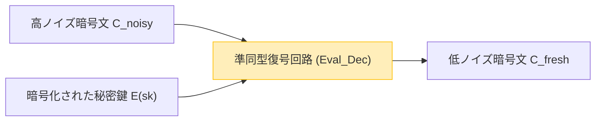

クラウドコンピューティングやAI技術が社会の基盤として定着する中、「データのプライバシー」と「データの利活用」のトレードオフは、最も重要な課題の一つとなっています。医療データ、金融情報、個人の生体情報など、機密性の高いデータをクラウド上でAIに解析させたいという需要は高まっていますが、セキュリティ上の懸念からデータの外部送信を躊躇する企業は少なくありません。

従来の暗号化技術（AESやRSAなど）は、ストレージに保存されているデータ（Data at Rest）やネットワーク上を流れるデータ（Data in Transit）を保護することには長けています。しかし、サーバー側でデータに対して検索や機械学習などの**処理（計算）を行う際（Data in Use）には、一度暗号を復号して平文に戻す必要があります**。もしこの復号されたタイミングでサーバーがハッキングされたり、内部の悪意ある管理者がデータを覗き見たりすれば、情報漏洩に直結します。

この「処理時の復号」という根本的な弱点を克服する夢の技術が、**完全準同型暗号（Fully Homomorphic Encryption: FHE）**です。FHEを利用すれば、データを暗号化したまま一切復号せずに計算処理を行い、その結果の暗号文だけをクライアントに返すことが可能になります。

本記事では、このFHEの概念から歴史、Craig Gentryによる画期的なブレイクスルー、数学的な基礎（Ring-LWEなど）、最大の課題である「ノイズ」とその解決策（ブートストラッピング）、そして最新の実装ライブラリに至るまで、次世代セキュリティの要であるFHEを徹底的に深く解説します。

---

## 1. 準同型暗号とは何か？基本的な概念

「準同型（Homomorphic）」とは代数学の用語であり、ある構造を持つ集合間で、演算の構造を保ったまま写像できる性質を指します。暗号理論における「準同型性」とは、**平文空間での演算が、暗号文空間での演算に対応している**という性質です。

単純な数式で表すと、平文 $m_1$ と $m_2$ に対する暗号化関数を $E(\cdot)$ とし、復号関数を $D(\cdot)$ とします。平文上での演算（加算や乗算など）を $\circ$ 、暗号文上での演算を $\diamond$ としたとき、以下の関係が成り立ちます。

$$ D(E(m_1) \diamond E(m_2)) = m_1 \circ m_2 $$

つまり、暗号文 $E(m_1)$ と $E(m_2)$ に対して何らかの演算 $\diamond$ を施した結果を復号すると、元の平文同士を演算 $\circ$ した結果と一致するということです。

### クラウドコンピューティングにおけるデータフロー

FHEを用いたクラウド処理のアーキテクチャは、従来のものと全く異なります。以下の図は、FHEを活用したセキュアなデータ処理のフローを示しています。

```mermaid
graph TD
    A["クライアント (秘密鍵を保持)"] -->|1. 平文 x を暗号化: E(x)| B["クラウドサーバー (暗号化データのみ)"]
    B -->|2. 暗号文のまま関数 f を適用: E(f(x))| B
    B -->|3. 計算結果の暗号文 E(y)| A
    A -->|4. 秘密鍵で復号: y = f(x)| A
    
    style A fill:#d4edda,stroke:#28a745
    style B fill:#f8d7da,stroke:#dc3545
```

サーバーは暗号化されたデータ $E(x)$ を受け取りますが、秘密鍵を持たないためデータの中身を知ることは絶対にできません。しかし、FHEの性質を利用することで、暗号文に対して関数 $f$（例えば機械学習の推論モデル）を適用し、$E(f(x))$ を生成することができます。クライアントはこれを受け取り、自身の秘密鍵で復号することで、目的の結果 $y = f(x)$ を手に入れます。

---

## 2. 準同型暗号の進化の歴史：PHE, SHE, FHE

準同型暗号は、一度に現在の「完全」な形になったわけではありません。実現できる演算の種類や回数によって、大きく3つの段階に分類されます。

### Partially Homomorphic Encryption (PHE: 部分準同型暗号)
PHEは、加算か乗算の**どちらか一方のみ**を無制限に行うことができる暗号方式です。実は、この性質を持つ暗号は古くから存在していました。

*   **RSA暗号（乗算に対する準同型性）**
    RSA暗号は意図せずして乗算の準同型性を持っていました。平文 $m_1, m_2$、公開鍵 $(e, N)$ とすると：
    $$ E(m_1) = m_1^e \pmod N $$
    $$ E(m_2) = m_2^e \pmod N $$
    これらを掛け合わせると：
    $$ E(m_1) \times E(m_2) = (m_1 \cdot m_2)^e \pmod N = E(m_1 \times m_2) $$
    このように、暗号文同士の乗算が平文の乗算に対応します。
*   **Paillier暗号（加算に対する準同型性）**
    1999年に考案されたPaillier暗号は、加算に対する準同型性を持ちます。電子投票（暗号化された票を集計し、最終結果だけを復号する）などで実用化されています。

### Somewhat Homomorphic Encryption (SHE: 有界準同型暗号)
加算と乗算の**両方**を実行できますが、演算できる**回数（回路の深さ）に制限**がある方式です。後述する「ノイズ」の蓄積により、ある一定回数以上の乗算を行うと復号が不可能になってしまいます。2005年のBGN (Boneh-Goh-Nissim) 暗号などがこれに該当しますが、実用的な複雑な計算（ディープラーニングなど）を行うには限界がありました。

### Fully Homomorphic Encryption (FHE: 完全準同型暗号)
加算と乗算の両方を、**回数無制限**で実行できる暗号方式です。情報理論におけるチューリング完全性と同様に、加算（XORに相当）と乗算（ANDに相当）を無限に組み合わせることができれば、原理上いかなる計算可能な関数・アルゴリズムも暗号化されたまま実行できることを意味します。

FHEは長らく「暗号界の聖杯」と呼ばれ、実現不可能ではないかとも言われていました。しかし、2009年に当時スタンフォード大学の博士課程にいた **Craig Gentry** が、理想格子（Ideal Lattices）を用いた最初のFHEスキームを提案し、世界に衝撃を与えました。

---

## 3. FHEの数学的基盤：LWE問題とRing-LWE

現在の主流となっているFHEスキームの多くは、耐量子計算機暗号（Post-Quantum Cryptography）としても知られる「格子暗号（Lattice-based Cryptography）」の数学的難問である **LWE (Learning With Errors) 問題**に基づいています。

### LWE問題の直感的な理解
連立一次方程式を解くことは、ガウスの消去法などを用いれば簡単です。

$$ \begin{cases} 3s_1 + 4s_2 + 2s_3 \equiv 12 \pmod{17} \\ 1s_1 + 9s_2 + 5s_3 \equiv 8 \pmod{17} \\ \vdots \end{cases} $$

しかし、この方程式の結果に、ごく僅かな「ランダムな誤差（ノイズ）」$e$ を加えるとどうなるでしょうか。

$$ \begin{cases} 3s_1 + 4s_2 + 2s_3 + e_1 \equiv 13 \pmod{17} \\ 1s_1 + 9s_2 + 5s_3 + e_2 \equiv 7 \pmod{17} \\ \vdots \end{cases} $$

この誤差 $e$ が加わるだけで、秘密の変数ベクトル $\vec{s}$ を見つけ出す問題は、現在のスーパーコンピュータや量子コンピュータを用いても解読が困難なNP困難な問題へと変貌します。これがLWE問題です。

### Ring-LWE問題（RLWE）
標準のLWE問題は行列演算を含むため、鍵のサイズが非常に大きく（ギガバイト単位になることも）、計算効率も悪いという問題がありました。これを解決するために導入されたのが、多項式環上の演算を用いる **Ring-LWE (RLWE) 問題**です。

RLWEでは、要素が多項式環 $R_q = \mathbb{Z}_q[x] / (x^N + 1)$ に属します（ここで $N$ は2の冪乗、$q$ は法となる素数）。
秘密鍵を多項式 $s(x)$ とし、ランダムな多項式 $a(x)$、小さなノイズ多項式 $e(x)$ とすると、公開鍵は以下のペアになります。

$$ (a(x), b(x)) \quad \text{where} \quad b(x) = -a(x) \cdot s(x) + e(x) \pmod q $$

暗号化の際には、この多項式の性質を利用して平文 $m(x)$ をエンコードし、暗号文を生成します。

---

## 4. 最大の障壁「ノイズ」とGentryのブートストラッピング

FHEの理解において最も重要な概念が**「ノイズの管理」**です。

LWE/RLWEベースの暗号では、安全性を担保するために意図的に小さな「ノイズ（誤差）」を含めています。
平文 $m$ の暗号文 $c$ を復号するプロセスは、大雑把に言えば次のような数式で表されます。

$$ D(c) = (c \cdot s) \pmod q = m + \text{noise} $$

復号時には、この `noise` を丸め処理などで取り除くことで正しい平文 $m$ を得ます。しかし、暗号文同士で準同型演算（特に乗算）を行うと、このノイズが劇的に増幅してしまいます。

*   **準同型加算**: ノイズは足し算的に増加します（$e_1 + e_2$）。これは比較的緩やかな増加です。
*   **準同型加算による準同型性の数式表現**:
    $$ E(m_1) \oplus E(m_2) = E(m_1 + m_2) $$
*   **準同型乗算**: ノイズは掛け算的に爆発します（$e_1 \times e_2$ などを含むため）。数回乗算するだけでノイズがしきい値 $q/2$ を超えてしまい、正しい丸め処理ができず復号に失敗します。
*   **準同型乗算による準同型性の数式表現**:
    $$ E(m_1) \otimes E(m_2) = E(m_1 \times m_2) $$

これが、長い間FHEが実現できず、SHE（回数制限付き）に留まっていた理由です。

### ブートストラッピング（Bootstrapping）の魔法
Craig Gentryの天才的な貢献は、**「ブートストラッピング」**と呼ばれるノイズ削減の手法を発明したことです。これは暗号学におけるパラダイムシフトでした。

直感的には「暗号文がノイズまみれになって壊れる前に、暗号化されたままの状態で『復号』して綺麗にし、新しい暗号文に入れ直す」という操作です。

1. ノイズが大きくなった暗号文 $C_{noisy}$ があるとします。
2. クライアントは、秘密鍵 $sk$ を「公開鍵で暗号化したもの」$E_{pk}(sk)$（これをブートストラッピングキーと呼ぶ）をあらかじめサーバーに渡しておきます。
3. サーバーは、$C_{noisy}$ に対して、準同型的に**復号回路（Decryption Circuit）**を実行します。
4. 具体的には、$E_{pk}(C_{noisy})$ に対して $E_{pk}(sk)$ を用いて「暗号化された空間内での復号」を行います。
5. この復号回路自体も準同型演算であるため新たなノイズを生みますが、出力される新しい暗号文 $C_{fresh}$ のノイズは、一定の「固定レベル」にリセットされます。



このブートストラッピングを計算の途中で定期的に実行することで、理論上は無限の深さの回路を計算可能（FHEの達成）にしました。しかし、初期のGentryの方式は、このブートストラッピング処理に1回あたり数十分から数時間かかるという、絶望的なほど計算コストが高いものでした。

---

## 5. FHEの世代と主要なスキームの進化

FHEの実用化に向けて、世界中の暗号学者が競うようにアルゴリズムを改良してきました。現在、FHEは主に4つの世代・ファミリーに分類されます。

### 第2世代：整数の正確な演算 (BGV, BFV)
2011〜2012年にかけて登場した **BGV (Brakerski-Gentry-Vaikuntanathan)** と **BFV (Brakerski/Fan-Vercauteren)** スキームです。これらはRLWEを基盤としており、整数のモジュラ演算（正確な計算）に適しています。
SIMD (Single Instruction, Multiple Data) のようなバッチング（Batching）技術をサポートしており、1つの巨大な多項式の暗号文の中に、何千ものデータスロットを詰め込んで一度に並列計算できるのが特徴です。

### 第3世代：ブートストラッピングの高速化 (GSW, FHEW, TFHE)
2013年の **GSW (Gentry-Sahai-Waters)** スキームは、FHEの構造をよりシンプルにしました。そしてこれを発展させたのが、現在の主流の一つである **TFHE (Fast Fully Homomorphic Encryption over the Torus)** です。
TFHEの特徴は、ブートストラッピングが非常に高速（ミリ秒単位）であることです。ゲート単位（AND, XORなどの論理回路）での演算に強く、暗号文のサイズも比較的小さいため、任意の論理回路を高速に評価するのに適しています。

### 第4世代：近似計算と機械学習への特化 (CKKS)
2017年にCheonらによって提案された **CKKS (Cheon-Kim-Kim-Song)** スキームは、現在のAI・機械学習のプライバシー保護における決定版と言える技術です。
これまでのFHEが「正確な整数計算」にこだわっていたのに対し、CKKSは**「浮動小数点数の近似計算」**を暗号化されたままサポートします。ニューラルネットワークの学習や推論など、小さな誤差が許容される実数計算において、圧倒的なパフォーマンスを発揮します。

以下の表に、目的別のスキームの選び方をまとめます。

| スキーム名 | 得意なデータ型 | 推奨されるユースケース | 特徴 |
| :--- | :--- | :--- | :--- |
| **BFV / BGV** | 整数 (Integer) | 正確な統計計算、金融データ集計、DB検索 | SIMDバッチングによる高スループット |
| **CKKS** | 実数 (Real/Complex) | 機械学習 (DNN, ロジスティック回帰)、信号処理 | 近似計算による高速化、再スケーリング |
| **TFHE** | ブール値 (Boolean) | 任意の論理回路、文字列検索、非線形関数の評価 | 超高速ブートストラッピング（ミリ秒台） |

---

## 6. 実践：FHEライブラリと概念的なコード

現在では、暗号学の深い知識がなくてもFHEを利用できるオープンソースのライブラリが多数提供されています。

*   **Microsoft SEAL (Simple Encrypted Arithmetic Library)**: BFV, BGV, CKKSをサポートするC++ライブラリ。業界標準の一つ。Pythonバインディングである **TenSEAL** がAIエンジニアの間で人気です。
*   **Zama (Concrete)**: TFHEをベースにしたフレームワーク。Rust/Pythonで記述でき、既存のPyTorchモデルをコンパイルしてFHE上で動かす機能（Concrete ML）を提供しています。
*   **OpenFHE**: PALISADEの後継で、すべての主要なスキームをサポートする包括的なC++ライブラリ。

### Python (TenSEAL) を用いたFHEプログラミングの例

ここでは、CKKSスキームを用いて、暗号化されたまま実数ベクトルを足し合わせ、掛け合わせる概念的なPythonコードの例を示します。

```python
import tenseal as ts

# 1. コンテキストのセットアップ (鍵生成を含む)
# CKKSスキームを使用し、多項式の次数を8192に設定
context = ts.context(
    ts.SCHEME_TYPE.CKKS,
    poly_modulus_degree=8192,
    coeff_mod_bit_sizes=[60, 40, 40, 60]
)
context.generate_galois_keys()
context.global_scale = 2**40 # 実数のスケーリングファクタ

# 2. クライアント側：データの暗号化
vector1 = [1.5, 2.5, 3.5]
vector2 = [2.0, 3.0, 4.0]

# 平文ベクトルを暗号文に変換 (本来はクライアント側で実行)
enc_v1 = ts.ckks_vector(context, vector1)
enc_v2 = ts.ckks_vector(context, vector2)

# 3. サーバー側：暗号化されたままの演算 (Data in Useの保護)
# サーバーは平文を知らないが、加算と乗算を実行できる
enc_add = enc_v1 + enc_v2
enc_mul = enc_v1 * enc_v2

# 4. クライアント側：結果の復号
# 秘密鍵を持つクライアントだけが結果を見ることができる
res_add = enc_add.decrypt()
res_mul = enc_mul.decrypt()

print(f"復号された加算結果: {res_add}")
# 出力例: [3.5000001, 5.5000001, 7.5000002] (近似計算のため微小な誤差が含まれる)

print(f"復号された乗算結果: {res_mul}")
# 出力例: [3.0000002, 7.5000005, 14.0000003]
```

上記のコードからわかるように、`enc_v1 + enc_v2` のように通常のPythonの演算子をオーバーロードして直感的に暗号文同士の計算を記述することができます。サーバー側では、ベクトルの中身を知らずにベクトル演算を完了させています。

---

## 7. FHEの課題：パフォーマンスとハードウェアアクセラレーション

FHEは理論的に完璧なセキュリティを提供しますが、実用化における最大の課題は**「パフォーマンスのオーバーヘッド」**です。

1.  **計算のオーバーヘッド**: 平文での計算に比べ、暗号文での計算はCPU上で数千倍〜数万倍遅くなります。多項式の乗算やブートストラッピングには膨大なFFT（高速フーリエ変換）やNTT（数論変換）の計算が必要です。
2.  **データサイズの膨張 (Ciphertext Expansion)**: 数バイトの平文が、暗号化されると数メガバイトになることがあります。これはメモリ帯域やネットワーク帯域を強く圧迫します。

### ハードウェアによる解決へのアプローチ
このオーバーヘッドを克服するため、世界中でFHE専用のハードウェアアクセラレータ（ASIC, FPGA, GPU対応）の開発が進められています。

*   **GPUアクセラレーション**: NVIDIAなどの強力なGPUを用いて、NTT演算やブートストラッピングを並列化する取り組みが進んでおり、ソフトウェア実装に対して数十倍の高速化が報告されています（例：100x.ai, ZamaのTFHE-rs CUDA backend）。
*   **DARPA DPRIVE プロジェクト**: 米国防高等研究計画局（DARPA）は、FHEの計算速度を平文処理の実行速度と同等レベル（オーバーヘッド10倍以内）に引き上げるための専用ハードウェア開発プロジェクト「DPRIVE (Data Protection in Virtual Environments)」を推進しており、IntelやMicrosoft、Intellectual Venturesなどが参加しています。
*   **FPU (FHE Processing Unit) の登場**: CornamiやOptalysysといったスタートアップが、光コンピューティングや特殊なシリコンアーキテクチャを用いたFHE専用チップの開発に乗り出しています。

近い将来、AIにおけるNPU（Neural Processing Unit）のように、サーバーやクラウドインフラに「FPU」が標準搭載される時代が来るかもしれません。

---

## 8. 期待されるユースケース

FHEが実用的な速度に到達しつつある今、以下のような分野での破壊的イノベーションが期待されています。

1.  **医療・ゲノム解析のプライバシー保護**:
    複数の病院が持つ患者のカルテデータやDNAデータを、FHEで暗号化したままクラウドのAIに学習させることで、プライバシー法（HIPAAやGDPR）に違反することなく、高精度な癌診断モデルや新薬開発を行うことができます。
2.  **金融機関の不正検知・マネーロンダリング対策 (AML)**:
    競合する銀行同士が、顧客の口座情報や取引履歴を明かすことなく、暗号化された状態で互いのデータを照合し、巨大な不正送金ネットワークを検知するクロスバンク分析が可能になります。
3.  **セキュアなAI推論API (MaaS: Model as a Service)**:
    ユーザーは自身の音声や顔画像、プロンプトを暗号化してAIサービス（ChatGPTのようなLLMなど）に送信します。AIプロバイダーはユーザーの入力を一切知ることなく回答を生成し、暗号文として返します。これにより、「AIに個人情報を学習される・盗み見られる」という懸念が完全に払拭されます。

---

## 9. 結論：暗号の未来は「見えない計算」へ

1970年代に公開鍵暗号（RSA）が発明されてインターネット上の安全な通信（HTTPSなど）が可能になったように、Craig GentryによるFHEの発明は、暗号の歴史における最も重要なマイルストーンの一つです。

現在、完全準同型暗号（FHE）は研究室の理論から飛び出し、Microsoft、IBM、Intel、Google、そして多くのスタートアップが実用化に向けてしのぎを削る段階に入っています。計算コストやデータサイズの課題は依然として存在しますが、アルゴリズムの洗練とハードウェアアクセラレータの進化により、ムーアの法則を超えるペースで性能向上が続いています。

数年後、「データを暗号化したまま計算する」ことは特別なことではなく、クラウドサービスにおける標準的なデータ保護のベストプラクティスとなるでしょう。FHEは、データ駆動型社会における**究極のプライバシーとデータ利活用の両立**を実現する、次世代セキュリティの要なのです。

