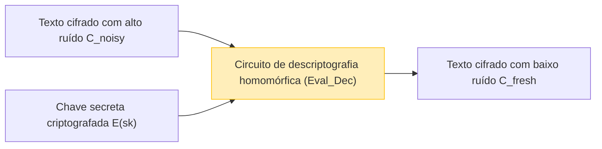

À medida que a computação em nuvem e a tecnologia de IA se estabelecem como base da sociedade, o trade-off entre a "privacidade de dados" e a "utilização de dados" tornou-se um dos desafios mais importantes. Embora haja uma demanda crescente por ter IAs analisando dados altamente sensíveis na nuvem — como dados médicos, informações financeiras e dados biométricos pessoais —, muitas empresas hesitam em enviar dados externamente por questões de segurança.

Tecnologias de criptografia tradicionais (como AES e RSA) são excelentes em proteger dados armazenados em disco (Data at Rest) ou dados transmitidos pela rede (Data in Transit). No entanto, quando o servidor executa **processamentos (cálculos) nos dados, como pesquisas ou aprendizado de máquina (Data in Use), é necessário descriptografar a cifra e retorná-la a texto plano primeiro**. Se o servidor for hackeado exatamente no momento em que os dados estão descriptografados, ou se um administrador interno mal-intencionado visualizar os dados, isso levará diretamente a um vazamento de informações.

A tecnologia dos sonhos que supera essa fraqueza fundamental da "descriptografia durante o processamento" é a **Criptografia Totalmente Homomórfica (Fully Homomorphic Encryption: FHE)**. Ao usar a FHE, torna-se possível realizar cálculos nos dados enquanto eles permanecem criptografados, sem qualquer descriptografia, e retornar apenas o texto cifrado do resultado para o cliente.

Neste artigo, explicaremos profundamente a FHE, o pilar da segurança da próxima geração, desde os seus conceitos até a história, o avanço revolucionário de Craig Gentry, a base matemática (como Ring-LWE), o maior desafio do "ruído" e sua solução (bootstrapping), chegando até as bibliotecas de implementação mais recentes.

---

## 1. O que é a Criptografia Homomórfica? Conceitos Básicos

"Homomorfismo" é um termo da álgebra que se refere à propriedade de mapeamento entre conjuntos que possuem uma determinada estrutura, preservando a estrutura de suas operações. A "propriedade homomórfica" na teoria da criptografia é a característica onde **as operações no espaço de texto plano correspondem às operações no espaço de texto cifrado**.

Expressado em uma fórmula simples, considere que a função de criptografia para os textos planos $m_1$ e $m_2$ seja $E(\cdot)$ e a função de descriptografia seja $D(\cdot)$. Sendo $\circ$ a operação sobre os textos planos (como adição ou multiplicação) e $\diamond$ a operação sobre os textos cifrados, a seguinte relação é mantida:

$$ D(E(m_1) \diamond E(m_2)) = m_1 \circ m_2 $$

Em outras palavras, ao descriptografar o resultado da aplicação de alguma operação $\diamond$ nos textos cifrados $E(m_1)$ e $E(m_2)$, obteremos o mesmo resultado da operação $\circ$ feita nos textos planos originais.

### Fluxo de Dados na Computação em Nuvem

A arquitetura de processamento em nuvem usando a FHE é completamente diferente da arquitetura tradicional. O diagrama a seguir ilustra o fluxo de processamento seguro de dados utilizando a FHE.

```mermaid
graph TD
    A["Cliente (Possui a chave secreta)"] -->|1. Criptografar texto plano x: E(x)| B["Servidor em Nuvem (Apenas dados criptografados)"]
    B -->|2. Aplicar função f no texto cifrado: E(f(x))| B
    B -->|3. Texto cifrado do resultado calculado E(y)| A
    A -->|4. Descriptografar com chave secreta: y = f(x)| A
    
    style A fill:#d4edda,stroke:#28a745
    style B fill:#f8d7da,stroke:#dc3545
```

O servidor recebe os dados criptografados $E(x)$, mas como ele não possui a chave secreta, ele é absolutamente incapaz de saber o conteúdo dos dados. No entanto, explorando as propriedades da FHE, é possível aplicar a função $f$ (por exemplo, um modelo de inferência de aprendizado de máquina) ao texto cifrado e gerar $E(f(x))$. O cliente recebe isso e, descriptografando-o com sua própria chave secreta, obtém o resultado desejado $y = f(x)$.

---

## 2. A História da Evolução da Criptografia Homomórfica: PHE, SHE, FHE

A criptografia homomórfica não atingiu sua forma "totalmente" atual de uma só vez. Ela é amplamente classificada em três estágios dependendo dos tipos e da quantidade de operações que podem ser realizadas.

### Partially Homomorphic Encryption (PHE: Criptografia Parcialmente Homomórfica)
A PHE é um método de criptografia que permite que **apenas uma das operações** (ou adição ou multiplicação) seja executada um número ilimitado de vezes. Na verdade, criptografias com essa propriedade existem há muito tempo.

*   **Criptografia RSA (Homomorfismo para multiplicação)**
    A criptografia RSA obteve inadvertidamente propriedade homomórfica multiplicativa. Dados os textos planos $m_1, m_2$ e a chave pública $(e, N)$:
    $$ E(m_1) = m_1^e \pmod N $$
    $$ E(m_2) = m_2^e \pmod N $$
    Ao multiplicá-los:
    $$ E(m_1) \times E(m_2) = (m_1 \cdot m_2)^e \pmod N = E(m_1 \times m_2) $$
    Assim, a multiplicação dos textos cifrados corresponde à multiplicação dos textos planos.
*   **Criptografia Paillier (Homomorfismo para adição)**
    A criptografia Paillier, inventada em 1999, possui propriedade homomórfica para a adição. Tem sido implementada na prática em sistemas como o voto eletrônico (onde os votos criptografados são agregados e apenas o resultado final é descriptografado).

### Somewhat Homomorphic Encryption (SHE: Criptografia Homomórfica Limitada)
Este método pode executar **tanto a adição quanto a multiplicação**, mas há **um limite no número de vezes (a profundidade do circuito)** em que as operações podem ser realizadas. Devido ao acúmulo de "ruído" discutido mais adiante, após realizar mais do que um certo número de multiplicações, a descriptografia se torna impossível. A criptografia BGN (Boneh-Goh-Nissim) de 2005 entra nessa categoria, mas tinha limites quando se tentava cálculos complexos práticos (como o deep learning).

### Fully Homomorphic Encryption (FHE: Criptografia Totalmente Homomórfica)
Um esquema de criptografia no qual tanto a adição quanto a multiplicação podem ser realizadas **um número ilimitado de vezes**. Semelhante à completude de Turing na teoria da informação, se a adição (correspondente a XOR) e a multiplicação (correspondente a AND) puderem ser combinadas infinitamente, significa que, em princípio, qualquer função ou algoritmo computável pode ser executado enquanto os dados permanecem criptografados.

Por muito tempo, a FHE foi chamada de o "Santo Graal do mundo da criptografia" e muitos pensavam ser impossível. No entanto, em 2009, **Craig Gentry**, que estava em um programa de doutorado na Universidade de Stanford na época, propôs o primeiro esquema de FHE usando Reticulados Ideais (Ideal Lattices), chocando o mundo.

---

## 3. A Base Matemática da FHE: O Problema LWE e Ring-LWE

Muitos esquemas modernos de FHE baseiam-se no **problema LWE (Learning With Errors)**, um difícil problema matemático da "Criptografia baseada em Reticulados (Lattice-based Cryptography)", também conhecida como Criptografia Pós-Quântica (Post-Quantum Cryptography).

### Entendimento Intuitivo do Problema LWE
Resolver um sistema de equações lineares é fácil usando métodos como a eliminação de Gauss.

$$ \begin{cases} 3s_1 + 4s_2 + 2s_3 \equiv 12 \pmod{17} \\ 1s_1 + 9s_2 + 5s_3 \equiv 8 \pmod{17} \\ \vdots \end{cases} $$

No entanto, o que acontece se adicionarmos um pequeno "erro aleatório (ruído)" $e$ ao resultado destas equações?

$$ \begin{cases} 3s_1 + 4s_2 + 2s_3 + e_1 \equiv 13 \pmod{17} \\ 1s_1 + 9s_2 + 5s_3 + e_2 \equiv 7 \pmod{17} \\ \vdots \end{cases} $$

Ao apenas adicionar esse erro $e$, o problema de descobrir o vetor de variáveis secretas $\vec{s}$ se transforma em um problema NP-difícil, extremamente complicado de ser decifrado mesmo utilizando os supercomputadores ou computadores quânticos de hoje. Esse é o problema LWE.

### Problema Ring-LWE (RLWE)
Como o problema LWE padrão envolve operações com matrizes, ele sofria da desvantagem de possuir tamanhos de chave extremamente grandes (às vezes chegando à escala de gigabytes) e de ter baixa eficiência computacional. O **problema Ring-LWE (RLWE)**, que utiliza operações sobre um anel polinomial, foi introduzido para resolver esse problema.

No RLWE, os elementos pertencem a um anel polinomial $R_q = \mathbb{Z}_q[x] / (x^N + 1)$ (onde $N$ é uma potência de 2, e $q$ é um número primo para o módulo).
Se a chave secreta for o polinômio $s(x)$, um polinômio aleatório for $a(x)$, e um polinômio de ruído pequeno for $e(x)$, o par de chaves públicas será:

$$ (a(x), b(x)) \quad \text{where} \quad b(x) = -a(x) \cdot s(x) + e(x) \pmod q $$

No momento da criptografia, a propriedade desse polinômio é usada para codificar o texto plano $m(x)$ e gerar o texto cifrado.

---

## 4. A Maior Barreira: "Ruído" e o Bootstrapping de Gentry

O conceito mais importante no entendimento da FHE é **"a gestão do ruído"**.

Em criptografias baseadas em LWE/RLWE, pequenos "ruídos (erros)" são intencionalmente incluídos para garantir a segurança.
O processo de descriptografia do texto cifrado $c$ do texto plano $m$ pode ser expresso em termos gerais pela seguinte fórmula:

$$ D(c) = (c \cdot s) \pmod q = m + \text{noise} $$

Durante a descriptografia, o texto plano $m$ correto é obtido pela remoção desse `noise` por meio de processos como o arredondamento. Contudo, ao realizar operações homomórficas (especialmente a multiplicação) nos textos cifrados, esse ruído se amplifica drasticamente.

*   **Adição homomórfica**: O ruído aumenta aditivamente ($e_1 + e_2$). É um aumento relativamente suave.
*   **Expressão matemática da propriedade homomórfica com adição homomórfica**:
    $$ E(m_1) \oplus E(m_2) = E(m_1 + m_2) $$
*   **Multiplicação homomórfica**: O ruído explode multiplicativamente (pois envolve fatores como $e_1 \times e_2$). Apenas multiplicando algumas vezes, o ruído pode exceder o limiar $q/2$, impossibilitando o arredondamento correto e levando à falha da descriptografia.
*   **Expressão matemática da propriedade homomórfica com multiplicação homomórfica**:
    $$ E(m_1) \otimes E(m_2) = E(m_1 \times m_2) $$

É por isso que a FHE permaneceu sem ser concretizada por um longo tempo, restrita a SHE (limitada em número de operações).

### A Magia do Bootstrapping
A contribuição genial de Craig Gentry foi a invenção da técnica de redução de ruído chamada **"bootstrapping"**. Essa foi uma mudança de paradigma na criptografia.

Intuitivamente, é o processo de "'descriptografar' o texto cifrado dentro do seu estado criptografado para limpá-lo, antes que ele se torne tão repleto de ruído que quebre, e então colocá-lo em um novo texto cifrado".

1. Suponha que temos um texto cifrado $C_{noisy}$ com muito ruído.
2. O cliente fornece antecipadamente ao servidor sua chave secreta $sk$ "criptografada com a chave pública", ou seja, $E_{pk}(sk)$ (isto é chamado de chave de bootstrapping).
3. O servidor executa homomorficamente o **Circuito de Descriptografia (Decryption Circuit)** sobre $C_{noisy}$.
4. Especificamente, ele realiza uma "descriptografia dentro do espaço criptografado" aplicando $E_{pk}(sk)$ em $E_{pk}(C_{noisy})$.
5. Como este circuito de descriptografia é em si mesmo uma operação homomórfica, ele gerará um novo ruído, mas o ruído do novo texto cifrado gerado, $C_{fresh}$, é redefinido para um "nível fixo" constante.



Ao executar este bootstrapping periodicamente no meio dos cálculos, tornou-se teoricamente possível calcular circuitos de profundidade infinita (atingindo a FHE). No entanto, no esquema inicial de Gentry, o custo computacional para esse processo de bootstrapping era desesperadamente alto, levando de dezenas de minutos a horas para ser executado uma única vez.

---

## 5. Gerações de FHE e a Evolução dos Principais Esquemas

Para tornar a FHE viável na prática, criptógrafos de todo o mundo vêm competindo para aprimorar os algoritmos. Atualmente, a FHE é amplamente categorizada em quatro gerações ou famílias.

### Segunda Geração: Aritmética Exata de Inteiros (BGV, BFV)
Surgidos entre 2011 e 2012, os esquemas **BGV (Brakerski-Gentry-Vaikuntanathan)** e **BFV (Brakerski/Fan-Vercauteren)**. Baseados no RLWE, eles são apropriados para a aritmética modular com números inteiros (cálculos exatos).
Eles têm como característica o suporte a técnicas de loteamento (Batching) como SIMD (Single Instruction, Multiple Data), que permite acomodar milhares de slots de dados em um único texto cifrado de polinômio gigante, possibilitando cálculos paralelos de uma só vez.

### Terceira Geração: Aceleração do Bootstrapping (GSW, FHEW, TFHE)
O esquema **GSW (Gentry-Sahai-Waters)** de 2013 simplificou a estrutura da FHE. Isso então evoluiu para o **TFHE (Fast Fully Homomorphic Encryption over the Torus)**, que é um dos métodos predominantes hoje em dia.
A característica do TFHE é que o seu bootstrapping é extremamente rápido (na ordem de milissegundos). Ele é robusto no processamento ao nível de portas (circuitos lógicos como AND, XOR) e possui um tamanho de texto cifrado relativamente pequeno, tornando-o ideal para avaliar rapidamente circuitos lógicos arbitrários.

### Quarta Geração: Especialização para Cálculo Aproximado e Aprendizado de Máquina (CKKS)
O esquema **CKKS (Cheon-Kim-Kim-Song)**, proposto por Cheon et al. em 2017, pode ser considerado a tecnologia definitiva na proteção da privacidade para a IA e aprendizado de máquina modernos.
Enquanto as versões anteriores da FHE focavam em "cálculos com números inteiros exatos", o CKKS suporta homomorficamente **"cálculos aproximados com números de ponto flutuante"**. Ele demonstra um desempenho avassalador em cálculos com números reais onde pequenas margens de erro são toleradas, como no treinamento e inferência de redes neurais.

A tabela abaixo resume como escolher os esquemas conforme a finalidade:

| Nome do Esquema | Tipo de Dados Adequado | Casos de Uso Recomendados | Características |
| :--- | :--- | :--- | :--- |
| **BFV / BGV** | Inteiros (Integer) | Cálculos estatísticos exatos, agregação de dados financeiros, buscas em DB | Alto rendimento via loteamento SIMD |
| **CKKS** | Números Reais (Real/Complex) | Aprendizado de Máquina (DNN, regressão logística), processamento de sinais | Aceleração via cálculo aproximado, reescalonamento |
| **TFHE** | Valores Booleanos (Boolean) | Circuitos lógicos arbitrários, buscas por strings, avaliação de funções não lineares | Bootstrapping super-rápido (escala de milissegundos) |

---

## 6. Prática: Bibliotecas de FHE e Código Conceitual

Atualmente, existem inúmeras bibliotecas de código aberto que permitem usar a FHE sem necessitar de conhecimento profundo em criptografia.

*   **Microsoft SEAL (Simple Encrypted Arithmetic Library)**: Biblioteca em C++ com suporte para os esquemas BFV, BGV e CKKS. É um dos padrões da indústria. O **TenSEAL**, seu wrapper em Python, é popular entre engenheiros de IA.
*   **Zama (Concrete)**: Framework baseado em TFHE. Pode ser codificado em Rust/Python e oferece recursos (Concrete ML) para compilar modelos PyTorch existentes para executá-los em FHE.
*   **OpenFHE**: O sucessor do PALISADE, é uma biblioteca C++ abrangente que suporta todos os esquemas principais.

### Exemplo de Programação FHE usando Python (TenSEAL)

Abaixo, mostramos um exemplo conceitual em Python usando o esquema CKKS, em que vetores de números reais são somados e multiplicados enquanto permanecem criptografados.

```python
import tenseal as ts

# 1. Configuração do contexto (incluindo a geração das chaves)
# Usando o esquema CKKS e configurando o grau do polinômio para 8192
context = ts.context(
    ts.SCHEME_TYPE.CKKS,
    poly_modulus_degree=8192,
    coeff_mod_bit_sizes=[60, 40, 40, 60]
)
context.generate_galois_keys()
context.global_scale = 2**40 # Fator de escala para números reais

# 2. Lado do cliente: Criptografia dos dados
vector1 = [1.5, 2.5, 3.5]
vector2 = [2.0, 3.0, 4.0]

# Convertendo o vetor em texto plano para um texto cifrado (Originalmente executado no cliente)
enc_v1 = ts.ckks_vector(context, vector1)
enc_v2 = ts.ckks_vector(context, vector2)

# 3. Lado do servidor: Operações no estado criptografado (Proteção do Data in Use)
# O servidor não conhece os textos planos, mas consegue realizar a adição e a multiplicação
enc_add = enc_v1 + enc_v2
enc_mul = enc_v1 * enc_v2

# 4. Lado do cliente: Descriptografia do resultado
# Apenas o cliente que possui a chave secreta consegue ver o resultado
res_add = enc_add.decrypt()
res_mul = enc_mul.decrypt()

print(f"Resultado da adição descriptografado: {res_add}")
# Exemplo de saída: [3.5000001, 5.5000001, 7.5000002] (Uma pequena margem de erro por causa dos cálculos aproximados)

print(f"Resultado da multiplicação descriptografado: {res_mul}")
# Exemplo de saída: [3.0000002, 7.5000005, 14.0000003]
```

Como pode ser visto no código acima, operações normais de operadores de Python como `enc_v1 + enc_v2` podem ser sobrecarregadas para expressar cálculos entre textos cifrados de maneira intuitiva. No lado do servidor, as operações vetoriais são completadas sem que se conheça o conteúdo do vetor.

---

## 7. Desafios da FHE: Desempenho e Aceleração por Hardware

Embora a FHE forneça uma segurança teoricamente perfeita, o maior desafio na sua aplicação prática é a **"sobrecarga (overhead) de desempenho"**.

1.  **Sobrecarga computacional**: Comparado ao cálculo em texto plano, o cálculo sobre um texto cifrado na CPU é milhares a dezenas de milhares de vezes mais lento. Multiplicar polinômios e realizar bootstrapping exige cálculos computacionais imensos, como FFT (Transformada Rápida de Fourier) e NTT (Transformada da Teoria dos Números).
2.  **Expansão de Dados (Ciphertext Expansion)**: Um texto plano de alguns bytes, quando criptografado, pode aumentar de tamanho para alguns megabytes. Isso exerce forte pressão sobre a largura de banda de memória e da rede.

### Abordagens de Resolução Através de Hardware
Para superar essa sobrecarga, esforços estão em andamento em todo o mundo para desenvolver aceleradores de hardware dedicados à FHE (suporte a ASIC, FPGA e GPU).

*   **Aceleração com GPU**: Esforços para usar as potentes GPUs (como as da NVIDIA) a fim de paralelizar os cálculos de NTT ou o bootstrapping estão progredindo e relatam velocidades que são dezenas de vezes mais rápidas em comparação com as implementações baseadas em software (ex.: 100x.ai, o backend CUDA TFHE-rs da Zama).
*   **Projeto DARPA DPRIVE**: A Defense Advanced Research Projects Agency (DARPA) dos EUA, está conduzindo o "DPRIVE (Data Protection in Virtual Environments)", um projeto focado no desenvolvimento de hardware exclusivo projetado para elevar a velocidade do cálculo da FHE a uma capacidade equivalente à velocidade de execução em texto plano (com overhead dentro de 10x), que conta com parceiros como Intel, Microsoft, Intellectual Ventures e afins.
*   **O Surgimento da FPU (FHE Processing Unit)**: Startups como Cornami e Optalysys têm se empenhado em construir chips dedicados à FHE usando arquiteturas de silício especiais ou tecnologias de computação óptica.

Num futuro próximo, poderemos presenciar a era em que as FPUs estejam incluídas como padrão em infraestruturas de servidores ou na nuvem, da mesma forma que as NPUs (Neural Processing Units) ocorrem na IA.

---

## 8. Casos de Uso Esperados

Hoje em dia, onde a FHE está alcançando uma velocidade em níveis práticos, são aguardadas inovações disruptivas nos seguintes campos:

1.  **Proteção à privacidade em análises genômicas e médicas**:
    Informações biológicas (dados de DNA) ou laudos e exames provindos de muitos hospitais diferentes poderão receber modelos de IA em conjunto pelas nuvens sob formatação FHE de estado permanente cifrado, o qual atende inteiramente os limites impostos pelas leis legislativas de conformidade (como a LGPD, HIPAA e GDPR). Esses esforços proporcionarão construções avançadas com diagnóstico e produção em tratamentos farmacêuticos precisos sobre patologias de tumores cancerosos e desenvolvimento de novas medicações sem riscos.
2.  **Verificação antifraude nas Instituições Financeiras e PLD (Prevenção à Lavagem de Dinheiro)**:
    Instituições financeiras em concorrência poderão verificar em mútuo auxílio o quadro dos extratos ou as referências transacionais de cada cliente sob encriptação, contendo integridade não visível para apontar enormes cadeias criminosas de fraude que praticam remessas desonestas entre bancos nas transferências. O que possibilita executar a chamada avaliação multi-bancos.
3.  **APIs de IA Seguras de Inferências Pessoais (MaaS: Model as a Service)**:
    Usuários usarão chaves particulares próprias (mensagens digitadas de comandos/prompt, rostos, fotos, imagens de íris, gravações da sua fala) e repassarão elas de maneira cifrada e inacessível a uma determinada aplicação de Inteligência Artificial para Inferência de Modelos de Linguagem (a exemplo de um modelo LLM igual o ChatGPT ou congêneres da tecnologia de processamento natural humano). O Fornecedor provedor detentor da IA despacha e fabrica formulações conclusivas não sabendo jamais qual era o dado ali originário de partida; remetendo sua solução redigida na total cifra. Desse modo erradica o abalo de "permitir o espião no treinamento indevido sob rastros dos detalhes expostos pelo indivíduo na internet privada e sensível".

---

## 9. Conclusão: O Futuro da Criptografia em Direção ao "Cálculo Invisível"

Assim como a invenção da criptografia de chave pública (como a RSA) na década de 1970 possibilitou a comunicação segura pela internet (como no HTTPS), a invenção da FHE por Craig Gentry é um dos marcos mais cruciais em toda a história criptográfica da humanidade.

No presente, a Criptografia Totalmente Homomórfica (FHE) deu um salto dos laboratórios teóricos para o mundo real, entrando agora na etapa pela qual as corporações da Microsoft, IBM, Intel, Google, assim como uma quantidade de startups lutam firmemente em direção ao estado da comercialização tangível no sistema prático. O problema da quantidade do peso do tamanho expansível nos dados codificados ainda está contido no rol de entraves e desafios a transpor, mas à luz do requinte arquitetônico dos modelos e softwares matemáticos de algoritmo em sincronia contínua de aperfeiçoamento nos hardwares superacelerados tecnológicos, sua capacidade de melhoria atinge avanços velozes cujas expectativas superam a Lei de Moore.

Daqui a poucos anos, a frase "processar e calcular enquanto os dados se encontram em criptografia resguardada" será desprovida da sensação da complexidade esotérica especial e rara e deve vir a ser consolidada na prática essencialmente como base obrigatória generalizada do mercado na segurança protetora das soluções da arquitetura pela nuvem de serviços mundiais atuais. Afinal, no palco dessa presente comunidade conectada (data-driven) embasada globalmente via bases contínuas digitais, a **FHE (Criptografia Totalmente Homomórfica)** assume sua titularidade do suporte principal absoluto para a segurança nas próximas fronteiras do amanhã que concretiza a conciliação unânime final das realidades — da máxima e rigorosa preservação do resguardo íntimo da **privacidade e paralelamente de suas inúmeras flexibilidades promissoras no uso interconectado nos dados**.

