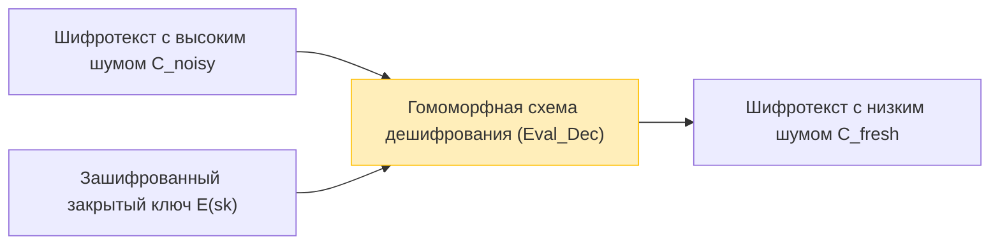

В условиях, когда облачные вычисления и технологии ИИ становятся основой общества, компромисс между «конфиденциальностью данных» и «использованием данных» является одной из важнейших проблем. Растет спрос на использование ИИ в облаке для анализа высококонфиденциальных данных, таких как медицинские данные, финансовая информация и личная биометрическая информация, но многие компании не решаются передавать данные наружу из-за соображений безопасности.

Традиционные технологии шифрования (такие как AES и RSA) отлично справляются с защитой данных, хранящихся в хранилище (Data at Rest) и передаваемых по сети (Data in Transit). Однако при **выполнении обработки (вычислений) на стороне сервера, например, поиска или машинного обучения над данными (Data in Use), необходимо сначала расшифровать их и вернуть в виде открытого текста**. Если сервер будет взломан в момент расшифровки, или если злонамеренный внутренний администратор заглянет в данные, это приведет к прямой утечке информации.

Технология мечты, которая преодолевает эту фундаментальную слабость «расшифровки во время обработки», — это **полностью гомоморфное шифрование (Fully Homomorphic Encryption: FHE)**. Использование FHE позволяет выполнять вычислительную обработку данных, оставляя их зашифрованными без какой-либо расшифровки, и возвращать клиенту только зашифрованный результат.

В этой статье мы глубоко и детально рассмотрим FHE, основу безопасности следующего поколения, начиная от концепции и истории, новаторского прорыва Крейга Джентри, математических основ (таких как Ring-LWE), до самой большой проблемы — «шума» — и ее решения (bootstrapping, начальная загрузка/загрузка), а также новейших библиотек реализаций.

---

## 1. Что такое гомоморфное шифрование? Основные концепции

«Гомоморфный» — это алгебраический термин, который относится к свойству отображения между множествами с определенной структурой, при котором сохраняется структура операций. «Гомоморфизм» в теории криптографии означает свойство, при котором **операции в пространстве открытого текста соответствуют операциям в пространстве шифротекста**.

Выражаясь простой математической формулой, пусть $E(\cdot)$ будет функцией шифрования, а $D(\cdot)$ — функцией дешифрования для открытых текстов $m_1$ и $m_2$. Если операция над открытым текстом (например, сложение или умножение) обозначается как $\circ$, а операция над шифротекстом — как $\diamond$, то выполняется следующее соотношение:

$$ D(E(m_1) \diamond E(m_2)) = m_1 \circ m_2 $$

Другими словами, расшифровка результата применения какой-либо операции $\diamond$ к шифротекстам $E(m_1)$ и $E(m_2)$ совпадает с результатом применения операции $\circ$ к исходным открытым текстам.

### Поток данных в облачных вычислениях

Архитектура облачной обработки с использованием FHE полностью отличается от традиционной. На следующем рисунке показан поток безопасной обработки данных с использованием FHE.

```mermaid
graph TD
    A["Клиент (хранит закрытый ключ)"] -->|1. Шифрует открытый текст x: E(x)| B["Облачный сервер (только зашифрованные данные)"]
    B -->|2. Применяет функцию f к шифротексту: E(f(x))| B
    B -->|3. Зашифрованный результат вычислений E(y)| A
    A -->|4. Расшифровывает закрытым ключом: y = f(x)| A
    
    style A fill:#d4edda,stroke:#28a745
    style B fill:#f8d7da,stroke:#dc3545
```

Сервер получает зашифрованные данные $E(x)$, но, поскольку у него нет закрытого ключа, он абсолютно не может знать содержимое данных. Однако, используя свойства FHE, можно применить функцию $f$ (например, модель машинного обучения) к шифротексту и сгенерировать $E(f(x))$. Клиент получает это и расшифровывает с помощью своего собственного закрытого ключа, получая таким образом желаемый результат $y = f(x)$.

---

## 2. История эволюции гомоморфного шифрования: PHE, SHE, FHE

Гомоморфное шифрование не сразу приняло свою нынешнюю «полную» форму. Оно широко подразделяется на три этапа в зависимости от типов и количества операций, которые могут быть выполнены.

### Partially Homomorphic Encryption (PHE: Частично гомоморфное шифрование)

PHE — это схема шифрования, которая может выполнять **только одну** операцию, либо сложение, либо умножение, неограниченное количество раз. На самом деле, шифры с таким свойством существуют с давних времен.

*   **Шифрование RSA (гомоморфизм по умножению)**
    Шифрование RSA непреднамеренно обладало гомоморфизмом по умножению. Пусть открытые тексты равны $m_1, m_2$, а открытый ключ — $(e, N)$:
    $$ E(m_1) = m_1^e \pmod N $$
    $$ E(m_2) = m_2^e \pmod N $$
    Если перемножить их, то получится:
    $$ E(m_1) \times E(m_2) = (m_1 \cdot m_2)^e \pmod N = E(m_1 \times m_2) $$
    Таким образом, умножение шифротекстов соответствует умножению открытых текстов.
*   **Шифрование Пэйе (гомоморфизм по сложению)**
    Шифрование Пэйе (Paillier), изобретенное в 1999 году, обладает гомоморфизмом по сложению. Оно применяется на практике, например, в электронном голосовании (подсчет зашифрованных голосов и расшифровка только конечного результата).

### Somewhat Homomorphic Encryption (SHE: Ограниченно гомоморфное шифрование)

Это схема, которая может выполнять **обе** операции, сложение и умножение, но имеет **ограничение на количество выполняемых операций (глубину схемы)**. Из-за накопления «шума», о котором будет рассказано позже, дешифрование становится невозможным после определенного количества умножений. К этой категории относится шифр BGN (Boneh-Goh-Nissim) 2005 года, но у него были ограничения для выполнения практических сложных вычислений (таких как глубокое обучение).

### Fully Homomorphic Encryption (FHE: Полностью гомоморфное шифрование)

Это схема шифрования, которая позволяет выполнять как сложение, так и умножение **неограниченное количество раз**. Подобно полноте по Тьюрингу в теории информации, если сложение (соответствует XOR) и умножение (соответствует AND) можно комбинировать бесконечно, это означает, что в принципе любая вычислимая функция или алгоритм могут быть выполнены в зашифрованном виде.

FHE долгое время называли «Святым Граалем криптографии» и считали невозможным. Однако в 2009 году **Крейг Джентри**, в то время аспирант Стэнфордского университета, предложил первую схему FHE с использованием идеальных решеток (Ideal Lattices), что потрясло мир.

---

## 3. Математические основы FHE: Задача LWE и Ring-LWE

Многие из современных господствующих схем FHE основаны на **задаче LWE (Обучение с ошибками, Learning With Errors)**, сложной математической проблеме в «криптографии на решетках (Lattice-based Cryptography)», которая также известна как постквантовая криптография.

### Интуитивное понимание задачи LWE

Решение системы линейных уравнений является простой задачей, если использовать такие методы, как метод исключения Гаусса.

$$ \begin{cases} 3s_1 + 4s_2 + 2s_3 \equiv 12 \pmod{17} \\ 1s_1 + 9s_2 + 5s_3 \equiv 8 \pmod{17} \\ \vdots \end{cases} $$

Но что произойдет, если к результатам этих уравнений добавить крошечную «случайную ошибку (шум)» $e$?

$$ \begin{cases} 3s_1 + 4s_2 + 2s_3 + e_1 \equiv 13 \pmod{17} \\ 1s_1 + 9s_2 + 5s_3 + e_2 \equiv 7 \pmod{17} \\ \vdots \end{cases} $$

Добавление только этой ошибки $e$ превращает задачу нахождения секретного вектора переменных $\vec{s}$ в NP-трудную задачу, которую трудно взломать даже с помощью современных суперкомпьютеров или квантовых компьютеров. Это и есть задача LWE.

### Задача Ring-LWE (RLWE)

Стандартная задача LWE включает в себя матричные операции, поэтому она имела проблему огромных размеров ключей (которые могли достигать гигабайт) и низкой вычислительной эффективности. Для решения этой проблемы была введена **задача Ring-LWE (RLWE)**, которая использует операции над кольцами многочленов.

В RLWE элементы принадлежат кольцу многочленов $R_q = \mathbb{Z}_q[x] / (x^N + 1)$ (где $N$ — степень двойки, а $q$ — простое число, выступающее в качестве модуля).
Если закрытый ключ является многочленом $s(x)$, а случайный многочлен — $a(x)$, и небольшой многочлен шума — $e(x)$, то открытый ключ будет представлять собой следующую пару:

$$ (a(x), b(x)) \quad \text{where} \quad b(x) = -a(x) \cdot s(x) + e(x) \pmod q $$

При шифровании открытый текст $m(x)$ кодируется с использованием свойств этого многочлена для генерации шифротекста.

---

## 4. Самое большое препятствие «Шум» и Bootstrapping Джентри

Самая важная концепция в понимании FHE — это **«управление шумом»**.

Шифры на основе LWE/RLWE преднамеренно включают небольшой «шум (ошибку)» для обеспечения безопасности.
Процесс дешифрования шифротекста $c$ открытого текста $m$, грубо говоря, выражается следующей формулой:

$$ D(c) = (c \cdot s) \pmod q = m + \text{noise} $$

При дешифровании этот `noise` (шум) удаляется посредством округления, в результате чего получается правильный открытый текст $m$. Однако при выполнении гомоморфных операций (особенно умножения) между шифротекстами этот шум резко возрастает.

*   **Гомоморфное сложение**: Шум увеличивается аддитивно ($e_1 + e_2$). Это относительно постепенное увеличение.
*   **Математическое выражение гомоморфизма посредством гомоморфного сложения**:
    $$ E(m_1) \oplus E(m_2) = E(m_1 + m_2) $$
*   **Гомоморфное умножение**: Шум возрастает мультипликативно взрывным образом (поскольку он включает $e_1 \times e_2$ и т. д.). После всего нескольких умножений шум превышает порог $q/2$, в результате чего невозможно выполнить правильное округление, и дешифрование завершается неудачей.
*   **Математическое выражение гомоморфизма посредством гомоморфного умножения**:
    $$ E(m_1) \otimes E(m_2) = E(m_1 \times m_2) $$

Именно поэтому FHE долгое время не удавалось реализовать, и все ограничивалось SHE (с ограничением количества операций).

### Магия Bootstrapping (перезагрузки)

Гениальный вклад Крейга Джентри заключается в изобретении метода снижения шума, называемого **«bootstrapping»**. Это был сдвиг парадигмы в криптографии.

Интуитивно это операция: «прежде чем шифротекст будет поврежден, наполнившись шумом, 'расшифровать' его, оставаясь в зашифрованном состоянии, очистить его и поместить в новый шифротекст».

1. Допустим, есть шифротекст с высоким уровнем шума $C_{noisy}$.
2. Клиент заранее передает серверу «зашифрованный с помощью открытого ключа» закрытый ключ $sk$, $E_{pk}(sk)$ (называемый ключом bootstrapping).
3. Сервер гомоморфно выполняет **схему дешифрования (Decryption Circuit)** над $C_{noisy}$.
4. В частности, он выполняет «дешифрование в зашифрованном пространстве» для $E_{pk}(C_{noisy})$ с использованием $E_{pk}(sk)$.
5. Поскольку сама эта схема дешифрования также является гомоморфной операцией, она генерирует новый шум, но шум результирующего нового шифротекста $C_{fresh}$ сбрасывается до определенного «фиксированного уровня».



Периодически выполняя этот bootstrapping в процессе вычислений, теоретически стало возможным вычислять схемы бесконечной глубины (достижение FHE). Однако в первоначальном методе Джентри эта операция bootstrapping занимала от нескольких десятков минут до нескольких часов на один раз, что было катастрофически затратно в вычислительном плане.

---

## 5. Поколения FHE и эволюция основных схем

В целях практического применения FHE криптографы со всего мира соревновались в совершенствовании алгоритмов. В настоящее время FHE классифицируется в основном на четыре поколения/семейства.

### Второе поколение: Точные операции над целыми числами (BGV, BFV)

Схемы **BGV (Brakerski-Gentry-Vaikuntanathan)** и **BFV (Brakerski/Fan-Vercauteren)** появились в 2011–2012 годах. Они основаны на RLWE и подходят для модульных арифметических операций над целыми числами (точные вычисления).
Они поддерживают методы пакетирования (Batching), такие как SIMD (Single Instruction, Multiple Data), и характеризуются способностью упаковывать тысячи слотов данных в один огромный полиномиальный шифротекст и вычислять их параллельно за один раз.

### Третье поколение: Ускорение Bootstrapping (GSW, FHEW, TFHE)

Схема **GSW (Gentry-Sahai-Waters)** 2013 года упростила структуру FHE. Ее развитием является **TFHE (Fast Fully Homomorphic Encryption over the Torus)**, одно из современных основных направлений.
Особенностью TFHE является чрезвычайно быстрый bootstrapping (в миллисекундах). Он эффективен при выполнении операций на уровне логических вентилей (логические схемы, такие как AND, XOR) и имеет относительно небольшой размер шифротекста, что делает его подходящим для быстрой оценки любых логических схем.

### Четвертое поколение: Специализация на приближенных вычислениях и машинном обучении (CKKS)

Схема **CKKS (Cheon-Kim-Kim-Song)**, предложенная Cheon и соавторами в 2017 году, может считаться окончательной технологией для защиты конфиденциальности в современном ИИ и машинном обучении.
В то время как предыдущие FHE фокусировались на «точных целочисленных вычислениях», CKKS поддерживает **«приближенные вычисления чисел с плавающей запятой»** в зашифрованном виде. Он демонстрирует невероятную производительность в вычислениях над вещественными числами, где допускаются небольшие ошибки, таких как обучение и логический вывод нейронных сетей.

В следующей таблице обобщено, как выбрать схему в зависимости от цели.

| Имя схемы | Подходящий тип данных | Рекомендуемые варианты использования | Особенности |
| :--- | :--- | :--- | :--- |
| **BFV / BGV** | Целые числа (Integer) | Точные статистические расчеты, агрегация финансовых данных, поиск в БД | Высокая пропускная способность за счет пакетирования SIMD |
| **CKKS** | Вещественные числа (Real/Complex) | Машинное обучение (DNN, логистическая регрессия), обработка сигналов | Ускорение за счет приближенных вычислений, масштабирование (rescaling) |
| **TFHE** | Булевы значения (Boolean) | Любые логические схемы, поиск по строкам, оценка нелинейных функций | Сверхбыстрый bootstrapping (на уровне миллисекунд) |

---

## 6. Практика: Библиотеки FHE и концептуальный код

В настоящее время доступно множество библиотек с открытым исходным кодом, которые позволяют использовать FHE без глубоких знаний криптографии.

*   **Microsoft SEAL (Simple Encrypted Arithmetic Library)**: Библиотека C++, поддерживающая BFV, BGV и CKKS. Один из отраслевых стандартов. Ее привязка для Python, **TenSEAL**, популярна среди инженеров ИИ.
*   **Zama (Concrete)**: Фреймворк на базе TFHE. Может быть написан на Rust/Python, предоставляет функциональность (Concrete ML) для компиляции существующих моделей PyTorch для работы поверх FHE.
*   **OpenFHE**: Преемник PALISADE, комплексная библиотека C++, поддерживающая все основные схемы.

### Пример программирования FHE на Python (TenSEAL)

Здесь показан концептуальный пример кода на Python, использующий схему CKKS для сложения и умножения векторов вещественных чисел в зашифрованном виде.

```python
import tenseal as ts

# 1. Настройка контекста (включая генерацию ключей)
# Использование схемы CKKS и установка степени полинома 8192
context = ts.context(
    ts.SCHEME_TYPE.CKKS,
    poly_modulus_degree=8192,
    coeff_mod_bit_sizes=[60, 40, 40, 60]
)
context.generate_galois_keys()
context.global_scale = 2**40 # Коэффициент масштабирования для вещественных чисел

# 2. Сторона клиента: Шифрование данных
vector1 = [1.5, 2.5, 3.5]
vector2 = [2.0, 3.0, 4.0]

# Преобразование векторов открытого текста в шифротекст (Обычно выполняется на стороне клиента)
enc_v1 = ts.ckks_vector(context, vector1)
enc_v2 = ts.ckks_vector(context, vector2)

# 3. Сторона сервера: Операции в зашифрованном виде (Защита Data in Use)
# Сервер не знает открытого текста, но может выполнять сложение и умножение
enc_add = enc_v1 + enc_v2
enc_mul = enc_v1 * enc_v2

# 4. Сторона клиента: Дешифрование результатов
# Только клиент с закрытым ключом может видеть результат
res_add = enc_add.decrypt()
res_mul = enc_mul.decrypt()

print(f"Расшифрованный результат сложения: {res_add}")
# Пример вывода: [3.5000001, 5.5000001, 7.5000002] (Включает небольшие ошибки из-за приближенных вычислений)

print(f"Расшифрованный результат умножения: {res_mul}")
# Пример вывода: [3.0000002, 7.5000005, 14.0000003]
```

Как видно из приведенного выше кода, можно интуитивно описывать вычисления между шифротекстами путем перегрузки обычных операторов Python, например, `enc_v1 + enc_v2`. На стороне сервера векторные операции завершаются без знания содержимого векторов.

---

## 7. Проблемы FHE: Производительность и аппаратное ускорение

Хотя FHE обеспечивает теоретически идеальную безопасность, самой большой проблемой на пути к практическому применению являются **«накладные расходы на производительность»**.

1.  **Вычислительные накладные расходы**: По сравнению с вычислениями с открытым текстом вычисления с шифротекстом на CPU медленнее в тысячи и десятки тысяч раз. Умножение полиномов и bootstrapping требуют огромных вычислений БПФ (быстрого преобразования Фурье) и NTT (теоретико-числового преобразования).
2.  **Увеличение размера данных (Ciphertext Expansion)**: Несколько байтов открытого текста при шифровании могут превратиться в несколько мегабайтов. Это создает большую нагрузку на пропускную способность памяти и сети.

### Подходы к аппаратному решению

Чтобы преодолеть эти накладные расходы, по всему миру разрабатываются аппаратные ускорители (соответствующие ASIC, FPGA, GPU), специально предназначенные для FHE.

*   **Ускорение на GPU**: Ведутся работы по распараллеливанию вычислений NTT и bootstrapping с использованием мощных графических процессоров, таких как от NVIDIA, и сообщается об ускорении в десятки раз по сравнению с программными реализациями (например, 100x.ai, TFHE-rs CUDA backend от Zama).
*   **Проект DARPA DPRIVE**: Агентство передовых исследований проектов обороны США (DARPA) продвигает проект разработки специализированного аппаратного обеспечения «DPRIVE (Data Protection in Virtual Environments)», чтобы повысить скорость вычислений FHE до уровня скорости обработки открытого текста (с накладными расходами в пределах 10-кратного увеличения), в котором участвуют Intel, Microsoft, Intellectual Ventures и другие.
*   **Появление FPU (FHE Processing Unit)**: Стартапы, такие как Cornami и Optalysys, приступили к разработке специализированных чипов для FHE с использованием оптических вычислений и специальной кремниевой архитектуры.

Возможно, в ближайшем будущем наступит эпоха, когда «FPU» будут стандартно устанавливаться в серверах и облачной инфраструктуре, подобно NPU (Neural Processing Unit) в ИИ.

---

## 8. Ожидаемые варианты использования

Теперь, когда FHE приближается к практической скорости, ожидаются прорывные инновации в следующих областях.

1.  **Защита конфиденциальности в медицинском и геномном анализе**:
    Обучая ИИ в облаке на медицинских картах пациентов или данных ДНК из нескольких больниц в зашифрованном с помощью FHE виде, можно разрабатывать высокоточные модели диагностики рака или новые лекарства без нарушения законов о конфиденциальности (HIPAA или GDPR).
2.  **Выявление мошенничества и борьба с отмыванием денег (AML) в финансовых учреждениях**:
    Конкурирующие банки могут сверять данные друг друга в зашифрованном состоянии, не раскрывая информацию о счетах клиентов или историю транзакций, обеспечивая межбанковский анализ для выявления огромных сетей мошеннических переводов.
3.  **Безопасный API вывода ИИ (MaaS: Model as a Service)**:
    Пользователи шифруют свой голос, изображения лиц или промпты и отправляют их в сервисы ИИ (такие как LLM, например, ChatGPT). Провайдер ИИ генерирует ответ, не зная ввода пользователя, и возвращает его в виде шифротекста. Это полностью устраняет опасения, что «ИИ может изучить или украсть личную информацию».

---

## 9. Заключение: Будущее криптографии лежит в «Невидимых вычислениях»

Точно так же, как изобретение криптографии с открытым ключом (RSA) в 1970-х годах сделало возможной безопасную связь в Интернете (например, HTTPS), изобретение FHE Крейгом Джентри является одной из самых важных вех в истории криптографии.

Сегодня полностью гомоморфное шифрование (FHE) вышло из лабораторной теории, и Microsoft, IBM, Intel, Google и множество стартапов вступили в стадию жесткой конкуренции за его практическое применение. Проблемы с вычислительными затратами и размером данных по-прежнему существуют, но благодаря совершенствованию алгоритмов и эволюции аппаратных ускорителей производительность продолжает улучшаться темпами, превышающими закон Мура.

Через несколько лет «вычисление зашифрованных данных» больше не будет чем-то особенным, а станет стандартной передовой практикой защиты данных в облачных сервисах. FHE — это основа безопасности следующего поколения, которая реализует **окончательную совместимость конфиденциальности и использования данных** в обществе, управляемом данными.
