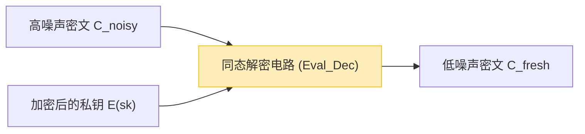

随着云计算和AI技术作为社会基础设施的普及，“数据隐私”与“数据利用”之间的权衡已成为最重要的问题之一。虽然医疗数据、金融信息和个人生物特征信息等高度机密数据在云端交由AI进行分析的需求日益增长，但出于安全考虑，不少企业仍对向外部发送数据犹豫不决。

传统的加密技术（如AES和RSA等）擅长保护存储中的数据（Data at Rest）和网络传输中的数据（Data in Transit）。然而，**当服务器端对数据进行搜索或机器学习等处理（计算）时（Data in Use），必须先解密恢复为明文**。如果在解密的这一时刻服务器遭到黑客攻击，或者内部的恶意管理员窥探数据，将直接导致信息泄露。

克服“处理时解密”这一根本弱点的梦幻技术，便是**完全同态加密（Fully Homomorphic Encryption: FHE）**。利用FHE，可以在保持数据加密且完全不解密的情况下进行计算处理，并仅将结果的密文返回给客户端。

本文将从FHE的概念、历史、Craig Gentry的突破性进展、数学基础（如Ring-LWE），到其面临的最大挑战“噪声”及其解决方案（自举，Bootstrapping），以及最新的实现库，全面深入地解析作为下一代安全核心的FHE。

---

## 1. 什么是同态加密？基本概念

“同态（Homomorphic）”是代数术语，指在具有某种结构的集合之间，能够保持运算结构不变地进行映射的性质。在密码学理论中，“同态性”指的是**明文空间中的运算与密文空间中的运算相对应**的性质。

用简单的数学公式表示，设明文 $m_1$ 和 $m_2$ 的加密函数为 $E(\cdot)$，解密函数为 $D(\cdot)$。当明文上的运算（如加法或乘法等）记为 $\circ$，密文上的运算记为 $\diamond$ 时，成立以下关系：

$$ D(E(m_1) \diamond E(m_2)) = m_1 \circ m_2 $$

也就是说，对密文 $E(m_1)$ 和 $E(m_2)$ 施加某种运算 $\diamond$ 后，将其结果解密，会与原始明文之间进行 $\circ$ 运算的结果一致。

### 云计算中的数据流

使用FHE的云处理架构与传统的完全不同。下图展示了利用FHE进行安全数据处理的流程。

```mermaid
graph TD
    A["客户端 (持有私钥)"] -->|1. 加密明文 x: E(x)| B["云服务器 (仅加密数据)"]
    B -->|2. 在密文状态下应用函数 f: E(f(x))| B
    B -->|3. 计算结果的密文 E(y)| A
    A -->|4. 使用私钥解密: y = f(x)| A
    
    style A fill:#d4edda,stroke:#28a745
    style B fill:#f8d7da,stroke:#dc3545
```

服务器虽然接收到加密后的数据 $E(x)$，但由于没有私钥，绝对无法得知数据的内容。然而，通过利用FHE的性质，可以对密文应用函数 $f$（例如机器学习的推理模型）并生成 $E(f(x))$。客户端接收到该结果后，通过自己的私钥解密，便可获得目标结果 $y = f(x)$。

---

## 2. 同态加密的发展历史：PHE, SHE, FHE

同态加密并不是一蹴而就达到现在的“完全”形态的。根据能够实现的运算类型和次数，它大致可分为三个阶段。

### Partially Homomorphic Encryption (PHE: 部分同态加密)
PHE是**仅能**无限制地进行加法或乘法其中**一种运算**的加密方式。实际上，具有这种性质的加密算法自古就已存在。

*   **RSA加密（对乘法的同态性）**
    RSA加密无意中具有乘法同态性。设明文为 $m_1, m_2$，公钥为 $(e, N)$，则：
    $$ E(m_1) = m_1^e \pmod N $$
    $$ E(m_2) = m_2^e \pmod N $$
    将它们相乘：
    $$ E(m_1) \times E(m_2) = (m_1 \cdot m_2)^e \pmod N = E(m_1 \times m_2) $$
    这样，密文之间的乘法就对应于明文的乘法。
*   **Paillier加密（对加法的同态性）**
    1999年发明的Paillier加密具有加法同态性。它已被实际应用于电子投票（汇总加密选票，仅解密最终结果）等场景中。

### Somewhat Homomorphic Encryption (SHE: 有限同态加密)
这是一种可以同时执行加法和乘法的加密方式，但可运算的**次数（电路深度）有限制**。由于后文将提到的“噪声”积累，当进行超过一定次数的乘法运算后，就会变得无法解密。2005年的BGN（Boneh-Goh-Nissim）加密等就属于此类，但在进行实际复杂的计算（如深度学习等）时存在局限性。

### Fully Homomorphic Encryption (FHE: 完全同态加密)
这是一种可以**无限制次数**地同时执行加法和乘法运算的加密方式。正如信息论中的图灵完备性一样，只要能够无限地组合加法（相当于XOR）和乘法（相当于AND），在原理上就意味着可以在保持加密状态下执行任何可计算的函数和算法。

FHE长期以来被称为“密码学界的圣杯”，甚至有人认为它是不可能实现的。然而，在2009年，当时正在斯坦福大学攻读博士学位的 **Craig Gentry** 提出了基于理想格（Ideal Lattices）的首个FHE方案，震惊了世界。

---

## 3. FHE的数学基础：LWE问题和Ring-LWE

目前主流的许多FHE方案都基于**LWE（Learning With Errors，容错学习）问题**，这是“格密码（Lattice-based Cryptography）”——也以抗量子计算机密码（Post-Quantum Cryptography）而闻名——中的一个数学难题。

### LWE问题的直观理解
使用高斯消元法等方法，求解线性方程组是很容易的。

$$ \begin{cases} 3s_1 + 4s_2 + 2s_3 \equiv 12 \pmod{17} \\ 1s_1 + 9s_2 + 5s_3 \equiv 8 \pmod{17} \\ \vdots \end{cases} $$

然而，如果在该方程组的结果中加入极微小的“随机误差（噪声）” $e$，会发生什么呢？

$$ \begin{cases} 3s_1 + 4s_2 + 2s_3 + e_1 \equiv 13 \pmod{17} \\ 1s_1 + 9s_2 + 5s_3 + e_2 \equiv 7 \pmod{17} \\ \vdots \end{cases} $$

仅仅加入这个误差 $e$，寻找秘密变量向量 $\vec{s}$ 的问题就会转变为一个即使使用现代超级计算机或量子计算机也难以破解的NP困难问题。这就是LWE问题。

### Ring-LWE问题（RLWE）
标准的LWE问题由于包含矩阵运算，存在密钥尺寸非常大（甚至可能达到千兆字节级别）且计算效率低下的问题。为了解决这一问题，引入了使用多项式环上运算的**Ring-LWE（RLWE）问题**。

在RLWE中，元素属于多项式环 $R_q = \mathbb{Z}_q[x] / (x^N + 1)$（其中 $N$ 是2的幂，$q$ 是作为模的素数）。
设私钥为多项式 $s(x)$，一个随机多项式为 $a(x)$，小噪声多项式为 $e(x)$，那么公钥就是以下对：

$$ (a(x), b(x)) \quad \text{where} \quad b(x) = -a(x) \cdot s(x) + e(x) \pmod q $$

在加密时，将利用这种多项式的性质对明文 $m(x)$ 进行编码，并生成密文。

---

## 4. 最大障碍“噪声”与Gentry的自举（Bootstrapping）

在理解FHE时，最重要的概念就是**“噪声管理”**。

在基于LWE/RLWE的密码中，为了保证安全性，会有意加入较小的“噪声（误差）”。
将明文 $m$ 的密文 $c$ 解密的过程，粗略地说，可以用以下公式表示：

$$ D(c) = (c \cdot s) \pmod q = m + \text{noise} $$

在解密时，通过舍入等操作去除这个 `noise` 即可得到正确的明文 $m$。然而，一旦在密文之间进行同态运算（尤其是乘法），这种噪声就会急剧放大。

*   **同态加法**: 噪声以加法的方式增加（$e_1 + e_2$）。这种增加相对较慢。
*   **同态加法的同态性数学表示**:
    $$ E(m_1) \oplus E(m_2) = E(m_1 + m_2) $$
*   **同态乘法**: 噪声呈爆炸性倍乘（因为它包含了 $e_1 \times e_2$ 等项）。仅仅经过几次乘法运算，噪声就会超过阈值 $q/2$，导致无法进行正确的舍入处理，从而解密失败。
*   **同态乘法的同态性数学表示**:
    $$ E(m_1) \otimes E(m_2) = E(m_1 \times m_2) $$

这就是FHE长期无法实现，只能停留在SHE（次数受限）阶段的原因。

### 自举（Bootstrapping）的魔力
Craig Gentry的天才贡献在于他发明了一种被称为**“自举（Bootstrapping）”**的降噪技术。这是密码学领域的一次范式转变。

直观上，这个操作就是“在密文充满噪声而崩溃之前，在保持加密的状态下对其进行‘解密’清理，然后重新放入一个新密文中”。

1. 假设有一个噪声变得很大的密文 $C_{noisy}$。
2. 客户端预先将使用公钥“加密后的私钥 $sk$” $E_{pk}(sk)$（称之为自举密钥）发送给服务器。
3. 服务器对 $C_{noisy}$ 执行同态的**解密电路（Decryption Circuit）**。
4. 具体来说，就是利用 $E_{pk}(sk)$ 对 $E_{pk}(C_{noisy})$ 进行“在加密空间内的解密”。
5. 尽管这个解密电路本身也是同态运算，会产生新的噪声，但其输出的新密文 $C_{fresh}$ 的噪声会被重置为一个特定的“固定水平”。



通过在计算过程中定期执行这种自举操作，理论上就可以计算无限深度的电路（实现了FHE）。然而，在Gentry最初的方案中，这种自举处理一次需要数十分钟甚至数小时，计算成本高得令人绝望。

---

## 5. FHE的世代与主要方案的演进

为了使FHE走向实用化，全世界的密码学家们竞相改进算法。如今，FHE主要可分为四个世代或家族。

### 第二代：整数的精确运算 (BGV, BFV)
这是在2011年至2012年间出现的 **BGV（Brakerski-Gentry-Vaikuntanathan）** 和 **BFV（Brakerski/Fan-Vercauteren）** 方案。它们以RLWE为基础，适合进行整数的模运算（精确计算）。
其特点是支持类似SIMD（单指令多数据）的批处理（Batching）技术，可以将数千个数据槽塞入一个巨大的多项式密文中，从而一次性进行并行计算。

### 第三代：加速自举 (GSW, FHEW, TFHE)
2013年的 **GSW（Gentry-Sahai-Waters）** 方案使FHE的结构变得更加简单。在其基础上发展而来的，便是当今的主流方案之一：**TFHE（Fast Fully Homomorphic Encryption over the Torus）**。
TFHE的特点在于其自举速度极快（毫秒级）。它擅长在门级（如AND、XOR等逻辑电路）进行运算，且密文尺寸相对较小，非常适合快速评估任意逻辑电路。

### 第四代：专注于近似计算与机器学习 (CKKS)
2017年由Cheon等人提出的 **CKKS（Cheon-Kim-Kim-Song）** 方案，可以说是当前AI与机器学习隐私保护领域的终极技术。
相较于以往的FHE固执于“精确的整数计算”，CKKS支持在加密状态下进行**“浮点数的近似计算”**。在神经网络训练或推理等允许微小误差的实数计算中，它展现出压倒性的性能优势。

下表总结了根据不同目的选择方案的方法。

| 方案名称 | 擅长的数据类型 | 推荐的使用用例 | 特点 |
| :--- | :--- | :--- | :--- |
| **BFV / BGV** | 整数 (Integer) | 精确的统计计算、金融数据汇总、数据库搜索 | 通过SIMD批处理实现高吞吐量 |
| **CKKS** | 实数 (Real/Complex) | 机器学习 (DNN, 逻辑回归)、信号处理 | 利用近似计算实现加速、重缩放 |
| **TFHE** | 布尔值 (Boolean) | 任意逻辑电路、字符串搜索、非线性函数评估 | 超高速自举（毫秒级） |

---

## 6. 实践：FHE库及概念性代码

如今，有许多开源库可供使用，即使没有深厚的密码学知识，也可以轻松利用FHE。

*   **Microsoft SEAL (Simple Encrypted Arithmetic Library)**：支持BFV、BGV和CKKS的C++库，是行业标准之一。其Python绑定版本 **TenSEAL** 在AI工程师中非常受欢迎。
*   **Zama (Concrete)**：基于TFHE的框架。可以使用Rust/Python编写，并提供了将现有的PyTorch模型编译并运行在FHE上的功能（Concrete ML）。
*   **OpenFHE**：PALISADE的继任者，支持所有主要方案的综合性C++库。

### 使用Python（TenSEAL）进行FHE编程的示例

在这里，我们展示一段使用CKKS方案，在加密状态下对实数向量进行加法和乘法运算的概念性Python代码示例。

```python
import tenseal as ts

# 1. 上下文设置 (包含密钥生成)
# 使用CKKS方案，将多项式的次数设置为8192
context = ts.context(
    ts.SCHEME_TYPE.CKKS,
    poly_modulus_degree=8192,
    coeff_mod_bit_sizes=[60, 40, 40, 60]
)
context.generate_galois_keys()
context.global_scale = 2**40 # 实数的缩放因子

# 2. 客户端：数据加密
vector1 = [1.5, 2.5, 3.5]
vector2 = [2.0, 3.0, 4.0]

# 将明文向量转换为密文 (原本应该在客户端执行)
enc_v1 = ts.ckks_vector(context, vector1)
enc_v2 = ts.ckks_vector(context, vector2)

# 3. 服务器端：在加密状态下进行运算 (保护Data in Use)
# 服务器不知道明文，但可以执行加法和乘法
enc_add = enc_v1 + enc_v2
enc_mul = enc_v1 * enc_v2

# 4. 客户端：结果解密
# 只有拥有私钥的客户端才能看到结果
res_add = enc_add.decrypt()
res_mul = enc_mul.decrypt()

print(f"解密后的加法结果: {res_add}")
# 输出示例: [3.5000001, 5.5000001, 7.5000002] (因为是近似计算，会包含微小误差)

print(f"解密后的乘法结果: {res_mul}")
# 输出示例: [3.0000002, 7.5000005, 14.0000003]
```

正如上述代码所示，可以通过像 `enc_v1 + enc_v2` 这样重载常规Python运算符，直观地编写密文之间的计算。在服务器端，它可以在完全不知道向量内容的情况下完成向量运算。

---

## 7. FHE的挑战：性能与硬件加速

FHE在理论上提供了完美的安全性，但其实用化面临的最大挑战是**“性能开销”**。

1.  **计算开销**：与明文计算相比，密文计算在CPU上的速度要慢几千倍甚至几万倍。多项式的乘法以及自举过程都需要进行大量的FFT（快速傅里叶变换）或NTT（数论变换）计算。
2.  **数据大小膨胀 (Ciphertext Expansion)**：只需几个字节的明文，加密后就可能变成数兆字节。这会严重挤占内存带宽和网络带宽。

### 硬件解决方案的探索
为了克服这一开销，世界各地正在研发FHE专用的硬件加速器（支持ASIC、FPGA、GPU等）。

*   **GPU加速**：正在利用NVIDIA等强大的GPU，对NTT运算和自举进行并行化的尝试。据报道，其速度相比纯软件实现提升了数十倍（例如：100x.ai，Zama的TFHE-rs CUDA backend）。
*   **DARPA DPRIVE 项目**：美国国防高级研究计划局（DARPA）正在推进旨在将FHE的计算速度提升至与明文处理执行速度同等水平（开销控制在10倍以内）的专用硬件开发项目“DPRIVE (Data Protection in Virtual Environments)”，Intel、Microsoft、Intellectual Ventures等公司均有参与。
*   **FPU (FHE Processing Unit) 的出现**：Cornami、Optalysys等初创公司正着手研发使用光计算或特殊硅架构的FHE专用芯片。

在不久的将来，也许会迎来如同AI领域中NPU（Neural Processing Unit）一般，服务器或云基础设施标配“FPU”的时代。

---

## 8. 期待的应用用例

随着FHE逐渐达到实用的速度，它有望在以下领域带来颠覆性的创新。

1.  **医疗与基因组分析的隐私保护**：
    通过对多家医院拥有的患者病历数据和DNA数据使用FHE加密，并在云端交由AI进行训练，可以在不违反隐私法规（如HIPAA和GDPR）的前提下，开展高精度的癌症诊断模型或新药研发。
2.  **金融机构的欺诈检测与反洗钱 (AML)**：
    相互竞争的银行之间无需透露客户的账户信息或交易记录，即可在加密状态下比对彼此的数据，从而实现跨行分析，以检测庞大的非法汇款网络。
3.  **安全的AI推理API (MaaS: Model as a Service)**：
    用户可以将自己的声音、面部图像或提示词加密后发送给AI服务（如ChatGPT等LLM）。AI提供商在完全不知道用户输入内容的情况下生成回答，并以密文形式返回。这将完全消除“AI会学习/窥探个人信息”的担忧。

---

## 9. 结论：密码学的未来走向“不可见计算”

正如20世纪70年代公钥加密（RSA）的发明使得互联网上的安全通信（如HTTPS）成为可能一样，Craig Gentry发明的FHE是密码学历史上最重要的里程碑之一。

如今，完全同态加密（FHE）已经走出实验室理论的范畴，进入了由Microsoft、IBM、Intel、Google以及众多初创企业为了实用化而展开激烈竞争的阶段。尽管仍面临计算成本和数据大小等挑战，但得益于算法的精进和硬件加速器的演进，其性能正以超越摩尔定律的速度持续提升。

在几年后，“对加密数据进行计算”将不再是一件特别的事情，而将成为云服务中标准数据保护的最佳实践。在数据驱动型社会中，FHE能够实现**极致隐私保护与数据充分利用的完美结合**，它无疑是下一代安全的核心。
