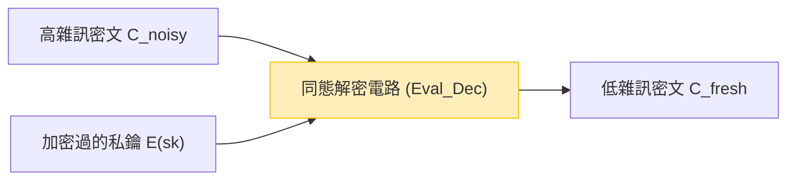

隨著雲端運算和 AI 技術逐漸成為社會的基礎，『資料隱私』與『資料活用』之間的權衡，已成為最重要的課題之一。越來越多的需求希望能在雲端上讓 AI 分析醫療數據、金融資訊、個人生物特徵等高機密性資料，但由於資安上的疑慮，許多企業對於將資料外傳感到猶豫。

傳統的加密技術（如 AES 或 RSA 等）非常擅長保護儲存中的資料（Data at Rest）以及在網路上傳輸的資料（Data in Transit）。然而，當伺服器端要對資料進行搜尋或機器學習等**處理（計算）時（Data in Use），就必須先進行解密，將其還原為明文**。如果在解密的這段期間伺服器遭到駭客攻擊，或是內部的惡意管理者偷窺資料，將直接導致資訊外洩。

為了克服這種「處理時必須解密」的根本性弱點，有一項夢幻技術應運而生，那就是**完全同態加密（Fully Homomorphic Encryption: FHE）**。只要使用 FHE，就能在維持資料加密的狀態下進行運算處理，而完全不需要解密，並且僅將計算結果的密文回傳給客戶端。

本文將從 FHE 的概念與歷史、Craig Gentry 帶來的突破性進展、數學基礎（如 Ring-LWE 等）、其面臨的最大課題「雜訊」與解決方案（自舉，Bootstrapping），一路探討到最新的實作函式庫，為您深入且徹底地解析這項次世代資安的核心技術：FHE。

---

## 1. 什麼是同態加密？基本概念

「同態（Homomorphic）」是代數學的術語，指在具有某種結構的集合之間，能夠在保持運算結構的情況下進行映射的性質。在密碼學理論中的「同態性」，則是指**在明文空間中的運算，可以對應到密文空間中的運算**。

用簡單的數學式來表示，假設對明文 $m_1$ 與 $m_2$ 的加密函數為 $E(\cdot)$，解密函數為 $D(\cdot)$。當明文上的運算（如加法或乘法等）為 $\circ$，而密文上的運算為 $\diamond$ 時，會成立以下關係：

$$ D(E(m_1) \diamond E(m_2)) = m_1 \circ m_2 $$

也就是說，對密文 $E(m_1)$ 與 $E(m_2)$ 施以某種運算 $\diamond$ 後，將其結果解密，會與原本明文之間進行運算 $\circ$ 的結果完全一致。

### 雲端運算中的資料流程

使用 FHE 的雲端運算架構與傳統架構截然不同。下圖展示了運用 FHE 的安全資料處理流程。

```mermaid
graph TD
    A["客戶端（持有私鑰）"] -->|1. 將明文 x 加密: E(x)| B["雲端伺服器（僅有加密資料）"]
    B -->|2. 在密文狀態下套用函數 f: E(f(x))| B
    B -->|3. 計算結果的密文 E(y)| A
    A -->|4. 使用私鑰解密: y = f(x)| A
    
    style A fill:#d4edda,stroke:#28a745
    style B fill:#f8d7da,stroke:#dc3545
```

伺服器雖然接收了加密過後的資料 $E(x)$，但因為沒有私鑰，所以絕對無法知道資料的內容。然而，藉由利用 FHE 的性質，可以直接對密文套用函數 $f$（例如機器學習的推論模型），從而產生 $E(f(x))$。客戶端收到此結果後，使用自己的私鑰進行解密，即可獲得最終目標的結果 $y = f(x)$。

---

## 2. 同態加密的進化歷史：PHE, SHE, FHE

同態加密並非一開始就達到了現在的「完全」型態。根據所能實現的運算種類與次數，它大致可分為三個階段。

### Partially Homomorphic Encryption (PHE: 部分同態加密)
PHE 是一種只能無限制地執行加法或乘法中**其中一種**的加密方式。事實上，具備這種性質的加密技術自古便已存在。

*   **RSA 加密（對乘法的同態性）**
    RSA 加密在無意中具備了對乘法的同態性。若明文為 $m_1, m_2$，公鑰為 $(e, N)$：
    $$ E(m_1) = m_1^e \pmod N $$
    $$ E(m_2) = m_2^e \pmod N $$
    將它們相乘可得：
    $$ E(m_1) \times E(m_2) = (m_1 \cdot m_2)^e \pmod N = E(m_1 \times m_2) $$
    像這樣，密文之間的相乘就對應到明文的相乘。
*   **Paillier 加密（對加法的同態性）**
    於 1999 年發明的 Paillier 加密具備了對加法的同態性。它已被實際應用於電子投票（對加密的選票進行計票，最後只解密總結果）等領域。

### Somewhat Homomorphic Encryption (SHE: 淺度同態加密 / 具界同態加密)
雖然可以同時執行加法與乘法，但對於能運算的**次數（電路深度）有其限制**的加密方式。由於後述的「雜訊」累積問題，只要乘法超過一定的次數，就會變得無法解密。2005 年的 BGN (Boneh-Goh-Nissim) 加密等皆屬此類，但要用來進行實用的複雜計算（如深度學習等）仍有極限。

### Fully Homomorphic Encryption (FHE: 完全同態加密)
這是一種能夠**無限制次數**地同時執行加法與乘法的加密方式。就像資訊理論中的圖靈完備性一樣，只要能無限次組合加法（相當於 XOR）與乘法（相當於 AND），就意味著原則上任何可計算的函數或演算法，都能在加密狀態下執行。

FHE 長期以來被譽為「密碼學界的聖杯」，甚至曾被認為是不可能實現的。然而在 2009 年，當時還在史丹佛大學攻讀博士的 **Craig Gentry**，提出了首個基於理想格（Ideal Lattices）的 FHE 方案，震驚了全世界。

---

## 3. FHE 的數學基礎：LWE 問題與 Ring-LWE

目前主流的 FHE 方案中，有許多都是建構在「格密碼學（Lattice-based Cryptography）」（亦被稱為後量子密碼學，Post-Quantum Cryptography）中的一項數學難題上，也就是 **LWE (Learning With Errors) 問題**。

### LWE 問題的直觀理解
只要使用高斯消去法等方法，解聯立一次方程式非常簡單。

$$ \begin{cases} 3s_1 + 4s_2 + 2s_3 \equiv 12 \pmod{17} \\ 1s_1 + 9s_2 + 5s_3 \equiv 8 \pmod{17} \\ \vdots \end{cases} $$

然而，如果在這個方程式的結果中，加入極微小的「隨機誤差（雜訊）」$e$ 會發生什麼事呢？

$$ \begin{cases} 3s_1 + 4s_2 + 2s_3 + e_1 \equiv 13 \pmod{17} \\ 1s_1 + 9s_2 + 5s_3 + e_2 \equiv 7 \pmod{17} \\ \vdots \end{cases} $$

只要加上這個誤差 $e$，要找出未知變數向量 $\vec{s}$ 的問題，就會變成即使使用現今的超級電腦或量子電腦都難以破解的 NP 困難問題。這就是 LWE 問題。

### Ring-LWE 問題（RLWE）
標準的 LWE 問題因為包含矩陣運算，所以密鑰的容量非常大（甚至可能達到 Gigabyte 等級），並且有計算效率低落的問題。為了解決這個問題，於是導入了使用多項式環上運算的 **Ring-LWE (RLWE) 問題**。

在 RLWE 中，元素屬於多項式環 $R_q = \mathbb{Z}_q[x] / (x^N + 1)$（其中 $N$ 為 2 的冪次方，$q$ 為做為模數的質數）。
若將私鑰設為多項式 $s(x)$，並有隨機多項式 $a(x)$、微小的雜訊多項式 $e(x)$，則公鑰將會是以下的數對：

$$ (a(x), b(x)) \quad \text{where} \quad b(x) = -a(x) \cdot s(x) + e(x) \pmod q $$

加密時，會利用這個多項式的性質來將明文 $m(x)$ 進行編碼，進而產生密文。

---

## 4. 最大的障礙「雜訊」與 Gentry 的自舉（Bootstrapping）

在理解 FHE 時，最重要的概念就是**「雜訊的管理」**。

在基於 LWE/RLWE 的加密演算法中，為了確保安全性，會刻意加入微小的「雜訊（誤差）」。
將明文 $m$ 的密文 $c$ 解密的過程，粗略來說可以用以下數學式表示。

$$ D(c) = (c \cdot s) \pmod q = m + \text{noise} $$

解密時，可以透過捨入（rounding）等處理來消除這個 `noise`，從而獲得正確的明文 $m$。然而，當我們在密文之間進行同態運算（特別是乘法）時，這個雜訊將會急遽放大。

*   **同態加法**: 雜訊是以相加的方式增加（$e_1 + e_2$）。這種增長相對來說比較平緩。
*   **用同態加法來表示的同態性數學式**:
    $$ E(m_1) \oplus E(m_2) = E(m_1 + m_2) $$
*   **同態乘法**: 雜訊會呈乘法級數爆發增長（因為包含了 $e_1 \times e_2$ 等）。只要進行幾次乘法，雜訊就會超過臨界值 $q/2$，導致無法進行正確的捨入處理而解密失敗。
*   **用同態乘法來表示的同態性數學式**:
    $$ E(m_1) \otimes E(m_2) = E(m_1 \times m_2) $$

這就是為何長久以來 FHE 都無法實現，只能停留在 SHE（限制次數）的原因。

### 自舉（Bootstrapping）的魔法
Craig Gentry 天才般的貢獻，就是發明了被稱為**「自舉（Bootstrapping）」**的雜訊消除手法。這是密碼學界的一次典範轉移。

直觀來說，這個操作就是「在密文因為充滿雜訊而損壞之前，在保持加密的狀態下進行『解密』以清理雜訊，然後重新放入新的密文之中」。

1. 假設有一個雜訊變得很大的密文 $C_{noisy}$。
2. 客戶端會將私鑰 $sk$ 事先「用公鑰加密」成 $E_{pk}(sk)$（這稱為 Bootstrapping key，自舉密鑰），並交給伺服器。
3. 伺服器針對 $C_{noisy}$，以同態的方式執行**解密電路（Decryption Circuit）**。
4. 具體來說，就是針對 $E_{pk}(C_{noisy})$ 使用 $E_{pk}(sk)$ 來進行「在加密空間內的解密」。
5. 由於這個解密電路本身也是同態運算，因此會產生新的雜訊，但所輸出之新密文 $C_{fresh}$ 的雜訊，將被重設到一個固定的「恆定水準」。



只要在計算過程中定期執行這種自舉操作，理論上就能計算無限深度的電路（達成 FHE）。然而，早期 Gentry 的方法，每次自舉處理都需要花費數十分鐘甚至數小時，計算成本高得令人絕望。

---

## 5. FHE 的世代與主要方案的進化

為了讓 FHE 得以實用化，世界各地的密碼學者爭相改良演算法。現在，FHE 主要分為四個世代或家族。

### 第 2 世代：整數的精確運算 (BGV, BFV)
於 2011 到 2012 年間登場的 **BGV (Brakerski-Gentry-Vaikuntanathan)** 與 **BFV (Brakerski/Fan-Vercauteren)** 方案。這些方案建立在 RLWE 的基礎上，非常適合整數的模數運算（精確計算）。
它們支援類似 SIMD (Single Instruction, Multiple Data) 的批次處理（Batching）技術，其特色是可以在一個巨大的多項式密文當中，塞入數千個資料槽，並一次進行平行運算。

### 第 3 世代：自舉的加速化 (GSW, FHEW, TFHE)
2013 年的 **GSW (Gentry-Sahai-Waters)** 方案簡化了 FHE 的結構。而將其進一步發展的，便是目前的主流之一 **TFHE (Fast Fully Homomorphic Encryption over the Torus)**。
TFHE 的特色在於其自舉速度非常快（達毫秒等級）。它在邏輯閘層級（如 AND、XOR 等邏輯電路）的運算上非常強大，且密文的容量相對較小，因此適合用來高速評估任意的邏輯電路。

### 第 4 世代：專精於近似計算與機器學習 (CKKS)
2017 年由 Cheon 等人所提出的 **CKKS (Cheon-Kim-Kim-Song)** 方案，可說是目前 AI 與機器學習隱私保護領域的決定性技術。
相較於過去的 FHE 執著於「精確的整數計算」，CKKS 則支援在加密狀態下進行**「浮點數的近似計算」**。在神經網路的訓練或推論等容許微小誤差的實數計算上，它展現了壓倒性的效能。

下表總結了如何根據不同目的來選擇方案。

| 方案名稱 | 擅長的資料型態 | 推薦的應用場景 | 特色 |
| :--- | :--- | :--- | :--- |
| **BFV / BGV** | 整數 (Integer) | 精確的統計計算、金融資料彙總、資料庫搜尋 | 藉由 SIMD 批次處理實現高吞吐量 |
| **CKKS** | 實數 (Real/Complex) | 機器學習 (DNN、邏輯迴歸)、訊號處理 | 透過近似計算提升速度、重新縮放 (Rescaling) |
| **TFHE** | 布林值 (Boolean) | 任意邏輯電路、字串搜尋、非線性函數評估 | 超高速的自舉（毫秒級別） |

---

## 6. 實踐：FHE 函式庫與概念性程式碼

時至今日，已經有許多開源函式庫釋出，讓開發者不需要具備深厚的密碼學知識也能使用 FHE。

*   **Microsoft SEAL (Simple Encrypted Arithmetic Library)**: 支援 BFV、BGV、CKKS 的 C++ 函式庫，也是業界標準之一。其 Python 綁定版 **TenSEAL** 在 AI 工程師之間廣受歡迎。
*   **Zama (Concrete)**: 基於 TFHE 的框架。可用 Rust/Python 編寫，並提供將現有的 PyTorch 模型編譯為在 FHE 上執行的功能（Concrete ML）。
*   **OpenFHE**: PALISADE 的後繼者，是一個支援所有主要方案的全面性 C++ 函式庫。

### 使用 Python (TenSEAL) 的 FHE 程式設計範例

這裡我們展示一段概念性的 Python 程式碼範例，它使用 CKKS 方案，在加密狀態下將實數向量相加與相乘。

```python
import tenseal as ts

# 1. 建立上下文 (包含金鑰生成)
# 使用 CKKS 方案，並設定多項式的次數為 8192
context = ts.context(
    ts.SCHEME_TYPE.CKKS,
    poly_modulus_degree=8192,
    coeff_mod_bit_sizes=[60, 40, 40, 60]
)
context.generate_galois_keys()
context.global_scale = 2**40 # 實數的縮放係數

# 2. 客戶端：將資料加密
vector1 = [1.5, 2.5, 3.5]
vector2 = [2.0, 3.0, 4.0]

# 將明文向量轉換為密文 (實際上這會在客戶端執行)
enc_v1 = ts.ckks_vector(context, vector1)
enc_v2 = ts.ckks_vector(context, vector2)

# 3. 伺服器端：在維持加密的狀態下運算 (保護 Data in Use)
# 伺服器並不知道明文為何，但可以執行加法與乘法
enc_add = enc_v1 + enc_v2
enc_mul = enc_v1 * enc_v2

# 4. 客戶端：解密結果
# 只有擁有私鑰的客戶端能看到結果
res_add = enc_add.decrypt()
res_mul = enc_mul.decrypt()

print(f"解密後的加法結果: {res_add}")
# 輸出範例: [3.5000001, 5.5000001, 7.5000002] (因為是近似計算，所以會包含微小誤差)

print(f"解密後的乘法結果: {res_mul}")
# 輸出範例: [3.0000002, 7.5000005, 14.0000003]
```

從上述的程式碼可以看出，我們能夠像 `enc_v1 + enc_v2` 這樣，透過多載 (overload) 一般的 Python 運算子，直觀地撰寫密文之間的計算。而在伺服器端，不需要知道向量的內容也能完成向量運算。

---

## 7. FHE 的課題：效能與硬體加速

雖然 FHE 在理論上提供了完美的安全性，但實用化上的最大課題在於**「效能的負擔（Overhead）」**。

1.  **計算的負擔**: 與在明文下計算相比，密文下的計算在 CPU 上會慢了數千到數萬倍。多項式的乘法或自舉需要進行龐大的 FFT（快速傅立葉轉換）或 NTT（數論轉換）計算。
2.  **資料容量膨脹 (Ciphertext Expansion)**: 只有幾個位元組的明文，在加密後可能會變成幾十 MB。這會對記憶體頻寬與網路頻寬造成巨大的壓力。

### 透過硬體解決的方法
為克服這種效能負擔，世界各地正積極開發專門針對 FHE 的硬體加速器（支援 ASIC、FPGA、GPU）。

*   **GPU 加速**: 使用 NVIDIA 等強大的 GPU，以平行化處理 NTT 運算或自舉的技術正持續發展，已有報告指出比軟體實作快上數十倍（例如：100x.ai、Zama 的 TFHE-rs CUDA backend）。
*   **DARPA DPRIVE 專案**: 美國國防高等研究計劃署（DARPA）正在推動名為「DPRIVE (Data Protection in Virtual Environments)」的專屬硬體開發專案，目標是將 FHE 的計算速度提升至與明文處理相同的等級（負擔在 10 倍以內），參與者包括 Intel、Microsoft、Intellectual Ventures 等。
*   **FPU (FHE Processing Unit) 的出現**: Cornami 與 Optalysys 等新創公司，已經開始著手開發運用光學運算或特殊矽架構的 FHE 專用晶片。

或許在不久的將來，會像現在 AI 領域中的 NPU（神經網路處理器）一樣，迎來伺服器或雲端基礎架構將「FPU」列為標準配備的時代。

---

## 8. 備受期待的應用場景

隨著 FHE 逐漸達到具備實用性的速度，人們也期待它能在以下領域帶來破壞式的創新。

1.  **醫療與基因解析的隱私保護**:
    在不違反隱私法規（如 HIPAA 或 GDPR）的情況下，能將多家醫院所擁有的病患病歷或 DNA 資料，在以 FHE 加密的狀態下交由雲端 AI 進行訓練，藉此建立出高準確度的癌症診斷模型或進行新藥開發。
2.  **金融機構的防詐欺與洗錢防制 (AML)**:
    互相競爭的銀行之間，可以在不公開客戶帳戶資訊或交易紀錄的情況下，以加密狀態比對彼此的資料，進行跨銀行的分析以偵測出龐大的非法匯款網路。
3.  **安全的 AI 推論 API (MaaS: Model as a Service)**:
    使用者可以將自己的聲音、臉部影像或提示詞加密後，再傳送給 AI 服務（如 ChatGPT 等 LLM）。AI 提供商能在完全不知道使用者輸入內容的情況下生成回答，並以密文形式傳回。這將徹底消除人們對於「個人資料會被 AI 學習或偷窺」的疑慮。

---

## 9. 結論：密碼學的未來將邁向「看不見的計算」

就像 1970 年代發明了公開金鑰加密（RSA）後，網際網路上的安全通訊（如 HTTPS 等）才得以實現一樣，Craig Gentry 發明 FHE 的創舉，同樣是密碼學歷史上最重要的里程碑之一。

現在，完全同態加密（FHE）已走出實驗室的理論階段，並進入 Microsoft、IBM、Intel、Google 以及許多新創公司為了商業化而激烈競爭的階段。儘管計算成本與資料容量的課題依然存在，但隨著演算法的精進與硬體加速器的發展，其效能正以超越摩爾定律的速度持續提升中。

幾年之後，「將資料加密並維持該狀態進行計算」將不再是什麼特別的事情，而是會成為雲端服務中保護資料的標準最佳實踐。FHE 正是在數據驅動的社會中，能夠實現**極致隱私與資料活用兼得**的次世代資安核心技術。
