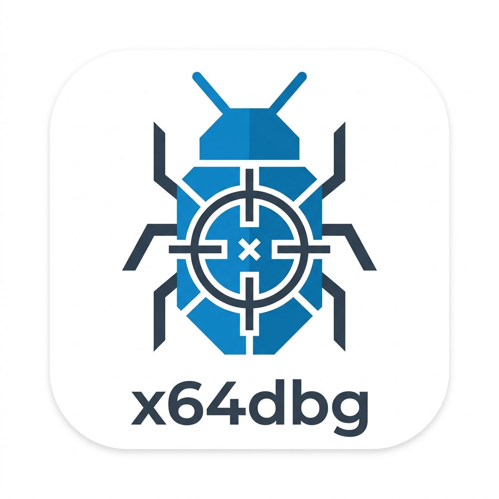

# What is an Executable File (exe)

A file that can be executed on Windows. Basically, it is written in a format called PE format.
It contains machine code to execute, as well as resources such as icons and images.

Since there are several tools to analyze executable files, I will introduce them here.

## 7-Zip

EXE files are sometimes compressed because their size tends to be large otherwise. In this case, by using the file compression and decompression software 7-Zip, you can extract the executable file and examine its contents. WinRAR is another tool that can extract them similarly.

## Resource Hacker

It allows you to extract resources (icons, bitmaps, dialog boxes, strings, etc.) inside an EXE file. Additionally, since it functions as a binary editor, you can edit and rewrite the contents of an EXE file.

## PE Explorer

It can analyze PE files (EXE, DLL, OCX, SYS, drivers) for Windows. PE Explorer provides various analysis features, such as displaying the file structure, file headers, directory entries, and exported functions and symbols.

## Dependency Walker

You can investigate the DLL files that an EXE file depends on and verify whether they are loaded correctly. You can also trace the function calls of DLL files.

## Ghidra

This is a powerful reverse engineering tool developed by the NSA (National Security Agency) and released for free as open source. It is highly popular because it not only disassembles EXE files (converts them to assembly language) but also has decompilation capabilities to convert them into a form close to C language.

## IDA Free / IDA Pro

These are high-performance disassemblers and decompilers that have become a global industry standard in malware analysis and reverse engineering. The Pro version is very expensive, but you can use the functionally restricted version "IDA Free" for free for personal or non-commercial purposes.

## x64dbg (x32dbg)

An open source debugger for Windows. It specializes in "dynamic analysis," which involves analyzing the internal state and memory step-by-step while running the executable file. It is commonly used for solving crackmes (challenge programs for analysis) and investigating malware behavior.

## ILSpy / dotPeek

If the target EXE file is created in a .NET language such as C#, using these tools allows you to decompile (reverse compile) it into almost the exact same state as the original source code, completely exposing its contents.

These tools are useful for examining the contents of EXE files, but caution is required. Modifying files or using them for unauthorized purposes can cause copyright and security issues, so please ensure you fully understand this before using them.
