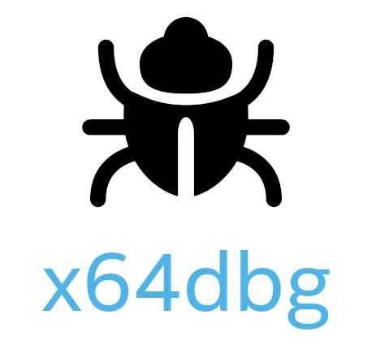

---
title: '4 ferramentas úteis que podem analisar e extrair o conteúdo de arquivos executáveis (exe) do Windows'
slug: "実行ファイル（exe）の中身を解析するツール"
date: 2023-04-05T23:31:06+09:00
tags: ["windows", "exe", "arquivo executável", "análise"]
draft: false
image: "img_1.webp"
categories: ["PC e Gadgets"]
description: 'Apresentamos ferramentas recomendadas capazes de analisar e extrair arquivos executáveis (exe) do Windows. Explicaremos de forma fácil de entender como verificar a estrutura do formato PE, extrair recursos e editar binários usando o 7-Zip, Resource Hacker, etc.'
---

# O que é um arquivo executável (exe)

Um arquivo que pode ser executado no Windows. Basicamente, ele é escrito em um formato chamado formato PE.
Ele contém o código de linguagem de máquina para execução e recursos como ícones e imagens.

Existem várias ferramentas para analisar arquivos executáveis, e nós as apresentaremos desta vez.

## 7-Zip

Como os arquivos EXE tendem a ser grandes, eles podem ser criados por compactação de arquivo. Nesse caso, ao usar o 7-Zip, um software de compactação e descompactação de arquivos, você pode extrair o arquivo executável e examinar seu conteúdo. Também existe uma ferramenta chamada WinRAR que pode ser extraída da mesma maneira.

## Resource Hacker

Você pode extrair recursos (ícones, bitmaps, caixas de diálogo, strings, etc.) em um arquivo EXE. Ele também funciona como um editor hexadecimal, portanto, você pode editar e reescrever o conteúdo do arquivo EXE.

## PE Explorer

Você pode analisar arquivos PE (EXE, DLL, OCX, SYS, drivers) para Windows. O PE Explorer oferece vários recursos de análise, como visualização da estrutura do arquivo, visualização do cabeçalho do arquivo, visualização das entradas do diretório e visualização das funções e símbolos exportados.

## Dependency Walker

Você pode descobrir de quais arquivos DLL o arquivo EXE depende e verificar se eles foram carregados corretamente. Você também pode rastrear chamadas de função de arquivos DLL.

## Ghidra

É uma poderosa ferramenta de engenharia reversa desenvolvida pela NSA (Agência de Segurança Nacional dos EUA) e lançada gratuitamente como código aberto. É muito popular porque não só desmonta arquivos EXE (os converte para linguagem assembly), mas também tem uma função de descompilação para um formato próximo à linguagem C.

## IDA Free / IDA Pro

É um desmontador e descompilador de alto desempenho que se tornou o padrão global da indústria em análise de malware e engenharia reversa. A versão Pro é muito cara, mas se for para uso pessoal ou não comercial, você pode usar a versão de função limitada "IDA Free" gratuitamente.

## x64dbg (x32dbg)

É um depurador de código aberto para Windows. Ele é especializado em "análise dinâmica", onde o conteúdo e o estado da memória são analisados passo a passo enquanto o arquivo executável é executado, e é frequentemente usado para decifrar crackmes (programas de desafio para análise) e investigar o comportamento de malware.

## ILSpy / dotPeek

Se o arquivo EXE alvo for criado em uma linguagem .NET como C#, usando essas ferramentas, você pode descompilar o arquivo para um estado quase idêntico ao código-fonte original e ver o que está dentro.

Essas ferramentas são úteis para descobrir o que está dentro de um arquivo EXE, mas você precisa ter cuidado. Editar o arquivo ou usá-lo para fins maliciosos pode causar problemas de direitos autorais ou de segurança, portanto, certifique-se de entender isso completamente antes de usá-las.
