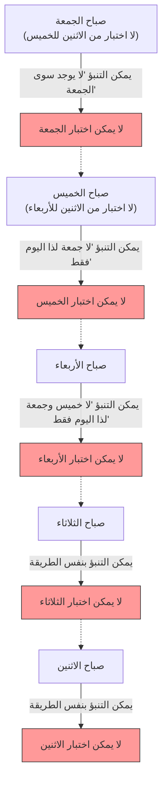

## 1. "الإعلان المطلق" للمعلم

في طريق العودة إلى المنزل يوم جمعة، أصدر معلم الرياضيات إعلانًا مرعبًا لطلابه.

**"في الأسبوع القادم، في أي يوم من الاثنين إلى الجمعة، سأجري 'اختبارًا مفاجئًا' لمرة واحدة فقط.**
**ومع ذلك، إذا تمكنتم من التنبؤ بشكل مؤكد في صباح ذلك اليوم بأن 'اليوم هو يوم الاختبار'، فلن يكون ذلك مفاجئًا، ولن أقوم بإجراء الاختبار في ذلك اليوم."**

عند سماع هذا الإعلان، ارتعد الطلاب خوفًا. كان عليهم أن يقضوا كل يوم في قلق، متسائلين متى سيتم الاختبار.
ولكن، الطالب A، أذكى طالب في الفصل، وقف فجأة وابتسم ابتسامة عريضة.

"لا تقلقوا يا رفاق. **من المستحيل تمامًا أن يكون هناك اختبار مفاجئ الأسبوع القادم. إنه مستحيل منطقيًا!**"

بدأ الطالب A بكتابة "منطقه المثالي" بثقة تامة على السبورة.

---

## 2. الإثبات بواسطة "المنطق المثالي" للطالب A

يستخدم إثبات الطالب A تقنية رياضية تُعرف بـ **التفكير بالعودة بالزمن إلى الوراء بدءًا من "يوم الجمعة" (الاستدلال التراجعي)**.

### الخطوة 1: استبعاد احتمالية يوم الجمعة
> لنفترض أنه لم يتم إجراء أي اختبار طوال الأيام الأربعة: الاثنين، الثلاثاء، الأربعاء، والخميس.
> إذن، اليوم الوحيد المتبقي هو "الجمعة".
> في صباح يوم الجمعة، سيتمكن الطلاب من **التنبؤ بشكل مؤكد** قائلين: "بما أن اليوم هو الوحيد المتبقي، فمن المؤكد أن الاختبار سيكون اليوم!".
> ووفقًا لإعلان المعلم، "لن يتم إجراء الاختبار في اليوم الذي يمكن التنبؤ به"، لذا فإنه من المستحيل منطقيًا إجراء اختبار مفاجئ يوم الجمعة.
> **لذلك، لن يكون هناك اختبار يوم الجمعة مطلقًا.**

### الخطوة 2: استبعاد احتمالية يوم الخميس
> لقد تأكدنا من عدم وجود اختبار يوم الجمعة.
> وهذا يعني أن اليوم الأخير الذي يمكن فيه إجراء الاختبار هو "الخميس".
> لنفترض أنه لم يتم إجراء الاختبار في الأيام الثلاثة: الاثنين، الثلاثاء، والأربعاء.
> إذن، الاحتمال الوحيد المتبقي هو الخميس (تم استبعاد الجمعة بالفعل).
> في صباح يوم الخميس، سيتمكن الطلاب من التنبؤ بشكل مؤكد قائلين: "الاختبار سيكون اليوم!".
> **لذلك، لن يكون هناك اختبار يوم الخميس مطلقًا.**

### الخطوة 3: استبعاد جميع الأيام
> ما عليك سوى تكرار نفس المنطق.
> إذا لم يكن الخميس، فإن اليوم الأخير سيكون الأربعاء. لذلك، إذا لم يكن هناك اختبار حتى يوم الثلاثاء، فيمكن التنبؤ به في صباح يوم الأربعاء، وبالتالي يتم استبعاد الأربعاء أيضًا.
> إذا تم استبعاد الأربعاء، سيتم استبعاد الثلاثاء، وسيتم استبعاد الاثنين أيضًا.
> **الخلاصة: طالما تم الالتزام بقاعدة المعلم، فمن المستحيل تمامًا إجراء اختبار مفاجئ في أي يوم من الاثنين إلى الجمعة!**

فرح طلاب الفصل. بدا منطق الطالب A مثاليًا، ولم تكن فيه أية ثغرات.
لقد استمتعوا بعطلة نهاية الأسبوع في اللعب والمرح، واستقبلوا يوم الاثنين دون أن يدرسوا للاختبار على الإطلاق.

يوم الاثنين... لم يكن هناك اختبار. "أرأيتم!"
يوم الثلاثاء... لم يكن هناك اختبار. "الطالب A كان محقًا!"

ثم جاء **صباح الأربعاء**.
فُتح باب الفصل فجأة، ودخل المعلم قائلًا:

**"حسنًا، أخلوا مكاتبكم. سنبدأ الآن اختبارًا مفاجئًا!"**

أصيب الطلاب بالذعر.
"مـ، لماذا!؟ وجود اختبار يوم الأربعاء، **لم نكن نتوقعه على الإطلاق!**"

ابتسم المعلم ابتسامة عريضة.
**"أرأيتم، لم تتمكنوا من التنبؤ به، أليس كذلك؟ 'إعلاني' كان صحيحًا تمامًا، ووفقًا للقواعد، تم إجراء الاختبار المفاجئ بنجاح."**

---

## 3. أين كان الخطأ المنطقي بالضبط؟

على الرغم من أن إثبات الطالب A بدا مثاليًا، لماذا أصبح "الاختبار المفاجئ الكامل" حقيقة واقعة؟
هذه المشكلة كانت تُعرف في الأصل باسم "مفارقة الشنق المفاجئ" (Unexpected hanging paradox)، ومنذ أن ابتكرها عالم الرياضيات السويدي لينارت إكبوهم في الأربعينيات من القرن الماضي، لا تزال تحير الفلاسفة وعلماء المنطق.

في الواقع، لا يوجد حتى الآن رأي موحد يعتبر "الحل الصحيح والوحيد" لهذه المفارقة. ومع ذلك، هناك العديد من المقاربات القوية لحلها.

### المقاربة 1: "مفارقة المعرفة (نظرية المعرفة)"
أكبر فخ في استنتاج الطالب A هو أنه **أدرج الافتراض بأن "إعلان المعلم صحيح بنسبة 100%" في توقعاته الخاصة**.

يتكون إعلان المعلم من شرطين: "إجراء اختبار الأسبوع القادم (P)" و"عدم إجرائه في اليوم الذي يمكن التنبؤ به (Q)".
إذا لم يكن هناك اختبار حتى يوم الجمعة، سيفكر الطالب: "إذا كان الإعلان صحيحًا، فيجب أن يكون الاختبار اليوم"، ولكن في نفس الوقت يُطرح شك: "إذا تمكنت من التنبؤ بأنه اليوم، فهذا يتعارض مع الشرط Q من الإعلان. إذن، ألم يكن الإعلان P (بإجراء الاختبار) كذبة في المقام الأول؟".

نتيجة الصدام بين الاعتقاد بأن "كلام المعلم صحيح تمامًا" و"الاستنتاج المنطقي"، وصل الطلاب إلى استنتاج (اعتقاد) خاطئ بأن "المعلم لن يجري الاختبار"، ونتيجة لذلك، في أي وقت يُقدم فيه الاختبار، يصبح في حالة "غير متوقعة (مفاجئة)".

### المقاربة 2: "مفارقة المرجعية الذاتية"
دعونا نحول كلمات المعلم إلى صيغة منطقية.
لنفترض أن ادعاء المعلم هو $S$.
$S = $ "سأجري اختبارًا في يوم معين $T$. وفي نفس الوقت، لا يمكنكم التنبؤ بذلك اليوم $T$."

هذا الادعاء يمتلك **"بنية مرجعية ذاتية"** حيث يتغير صدقه أو كذبه بناءً على كيفية تلقي الطلاب للادعاء نفسه (الإعلان). تمامًا مثل "مفارقة الكذاب" ('هذه الجملة كاذبة')، فإن له خاصية التسبب في حلقة مفرغة لا نهائية من الاستدلال المنطقي.

---

## 4. "الاختبارات المفاجئة" الكامنة في الحياة اليومية

هذه المفارقة لا تُطبق في الرياضيات فحسب، بل في حياتنا اليومية أيضًا.

**【معضلة الحفلة المفاجئة】**
> لنفترض أن صديقًا لك أعلن: "هذا الشهر، سأقيم لك حفلة مفاجئة بمناسبة عيد ميلادك!".
> عند سماعك لهذا، ستبدأ في التوقع كل يوم: "هل ستكون اليوم؟ أم غدًا؟".
> حتى لو وصل اليوم الأخير من الشهر ولم تكن هناك حفلة، فلكي يتحقق شرط "المفاجأة (عدم القدرة على التوقع)"، ستستنتج أنه من المستحيل إقامتها في اليوم الأخير...
> ولكن في الواقع، إذا ظهرت الكعكة فجأة في منتصف الشهر، فستقول: "لقد تفاجأت حقًا!" وتتلقى مفاجأة مثالية.

---

## 5. الخلاصة

تُعبر "مفارقة الاختبار المفاجئ" ببراعة عن **صعوبة إدراج حالة الإنسان في "المعرفة (التوقع)" نفسها في الحسابات المنطقية**.

ما نعتقد أنه "استنتاج مثالي" قد لا يكون سوى قصر من رمال مبني على اعتقاد لا أساس له بأن "الطرف الآخر سيلتزم بالقواعد تمامًا".
في المرة القادمة التي يقول فيها المعلم: "سأجري اختبارًا مفاجئًا"، يبدو أن الخيار الأكثر عقلانية هو التوقف عن التلاعب بالمنطق، والالتزام بالدراسة الهادئة كل يوم.
