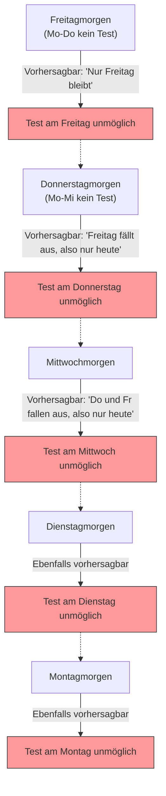

## 1. Die „absolute Ankündigung“ des Lehrers

Auf dem Heimweg an einem Freitag machte der Mathematiklehrer seinen Schülern eine erschreckende Ankündigung.

**„Ich werde nächste Woche an einem Tag, von Montag bis Freitag, genau einen ‚Überraschungstest‘ durchführen.**
**Wenn ihr jedoch am Morgen jenes Tages mit Sicherheit vorhersagen könnt: ‚Heute ist der Tag des Tests‘, dann ist es keine Überraschung mehr, und daher werde ich den Test an diesem Tag nicht durchführen.“**

Als die Schüler diese Ankündigung hörten, zitterten sie. Denn sie müssten jeden Tag in Angst verbringen, ohne zu wissen, wann der Test stattfindet.
Doch Schüler A, das größte Genie der Klasse, stand plötzlich mit einem Grinsen auf.

„Leute, ihr könnt beruhigt sein. **Es ist absolut unmöglich, dass nächste Woche ein Überraschungstest stattfindet. Es ist logisch unmöglich!**“

Schüler A begann voller Selbstvertrauen, die folgende „perfekte Logik“ an die Tafel zu schreiben.

---

## 2. Der Beweis durch die „perfekte Logik“ von Schüler A

Der Beweis von Schüler A verwendet eine mathematische Technik namens **Rückwärtsinduktion, also das Zurückdenken vom „Freitag“ an**.

### Schritt 1: Den Freitag ausschließen
> Angenommen, an den vier Tagen Montag, Dienstag, Mittwoch und Donnerstag wurde kein Test durchgeführt.
> Dann ist der einzige verbleibende Tag der „Freitag“.
> Am Freitagmorgen könnten die Schüler **mit Sicherheit vorhersagen**: „Da nur noch der heutige Tag übrig ist, findet der Test zweifellos heute statt!“
> Gemäß der Regel des Lehrers („an vorhersehbaren Tagen wird er nicht durchgeführt“) ist es logisch unmöglich, am Freitag einen Überraschungstest durchzuführen.
> **Daher gibt es am Freitag definitiv keinen Test.**

### Schritt 2: Den Donnerstag ausschließen
> Es steht fest, dass es am Freitag keinen Test gibt.
> Das bedeutet, der letztmögliche Tag, an dem der Test stattfinden könnte, ist der „Donnerstag“.
> Angenommen, an den drei Tagen Montag, Dienstag und Mittwoch wurde kein Test durchgeführt.
> Dann ist die einzige verbleibende Möglichkeit der Donnerstag (der Freitag wurde bereits ausgeschlossen).
> Am Donnerstagmorgen könnten die Schüler mit Sicherheit vorhersagen: „Heute ist der Test!“
> **Daher gibt es auch am Donnerstag definitiv keinen Test.**

### Schritt 3: Alle Wochentage verschwinden
> Wir müssen nur dieselbe Logik wiederholen.
> Wenn es nicht der Donnerstag ist, ist der letzte Tag der Mittwoch. Wenn also bis Dienstag kein Test stattfindet, kann man es am Mittwochmorgen vorhersagen, wodurch auch der Mittwoch wegfällt.
> Wenn der Mittwoch wegfällt, fällt auch der Dienstag weg und ebenso der Montag.
> **Fazit: Solange die Regeln des Lehrers eingehalten werden, ist es absolut unmöglich, an irgendeinem Wochentag von Montag bis Freitag einen Überraschungstest durchzuführen!**

Die Schüler in der Klasse jubelten. Die Logik von Schüler A war perfekt und schien keine Lücken zu haben.
Sie amüsierten sich am Wochenende, lernten überhaupt nicht für den Test und begrüßten den Montag.

Montag... Es gab keinen Test. „Siehst du!“
Dienstag... Es gab keinen Test. „Schüler A hat recht!“

Und dann der **Mittwochmorgen**.
Ratter! Die Klassenzimmertür öffnete sich, der Lehrer kam herein und sagte:

**„So, räumt eure Tische auf. Wir beginnen jetzt mit einem Überraschungstest!“**

Die Schüler gerieten in Panik.
„W-warum!? Dass es am Mittwoch einen Test gibt, **hatten wir absolut nicht vorhergesehen!**“

Der Lehrer grinste.
**„Seht ihr, ihr konntet es nicht vorhersagen, oder? Meine ‚Ankündigung‘ war völlig richtig, und der Überraschungstest hat den Regeln entsprechend funktioniert.“**

---

## 3. Wo genau lag der Fehler in der Logik?

Obwohl der Beweis von Schüler A perfekt schien, warum fand in der Realität ein „perfekter Überraschungstest“ statt?
Dieses Problem ist ursprünglich als „Paradoxon der unerwarteten Hinrichtung“ (Unexpected hanging paradox) bekannt. Seit es in den 1940er Jahren vom schwedischen Mathematiker Lennart Ekbom erdacht wurde, bereitet es Philosophen und Logikern Kopfzerbrechen.

Tatsächlich gibt es für dieses Paradoxon noch keine einheitliche Sichtweise im Sinne von „Dies ist die einzig absolute richtige Antwort“. Es gibt jedoch einige vielversprechende Lösungsansätze.

### Ansatz 1: „Das Paradoxon des Wissens (Epistemologie)“
Die größte Falle in der Schlussfolgerung von Schüler A war, dass er **die Prämisse „Die Ankündigung des Lehrers ist zu 100 % wahr“ in seine eigene Vorhersage einbezogen hat**.

Die Ankündigung des Lehrers besteht aus zwei Bedingungen: „Ich werde nächste Woche einen Test durchführen (P)“ und „Ich werde ihn nicht an einem vorhersehbaren Tag durchführen (Q)“.
Wenn es bis Freitag keinen Test gäbe, würden die Schüler denken: „Wenn die Ankündigung wahr ist, kann es nur heute sein.“ Gleichzeitig entsteht aber der Zweifel: „Wenn wir vorhersagen können, dass es heute ist, widerspricht das der Bedingung Q. War dann die Ankündigung P (einen Test durchzuführen) nicht von vornherein eine Lüge?“

Als Folge des Konflikts zwischen dem Glauben „Die Worte des Lehrers sind absolut wahr“ und dem „logischen Schlussfolgern“ kamen die Schüler zu der falschen Schlussfolgerung (dem Glauben): „Der Lehrer wird keinen Test durchführen“. Das führte dazu, dass sie, egal wann der Test stattfand, immer in einem „unerwarteten (überraschten)“ Zustand waren.

### Ansatz 2: „Das Paradoxon der Selbstreferenz“
Lassen Sie uns die Worte des Lehrers in eine logische Formel übersetzen.
Sei die Behauptung des Lehrers $S$.
$S = $ „Ich werde an einem Tag $T$ einen Test durchführen. Und ihr werdet diesen Tag $T$ nicht vorhersagen können.“

Diese Behauptung hat eine **„selbstreferenzielle Struktur“**, deren Wahrheitsgehalt davon abhängt, wie die Schüler sie (die Ankündigung selbst) aufnehmen. Ähnlich wie beim „Lügner-Paradoxon (‚Dieser Satz ist falsch‘)“ hat sie die Eigenschaft, logische Schlussfolgerungen in eine Endlosschleife laufen zu lassen.

---

## 4. „Überraschungstests“ im Alltag

Dieses Paradoxon lässt sich nicht nur auf die Mathematik, sondern auch auf unser alltägliches Leben anwenden.

**【Das Dilemma der Überraschungsparty】**
> Angenommen, ein Freund kündigt an: „Diesen Monat schmeiße ich eine Überraschungsparty zu deinem Geburtstag!“
> Wenn du das hörst, rätst du jeden Tag: „Ist es heute? Ist es morgen?“
> Wenn bis zum letzten Tag des Monats keine Party stattfindet, schlussfolgerst du, dass sie am letzten Tag unmöglich stattfinden kann, um die Bedingung „Überraschung (unvorhersehbar)“ zu erfüllen...
> Wenn jedoch plötzlich Mitte des Monats ein Kuchen auftaucht, wirst du sagen: „Ich war wirklich überrascht!“ und erlebst eine perfekte Überraschung.

---

## 5. Fazit

„Das Paradoxon des Überraschungstests“ drückt auf wunderbare Weise **die Schwierigkeit aus, den menschlichen Zustand des „Wissens (Vorhersagens)“ selbst in logische Berechnungen einzubeziehen**.

Was wir für eine „perfekte Schlussfolgerung“ halten, ist vielleicht nur ein Luftschloss, das auf dem unbegründeten Glauben beruht: „Der andere wird sich absolut an die Regeln halten“.
Wenn der Lehrer das nächste Mal sagt: „Ich werde einen Überraschungstest machen“, ist es wohl am vernünftigsten, aufzuhören, die Logik zu verdrehen, und stattdessen brav jeden Tag zu lernen.
