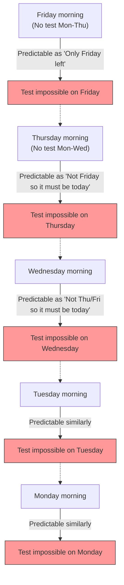

## 1. The Teacher's "Absolute Declaration"

On the way home one Friday, a math teacher made a terrifying announcement to his students.

**"Next week, on some day from Monday to Friday, I will give a 'surprise test' exactly once.**
**However, if you can definitely predict 'the test is today' on the morning of that day, it won't be a surprise, so the test will not be given on that day."**

Hearing this declaration, the students trembled. It meant they had to spend every day in fear, wondering when the test would be held.
However, Student A, the brightest in the class, suddenly smiled and stood up.

"Everyone, you can rest easy. **It is absolutely impossible for a surprise test to be held next week. It's logically impossible!**"

With full confidence, Student A began to write the following "perfect logic" on the blackboard.

---

## 2. Student A's Proof by "Perfect Logic"

Student A's proof uses a mathematical technique of **thinking backwards from "Friday" (backward reasoning)**.

### Step 1: Eliminate the Possibility of Friday
> Suppose the test was not given for the four days of Monday, Tuesday, Wednesday, and Thursday.
> Then, the only day left is "Friday."
> On the morning of Friday, the students would be able to **definitely predict**, "Today is the only day left, so the test is definitely today!"
> According to the teacher's declaration, "It will not be given on a day it can be predicted," so it is logically impossible to give a surprise test on Friday.
> **Therefore, there will absolutely be no test on Friday.**

### Step 2: Eliminate the Possibility of Thursday
> It is confirmed that there is no test on Friday.
> This means that the last possible day the test can be given is "Thursday."
> Suppose the test was not given for the three days of Monday, Tuesday, and Wednesday.
> Then, the only remaining possibility is Thursday (Friday has already been eliminated).
> On the morning of Thursday, the students would be able to definitely predict, "The test is today!"
> **Therefore, there will absolutely be no test on Thursday either.**

### Step 3: All Days of the Week Disappear
> We just need to repeat the same logic.
> If there's no Thursday, the last day becomes Wednesday. Thus, if there is no test until Tuesday, it could be predicted on Wednesday morning, so Wednesday also disappears.
> If Wednesday disappears, Tuesday disappears, and Monday disappears too.
> **Conclusion: As long as the teacher's rules are followed, it is absolutely impossible to give a surprise test on any day from Monday to Friday!**

The students in the class rejoiced. Student A's logic seemed perfect, with no loopholes anywhere.
They spent the weekend playing around and having fun, and welcomed Monday without studying for the test at all.

Monday... There was no test. "See!"
Tuesday... There was no test. "Just like Student A said!"

And then, on **Wednesday morning**.
*Clatter!* The classroom door opened, the teacher came in, and said:

**"Alright, clear your desks. We're going to start the surprise test now!"**

The students fell into a panic.
"W-Why!? We **completely didn't predict** that there would be a test on Wednesday!"

The teacher smiled smugly.
**"See, you couldn't predict it, could you? My 'declaration' was completely correct, and the surprise test was established according to the rules."**

---

## 3. Where Did the Logic Go Wrong?

Even though Student A's proof looked perfect, why did a "perfect surprise test" actually take place in reality?
This problem is originally called the "Unexpected Hanging Paradox," and ever since it was devised by the Swedish mathematician Lennart Ekbom in the 1940s, it has continued to trouble philosophers and logicians.

Actually, there is still no unified view that "this is the one absolute correct answer" to this paradox. However, there are some leading approaches to resolving it.

### Approach 1: "Paradox of Knowledge (Epistemology)"
The biggest pitfall in Student A's reasoning was that **he incorporated the premise that "the teacher's declaration is 100% true" into his own prediction**.

The teacher's declaration consists of two conditions: "Give a test next week (P)" and "Do not give it on a day it can be predicted (Q)."
If there has been no test up to Friday, the student thinks, "If the declaration is correct, it must be today," but at the same time, room for doubt is born: "If I can predict it's today, it violates Q of the declaration. In that case, wasn't the declaration P (give a test) itself a lie in the first place?"

As a result of the collision between the belief that "the teacher's words are absolutely correct" and "logical reasoning," the students held the false conclusion (belief) that "the teacher will not give the test," and as a result, no matter when the test was given, they ended up in an "unexpected (surprise)" state.

### Approach 2: "Paradox of Self-Reference"
Let's convert the teacher's words into a logical formula.
Let the teacher's claim be $S$.
$S =$ "I will give a test on a certain day $T$. And, you will not be able to predict that day $T$."

This claim has a **"self-referential structure"** where its truth or falsehood changes depending on how the students receive it itself (the declaration). Just like the "Liar Paradox ('This sentence is a lie')", it has the property of causing logical reasoning to loop infinitely.

---

## 4. "Surprise Tests" Lurking in Daily Life

This paradox is applied not only to mathematics but also to our everyday lives.

**[The Dilemma of the Surprise Party]**
> Suppose a friend declares, "I'm going to throw a surprise party for your birthday this month!"
> Hearing this, you guess every day, "Is it today? Is it tomorrow?"
> If there is no party even by the last day of the month, you end up reasoning that in order to satisfy the condition of a "surprise (unpredictable)", it absolutely cannot be done on the last day...
> However, in reality, if a cake suddenly appears around the middle of the month, you receive a perfect surprise, thinking, "I was really surprised!"

---

## 5. Conclusion

"The Unexpected Hanging Paradox" brilliantly expresses **the difficulty of including the human state of 'knowing (predicting)' itself into logical calculations**.

What we think of as "perfect reasoning" might actually be nothing more than a castle built on sand, resting on the baseless belief that "the other party will absolutely follow the rules."
Next time a teacher says, "I'm giving a surprise test," it seems the most rational thing to do is to stop twisting logic and just quietly study every day.
