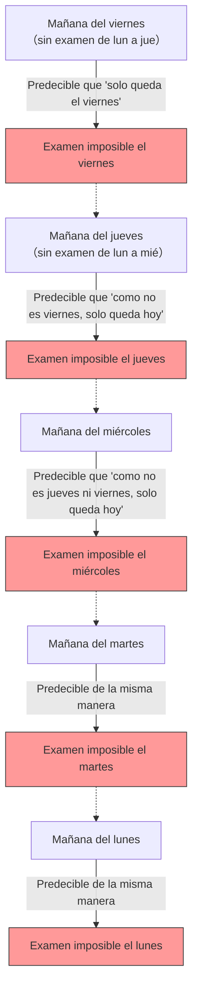

## 1. La "declaración absoluta" del profesor

De camino a casa un viernes, el profesor de matemáticas hizo un anuncio aterrador a los estudiantes.

**"La próxima semana, un día entre el lunes y el viernes, realizaré un 'examen sorpresa' por única vez.**
**Sin embargo, si en la mañana de ese día pueden predecir con certeza que 'hoy es el día del examen', ya no será una sorpresa, por lo que no realizaré el examen ese día."**

Al escuchar esta declaración, los estudiantes temblaron. Tendrían que pasar todos los días con miedo, preguntándose cuándo sería el examen.
Sin embargo, el estudiante A, el más brillante de la clase, de repente sonrió y se puso de pie.

"Chicos, pueden estar tranquilos. **Es absolutamente imposible que haya un examen sorpresa la próxima semana. ¡Es lógicamente imposible!**"

El estudiante A, con mucha confianza, comenzó a escribir la siguiente "lógica perfecta" en la pizarra.

---

## 2. La prueba mediante la "lógica perfecta" del estudiante A

La prueba del estudiante A utiliza una técnica matemática que consiste en **razonar hacia atrás en el tiempo partiendo desde el "viernes" (razonamiento hacia atrás)**.

### Paso 1: Eliminar la posibilidad del viernes
> Supongamos que durante 4 días, de lunes a jueves, no se realizó ningún examen.
> Entonces, el único día que queda es el "viernes".
> En la mañana del viernes, los estudiantes podrían **predecir con certeza**: "¡Como solo queda hoy, sin duda hoy es el examen!".
> Según la declaración del profesor, "no se realizará si se puede predecir", por lo tanto, es lógicamente imposible realizar un examen sorpresa el viernes.
> **Por lo tanto, es seguro que no habrá examen el viernes.**

### Paso 2: Eliminar la posibilidad del jueves
> Se ha confirmado que no hay examen el viernes.
> Esto significa que el último día posible para realizar el examen es el "jueves".
> Supongamos que no se realizó ningún examen durante los 3 días de lunes a miércoles.
> Entonces, la única posibilidad que queda es el jueves (el viernes ya ha sido descartado).
> En la mañana del jueves, los estudiantes podrían predecir con certeza: "¡Hoy es el examen!".
> **Por lo tanto, es seguro que tampoco habrá examen el jueves.**

### Paso 3: Todos los días desaparecen
> Solo tenemos que repetir la misma lógica.
> Si no es el jueves, el último día será el miércoles. Por lo tanto, si no hay examen hasta el martes, se podría predecir en la mañana del miércoles, por lo que el miércoles también se descarta.
> Si el miércoles se descarta, el martes también, y el lunes también.
> **Conclusión: ¡Mientras se sigan las reglas del profesor, es absolutamente imposible realizar un examen sorpresa en cualquier día de lunes a viernes!**

Los estudiantes de la clase se llenaron de alegría. La lógica del estudiante A era perfecta y parecía no tener lagunas en ningún lado.
Se divirtieron jugando todo el fin de semana y llegaron al lunes sin haber estudiado en absoluto para el examen.

Lunes... no hubo examen. "¡Lo ven!"
Martes... no hubo examen. "¡El estudiante A tiene razón!"

Y entonces, **la mañana del miércoles**.
¡Clack! La puerta del aula se abrió de golpe, el profesor entró y dijo:

**"Muy bien, despejen sus escritorios. ¡El examen sorpresa comienza ahora mismo!"**

Los estudiantes entraron en pánico.
"¿¡P-pero por qué!? ¡Un examen en miércoles, **no lo habíamos predicho en absoluto!**"

El profesor sonrió con malicia.
**"¿Lo ven? No pudieron predecirlo, ¿verdad? Mi 'declaración' fue completamente correcta, y el examen sorpresa se llevó a cabo según las reglas."**

---

## 3. ¿Dónde exactamente falló la lógica?

A pesar de que la prueba del estudiante A parecía perfecta, ¿por qué en la realidad se logró un "examen sorpresa perfecto"?
Este problema se conocía originalmente como la "paradoja del ahorcamiento inesperado" (o paradoja del examen sorpresa), y ha desconcertado a filósofos y lógicos desde que fue ideado en la década de 1940 por el matemático sueco Lennart Ekbom.

En realidad, aún no hay un consenso unificado que diga "esta es la única respuesta correcta y absoluta" para esta paradoja. Sin embargo, existen varios enfoques prometedores para resolverla.

### Enfoque 1: "Paradoja del conocimiento (Epistemología)"
El mayor error en el razonamiento del estudiante A es que **incorporó la premisa de que "la declaración del profesor es 100% cierta" en su propia predicción**.

La declaración del profesor consta de dos condiciones: "haré un examen la próxima semana (P)" y "no lo haré el día que se pueda predecir (Q)".
Si no ha habido examen hasta el viernes, los estudiantes piensan: "Si la declaración es cierta, solo queda hoy", pero al mismo tiempo surge la duda: "Si se puede predecir que es hoy, contradice la condición Q de la declaración. Entonces, ¿acaso la declaración P (haré un examen) en sí misma era una mentira desde el principio?".

Como resultado del conflicto entre la creencia de que "las palabras del profesor son absolutamente ciertas" y la "deducción lógica", los estudiantes llegaron a la conclusión errónea (creencia) de que "el profesor no hará el examen", lo que provocó que, independientemente de cuándo se presentara el examen, estuvieran en un estado "inesperado (sorpresa)".

### Enfoque 2: "Paradoja de autorreferencia"
Convirtamos las palabras del profesor en una fórmula lógica.
Supongamos que la afirmación del profesor es $S$.
$S = $ "Realizaré un examen en un día $T$. Y ustedes no podrán predecir ese día $T$."

Esta afirmación tiene una **"estructura autorreferencial"** donde su verdad o falsedad cambia dependiendo de cómo los estudiantes perciban la afirmación misma (la declaración). Al igual que la "paradoja del mentiroso ('Esta oración es falsa')", tiene la propiedad de hacer que el razonamiento lógico entre en un bucle infinito interminable.

---

## 4. Los "exámenes sorpresa" ocultos en la vida cotidiana

Esta paradoja se aplica no solo en las matemáticas, sino también en nuestra vida cotidiana.

**[El dilema de la fiesta sorpresa]**
> Supón que un amigo declara: "¡Este mes, te haré una fiesta sorpresa por tu cumpleaños!".
> Al escuchar esto, adivinas todos los días: "¿Será hoy? ¿Será mañana?".
> Si llega el último día del mes y no ha habido fiesta, deduces que para cumplir con la condición de "sorpresa (impredecible)", definitivamente no puede ser el último día...
> Sin embargo, en la realidad, si de repente aparece un pastel a mediados de mes, recibes una sorpresa perfecta y piensas: "¡Realmente me sorprendieron!".

---

## 5. Resumen

La "paradoja del examen sorpresa" expresa de manera brillante la **dificultad de incluir el propio estado humano de "saber (predecir)" en los cálculos lógicos**.

Lo que consideramos un "razonamiento perfecto" podría ser en realidad solo un castillo de arena construido sobre la creencia infundada de que "la otra parte seguirá las reglas absolutamente".
La próxima vez que el profesor diga "Haré un examen sorpresa", parece que lo más racional será dejar de darle vueltas a la lógica y simplemente estudiar tranquilamente todos los días.
