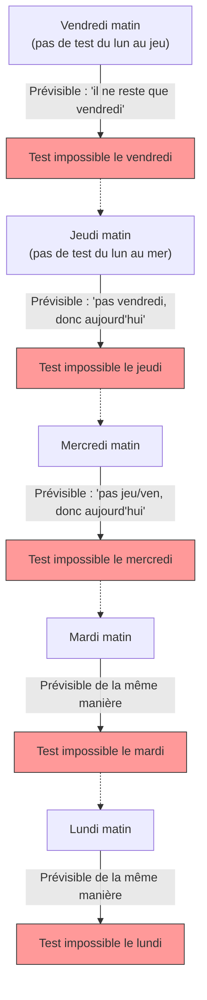

## 1. La « déclaration absolue » du professeur

Un vendredi sur le chemin du retour, le professeur de mathématiques a fait une annonce terrifiante à ses élèves.

**« La semaine prochaine, un jour entre lundi et vendredi, je vous ferai un "contrôle surprise" unique.**
**Cependant, si le matin même vous pouvez prédire avec certitude que "le contrôle aura lieu aujourd'hui", ce ne sera plus une surprise, et donc je ne ferai pas de contrôle ce jour-là. »**

En entendant cette déclaration, les élèves ont tremblé de peur. Ils allaient devoir passer chaque jour dans l'angoisse de savoir quand le contrôle aurait lieu.
Cependant, l'élève A, le plus brillant de la classe, s'est soudainement levé avec un sourire en coin.

« Les gars, vous pouvez être rassurés. **Il est absolument impossible qu'un contrôle surprise ait lieu la semaine prochaine. C'est logiquement impossible !** »

L'élève A, plein de confiance, a commencé à écrire sa « logique parfaite » au tableau.

---

## 2. La preuve par la « logique parfaite » de l'élève A

La preuve de l'élève A utilise une technique mathématique appelée **raisonnement à rebours**, en commençant par le « vendredi » et en remontant le temps.

### Étape 1 : Éliminer la possibilité du vendredi
> Supposons qu'il n'y ait pas de contrôle pendant 4 jours, du lundi au jeudi.
> Il ne reste alors que le « vendredi ».
> Le vendredi matin, les élèves pourront **prédire avec certitude** : « Puisqu'il ne reste qu'aujourd'hui, le contrôle est sans aucun doute aujourd'hui ! »
> Selon la déclaration du professeur, « il n'y aura pas de contrôle le jour où il peut être prédit », il est donc logiquement impossible de faire un contrôle surprise le vendredi.
> **Par conséquent, il n'y aura absolument pas de contrôle le vendredi.**

### Étape 2 : Éliminer la possibilité du jeudi
> Il est maintenant confirmé qu'il n'y a pas de contrôle le vendredi.
> Cela signifie que le dernier jour où un contrôle peut avoir lieu est le « jeudi ».
> Supposons qu'il n'y ait pas de contrôle pendant 3 jours, du lundi au mercredi.
> La seule possibilité restante est alors le jeudi (le vendredi a déjà été éliminé).
> Le jeudi matin, les élèves pourront prédire avec certitude que « le contrôle est aujourd'hui ! ».
> **Par conséquent, il n'y aura absolument pas de contrôle le jeudi non plus.**

### Étape 3 : Tous les jours de la semaine disparaissent
> Il suffit de répéter la même logique.
> S'il n'y a pas de jeudi, le dernier jour devient le mercredi. Par conséquent, s'il n'y a pas de contrôle jusqu'au mardi, cela pourra être prédit le mercredi matin, donc le mercredi disparaît également.
> Si le mercredi disparaît, le mardi disparaît aussi, et le lundi aussi.
> **Conclusion : Tant que l'on respecte la règle du professeur, il est absolument impossible d'organiser un contrôle surprise n'importe quel jour de la semaine, du lundi au vendredi !**

Les élèves de la classe ont exulté. La logique de l'élève A semblait parfaite, sans la moindre faille.
Ils ont passé le week-end à s'amuser et sont arrivés le lundi sans avoir étudié une seule fois.

Lundi... il n'y a pas eu de contrôle. « Tu vois ! »
Mardi... il n'y a pas eu de contrôle. « L'élève A avait raison ! »

Puis, le **mercredi matin**.
La porte de la classe s'est ouverte brusquement et le professeur est entré en disant :

**« Allez, rangez vos bureaux. Nous allons commencer le contrôle surprise ! »**

Les élèves ont paniqué.
« Ma, mais pourquoi !? On n'avait **pas du tout prévu** qu'il y aurait un contrôle le mercredi ! »

Le professeur sourit d'un air narquois.
**« Vous voyez, vous n'avez pas pu le prédire, n'est-ce pas ? Ma "déclaration" était tout à fait correcte, et selon les règles, le contrôle surprise a bien eu lieu. »**

---

## 3. Où la logique s'est-elle trompée ?

La preuve de l'élève A semblait parfaite, alors pourquoi un « contrôle totalement surprise » a-t-il pu avoir lieu dans la réalité ?
Ce problème, à l'origine connu sous le nom de « paradoxe de l'interrogation surprise » (ou paradoxe de la pendaison inattendue), a été imaginé dans les années 1940 par le mathématicien suédois Lennart Ekbom et n'a cessé depuis de tourmenter philosophes et logiciens.

En fait, il n'existe pas encore de consensus unifié affirmant « voici l'unique et absolue bonne réponse » à ce paradoxe. Cependant, il existe plusieurs approches majeures pour le résoudre.

### Approche 1 : « Le paradoxe de la connaissance (Épistémologie) »
Le plus grand piège dans le raisonnement de l'élève A est d'avoir **inclus la prémisse que « la déclaration du professeur est 100 % vraie » dans sa propre prédiction**.

La déclaration du professeur est composée de deux conditions : « Il y aura un contrôle la semaine prochaine (P) » et « Il n'y aura pas de contrôle le jour où vous l'aurez prédit (Q) ».
S'il n'y a pas de contrôle avant vendredi, l'élève pense « si la déclaration est vraie, ce ne peut être qu'aujourd'hui », mais en même temps il reste de la place pour douter : « si je peux prédire que c'est aujourd'hui, cela contredit Q dans la déclaration. Dans ce cas, la déclaration P elle-même (il y aura un contrôle) n'était-elle pas un mensonge depuis le début ? »

Le conflit entre la conviction que « la parole du professeur est absolument vraie » et le « raisonnement logique » a conduit les élèves à la fausse conclusion (conviction) que « le professeur ne fera pas de contrôle », avec pour conséquence que quel que soit le moment où le contrôle serait donné, il serait dans un état « inattendu (surprise) ».

### Approche 2 : « Le paradoxe de l'autoréférence »
Traduisons les mots du professeur en formule logique.
Soit $S$ l'affirmation du professeur.
$S = $ « Je ferai un contrôle un certain jour $T$. Et vous ne pourrez pas prédire ce jour $T$. »

Cette affirmation possède une **« structure autoréférentielle »** dont la vérité ou la fausseté change selon la façon dont les élèves la perçoivent (la déclaration). Tout comme le « paradoxe du menteur ("Cette phrase est fausse") », elle a pour propriété de faire tourner le raisonnement logique dans une boucle infinie.

---

## 4. Le « contrôle surprise » caché dans la vie quotidienne

Ce paradoxe s'applique non seulement aux mathématiques, mais aussi à notre vie quotidienne.

**[Le dilemme de la fête surprise]**
> Supposons qu'un ami déclare : « Ce mois-ci, je vais organiser une fête surprise pour ton anniversaire ! »
> En entendant cela, vous essayez de deviner chaque jour : « Est-ce aujourd'hui ? Est-ce demain ? »
> Si la fête n'a pas eu lieu le dernier jour du mois, pour que la condition de « surprise (imprévisible) » soit remplie, vous en déduisez qu'elle ne peut absolument pas avoir lieu le dernier jour...
> Mais en réalité, si un gâteau apparaît soudainement vers le milieu du mois, vous serez « vraiment surpris ! » et subirez une surprise parfaite.

---

## 5. Résumé

Le « paradoxe de l'interrogation surprise » illustre parfaitement **la difficulté d'inclure l'état même de « savoir (prédire) » dans le calcul logique**.

Ce que nous considérons comme un « raisonnement parfait » n'est peut-être en réalité qu'un château de sable construit sur la croyance infondée que « l'autre partie respectera absolument les règles ».
La prochaine fois que le professeur annoncera : « Je vais faire un contrôle surprise », il serait plus raisonnable d'arrêter de manipuler la logique et d'étudier docilement tous les jours.
