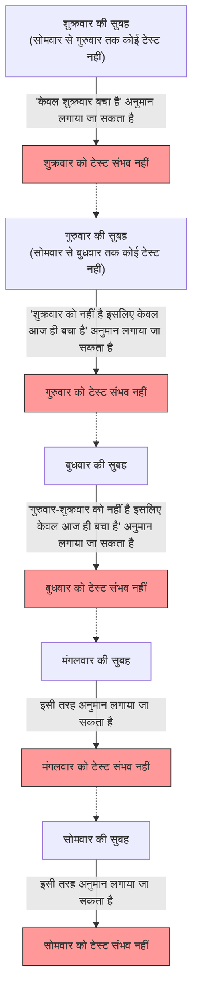

## 1. शिक्षक की "निरपेक्ष घोषणा"

एक शुक्रवार की शाम घर जाते समय, गणित के शिक्षक ने छात्रों को एक डरावनी घोषणा की।

**"अगले हफ्ते सोमवार से शुक्रवार के बीच किसी एक दिन, मैं सिर्फ एक बार 'सरप्राइज टेस्ट' (अचानक परीक्षा) लूंगा।**
**हालांकि, अगर उस दिन की सुबह तुम लोग निश्चित रूप से यह अनुमान लगा सको कि 'आज टेस्ट का दिन है', तो वह सरप्राइज नहीं रहेगा, इसलिए मैं उस दिन टेस्ट नहीं लूंगा।"**

यह घोषणा सुनकर छात्र डर गए। उन्हें हर दिन इस खौफ में बिताना पड़ेगा कि न जाने कब टेस्ट हो जाए।
लेकिन कक्षा के सबसे मेधावी छात्र ए (A) ने अचानक मुस्कुराते हुए खड़े होकर कहा:

"दोस्तों, चिंता मत करो। **अगले हफ्ते सरप्राइज टेस्ट होना बिल्कुल असंभव है। यह तार्किक रूप से नामुमकिन है!**"

ए ने पूरे आत्मविश्वास के साथ ब्लैकबोर्ड पर एक "पूर्ण तर्क" लिखना शुरू किया।

---

## 2. छात्र ए का "पूर्ण तर्क" द्वारा प्रमाण

ए का प्रमाण **"शुक्रवार" से पीछे की ओर सोचने (बैकवर्ड रीजनिंग)** की गणितीय तकनीक का उपयोग करता है।

### चरण 1: शुक्रवार की संभावना को खत्म करना
> मान लीजिए कि सोमवार, मंगलवार, बुधवार और गुरुवार, इन 4 दिनों में कोई टेस्ट नहीं हुआ।
> तो, बचा हुआ दिन केवल "शुक्रवार" है।
> शुक्रवार की सुबह, छात्र **निश्चित रूप से अनुमान लगा लेंगे** कि "चूंकि आज के अलावा कोई दिन नहीं बचा है, इसलिए आज ही टेस्ट होगा!"
> शिक्षक की घोषणा के अनुसार, "जिस दिन अनुमान लगाया जा सके उस दिन टेस्ट नहीं होगा", इसलिए शुक्रवार को सरप्राइज टेस्ट लेना तार्किक रूप से असंभव है।
> **इसलिए, शुक्रवार को टेस्ट बिल्कुल नहीं होगा।**

### चरण 2: गुरुवार की संभावना को खत्म करना
> यह तय हो गया कि शुक्रवार को कोई टेस्ट नहीं होगा।
> इसका मतलब है कि टेस्ट होने की अंतिम संभावित दिन "गुरुवार" है।
> मान लीजिए कि सोमवार, मंगलवार और बुधवार, इन 3 दिनों में कोई टेस्ट नहीं हुआ।
> तो, बची हुई एकमात्र संभावना गुरुवार है (शुक्रवार को पहले ही हटा दिया गया है)।
> गुरुवार की सुबह, छात्र निश्चित रूप से अनुमान लगा लेंगे कि "आज ही टेस्ट है!"
> **इसलिए, गुरुवार को भी टेस्ट बिल्कुल नहीं होगा।**

### चरण 3: सभी दिन खत्म हो जाते हैं
> बस इसी तर्क को दोहराना है।
> यदि गुरुवार नहीं है, तो अंतिम दिन बुधवार होगा। इसलिए यदि मंगलवार तक कोई टेस्ट नहीं होता है, तो बुधवार की सुबह अनुमान लगाया जा सकता है, इसलिए बुधवार भी खत्म हो जाएगा।
> अगर बुधवार खत्म हो गया, तो मंगलवार भी खत्म हो जाएगा, और सोमवार भी खत्म हो जाएगा।
> **निष्कर्ष: जब तक शिक्षक के नियमों का पालन किया जाता है, सोमवार से शुक्रवार तक किसी भी दिन सरप्राइज टेस्ट लेना बिल्कुल असंभव है!**

कक्षा के छात्र खुशी से झूम उठे। ए का तर्क पूर्ण था, और इसमें कोई खामी नहीं दिख रही थी।
उन्होंने सप्ताहांत में खूब मस्ती की, बिना कोई पढ़ाई किए सोमवार का स्वागत किया।

सोमवार…… कोई टेस्ट नहीं था। "देखा!"
मंगलवार…… कोई टेस्ट नहीं था। "ए बिल्कुल सही कह रहा था!"

और **बुधवार की सुबह**।
कक्षा का दरवाजा खटखटाकर खुला, और शिक्षक ने अंदर आकर कहा:

**"ठीक है, अपनी डेस्क साफ करो। हम अभी सरप्राइज टेस्ट शुरू करने जा रहे हैं!"**

छात्र घबरा गए।
"क्या, क्यों!? बुधवार को टेस्ट होगा, यह हमने **बिल्कुल भी अनुमान नहीं लगाया था!**"

शिक्षक मुस्कुराए।
**"देखा, तुम लोग अनुमान नहीं लगा पाए ना? मेरी 'घोषणा' बिल्कुल सही थी, और नियम के अनुसार सरप्राइज टेस्ट हो गया।"**

---

## 3. तर्क में आखिर कहाँ गलती थी?

ए का प्रमाण पूर्ण लग रहा था, तो फिर वास्तव में "पूर्ण सरप्राइज टेस्ट" कैसे सफल हो गया?
इस समस्या को मूल रूप से "अप्रत्याशित फांसी का पैराडॉक्स (Unexpected hanging paradox)" कहा जाता है, और 1940 के दशक में स्वीडिश गणितज्ञ लेनार्ट एकबोम (Lennart Ekbom) द्वारा इसके आविष्कार के बाद से इसने दार्शनिकों और तर्कशास्त्रियों को परेशान कर रखा है।

वास्तव में, इस पैराडॉक्स का कोई सर्वमान्य समाधान नहीं है कि "यही एकमात्र सही उत्तर है"। हालाँकि, समाधान के कुछ प्रमुख दृष्टिकोण मौजूद हैं।

### दृष्टिकोण 1: "ज्ञान का पैराडॉक्स (ज्ञानमीमांसा)"
ए के तर्क की सबसे बड़ी खामी यह थी कि उसने **"शिक्षक की घोषणा 100% सत्य है" इस धारणा को अपने स्वयं के अनुमानों में शामिल कर लिया था**।

शिक्षक की घोषणा 2 शर्तों से बनी है: "अगले सप्ताह टेस्ट होगा (P)" और "जिस दिन अनुमान लगाया जा सके उस दिन नहीं होगा (Q)"।
यदि शुक्रवार तक कोई टेस्ट नहीं होता है, तो छात्र सोचते हैं कि "यदि घोषणा सही है तो आज ही टेस्ट होना चाहिए", लेकिन साथ ही यह संदेह भी उत्पन्न होता है कि "यदि यह अनुमान लगाया जा सकता है कि यह आज है तो यह घोषणा के Q का उल्लंघन करता है। तो क्या P (टेस्ट होगा) की घोषणा ही झूठ थी?"

"शिक्षक के शब्द बिल्कुल सही हैं" इस विश्वास और "तार्किक तर्क" के बीच टकराव के परिणामस्वरूप, छात्रों ने "शिक्षक टेस्ट नहीं लेंगे" यह गलत निष्कर्ष (विश्वास) बना लिया, और परिणामस्वरूप, जब भी टेस्ट दिया गया वह उनके लिए "अप्रत्याशित (सरप्राइज)" स्थिति बन गई।

### दृष्टिकोण 2: "आत्म-संदर्भ का पैराडॉक्स"
आइए शिक्षक के शब्दों को एक तार्किक सूत्र में बदलें।
मान लीजिए शिक्षक का दावा $S$ है।
$S = $ "मैं किसी दिन $T$ को टेस्ट लूंगा। और, तुम लोग उस दिन $T$ का अनुमान नहीं लगा पाओगे।"

इस दावे की सत्यता इस बात पर निर्भर करती है कि छात्र इसे (घोषणा को) कैसे समझते हैं, इसमें एक **"आत्म-संदर्भित संरचना"** है। "झूठे के पैराडॉक्स ('यह वाक्य झूठ है')" की तरह, इसमें तार्किक तर्क को एक अंतहीन पाश (लूप) में घुमाते रहने की प्रवृत्ति होती है।

---

## 4. दैनिक जीवन में छिपा "सरप्राइज टेस्ट"

यह पैराडॉक्स न केवल गणित बल्कि हमारे रोजमर्रा के जीवन पर भी लागू होता है।

**[सरप्राइज पार्टी की दुविधा]**
> मान लीजिए कोई दोस्त घोषणा करता है, "मैं इस महीने तुम्हारे जन्मदिन पर एक सरप्राइज पार्टी दूंगा!"
> इसे सुनकर, आप हर दिन अनुमान लगाते हैं: "क्या यह आज है? क्या यह कल है?"
> यदि महीने के अंतिम दिन तक कोई पार्टी नहीं होती है, तो आप तर्क करते हैं कि "सरप्राइज (अप्रत्याशित)" शर्त को पूरा करने के लिए, यह अंतिम दिन पर तो बिल्कुल नहीं हो सकती...
> लेकिन वास्तव में, जब महीने के मध्य में अचानक केक सामने आता है, तो आप एक पूर्ण सरप्राइज महसूस करते हुए कहते हैं: "मैं सच में हैरान रह गया!"

---

## 5. निष्कर्ष

"सरप्राइज टेस्ट पैराडॉक्स" मनुष्य की **"जानने (अनुमान लगाने)" की स्थिति को ही तार्किक गणनाओं में शामिल करने की कठिनाई** को खूबसूरती से दर्शाता है।

हम जिसे "पूर्ण तर्क" मानते हैं, वह शायद उस निराधार विश्वास पर बना एक ताश का महल हो सकता है कि "दूसरा व्यक्ति निश्चित रूप से नियमों का पालन करेगा"।
अगली बार जब कोई शिक्षक कहे कि "मैं सरप्राइज टेस्ट लूंगा", तो तर्क-वितर्क करने के बजाय हर दिन चुपचाप पढ़ाई करना सबसे तर्कसंगत लगता है।
