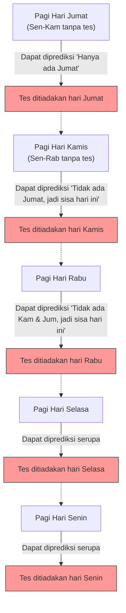

## 1. "Deklarasi Mutlak" Guru

Pada suatu perjalanan pulang di hari Jumat, guru matematika menyampaikan deklarasi yang menakutkan kepada para siswanya.

**"Minggu depan, pada salah satu hari dari Senin hingga Jumat, saya akan mengadakan 'tes dadakan' satu kali saja.**
**Namun, jika pada pagi harinya kalian bisa dengan pasti memprediksi bahwa 'hari ini adalah hari tes', maka itu bukan tes dadakan, sehingga tes tidak akan diadakan pada hari itu."**

Mendengar deklarasi ini, para siswa gemetar ketakutan. Mereka harus menghabiskan setiap hari dengan rasa cemas karena tidak tahu kapan tes akan diadakan.
Namun, Siswa A, yang paling pintar di kelas, tiba-tiba tersenyum licik dan berdiri.

"Teman-teman, kalian bisa tenang. **Minggu depan, tidak mungkin sama sekali akan ada tes dadakan. Secara logika itu tidak mungkin!**"

Siswa A dengan penuh percaya diri mulai menuliskan "logika sempurna" berikut ini di papan tulis.

---

## 2. Bukti Berdasarkan "Logika Sempurna" Siswa A

Bukti Siswa A menggunakan teknik matematika yaitu **berpikir mundur mulai dari "hari Jumat" (penalaran mundur)**.

### Langkah 1: Menghilangkan Kemungkinan Hari Jumat
> Mari asumsikan tes tidak diadakan selama 4 hari: Senin, Selasa, Rabu, dan Kamis.
> Kalau begitu, satu-satunya hari yang tersisa adalah "Jumat".
> Pada Jumat pagi, para siswa akan dapat **memprediksi dengan pasti** bahwa "Sisa hari ini saja, jadi pastinya hari ini adalah hari tes!".
> Menurut deklarasi guru, "tes tidak diadakan pada hari yang dapat diprediksi", sehingga secara logika tidak mungkin mengadakan tes dadakan pada hari Jumat.
> **Oleh karena itu, tes pada hari Jumat sama sekali tidak mungkin.**

### Langkah 2: Menghilangkan Kemungkinan Hari Kamis
> Telah dipastikan bahwa tidak ada tes pada hari Jumat.
> Artinya, hari terakhir yang memungkinkan untuk diadakannya tes adalah "Kamis".
> Mari asumsikan tes tidak diadakan selama 3 hari: Senin, Selasa, dan Rabu.
> Kalau begitu, satu-satunya kemungkinan yang tersisa adalah Kamis (Jumat sudah dieliminasi).
> Pada Kamis pagi, para siswa akan dapat memprediksi dengan pasti bahwa "Hari ini adalah hari tes!".
> **Oleh karena itu, tes pada hari Kamis juga sama sekali tidak mungkin.**

### Langkah 3: Semua Hari Menghilang
> Kita hanya perlu mengulangi logika yang sama.
> Jika tidak ada hari Kamis, maka hari terakhir adalah Rabu. Oleh karena itu, jika tidak ada tes hingga hari Selasa, akan dapat diprediksi pada Rabu pagi, sehingga hari Rabu juga menghilang.
> Jika hari Rabu menghilang, hari Selasa juga menghilang, dan hari Senin pun menghilang.
> **Kesimpulan: Selama mengikuti aturan guru, sama sekali tidak mungkin mengadakan tes dadakan pada hari apa pun dari Senin hingga Jumat!**

Para siswa di kelas bersorak gembira. Logika Siswa A sangat sempurna dan sepertinya tidak ada celah di mana pun.
Mereka menikmati akhir pekan dengan bersenang-senang, sama sekali tidak belajar untuk tes, dan menyambut hari Senin.

Senin...... Tidak ada tes. "Tuh kan!"
Selasa...... Tidak ada tes. "Seperti kata Siswa A!"

Dan **pada Rabu pagi**.
Srak! Pintu kelas terbuka, guru masuk dan berkata.

**"Baiklah, bersihkan meja kalian. Kita akan mulai tes dadakan sekarang!"**

Para siswa panik.
"Ke, kenapa!? Kami **sama sekali tidak memprediksi** akan ada tes di hari Rabu!"

Guru tersenyum licik.
**"Lihat, kalian tidak bisa memprediksinya kan? 'Deklarasi' saya sepenuhnya benar, dan tes dadakan telah berhasil dilaksanakan sesuai aturan."**

---

## 3. Di Mana Sebenarnya Logikanya Salah?

Padahal bukti Siswa A tampak sempurna, mengapa dalam kenyataannya "tes dadakan yang sempurna" malah berhasil dilaksanakan?
Masalah ini awalnya disebut "Paradoks Hukuman Gantung Tak Terduga" (Unexpected Hanging Paradox), dan sejak dikemukakan oleh matematikawan Swedia Lennart Ekbom pada tahun 1940-an, terus membingungkan para filsuf dan ahli logika.

Sebenarnya, belum ada pandangan terpadu yang menyatakan "ini adalah satu-satunya jawaban mutlak yang benar" untuk paradoks ini. Namun, ada beberapa pendekatan menjanjikan untuk menyelesaikannya.

### Pendekatan 1: "Paradoks Pengetahuan (Epistemologi)"
Jebakan terbesar dari penalaran Siswa A adalah ia **memasukkan asumsi "deklarasi guru 100% benar" ke dalam prediksinya sendiri**.

Deklarasi guru terdiri dari dua kondisi: "mengadakan tes minggu depan (P)" dan "tidak mengadakannya pada hari yang dapat diprediksi (Q)".
Jika tidak ada tes hingga hari Jumat, siswa akan berpikir "jika deklarasinya benar, maka hanya hari ini yang tersisa", tetapi pada saat yang sama, "jika bisa diprediksi hari ini, maka itu bertentangan dengan kondisi Q dari deklarasi. Kalau begitu, mungkinkah deklarasi P (mengadakan tes) itu sendiri adalah kebohongan sejak awal?". Hal ini memberi ruang untuk keraguan.

Akibat dari benturan antara keyakinan "kata-kata guru pasti benar" dan "penalaran logis", para siswa mendapatkan kesimpulan yang salah (keyakinan) bahwa "guru tidak akan mengadakan tes", dan sebagai hasilnya, kapan pun tes diberikan, itu akan menjadi keadaan yang "tidak terduga (dadakan)".

### Pendekatan 2: "Paradoks Referensi Diri"
Mari kita ubah kata-kata guru menjadi ekspresi logika.
Misalkan pernyataan guru adalah $S$.
$S = $ "Saya akan mengadakan tes pada suatu hari $T$. Dan kalian tidak akan bisa memprediksi hari $T$ itu."

Pernyataan ini memiliki **"struktur referensi diri" (self-referential structure)**, di mana kebenaran atau kesalahannya bergantung pada bagaimana siswa memahami pernyataan itu (deklarasi) sendiri. Sama seperti "Paradoks Pembohong" ("Kalimat ini adalah kebohongan"), hal ini memiliki sifat yang membuat penalaran logis berputar-putar dalam putaran tak berujung.

---

## 4. "Tes Dadakan" yang Tersembunyi dalam Kehidupan Sehari-hari

Paradoks ini tidak hanya berlaku dalam matematika, tetapi juga dapat diterapkan pada kehidupan sehari-hari di sekitar kita.

**【Dilema Pesta Kejutan】**
> Misalkan teman Anda mendeklarasikan, "Bulan ini, saya akan mengadakan pesta kejutan di hari ulang tahunmu!".
> Mendengar hal ini, Anda setiap hari memprediksi, "Apakah hari ini? Apakah besok?".
> Jika tidak ada pesta sampai hari terakhir di akhir bulan, Anda akan menyimpulkan, "Untuk memenuhi syarat 'kejutan' (tidak dapat diprediksi), pesta itu sama sekali tidak bisa dilakukan di hari terakhir...".
> Namun kenyataannya, jika tiba-tiba kue muncul pada pertengahan bulan yang acak, Anda akan merasa "benar-benar terkejut!" dan mengalami kejutan yang sempurna.

---

## 5. Kesimpulan

"Paradoks Tes Dadakan" dengan apik mengekspresikan **betapa sulitnya memasukkan keadaan "mengetahui (memprediksi)" manusia itu sendiri ke dalam perhitungan logika**.

Apa yang kita anggap sebagai "penalaran sempurna" mungkin sebenarnya hanyalah istana pasir yang dibangun di atas keyakinan tak berdasar bahwa "pihak lain pasti mematuhi aturan".
Jika guru Anda selanjutnya berkata "Saya akan mengadakan tes dadakan", hal yang paling rasional untuk dilakukan tampaknya adalah berhenti memutar balik logika dan diam-diam belajar setiap hari.
