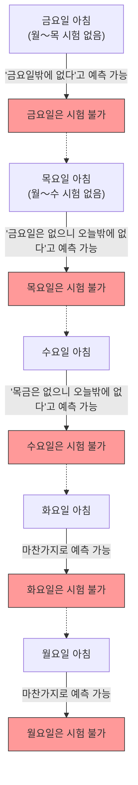

## 1. 선생님의 "절대적인 선언"

어느 금요일 하굣길, 수학 선생님이 학생들을 향해 무서운 선고를 했습니다.

**"다음 주 월요일부터 금요일 중 하루에, 단 한 번만 '깜짝 시험'을 실시하겠다.**
**단, 그날 아침 시점에 너희들이 '오늘이 시험 날이다'라고 확실하게 예측할 수 있다면, 그것은 깜짝 시험이 아니므로 그날에는 시험을 치르지 않겠다"**

이 선언을 듣고 학생들은 두려움에 떨었습니다. 언제 시험이 치러질지 매일 조마조마하며 지내야 했기 때문입니다.
하지만 반에서 가장 똑똑한 A군이 갑자기 씩 웃으며 일어났습니다.

"얘들아, 안심해도 돼. **다음 주에 깜짝 시험이 치러지는 일은 절대 있을 수 없어. 논리적으로 불가능해!**"

A군은 자신만만하게 다음과 같은 "완벽한 논리"를 칠판에 적기 시작했습니다.

---

## 2. A군의 "완벽한 논리"에 의한 증명

A군의 증명은 **"금요일"부터 시간을 거슬러 올라가며 생각하는(역방향 추론)** 수학적 기법을 사용하고 있습니다.

### 1단계: 금요일의 가능성을 지운다
> 만약, 월·화·수·목 4일 동안 계속 시험이 치러지지 않았다고 가정해 보자.
> 그러면 남은 날은 "금요일"밖에 없다.
> 금요일 아침 시점에 학생들은 "남은 날은 오늘밖에 없으니, 틀림없이 오늘이 시험이다!"라고 **확실하게 예측해 버릴 수 있다**.
> 선생님의 선언에 따르면, "예측할 수 있는 날에는 실시하지 않는다"고 했으므로, 금요일에 깜짝 시험을 실시하는 것은 논리적으로 불가능하다.
> **따라서, 금요일 시험은 절대 없다.**

### 2단계: 목요일의 가능성을 지운다
> 금요일에 시험이 없다는 것이 확정되었다.
> 그렇다는 것은 시험이 치러질 가능성이 있는 마지막 날은 "목요일"이다.
> 만약 월·화·수 3일 동안 시험이 치러지지 않았다고 가정해 보자.
> 그러면 남은 가능성은 목요일밖에 없다(금요일은 이미 소거됨).
> 목요일 아침 시점에 학생들은 "오늘이 시험이다!"라고 확실하게 예측해 버릴 수 있다.
> **따라서, 목요일 시험도 절대 없다.**

### 3단계: 모든 요일이 지워진다
> 같은 논리를 반복하면 된다.
> 목요일이 없다면, 마지막 날은 수요일이 된다. 따라서 화요일까지 시험이 없다면, 수요일 아침에 예측할 수 있게 되므로 수요일도 지워진다.
> 수요일이 지워지면 화요일도 지워지고, 월요일도 지워진다.
> **결론: 선생님의 규칙을 지키는 한, 월요일부터 금요일 중 어느 요일이든 절대 깜짝 시험을 실시하는 것은 불가능하다!**

반 학생들은 환호했습니다. A군의 논리는 완벽했고, 어디에도 빈틈이 없어 보였습니다.
그들은 주말을 즐겁게 놀며 보냈고, 시험 공부 따위는 전혀 하지 않은 채 월요일을 맞이했습니다.

월요일…… 시험은 없었습니다. "거봐!"
화요일…… 시험은 없었습니다. "A군 말이 맞았어!"

그리고 **수요일 아침**.
드르륵! 하고 교실 문이 열리고, 선생님이 들어와서 말했습니다.

**"자, 책상 위를 치워라. 지금부터 깜짝 시험을 시작하겠다!"**

학생들은 패닉에 빠졌습니다.
"어, 어째서!? 수요일에 시험이 있을 줄은, **전혀 예측하지 못했다!**"

선생님은 씩 웃었습니다.
**"거봐, 너희들은 예측하지 못했지? 내 '선언'은 완전히 옳았고, 규칙대로 깜짝 시험은 성립한 것이다"**

---

## 3. 도대체 어디서 논리가 잘못되었던 것일까?

A군의 증명은 완벽해 보였는데, 왜 현실에서는 "완벽한 깜짝 시험"이 성립해 버린 것일까요?
이 문제는 원래 "예기치 못한 교수형의 역설(Unexpected hanging paradox)"이라고 불리며, 1940년대에 스웨덴의 수학자 렌나르트 에크봄(Lennart Ekbom)이 고안한 이래 철학자와 논리학자들을 계속 괴롭혀 왔습니다.

사실, 이 역설에는 "이것이 유일하고 절대적인 정답이다"라는 통일된 견해가 아직 없습니다. 하지만, 몇 가지 유력한 해결 접근법이 존재합니다.

### 접근법 1: "지식의 역설(인식론)"
A군 추론의 가장 큰 함정은, **"선생님의 선언은 100% 진실이다"라는 전제를 자기 자신의 예측 안에 포함시켜 버렸다**는 것입니다.

선생님의 선언은, "다음 주에 시험을 치른다(P)"와 "예측할 수 있는 날에는 치르지 않는다(Q)"의 두 가지 조건으로 이루어져 있습니다.
만약 금요일까지 시험이 없었을 경우, 학생은 "선언이 맞다면 오늘밖에 없다"고 생각하지만, 동시에 "오늘이라고 예측할 수 있다면 선언의 Q에 어긋난다. 그렇다면 애초에 P(시험을 치른다)라는 선언 자체가 거짓말이었던 것은 아닐까?"라고 의심할 여지가 생깁니다.

"선생님의 말씀이 절대적으로 맞다"는 믿음과, "논리적 추론"이 충돌한 결과, 학생들은 "선생님은 시험을 치르지 않는다"라는 잘못된 결론(믿음)을 품게 되었고, 그 결과로 언제 시험이 나오더라도 "예기치 못한(깜짝)" 상태가 되어버린 것입니다.

### 접근법 2: "자기 지시의 역설"
선생님의 말씀을 논리식으로 고쳐 봅시다.
선생님의 주장을 $S$ 라고 합니다.
$S = $ "나는 어느 날 $T$ 에 시험을 치른다. 그리고, 너희들은 그날 $T$ 를 예측할 수 없다."

이 주장은 자기 자신(선언)을 학생들이 어떻게 받아들이느냐에 따라 참과 거짓이 바뀌는, **"자기 지시적인 구조"**를 가지고 있습니다. "거짓말쟁이의 역설('이 문장은 거짓이다')"과 마찬가지로, 논리적인 추론을 빙글빙글 무한 루프에 빠지게 만드는 성질이 있는 것입니다.

---

## 4. 일상생활에 숨어있는 "깜짝 시험"

이 역설은 수학뿐만 아니라, 우리의 친숙한 생활에도 응용됩니다.

**【서프라이즈 파티의 딜레마】**
> "이번 달 네 생일에 서프라이즈 파티를 할게!"라고 친구가 선언했다고 합시다.
> 이 말을 들은 당신은, "오늘일까? 내일일까?"라며 매일 예상합니다.
> 월말의 마지막 날이 되어도 파티가 없다면, "서프라이즈(예상할 수 없다)"라는 조건을 만족하기 위해서는 마지막 날에는 절대 할 수 없을 텐데…… 라고 추론해 버립니다.
> 하지만 현실에서는 적당한 중순에 갑자기 케이크가 나오면, 당신은 "정말 깜짝 놀랐어!"라며 완벽한 서프라이즈를 받게 되는 것입니다.

---

## 5. 요약

"깜짝 시험의 역설"은 인간의 **"알고 있다(예측하고 있다)"라는 상태 자체를 논리 계산에 포함시키는 것의 어려움**을 훌륭하게 표현하고 있습니다.

우리가 "완벽한 추론"이라고 생각하는 것은, 사실 "상대방이 규칙을 절대적으로 지킬 것이다"라는 근거 없는 믿음 위에 세워진 모래성에 불과할지도 모릅니다.
다음에 선생님이 "깜짝 시험을 치르겠다"고 말씀하시면, 논리를 억지로 짜맞추는 것은 그만두고 얌전히 매일 공부해 두는 것이 가장 합리적이라고 할 수 있겠습니다.
