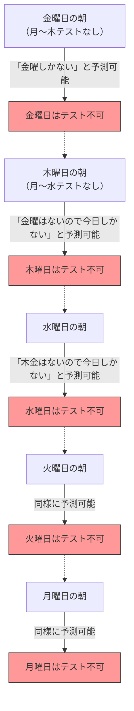

## 1. 先生の「絶対の宣言」

ある金曜日の帰り道、数学の先生が生徒たちに向かって、恐ろしい宣告をしました。

**「来週の月曜日から金曜日のいずれかの日に、一度だけ『抜き打ちテスト』を実施する。**
**ただし、その日の朝の時点でお前たちが『今日がテストの日だ』と確実に予測できた場合、それは抜き打ちにならないので、その日にテストは実施しない」**

この宣言を聞いて、生徒たちは震え上がりました。いつテストが行われるのか、毎日ビクビクしながら過ごさなければならないからです。
しかし、クラスで一番の秀才であるA君が、突然ニヤリと笑って立ち上がりました。

「みんな、安心していいよ。**来週、抜き打ちテストが行われることは絶対にあり得ない。論理的に不可能だ！**」

A君は自信満々に、次のような「完璧な論理」を黒板に書き始めました。

---

## 2. A君の「完璧な論理」による証明

A君の証明は、**「金曜日」から時間をさかのぼって考える（後ろ向き推論）**という数学的なテクニックを使っています。

### ステップ1：金曜日の可能性を消す
> もし、月・火・水・木の4日間、ずっとテストが実施されなかったとしよう。
> すると、残された日は「金曜日」しかない。
> 金曜日の朝の時点で、生徒たちは「残るは今日しかないので、間違いなく今日がテストだ！」と**確実に予測できてしまう**。
> 先生の宣言によれば、「予測できた日は実施しない」のだから、金曜日に抜き打ちテストを実施することは論理的に不可能である。
> **よって、金曜日のテストは絶対にない。**

### ステップ2：木曜日の可能性を消す
> 金曜日にテストがないことが確定した。
> ということは、テストが実施される可能性がある最終日は「木曜日」だ。
> もし、月・火・水の3日間テストが実施されなかったとしよう。
> すると、残された可能性は木曜日しかない（金曜日はすでに消去済み）。
> 木曜日の朝の時点で、生徒たちは「今日がテストだ！」と確実に予測できてしまう。
> **よって、木曜日のテストも絶対にない。**

### ステップ3：すべての曜日が消える
> 同じ論理を繰り返せばいい。
> 木曜日がないなら、最終日は水曜日になる。よって火曜日までテストがなければ、水曜日の朝に予測できてしまうため、水曜日も消える。
> 水曜日が消えれば、火曜日も消え、月曜日も消える。
> **結論：先生のルールを守る限り、月曜から金曜のどの曜日であっても、絶対に抜き打ちテストを実施することは不可能である！**

クラスの生徒たちは歓喜しました。A君の論理は完璧で、どこにも隙がないように見えました。
彼らは週末を楽しく遊び呆け、テスト勉強など一切せずに月曜日を迎えました。

月曜日……テストはありませんでした。「ほらね！」
火曜日……テストはありませんでした。「A君の言う通りだ！」

そして**水曜日の朝**。
ガラッ！と教室のドアが開き、先生が入ってきて言いました。

**「はい、机の上を片付けて。今から抜き打ちテストを始めるぞ！」**

生徒たちはパニックに陥りました。
「な、なぜだ！？ 水曜日にテストがあるなんて、**全く予測していなかった！**」

先生はニヤリと笑いました。
**「ほら、お前たちは予測できなかっただろう？ 私の『宣言』は完全に正しかったし、ルール通りに抜き打ちテストは成立したのだよ」**

---

## 3. 一体どこで論理が間違えていたのか？

A君の証明は完璧に見えたのに、なぜ現実には「完全な抜き打ちテスト」が成立してしまったのでしょうか？
この問題はもともと「予期せぬ絞首刑のパラドックス」と呼ばれ、1940年代にスウェーデンの数学者レンナート・エクボムによって考案されて以来、哲学者や論理学者を悩ませ続けています。

実は、このパラドックスには「これが唯一絶対の正解だ」という統一的な見解がまだありません。しかし、いくつかの有力な解決へのアプローチが存在します。

### アプローチ1：「知識のパラドックス（認識論）」
A君の推論の最大の落とし穴は、**「先生の宣言は100%真実である」という前提を、自分自身の予測の中に組み込んでしまった**ことです。

先生の宣言は、「来週テストを行う（P）」と「予測できた日には行わない（Q）」の2つの条件から成り立っています。
もし金曜日までテストがなかった場合、生徒は「宣言が正しいなら今日しかない」と考えますが、同時に「今日だと予測できるなら宣言のQに反する。ならばそもそもP（テストを行う）という宣言自体が嘘だったのではないか？」と疑う余地が生まれます。

「先生の言葉が絶対に正しい」という信念と、「論理的推論」が衝突した結果、生徒たちは「先生はテストをやらない」という誤った結論（信念）を抱いてしまい、その結果として、いつテストを出されても「予期せぬ（抜き打ち）」状態になってしまったのです。

### アプローチ2：「自己言及のパラドックス」
先生の言葉を論理式に直してみましょう。
先生の主張を $S$ とします。
$S = $ 「私はある日 $T$ にテストを行う。かつ、お前たちはその日 $T$ を予測できない。」

この主張は、自分自身（宣言）を生徒たちがどう受け取るかによって真偽が変わる、**「自己言及的な構造」**を持っています。「嘘つきのパラドックス（『この文は嘘である』）」と同じように、論理的な推論をぐるぐると無限ループさせてしまう性質があるのです。

---

## 4. 日常生活に潜む「抜き打ちテスト」

このパラドックスは、数学だけでなく、私たちの身近な生活にも応用されます。

**【サプライズ・パーティーのジレンマ】**
> 「今月、君の誕生日にサプライズパーティーをするよ！」と友人が宣言したとします。
> これを聞いたあなたは、「今日かな？ 明日かな？」と毎日予想します。
> 月末の最終日になってもパーティーがなかったら、「サプライズ（予想できない）」という条件を満たすためには、最終日には絶対にできないはずだ……と推論してしまいます。
> しかし現実には、適当な中旬に突然ケーキが出てくれば、あなたは「本当にびっくりした！」と完璧なサプライズを受けてしまうのです。

---

## 5. まとめ

「抜き打ちテストのパラドックス」は、人間の**「知っている（予測している）」という状態そのものを論理の計算に含めることの難しさ**を見事に表現しています。

私たちが「完璧な推論」だと思っているものは、実は「相手がルールを絶対に守る」という根拠のない信念の上に成り立っている砂上の楼閣に過ぎないのかもしれません。
次に先生が「抜き打ちテストをするぞ」と言ったら、論理をこねくり回すのはやめて、大人しく毎日勉強しておくのが一番合理的だと言えそうです。
