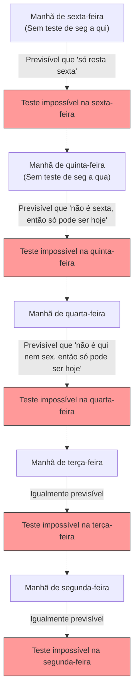

## 1. A "Declaração Absoluta" do Professor

No caminho de volta para casa, em uma sexta-feira, o professor de matemática fez uma declaração assustadora para os alunos.

**"Na próxima semana, em algum dia de segunda a sexta-feira, farei um 'teste surpresa' apenas uma vez.**
**No entanto, se na manhã desse dia vocês puderem prever com certeza que 'hoje é o dia do teste', não será uma surpresa e, portanto, o teste não será realizado nesse dia."**

Ao ouvir essa declaração, os alunos estremeceram. Isso porque eles teriam que viver com medo todos os dias, sem saber quando o teste ocorreria.
No entanto, o aluno A, o mais inteligente da classe, de repente sorriu e se levantou.

"Pessoal, podem ficar tranquilos. **É absolutamente impossível que haja um teste surpresa na próxima semana. É logicamente impossível!**"

O aluno A, cheio de confiança, começou a escrever a seguinte "lógica perfeita" no quadro-negro.

---

## 2. A Prova pela "Lógica Perfeita" do Aluno A

A prova do aluno A usa uma técnica matemática de **raciocinar de trás para frente (inferência reversa) a partir de "Sexta-feira"**.

### Passo 1: Eliminar a possibilidade da sexta-feira
> Suponha que o teste não tenha sido realizado durante os 4 dias de segunda, terça, quarta e quinta-feira.
> Então, o único dia restante é a "Sexta-feira".
> Na manhã de sexta-feira, os alunos **poderão prever com certeza**: "Como hoje é o único dia restante, sem dúvida o teste é hoje!".
> De acordo com a declaração do professor, "o teste não será realizado em dias que puderem ser previstos", portanto, é logicamente impossível realizar o teste surpresa na sexta-feira.
> **Logo, absolutamente não haverá teste na sexta-feira.**

### Passo 2: Eliminar a possibilidade da quinta-feira
> Está confirmado que não haverá teste na sexta-feira.
> Isso significa que o último dia em que o teste pode ser realizado é a "Quinta-feira".
> Suponha que o teste não tenha sido realizado durante os 3 dias de segunda, terça e quarta-feira.
> Então, a única possibilidade restante é a quinta-feira (já que a sexta-feira foi eliminada).
> Na manhã de quinta-feira, os alunos poderão prever com certeza: "O teste é hoje!".
> **Logo, também absolutamente não haverá teste na quinta-feira.**

### Passo 3: Todos os dias da semana desaparecem
> Basta repetir a mesma lógica.
> Se não há quinta-feira, o último dia passa a ser quarta-feira. Portanto, se não houver teste até terça-feira, isso poderá ser previsto na manhã de quarta-feira, eliminando também a quarta-feira.
> Se a quarta-feira for eliminada, a terça-feira também será, e a segunda-feira também.
> **Conclusão: Desde que as regras do professor sejam seguidas, é absolutamente impossível realizar um teste surpresa em qualquer dia de segunda a sexta-feira!**

Os alunos da classe comemoraram. A lógica do aluno A parecia perfeita e não tinha brechas.
Eles passaram o fim de semana brincando alegremente e chegaram à segunda-feira sem estudar nada para o teste.

Segunda-feira... não houve teste. "Estão vendo!"
Terça-feira... não houve teste. "O aluno A tinha razão!"

E então, na **manhã de quarta-feira**.
A porta da sala de aula se abriu de repente, e o professor entrou dizendo:

**"Muito bem, guardem tudo em cima das mesas. Vamos começar o teste surpresa agora!"**

Os alunos entraram em pânico.
"C-Como assim!? Que haveria um teste na quarta-feira, **ninguém tinha previsto de forma alguma!**"

O professor sorriu.
**"Viram só? Vocês não conseguiram prever, não é? A minha 'declaração' estava completamente correta, e o teste surpresa se concretizou de acordo com as regras."**

---

## 3. Onde afinal a lógica falhou?

Embora a prova do aluno A parecesse perfeita, por que na realidade um "teste perfeitamente surpresa" se concretizou?
Esse problema é originalmente chamado de "Paradoxo do Enforcamento Inesperado" e, desde que foi proposto pelo matemático sueco Lennart Ekbom na década de 1940, continua a intrigar filósofos e lógicos.

Na verdade, ainda não existe um consenso unificado que diga "esta é a única resposta absolutamente correta" para este paradoxo. No entanto, existem algumas abordagens promissoras para resolvê-lo.

### Abordagem 1: "O Paradoxo do Conhecimento (Epistemologia)"
A maior armadilha no raciocínio do aluno A foi **ter incorporado a premissa de que "a declaração do professor é 100% verdadeira" em suas próprias previsões**.

A declaração do professor consiste em duas condições: "O teste será realizado na próxima semana (P)" e "Não será realizado nos dias em que puder ser previsto (Q)".
Se o teste não tiver ocorrido até sexta-feira, os alunos pensariam "se a declaração for verdadeira, só pode ser hoje", mas ao mesmo tempo surgiria a dúvida: "Se pudermos prever que é hoje, isso viola o Q da declaração. Então, a própria declaração P (de que o teste seria realizado) não seria uma mentira desde o início?".

Como resultado do conflito entre a crença de que "as palavras do professor são absolutamente corretas" e o "raciocínio lógico", os alunos chegaram à conclusão errônea (crença) de que "o professor não fará o teste", e, como consequência disso, sempre que o teste fosse aplicado, seria uma situação "inesperada (surpresa)".

### Abordagem 2: "O Paradoxo da Autorreferência"
Vamos converter as palavras do professor em uma fórmula lógica.
Seja $S$ a afirmação do professor.
$S = $ "Eu farei um teste em um dia $T$. E vocês não poderão prever esse dia $T$."

Esta afirmação tem uma **"estrutura autorreferencial"**, cuja verdade ou falsidade muda dependendo de como os próprios alunos percebem a afirmação (declaração). Assim como o "Paradoxo do Mentiroso ('Esta frase é falsa')", tem a propriedade de colocar o raciocínio lógico em um loop infinito.

---

## 4. "Testes Surpresa" no Cotidiano

Esse paradoxo se aplica não apenas à matemática, mas também à nossa vida cotidiana.

**[O Dilema da Festa Surpresa]**
> Suponha que um amigo declare: "Este mês, faremos uma festa surpresa para o seu aniversário!".
> Ao ouvir isso, você tenta adivinhar todos os dias: "Será hoje? Será amanhã?".
> Se a festa não acontecer até o último dia do mês, você raciocinará que, para satisfazer a condição de "surpresa (imprevisível)", ela absolutamente não poderá ser realizada no último dia...
> Mas na realidade, se um bolo aparecer de repente no meio do mês, você terá um choque genuíno: "Eu realmente me surpreendi!", recebendo uma surpresa perfeita.

---

## 5. Conclusão

O "Paradoxo do Teste Surpresa" expressa brilhantemente a **dificuldade de incluir o próprio estado de 'saber (prever)' em cálculos lógicos**.

O que consideramos um "raciocínio perfeito" pode não passar de um castelo de areia construído sobre a crença infundada de que "a outra pessoa seguirá as regras rigorosamente".
Da próxima vez que um professor disser "Vou fazer um teste surpresa", parece que o mais racional a se fazer é parar de complicar a lógica e simplesmente estudar obedientemente todos os dias.
