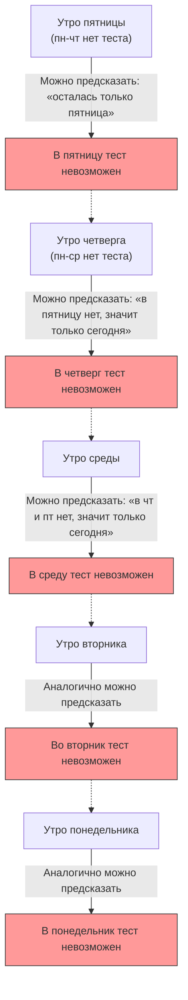

## 1. «Абсолютное заявление» учителя

Однажды в пятницу, по пути домой, учитель математики сделал своим ученикам пугающее заявление.

**«На следующей неделе, в один из дней с понедельника по пятницу, я проведу "неожиданный тест" ровно один раз.**
**Однако, если утром того же дня вы сможете с уверенностью предсказать, что "сегодня день теста", это уже не будет неожиданностью, и в этот день тест проводиться не будет».**

Услышав это заявление, ученики задрожали от страха. Ведь им придется каждый день жить в напряжении, не зная, когда именно будет тест.
Однако ученик А, самый блестящий в классе, вдруг усмехнулся и встал.

«Ребята, можете расслабиться. **Абсолютно невозможно, чтобы на следующей неделе был неожиданный тест. Это логически невозможно!**»

Ученик А с полной уверенностью начал писать на доске следующую «безупречную логику».

---

## 2. Доказательство с помощью «безупречной логики» ученика А

Доказательство ученика А использует математический метод, называемый **обратным рассуждением (рассуждение в обратном направлении), начиная с «пятницы»**.

### Шаг 1: Исключение вероятности пятницы
> Предположим, что в течение четырех дней — понедельника, вторника, среды и четверга — тест так и не был проведен.
> Тогда единственным оставшимся днем будет «пятница».
> Утром в пятницу ученики смогут **с уверенностью предсказать**: «Остался только сегодняшний день, поэтому тест, без сомнения, будет сегодня!»
> Согласно заявлению учителя, «если день можно предсказать, тест проводиться не будет», поэтому логически невозможно провести неожиданный тест в пятницу.
> **Следовательно, теста в пятницу абсолютно точно не будет.**

### Шаг 2: Исключение вероятности четверга
> Было установлено, что в пятницу теста не будет.
> Это означает, что последним возможным днем для проведения теста является «четверг».
> Предположим, что в течение трех дней — понедельника, вторника и среды — тест так и не был проведен.
> Тогда единственным оставшимся возможным днем будет четверг (пятница уже исключена).
> Утром в четверг ученики смогут с уверенностью предсказать: «Тест будет сегодня!»
> **Следовательно, теста в четверг тоже абсолютно точно не будет.**

### Шаг 3: Исключение всех дней недели
> Достаточно просто повторить ту же логику.
> Если не четверг, то последним днем будет среда. Следовательно, если до вторника теста не было, его можно будет предсказать утром в среду, поэтому среда также исключается.
> Если исключается среда, то исключается и вторник, и понедельник.
> **Вывод: пока соблюдаются правила учителя, провести неожиданный тест в любой день с понедельника по пятницу абсолютно невозможно!**

Ученики в классе обрадовались. Логика ученика А казалась безупречной и не имела никаких изъянов.
Они весело провели выходные и, совершенно не готовясь к тесту, встретили понедельник.

Понедельник... теста не было. «Ну вот!»
Вторник... теста не было. «А ведь прав был!»

И вот **утро среды**.
Дверь класса с грохотом открывается, входит учитель и говорит:

**«Итак, уберите всё со столов. Мы начинаем неожиданный тест прямо сейчас!»**

Ученики впали в панику.
«Н-но как!? Мы **абсолютно не ожидали**, что тест будет в среду!»

Учитель усмехнулся.
**«Вот видите, вы же не смогли его предсказать? Мое "заявление" было абсолютно верным, и неожиданный тест состоялся точно по правилам».**

---

## 3. Где именно была ошибка в логике?

Хотя доказательство ученика А казалось безупречным, почему же в реальности «совершенно неожиданный тест» все-таки состоялся?
Эта проблема изначально называлась «Парадоксом неожиданной казни», и она была придумана шведским математиком Леннартом Экбомом в 1940-х годах и с тех пор продолжает мучить философов и логиков.

На самом деле, для этого парадокса до сих пор нет единого мнения о том, каков «единственно правильный ответ». Однако существует несколько основных подходов к его разрешению.

### Подход 1: «Парадокс знания (эпистемология)»
Самая большая ловушка в рассуждениях ученика А заключалась в том, что он **включил в свои предсказания предпосылку о том, что «заявление учителя на 100% истинно»**.

Заявление учителя состоит из двух условий: «на следующей неделе будет проведен тест» (P) и «он не будет проведен в день, который можно предсказать» (Q).
Если тест не был проведен до пятницы, ученик подумает: «Если заявление верно, остается только сегодняшний день», но в то же время появится сомнение: «Если я могу предсказать, что это будет сегодня, это противоречит условию Q заявления. Значит, само по себе заявление P (о проведении теста) с самого начала было ложью?»

В результате конфликта между убеждением, что «слова учителя абсолютно верны», и «логическим выводом», ученики пришли к ошибочному выводу (убеждению), что «учитель не будет проводить тест», и в результате, когда бы ни был проведен тест, они всегда оказывались в ситуации «неожиданности».

### Подход 2: «Парадокс самореференции»
Давайте переведем слова учителя в логическое выражение.
Пусть утверждение учителя будет $S$.
$S = $ «Я проведу тест в некоторый день $T$. И вы не сможете предсказать этот день $T$.»

Это утверждение имеет **«самореферентную структуру»**, при которой его истинность или ложность меняется в зависимости от того, как сами ученики воспринимают само утверждение (заявление). Подобно «Парадоксу лжеца» («Это утверждение ложно»), оно обладает свойством зацикливать логические рассуждения в бесконечный цикл.

---

## 4. «Неожиданные тесты», скрывающиеся в повседневной жизни

Этот парадокс применим не только в математике, но и в нашей повседневной жизни.

**[Дилемма вечеринки-сюрприза]**
> Предположим, ваш друг заявляет: «В этом месяце я устрою тебе вечеринку-сюрприз на день рождения!»
> Услышав это, вы каждый день гадаете: «Сегодня? Завтра?»
> Если даже в последний день месяца вечеринки не было, вы приходите к выводу, что для выполнения условия «сюрприз (непредсказуемость)», она абсолютно не может состояться в последний день...
> Однако на деле, если где-то в середине месяца внезапно выносят торт, вы получаете идеальный сюрприз с мыслью: «Я действительно был удивлен!»

---

## 5. Заключение

«Парадокс неожиданной казни» (неожиданного теста) блестяще демонстрирует **сложность включения самого состояния «знания (предсказания)» человека в логические вычисления**.

То, что мы считаем «безупречным рассуждением», на самом деле может оказаться лишь замком на песке, построенным на необоснованном убеждении, что «оппонент будет абсолютно соблюдать правила».
Если в следующий раз учитель скажет: «Я устрою неожиданный тест», кажется, самым рациональным решением будет перестать мудрить с логикой и просто покорно учиться каждый день.
