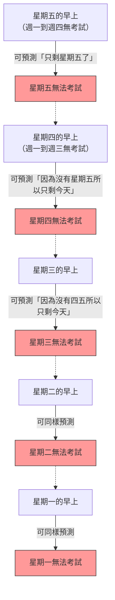

## 1. 老師的「絕對宣言」

某個星期五的放學路上，數學老師對著學生們宣布了一項可怕的宣告。

**「下週一到週五的其中一天，我只會舉行一次『突擊考試』。**
**但是，如果在當天早上你們能夠確切預測『今天就是考試的日子』，那就不算是突擊，所以當天就不會舉行考試。」**

聽到這項宣言，學生們都嚇得發抖。因為他們必須每天提心吊膽地度過，不知道考試到底什麼時候會舉行。
然而，班上最聰明的A同學突然露出微笑並站了起來。

「大家放心吧。**下週絕對不可能舉行突擊考試。這在邏輯上是不可能的！**」

A同學充滿自信地，開始在黑板上寫下如下的「完美邏輯」。

---

## 2. A同學基於「完美邏輯」的證明

A同學的證明使用了一種稱為**「從星期五開始往回推算（反向推理）」**的數學技巧。

### 步驟1：消除星期五的可能性
> 假設星期一、二、三、四這四天都一直沒有舉行考試。
> 那麼，剩下的日子只有「星期五」。
> 在星期五早上的時候，學生們**就能確切預測**：「因為只剩下今天了，毫無疑問今天就是考試！」
> 根據老師的宣言，「被預測到的日子就不會舉行」，因此在星期五舉行突擊考試在邏輯上是不可能的。
> **所以，絕對不會有星期五的考試。**

### 步驟2：消除星期四的可能性
> 既然已經確定星期五沒有考試。
> 這意味著，可能舉行考試的最後一天是「星期四」。
> 假設星期一、二、三這三天都沒有舉行考試。
> 那麼，剩下的可能性只有星期四（星期五已經被排除了）。
> 在星期四早上的時候，學生們就能確切預測：「今天就是考試！」
> **所以，也絕對不會有星期四的考試。**

### 步驟3：所有的星期都被消除
> 只要重複同樣的邏輯即可。
> 如果沒有星期四，最後一天就會變成星期三。因此如果到星期二都沒有考試，星期三早上就能預測到，所以星期三也被排除了。
> 星期三被排除，星期二也被排除，星期一也被排除。
> **結論：只要遵守老師的規則，無論是從星期一到星期五的哪一天，絕對不可能舉行突擊考試！**

班上的學生們歡呼雀躍。A同學的邏輯看起來完美無瑕，毫無破綻。
他們在週末盡情玩樂，完全沒有準備考試就迎來了星期一。

星期一……沒有考試。「看吧！」
星期二……沒有考試。「A同學說得對！」

然後是**星期三的早上**。
教室的門「喀啦！」一聲打開，老師走進來說：

**「好，把桌上收乾淨。現在開始進行突擊考試！」**

學生們陷入了恐慌。
「為、為什麼！？ 星期三居然會有考試，我們**完全沒有預測到！**」

老師露出了微笑。
**「看吧，你們沒能預測到吧？我的『宣言』完全正確，突擊考試也照規則成立了。」**

---

## 3. 邏輯到底在哪裡出了錯？

明明A同學的證明看起來完美無缺，為什麼現實中卻成立了「完美的突擊考試」呢？
這個問題原本被稱為「出乎意料的絞刑悖論（Unexpected hanging paradox）」，自從1940年代由瑞典數學家倫納特·埃克博姆（Lennart Ekbom）提出以來，就一直困擾著哲學家和邏輯學家。

事實上，對於這個悖論，目前還沒有一個「這就是唯一絕對正確答案」的統一見解。然而，存在著幾個有力的解決途徑。

### 途徑1：「知識悖論（認識論）」
A同學推理的最大陷阱在於，他**將「老師的宣言是100%真實的」這個前提，納入了自己的預測之中**。

老師的宣言由「下週會舉行考試（P）」和「能夠預測到的日子就不舉行（Q）」這兩個條件組成。
如果到了星期五還沒有考試，學生會想「如果宣言是正確的，那只能是今天」，但同時也產生了懷疑的空間：「如果能預測是今天，就違反了宣言中的Q。那麼一開始P（舉行考試）這個宣言本身不就是謊言嗎？」

「老師的話絕對正確」的信念與「邏輯推論」發生衝突的結果，讓學生們抱持了「老師不會舉行考試」的錯誤結論（信念），結果導致了無論什麼時候出考卷，都會處於「出乎意料（突擊）」的狀態。

### 途徑2：「自我指涉悖論」
讓我們把老師的話轉換成邏輯式。
假設老師的主張為 $S$。
$S = $ 「我會在某一天 $T$ 舉行考試。而且，你們無法預測到那一天 $T$。」

這個主張會因為學生們如何解讀它（宣言）而改變真假，具有**「自我指涉結構」**。就像「說謊者悖論（『這句話是謊言』）」一樣，它具有讓邏輯推論陷入無限迴圈的性質。

---

## 4. 潛藏在日常生活中的「突擊考試」

這個悖論不僅適用於數學，也適用於我們熟悉的日常生活中。

**【驚喜派對的困境】**
> 假設朋友宣布：「這個月，我們要在你生日的時候舉辦一場驚喜派對！」
> 聽到這句話的你，每天都在預測：「是今天嗎？還是明天？」
> 如果到了月底的最後一天還沒有派對，你就會推論：為了滿足「驚喜（無法預測）」的條件，最後一天絕對不可能舉辦……
> 然而現實中，如果在月中某個適當的時候突然端出蛋糕，你還是會受到完美的驚喜：「真的嚇我一跳！」

---

## 5. 總結

「突擊考試悖論」完美地表現了將人類「知道（預測）」的狀態本身納入邏輯計算的困難度。

我們認為是「完美推論」的東西，說不定其實只是建立在「對方絕對會遵守規則」這種毫無根據的信念之上的空中樓閣。
下次如果老師再說「我要進行突擊考試」時，最好的辦法似乎是別去玩弄邏輯，乖乖每天讀書才是最合理的。
