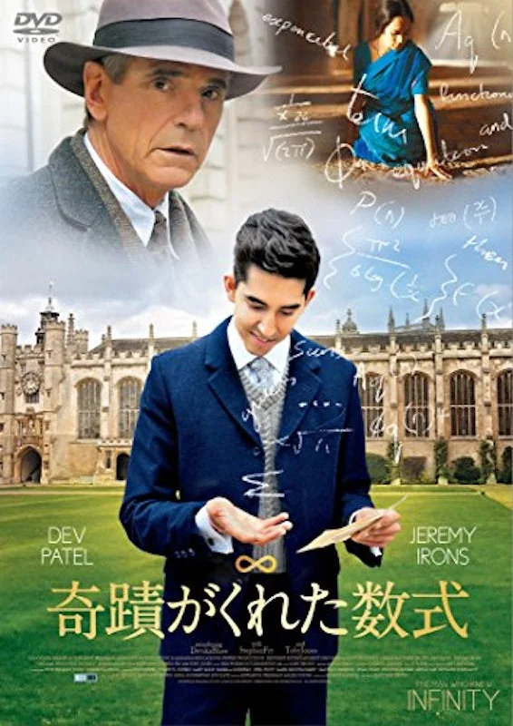
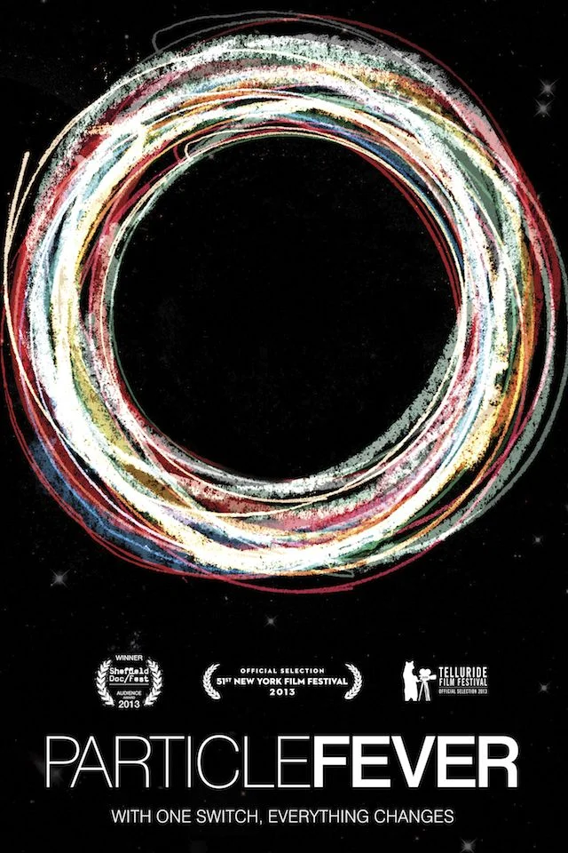

यहाँ मेरी अनुशंसित 3 फिल्में हैं जिनमें मुख्य पात्र गणितज्ञ हैं।

# ए ब्यूटीफुल माइंड
  
यह एक वास्तविक अमेरिकी प्रतिभाशाली गणितज्ञ के आधे जीवन को दर्शाने वाली फिल्म है। अंत में एक आश्चर्यजनक मोड़ है।
रसेल क्रो ने मुख्य भूमिका में बेहतरीन काम किया है।

# एनिग्मा
  
> 2001 में रिलीज़ हुई फिल्म, जो रॉबर्ट हैरिस के उपन्यास "एनिग्मा" पर आधारित है।
> विकिपीडिया से

यह जर्मनी द्वारा बनाई गई एनिग्मा एन्क्रिप्शन मशीन को डिक्रिप्ट करने की कहानी है।

# द इमिटेशन गेम
 

यह भी एनिग्मा से जुड़ी एक डिक्रिप्शन कहानी है। मुझे उस समय की दुनिया बहुत पसंद है।

# द मैन हू न्यू इन्फिनिटी

कैम्ब्रिज विश्वविद्यालय के गणितज्ञ हार्डी और भारतीय गणितज्ञ रामानुजन के बीच बातचीत को दर्शाने वाली फिल्म। आप इसमें गणित की सुंदरता को महसूस कर सकते हैं।

# द थ्योरी ऑफ एवरीथिंग

डॉ. हॉकिंग के जीवन को दर्शाने वाली फिल्म।

# पार्टिकल फीवर

