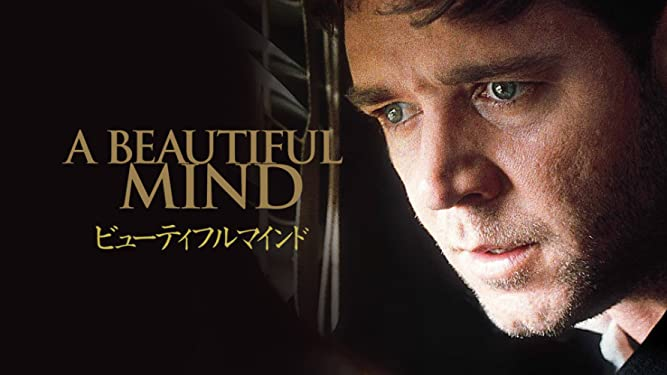
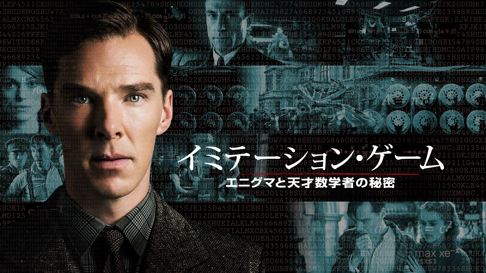
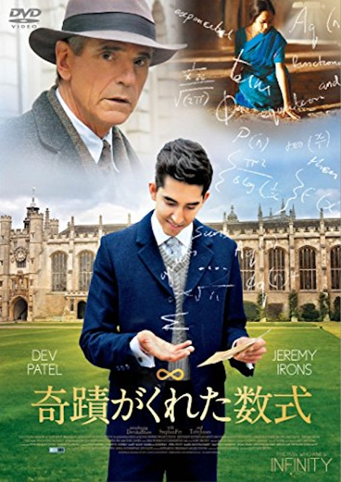
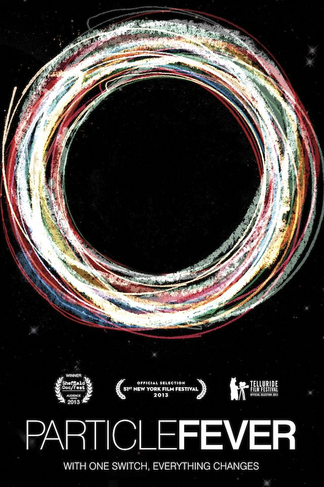

这是我推荐的3部以数学家为主角的电影。

# 美丽心灵
  
描绘了真实存在的美国天才数学家半生的作品。最后有令人惊讶的剧情展开。
主演罗素·克劳的表现非常出彩。

# 拦截密码战
  
> 改编自罗伯特·哈里斯的小说《挑战恩尼格玛密码机》，于2001年上映的电影。
> 摘自维基百科

讲述了解码德国制造的恩尼格玛密码的故事。

# 模仿游戏
 

这也是一部关于破解恩尼格玛密码的故事。我很喜欢当时的世界观设定。

# 知无涯者

描绘了剑桥大学数学家哈代与印度数学家拉马努金之间交流的作品。能让人感受到数学之美。

# 万物理论

描绘了霍金博士半生的作品。

# 粒子狂热

