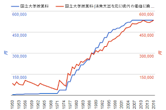
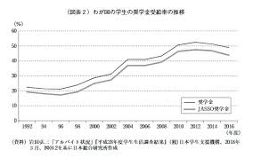

I'd like to organize my thoughts on what I find strange or think about Japanese society.

# About Student Loans
Speaking of scholarships in Japan, most of them are interest-bearing student loans that must be repaid.
In addition, university tuition fees have been continuously increasing since 1950, and the percentage of students receiving these loans is also on an upward trend.

On the other hand, it seems that the recent average total borrowing amount reaches 3.24 million yen.

> For users of the Japan Student Services Organization scholarships, the average total borrowing amount is 3,243,000 yen. [Reference](https://magazine.aruhi-corp.co.jp/0000-5086/#:~:text=%E5%80%9F%E5%85%A5%E7%B7%8F%E9%A1%8D%E3%81%AA%E3%81%A9%E3%81%AE%E5%B9%B3%E5%9D%87%E9%A1%8D%E3%81%AF&text=%E6%97%A5%E6%9C%AC%E5%AD%A6%E7%94%9F%E6%94%AF%E6%8F%B4%E6%A9%9F%E6%A7%8B%E3%81%AE%E5%A5%A8%E5%AD%A6%E9%87%91%E5%88%A9%E7%94%A8%E8%80%85%E3%81%AB%E3%81%8A%E3%81%84%E3%81%A6,%E4%BB%A5%E4%B8%8A%E3%82%92%E5%8D%A0%E3%82%81%E3%81%A6%E3%81%84%E3%81%BE%E3%81%99%E3%80%82)

If someone is burdened with a debt of 3 million yen at the age of 22 when graduating from university, naturally, their marriage age will be delayed, and it will obviously become harder to have children. I think this is one of the causes of Japan's declining birthrate problem.

# Pervasive Self-Responsibility Theory

This is somewhat based on my senses, but I feel there is a cold social attitude of "other people's business is their business."
It might be inevitable that this trend occurs after decades of ongoing economic recession, but
Even regarding the aforementioned student loan issue, it is not viewed as a problem for society as a whole, and I feel that the voices of young people and minorities, who have fewer votes in elections, are being ignored.
Even though, in the long run, it is actually a very important issue for Japan as a whole.

Instead of heading towards excessive competition, I think a spirit of everyone helping out when there are people, generations, or groups in need is extremely important for a country.
(However, I feel a sense of discomfort when the government insists on "self-help and mutual help." I want them to proactively work on rescuing the vulnerable.)

(This article will be updated as needed.)

## Characteristics of Japanese People as Seen by AI

Yes, I will explain the characteristics of Japanese people.

[Good Aspects]
- Japanese people have a culture of being polite and paying attention to respect and how they treat others.
- Punctuality is strictly enforced, and being on time is highly respected.
- A collectivistic mindset is strong, with an emphasis on teamwork and cooperation.
- Cleanliness is valued, and there is a tendency to be enthusiastic about manners and cleaning in public spaces.
- Gifts and souvenirs are cherished, and a culture of expressing gratitude is widespread.

[Bad Aspects]
- They may be poor at asserting their personal opinions and have a tendency to avoid clashes of opinion.
- A very strict work culture exists, and overtime work or death from overwork (karoshi) is sometimes seen as a problem.
- Issues of discrimination or exclusion towards foreigners remain, and harmony with the international community is sometimes called into question.
- There is an authoritarian tendency, and it is sometimes pointed out that they often accept the opinions of bosses or elders unconditionally.
- It is a closed society, and it is sometimes criticized for having a tendency to struggle to accept outside cultures and values.
