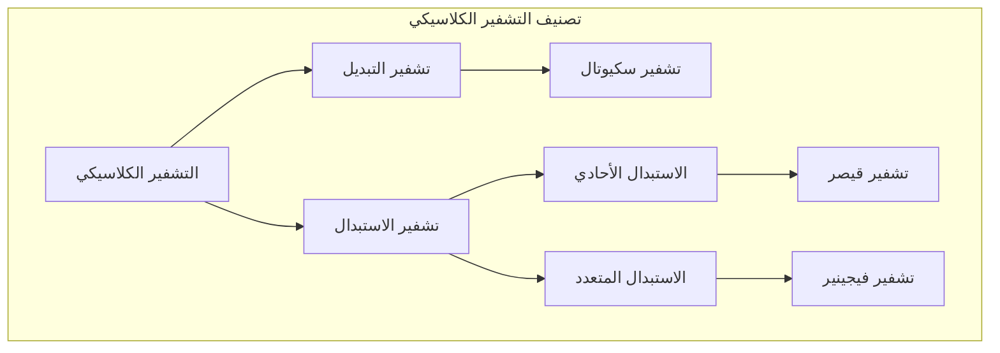
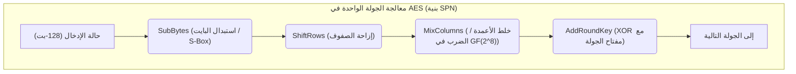
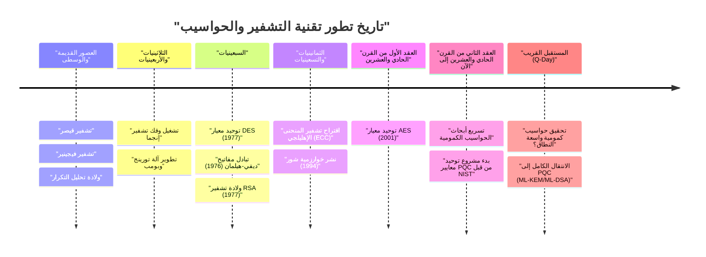

# 1. مقدمة: ما هي تقنية التشفير؟

تقنية التشفير (Cryptography) هي تقنية للحفاظ على سرية المعلومات، وقد تطورت مع تاريخ البشرية. من نقل الأوامر السرية في الحروب القديمة إلى حماية معلومات بطاقات الائتمان في الإنترنت الحديث، كان الغرض من التشفير ثابتًا. وهو "ضمان أن المتلقي المقصود فقط يمكنه فهم المعلومات، ولا يمكن لأي طرف ثالث فك تشفيرها".

في أمن المعلومات الحديث، لا تقتصر تقنية التشفير على مجرد "سرية المعلومات (Confidentiality)"، بل تلعب أيضًا أدوارًا مهمة مثل "سلامة البيانات (Integrity)"، "المصادقة (Authentication)"، و"عدم التنصل (Non-repudiation)".

في هذا المقال، سنستعرض بالتفصيل تاريخ تطور تقنية التشفير من منظور تقني ورياضي، بدءًا من تشفير الاستبدال البسيط في العصور القديمة، مرورًا بالتشفير الميكانيكي، وتشفير المفتاح المشترك والمفتاح العام الحديث، وصولًا إلى عصر "التشفير المقاوم للكم (PQC)" الذي سيحل مع الاستخدام العملي للحواسيب الكمومية.

---

# 2. عصر التشفير الكلاسيكي: استبدال الحروف وإعادة ترتيبها

يعود أصل التشفير إلى ما قبل الميلاد. كان التشفير المبكر يتكون بشكل رئيسي من نهجين: "التبديل (القلب)" و"الاستبدال".

## تشفير سكيوتال (تشفير التبديل)
يُعد "سكيوتال (Scytale)"، الذي استُخدم في إسبرطة باليونان القديمة في القرن الخامس قبل الميلاد، أحد أقدم أدوات التشفير. يتم لف شريط طويل من الرق على عصا خشبية ذات سمك معين، وتُكتب الرسالة عليها أفقيًا. عند فك الشريط، تظهر الحروف بترتيب غير مفهوم، ولكن يمكن للمستلم الذي يمتلك عصا بنفس السمك قراءة الرسالة الأصلية بلف الشريط عليها مرة أخرى.

## تشفير قيصر (تشفير الاستبدال الأحادي)
في القرن الأول قبل الميلاد، يُقال إن البطل الروماني القديم يوليوس قيصر استخدم "تشفير قيصر". هذا التشفير هو تشفير استبدال أحادي (Monoalphabetic substitution) يزيح الأبجدية بعدد ثابت (عادة 3 أحرف).

رياضيًا، إذا تعاملنا مع الحروف كأرقام من $0$ إلى $25$، وكان عدد الإزاحة هو $K$، فإن التحويل من النص العادي $P$ إلى النص المشفر $C$ يتم التعبير عنه بمعادلة التطابق التالية.

$$C \equiv P + K \pmod{26}$$

ولفك التشفير يتم إجراء العملية العكسية.

$$P \equiv C - K \pmod{26}$$

```python
# مثال لتنفيذ بسيط لتشفير قيصر بلغة بايثون
def caesar_cipher(text, shift, mode="encrypt"):
    result = ""
    if mode == "decrypt":
        shift = -shift
    
    for char in text:
        if char.isalpha():
            base = ord('A') if char.isupper() else ord('a')
            # حساب الإزاحة
            result += chr((ord(char) - base + shift) % 26 + base)
        else:
            result += char
    return result

# مثال على التنفيذ
plaintext = "HELLO WORLD"
ciphertext = caesar_cipher(plaintext, 3, "encrypt")
print(f"النص المشفر: {ciphertext}") # KHOOR ZRUOG
```

## تحليل التكرار وتشفير فيجينير
أصبح فك تشفير الاستبدال الأحادي سهلاً بفضل "تحليل التكرار (Frequency Analysis)" الذي ابتكره العالم العربي الكندي في القرن التاسع. وهو يستغل الخصائص الإحصائية للغة، مثل كثرة ظهور حرفي "E" و "T" في اللغة الإنجليزية.

ولمواجهة ذلك، تم ابتكار "تشفير فيجينير (Vigenère cipher)" في القرن السادس عشر. وهو تشفير استبدال متعدد (Polyalphabetic substitution) يستخدم عدة إزاحات (مفاتيح) بالتبادل دوريًا، وظل يُعرف باسم "التشفير غير القابل للكسر (Le Chiffre Indéchiffrable)" لنحو 300 عام.

رياضيًا، يتم تشفير الحرف رقم $i$ من النص العادي $P_i$ والحرف رقم $i$ من المفتاح المتكرر $K_i$ على النحو التالي.

$$C_i \equiv P_i + K_i \pmod{26}$$

تم فك هذا التشفير أيضًا في القرن التاسع عشر على يد تشارلز بابيج وفريدريش كاسيسكي، اللذين اكتشفا "اختبار كاسيسكي (Kasiski examination)" لتحديد طول المفتاح من الأنماط المتكررة في النص المشفر.



---

# 3. التشفير الميكانيكي والحروب العالمية: إنجما وفك تشفيرها

مع دخول القرن العشرين، انتقلت وسائل الاتصال من الرسائل إلى التلغراف والراديو، مما تطلب سرعة وتعقيدًا أكبر في التشفير. وهنا ظهر "التشفير الميكانيكي" الذي يجمع بين الدوارات (العجلات الدوارة).

## تهديد إنجما (Enigma)
خلال الحرب العالمية الثانية، استخدمت ألمانيا النازية "إنجما"، وهي أشهر آلة تشفير في تاريخ تقنية التشفير. كانت إنجما تتكون من عدة دوارات (عادة من 3 إلى 4)، ولوحة قوابس (Steckerbrett) لتبديل أسلاك الحروف، وعاكس (دوار عكسي).

في كل مرة يتم فيها كتابة حرف على لوحة المفاتيح، يدور الدوار، بحيث يتم إخراج حرف مشفر مختلف حتى لو تم كتابة نفس الحرف بشكل متتالي (ذروة التشفير المتعدد). بلغ حجم مساحة المفاتيح (مجموعات الإعدادات) حوالي $1.58 \times 10^{19}$ احتمالًا (حوالي 15.8 كوينتيليون)، وكان يُعتبر من المستحيل فك تشفيرها باستخدام القوة الغاشمة بالتكنولوجيا المتوفرة في ذلك الوقت.

## آلان تورينج و"بومب (Bombe)"
تصدى لهذا التشفير المنيع لإنجما فريق فك التشفير في حديقة بلتشلي في بريطانيا، بناءً على النتائج الأولية لعالم الرياضيات البولندي ماريان رييفسكي وآخرين.

على وجه الخصوص، استخدم آلان تورينج (Alan Turing) تخمين النصوص العادية المقابلة لأجزاء من النص المشفر (Crib)، وطور آلة فك تشفير كهروميكانيكية تسمى "بومب (Bombe)". تمكنت بومب من اكتشاف التناقضات المنطقية بسرعة عالية واستبعاد إعدادات الدوارات المستحيلة واحدة تلو الأخرى، مما أدى إلى نجاح فك تشفير إنجما. يُقال إن هذا الإنجاز العظيم عجّل بانتصار الحلفاء بعدة سنوات.

---

# 4. فجر التشفير الحديث: تشفير المفتاح المشترك (DES و AES)

بعد الحرب، ومع ظهور أجهزة الكمبيوتر، شهد التشفير تحولاً جذرياً من معالجة "الحروف" إلى معالجة "البتات (0 و 1)".

## كلود شانون ونظرية المعلومات
في عام 1949، نشر كلود شانون ورقة بحثية بعنوان "نظرية الاتصال في الأنظمة السرية"، مرسيًا الأساس الرياضي للتشفير الحديث. واقترح "الارتباك (Confusion)" و"الانتشار (Diffusion)" كمبادئ لتصميم تشفير آمن.
- **الارتباك (Confusion)**: جعل العلاقة بين المفتاح والنص المشفر معقدة قدر الإمكان. (يتحقق عن طريق الاستبدال وصناديق S)
- **الانتشار (Diffusion)**: التأكد من أن تغيير بت واحد من النص العادي يؤثر على العديد من بتات النص المشفر. (يتحقق عن طريق التبديل وإعادة الترتيب)

## DES (Data Encryption Standard)
في عام 1977، وضع المعهد الوطني للمعايير والتكنولوجيا في الولايات المتحدة (NIST، وكان يسمى آنذاك NBS) "DES" كمعيار للتشفير بناءً على تصميم شركة IBM.
يتبنى DES بنية تسمى "شبكة فيستل (Feistel Network)"، ويبلغ طول كتلته 64 بت وطول المفتاح 56 بت. كان يتمتع بميزة تنفيذية تتمثل في أن خوارزميات التشفير وفك التشفير لها نفس البنية تقريبًا.

ومع ذلك، مع تحسن القوة الحسابية لأجهزة الكمبيوتر، أصبح من الواضح أن طول المفتاح البالغ 56 بت (حوالي $7.2 \times 10^{16}$ احتمالًا) غير كافٍ. في عام 1998، طورت مؤسسة الحدود الإلكترونية (EFF) جهازًا مخصصًا يسمى "Deep Crack" وتمكنت من فك تشفير DES في غضون أيام قليلة.

## AES (Advanced Encryption Standard)
كمعيار جديد يحل محل DES، تم اعتماد "AES" في عام 2001. تم اختيار خوارزمية "رايندال (Rijndael)" التي صممها علماء تشفير بلجيكيون من خلال دعوة عامة.

يتبنى AES بنية "SPN (Substitution-Permutation Network)" بدلاً من بنية فيستل، ويستخدم العمليات الرياضية على مجال جالوا (المجال المحدود) $GF(2^8)$. يمكن اختيار طول المفتاح من 128 و 192 و 256 بت، ولا يزال يُستخدم على نطاق واسع كمعيار لتشفير المفتاح المشترك في جميع أنحاء العالم.



---

# 5. ثورة تشفير المفتاح العام: من ديفي-هيلمان إلى RSA

كان لتشفير المفتاح المشترك نقطة ضعف قاتلة. وهي "مشكلة توزيع المفاتيح (Key Distribution Problem)". المشكلة هي كيفية مشاركة "المفتاح المشترك" بشكل آمن مع طرف بعيد قبل بدء الاتصال المشفر. تم حل هذه المشكلة بواسطة "تشفير المفتاح العام" الذي ظهر في السبعينيات.

## تبادل مفاتيح ديفي-هيلمان
في عام 1976، نشر ويتفيلد ديفي ومارتن هيلمان ورقة بحثية رائدة بعنوان "اتجاهات جديدة في التشفير". لقد اقترحا طريقة لمشاركة المفاتيح بشكل آمن حتى على قنوات الاتصال التي يتم التنصت عليها، مستغلين الصعوبة الرياضية لـ "مشكلة اللوغاريتم المتقطع (Discrete Logarithm Problem)".

1. يتم نشر عدد أولي كبير $p$ ومولد $g$.
2. تختار أليس قيمة سرية $a$ وترسل $A = g^a \pmod{p}$ إلى بوب.
3. يختار بوب قيمة سرية $b$ ويرسل $B = g^b \pmod{p}$ إلى أليس.
4. تحسب أليس $K = B^a \pmod{p}$ ، ويحسب بوب $K = A^b \pmod{p}$.
5. وفقًا لقوانين الأسس، يصبح $K = (g^b)^a = (g^a)^b = g^{ab} \pmod{p}$، وبذلك ينجحان في مشاركة نفس المفتاح $K$.

## تشفير RSA
في العام التالي، 1977، ابتكر رون ريفست وعادي شامير وليونارد أدليمان "تشفير RSA". يعتمد هذا على خاصية أن "تحليل الأعداد المركبة الضخمة إلى عواملها الأولية أمر صعب".

**الآلية الرياضية لـ RSA:**
1. اختر عددين أوليين ضخمين $p$ و $q$ واحسب $n = p \times q$.
2. احسب دالة مؤشر أويلر $\phi(n) = (p-1)(q-1)$.
3. اختر عددًا صحيحًا $e$ (المفتاح العام) يكون أوليًا نسبيًا مع $\phi(n)$.
4. احسب عددًا صحيحًا $d$ (المفتاح السري) بحيث يكون $e \times d \equiv 1 \pmod{\phi(n)}$.

التشفير: للنص العادي $M$، احسب $C \equiv M^e \pmod{n}$
فك التشفير: للنص المشفر $C$، احسب $M \equiv C^d \pmod{n}$

```python
# كود بايثون يوضح مفهوم تشفير RSA (غير مخصص للاستخدام العملي)
def ext_euclid(a, b):
    # حساب المعكوس الضربي المعياري باستخدام خوارزمية إقليدس الممتدة
    if b == 0: return 1, 0, a
    x, y, g = ext_euclid(b, a % b)
    return y, x - (a // b) * y, g

def rsa_example():
    # مثال باستخدام أعداد أولية صغيرة
    p, q = 61, 53
    n = p * q
    phi = (p - 1) * (q - 1)
    
    e = 17 # قيمة أولية نسبيًا مع phi
    d, _, _ = ext_euclid(e, phi)
    if d < 0: d += phi
        
    print(f"المفتاح العام: (e={e}, n={n})")
    print(f"المفتاح السري: (d={d}, n={n})")
    
    # تشفير وفك تشفير الرسالة
    message = 65
    ciphertext = pow(message, e, n)
    decrypted = pow(ciphertext, d, n)
    
    print(f"النص العادي: {message} -> النص المشفر: {ciphertext} -> بعد فك التشفير: {decrypted}")

rsa_example()
```

---

# 6. صعود تشفير المنحنى الإهليلجي (ECC)

على الرغم من قوة تشفير RSA، إلا أنه مع تحسن أداء أجهزة الكمبيوتر، أصبح من الضروري زيادة طول المفتاح للحفاظ على الأمان (حاليًا 2048 أو 3072 بت)، مما أدى إلى مشكلة زيادة تكلفة الحساب.

لذلك، تم اقتراح "تشفير المنحنى الإهليلجي (Elliptic Curve Cryptography: ECC)" في عام 1985. يستخدم هذا التشفير إضافة النقاط على المنحنيات الإهليلجية (عادة على شكل $y^2 = x^3 + ax + b$) فوق المجالات المحدودة.

من المعروف أن مشكلة اللوغاريتم المتقطع على المنحنيات الإهليلجية (ECDLP) أصعب في الحل من مشكلة التحليل إلى العوامل الأولية، **ويمكن لـ ECC تحقيق نفس مستوى الأمان لمفتاح RSA بطول 3072 بت باستخدام مفتاح بطول 256 بت فقط**. وقد أتاح هذا اتصالاً مشفرًا سريعًا وآمنًا (مثل ECDSA و ECDH) حتى في البيئات ذات الموارد الحسابية المحدودة، مثل الهواتف الذكية وأجهزة إنترنت الأشياء (IoT).

---

# 7. تهديد الحواسيب الكمومية والتشفير المقاوم للكم (PQC)

بدت تقنية التشفير راسخة، ولكن في عام 1994، أحدث "خوارزمية شور" التي نشرها بيتر شور (Peter Shor) صدمة كبيرة.

تستغل الحواسيب الكمومية خصائص ميكانيكا الكم المتمثلة في "التراكب" و"التشابك الكمي" لإجراء العمليات الحسابية. وقد تم إثبات رياضيًا أنه عند تشغيل خوارزمية شور على حاسوب كمومي ذي أداء كافٍ، يمكن حل مشكلة التحليل إلى العوامل الأولية ومشكلة اللوغاريتم المتقطع في "وقت متعدد الحدود". بمعنى آخر، في اليوم الذي يكتمل فيه حاسوب كمومي عملي (Q-Day)، ستنهار جميع تشفيرات المفتاح العام المستخدمة حاليًا مثل RSA و ECC على الفور.

## ظهور PQC (Post-Quantum Cryptography)
استعدادًا لهذا التهديد غير المسبوق، تتقدم الأبحاث بوتيرة سريعة حول "تشفير الحواسيب المقاومة للكم (PQC)"، استنادًا إلى مشاكل رياضية جديدة يصعب حلها حتى بواسطة الحواسيب الكمومية. يعكف المعهد الوطني للمعايير والتكنولوجيا (NIST) على عملية توحيد معايير PQC لسنوات عديدة، وتعتبر الأساليب الرياضية التالية هي الأبرز:

### 1. التشفير القائم على الشبكة (Lattice-based Cryptography)
وهو النهج الأكثر ترجيحًا حاليًا، وقد تم اعتماده في خوارزميات التوحيد القياسي الخاصة بـ NIST (ML-KEM / Kyber و ML-DSA / Dilithium). يعتمد على صعوبة العثور على نقطة معينة على "شبكة (Lattice)" في مساحة متعددة الأبعاد (مثل مشكلة أقصر متجه: SVP) أو مشكلة LWE (التعلم مع الأخطاء).

يستغل مفهوم مشكلة LWE الخاصية المتمثلة في أنه عند إضافة "ضوضاء (خطأ) صغيرة" عمدًا إلى نظام معادلات خطية متزامنة، يصبح من الصعب جدًا إيجاد الحل.
نظام المعادلات: $\mathbf{A}\mathbf{s} + \mathbf{e} \equiv \mathbf{b} \pmod{q}$
($\mathbf{A}$ و $\mathbf{b}$ علنية، $\mathbf{s}$ هو المفتاح السري، و $\mathbf{e}$ هي ضوضاء دقيقة)

```python
# كود كاذب لمفهوم مشكلة LWE (للأغراض التعليمية)
import numpy as np

n = 256  # الأبعاد
q = 3329 # المعيار (Modulus)
m = 512  # عدد المعادلات

# المفتاح السري s والخطأ الصغير e
s = np.random.randint(0, 5, size=n)
e = np.random.randint(-1, 2, size=m)

# المصفوفة العامة A والمتجه العام b
A = np.random.randint(0, q, size=(m, n))
b = (np.dot(A, s) + e) % q

# حتى باستخدام حاسوب كمومي، يُعتبر استعادة s من A و b أمرًا بالغ الصعوبة
```

### 2. التشفير القائم على التجزئة (Hash-based Cryptography)
هو نظام توقيع رقمي يعتمد أمانه فقط على مقاومة الاصطدام لدوال التجزئة. وبما أنه لا يحتوي على بنية رياضية، فهو مقاوم للهجمات الكمومية، ولكن حجم التوقيع يميل إلى أن يكون كبيرًا (مثل SPHINCS+).

### 3. التشفير القائم على الرموز (Code-based Cryptography)
وهو نظام تشفير يعتمد على نظرية رموز تصحيح الأخطاء. أشهرها هو تشفير McEliece المقترح في عام 1978، والذي يتمتع بتاريخ طويل وسمعة طيبة من حيث الأمان، ولكن لديه عيب يتمثل في أن حجم المفتاح العام كبير جدًا (قد يصل إلى عدة ميغابايت).



---

# 8. الخاتمة: معركة لا تنتهي بين الدرع والرمح

تاريخ تقنية التشفير هو تاريخ لمعركة لا تنتهي بين اختراع طرق تشفير جديدة (الدرع) وطرق فك تشفير جديدة لكسرها (الرمح).

انهزم تشفير قيصر أمام تحليل التكرار، وهُزمت إنجما التي كانت تعتبر لا تُقهر أمام العقل العبقري لتورينج وقوة الآلات. والآن، تواجه التشفيرات القوية مثل RSA و ECC التي تدعم أساس مجتمع الإنترنت الحديث، تهديدًا أمام "الرمح" الجديد المتمثل في الحواسيب الكمومية.

ومع ذلك، فإن البشرية تتطلع بالفعل إلى المستقبل وتقوم بإعداد "درع" جديد يُسمى التشفير المقاوم للكم (PQC). في الوقت الحالي، أصبحت الاستعدادات للانتقال من تشفير المفتاح العام الحالي إلى PQC (ضمان المرونة التشفيرية - Crypto Agility) مهمة ملحة في البنى التحتية لتكنولوجيا المعلومات حول العالم.

تقنية التشفير ليست مجرد لغز رياضي معقد، بل هي الجدار الدفاعي الأقوى لحماية خصوصيتنا وممتلكاتنا والبنية التحتية لمجتمعنا بأسره.
