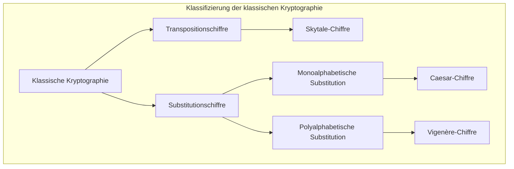
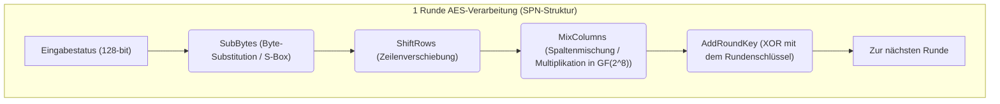
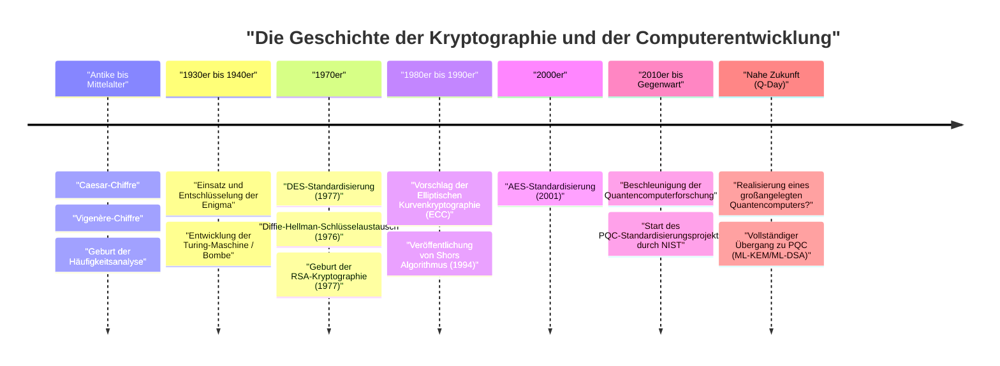

# 1. Einführung: Was ist Kryptographie?

Die Kryptographie (Kryptographie) ist die Technologie zur Wahrung der Geheimhaltung von Informationen und hat sich zusammen mit der Geschichte der Menschheit entwickelt. Von der Übermittlung geheimer Befehle in antiken Kriegen bis zum Schutz von Kreditkarteninformationen im modernen Internet ist der Zweck der Kryptographie konsistent geblieben. Er besteht darin, sicherzustellen, "dass nur der beabsichtigte Empfänger die Informationen verstehen kann und sie für Dritte nicht entschlüsselbar sind".

In der modernen Informationssicherheit spielt die Kryptographie nicht nur eine wichtige Rolle bei der "Geheimhaltung (Vertraulichkeit: Confidentiality)" von Informationen, sondern auch bei der "Integrität (Integrity)", "Authentifizierung (Authentication)" und der "Nichtabstreitbarkeit (Non-repudiation)" von Daten.

In diesem Artikel werden wir die Geschichte der Entwicklung der Kryptographie aus einer technischen und mathematischen Perspektive detailliert entwirren, beginnend mit einfachen Substitutionschiffren der Antike über mechanische Chiffren, moderne symmetrische und asymmetrische Kryptographie bis hin zur Ära der "Post-Quanten-Kryptographie (PQC)", die mit der praktischen Anwendung von Quantencomputern anbrechen wird.

---

# 2. Die Ära der klassischen Kryptographie: Buchstaben ersetzen und umstellen

Die Ursprünge der Kryptographie reichen bis vor die christliche Zeitrechnung zurück. Frühe Chiffren bestanden hauptsächlich aus zwei Ansätzen: "Transposition (Umstellung)" und "Substitution (Ersetzung)".

## Die Skytale-Chiffre (Transpositionschiffre)
Die im antiken griechischen Sparta im 5. Jahrhundert v. Chr. verwendete "Skytale (Scytale)" ist eines der ältesten kryptographischen Instrumente. Ein langer, schmaler Streifen Pergament wird um einen Holzstab einer bestimmten Dicke gewickelt und eine Nachricht wird horizontal darauf geschrieben. Wenn das Pergament abgewickelt wird, sind die Buchstaben in einer bedeutungslosen Reihenfolge angeordnet, aber ein Empfänger mit einem Stab derselben Dicke kann das Pergament erneut darumwickeln, um die ursprüngliche Nachricht zu lesen.

## Die Caesar-Chiffre (Monoalphabetische Substitutionschiffre)
Es wird gesagt, dass Julius Caesar (Caesar), ein Held des antiken Roms im 1. Jahrhundert v. Chr., die "Caesar-Chiffre" verwendete. Dies ist eine monoalphabetische Substitutionschiffre (Monoalphabetic substitution), bei der das Alphabet um eine bestimmte Anzahl (normalerweise 3 Buchstaben) verschoben wird.

Mathematisch gesehen, wenn wir Buchstaben als Zahlen von $0$ bis $25$ behandeln und die Verschiebung als $K$ bezeichnen, wird die Umwandlung von Klartext $P$ zu Chiffretext $C$ durch folgende Kongruenzgleichung ausgedrückt:

$$C \equiv P + K \pmod{26}$$

Die Entschlüsselung führt die umgekehrte Operation durch:

$$P \equiv C - K \pmod{26}$$

```python
# Einfaches Python-Implementierungsbeispiel für die Caesar-Chiffre
def caesar_cipher(text, shift, mode="encrypt"):
    result = ""
    if mode == "decrypt":
        shift = -shift
    
    for char in text:
        if char.isalpha():
            base = ord('A') if char.isupper() else ord('a')
            # Verschiebungsberechnung
            result += chr((ord(char) - base + shift) % 26 + base)
        else:
            result += char
    return result

# Ausführungsbeispiel
plaintext = "HELLO WORLD"
ciphertext = caesar_cipher(plaintext, 3, "encrypt")
print(f"Chiffretext: {ciphertext}") # KHOOR ZRUOG
```

## Häufigkeitsanalyse und Vigenère-Chiffre
Monoalphabetische Substitutionschiffren wurden durch die "Häufigkeitsanalyse (Frequency Analysis)", die vom arabischen Gelehrten Al-Kindi im 9. Jahrhundert entwickelt wurde, leicht entschlüsselbar. Dies nutzt die statistischen Eigenschaften der Sprache, wie etwa die Häufigkeit von "E" oder "T" im Englischen.

Um dem entgegenzuwirken, wurde im 16. Jahrhundert die "Vigenère-Chiffre (Vigenère cipher)" entwickelt. Dies ist eine polyalphabetische Substitutionschiffre (Polyalphabetic substitution), die regelmäßig zwischen mehreren Verschiebungen (Schlüsseln) wechselt und etwa 300 Jahre lang als "die unknackbare Chiffre (Le Chiffre Indéchiffrable)" bekannt war.

Mathematisch wird sie verschlüsselt, indem der $i$-te Buchstabe des Klartextes $P_i$ und der $i$-te Buchstabe des sich wiederholenden Schlüssels $K_i$ wie folgt verwendet werden:

$$C_i \equiv P_i + K_i \pmod{26}$$

Diese Chiffre wurde auch im 19. Jahrhundert von Charles Babbage und Friedrich Kasiski geknackt, indem sie den "Kasiski-Test (Kasiski examination)" entdeckten, der die Schlüssellänge aus sich wiederholenden Mustern im Chiffretext ermittelt.



---

# 3. Mechanische Chiffren und Weltkriege: Enigma und ihre Entschlüsselung

Zu Beginn des 20. Jahrhunderts verlagerte sich die Kommunikation von Briefen auf Telegrafen und Funk, was Schnelligkeit und Komplexität bei der Verschlüsselung erforderte. Hier traten die "mechanischen Chiffren" auf, die Rotoren (Drehscheiben) kombinierten.

## Die Bedrohung der Enigma (Enigma)
Die von Nazi-Deutschland im Zweiten Weltkrieg eingesetzte "Enigma" ist die berühmteste Chiffriermaschine in der Geschichte der Kryptographie. Die Enigma bestand aus mehreren Rotoren (normalerweise 3 bis 4), einem Steckerbrett zur Vertauschung von Buchstabenverdrahtungen und einem Reflektor (Umkehrwalze).

Da sich die Rotoren jedes Mal drehten, wenn ein Buchstabe auf der Tastatur getippt wurde, erzeugte selbst das wiederholte Tippen desselben Buchstabens unterschiedliche Chiffretextzeichen (das Extrem der polyalphabetischen Chiffre). Der Schlüsselraum (die Kombination von Einstellungen) betrug etwa $1.58 \times 10^{19}$ Möglichkeiten (etwa 15,8 Trillionen), und ein Brute-Force-Angriff galt mit der damaligen Technologie als unmöglich.

## Alan Turing und die "Bombe (Bombe)"
Das Team zur Entschlüsselung von Codes in Bletchley Park in Großbritannien, das auf den frühen Arbeiten des polnischen Mathematikers Marian Rejewski und anderer aufbaute, nahm die Herausforderung dieser uneinnehmbaren Enigma an.

Insbesondere Alan Turing entwickelte eine elektromechanische Entschlüsselungsmaschine namens "Bombe", die Vermutungen über den Klartext (Crib) nutzte, die Teilen des Chiffretextes entsprachen. Die Bombe erkannte schnell logische Widersprüche, schloss unmögliche Rotoreinstellungen eine nach der anderen aus und entschlüsselte erfolgreich die Enigma. Man sagt, dass diese bemerkenswerte Leistung den Sieg der Alliierten um mehrere Jahre beschleunigte.

---

# 4. Der Beginn der modernen Kryptographie: Symmetrische Kryptographie (DES und AES)

Nach dem Krieg, mit dem Aufkommen von Computern, erfuhr die Kryptographie einen dramatischen Paradigmenwechsel von der Manipulation von "Buchstaben" zur Manipulation von "Bits (0 und 1)".

## Claude Shannon und die Informationstheorie
Im Jahr 1949 veröffentlichte Claude Shannon seine Arbeit "Communication Theory of Secrecy Systems" und legte damit das mathematische Fundament für die moderne Kryptographie. Er schlug "Konfusion (Confusion)" und "Diffusion (Diffusion)" als Prinzipien für ein sicheres kryptographisches Design vor.
- **Konfusion (Confusion)**: Die Beziehung zwischen Schlüssel und Chiffretext so komplex wie möglich gestalten. (Erreicht durch Substitution/S-Boxen)
- **Diffusion (Diffusion)**: Sicherstellen, dass die Änderung eines einzelnen Bits im Klartext viele Bits im Chiffretext beeinflusst. (Erreicht durch Transposition/Permutation)

## DES (Data Encryption Standard)
Im Jahr 1977 etablierte das National Institute of Standards and Technology (NIST, damals NBS) der USA "DES", das auf einem IBM-Design basierte, als Standardverschlüsselung.
DES verwendet eine Architektur, die "Feistel-Netzwerk (Feistel Network)" genannt wird, mit einer Blocklänge von 64 Bit und einer Schlüssellänge von 56 Bit. Es hatte den Implementierungsvorteil, dass die Ver- und Entschlüsselungsalgorithmen fast die gleiche Struktur besaßen.

Jedoch wurde mit der Verbesserung der Rechenleistung von Computern klar, dass eine Schlüssellänge von 56 Bit (etwa $7.2 \times 10^{16}$ Möglichkeiten) unzureichend war. 1998 entwickelte die Electronic Frontier Foundation (EFF) eine spezielle Maschine namens "Deep Crack" und demonstrierte, dass DES innerhalb weniger Tage geknackt werden konnte.

## AES (Advanced Encryption Standard)
Als Ersatz für DES wurde im Jahr 2001 "AES" als neuer Standard etabliert. Der durch einen offenen Wettbewerb ausgewählte "Rijndael"-Algorithmus, der von belgischen Kryptographen entwickelt wurde, wurde übernommen.

AES verwendet nicht das Feistel-Netzwerk, sondern ein "SPN-Netzwerk (Substitution-Permutation Network)" und nutzt mathematische Operationen über dem Galois-Körper (endlichen Körper) $GF(2^8)$. Die Schlüssellängen können zwischen 128, 192 oder 256 Bits gewählt werden, und es wird heute weltweit noch immer als symmetrische Standardverschlüsselung eingesetzt.



---

# 5. Die Revolution der Public-Key-Kryptographie: Von Diffie-Hellman zu RSA

Die symmetrische Kryptographie hatte eine entscheidende Schwachstelle. Das war das "Schlüsselverteilungsproblem (Key Distribution Problem)". Es war das Problem, wie ein "gemeinsamer Schlüssel" sicher mit einer weit entfernten Partei geteilt werden konnte, bevor die verschlüsselte Kommunikation begann. Dieses Problem wurde durch die "Public-Key-Kryptographie" gelöst, die in den 1970er Jahren geboren wurde.

## Diffie-Hellman-Schlüsselaustausch
1976 veröffentlichten Whitfield Diffie und Martin Hellman ein bahnbrechendes Papier mit dem Titel "New Directions in Cryptography". Sie schlugen eine Methode vor, um Schlüssel auch über einen abgehörten Kommunikationsweg sicher zu teilen, indem sie die mathematische Schwierigkeit des "diskreten Logarithmusproblems (Discrete Logarithm Problem)" ausnutzten.

1. Eine große Primzahl $p$ und ein Erzeuger $g$ werden veröffentlicht.
2. Alice wählt einen geheimen Wert $a$ und sendet $A = g^a \pmod{p}$ an Bob.
3. Bob wählt einen geheimen Wert $b$ und sendet $B = g^b \pmod{p}$ an Alice.
4. Alice berechnet $K = B^a \pmod{p}$ und Bob berechnet $K = A^b \pmod{p}$.
5. Durch die Potenzgesetze wird $K = (g^b)^a = (g^a)^b = g^{ab} \pmod{p}$, und sie können wunderbar denselben Schlüssel $K$ teilen.

## RSA-Kryptographie
Im folgenden Jahr, 1977, wurde die "RSA-Kryptographie" von Ron Rivest, Adi Shamir und Leonard Adleman entwickelt. Sie basiert auf der Eigenschaft, dass "die Primfaktorzerlegung einer riesigen zusammengesetzten Zahl schwierig ist".

**Mathematischer Mechanismus von RSA:**
1. Wähle zwei riesige Primzahlen $p$ und $q$ und berechne $n = p \times q$.
2. Berechne Eulers Totient-Funktion $\phi(n) = (p-1)(q-1)$.
3. Wähle eine ganze Zahl $e$ (öffentlicher Schlüssel), die teilerfremd zu $\phi(n)$ ist.
4. Berechne eine ganze Zahl $d$ (privater Schlüssel), so dass $e \times d \equiv 1 \pmod{\phi(n)}$ gilt.

Verschlüsselung: Für den Klartext $M$, $C \equiv M^e \pmod{n}$
Entschlüsselung: Für den Chiffretext $C$, $M \equiv C^d \pmod{n}$

```python
# Python-Code zur Veranschaulichung des RSA-Konzepts (nicht für den praktischen Einsatz)
def ext_euclid(a, b):
    # Berechnung des modularen Inversen durch den erweiterten euklidischen Algorithmus
    if b == 0: return 1, 0, a
    x, y, g = ext_euclid(b, a % b)
    return y, x - (a // b) * y, g

def rsa_example():
    # Beispiel mit kleinen Primzahlen
    p, q = 61, 53
    n = p * q
    phi = (p - 1) * (q - 1)
    
    e = 17 # Wert teilerfremd zu phi
    d, _, _ = ext_euclid(e, phi)
    if d < 0: d += phi
        
    print(f"Öffentlicher Schlüssel: (e={e}, n={n})")
    print(f"Privater Schlüssel: (d={d}, n={n})")
    
    # Verschlüsselung und Entschlüsselung der Nachricht
    message = 65
    ciphertext = pow(message, e, n)
    decrypted = pow(ciphertext, d, n)
    
    print(f"Klartext: {message} -> Chiffretext: {ciphertext} -> Entschlüsselt: {decrypted}")

rsa_example()
```

---

# 6. Der Aufstieg der elliptischen Kurvenkryptographie (ECC)

Die RSA-Kryptographie ist mächtig, aber mit der Verbesserung der Computerleistung wurde es notwendig, die Schlüssellängen zu verlängern, um die Sicherheit aufrechtzuerhalten (derzeit 2048 Bit oder 3072 Bit), was zu dem Problem erhöhter Rechenkosten führte.

Daher wurde 1985 die "Elliptische Kurvenkryptographie (Elliptic Curve Cryptography: ECC)" vorgeschlagen. Sie nutzt die Addition von Punkten auf einer elliptischen Kurve über einem endlichen Körper (im Allgemeinen in der Form $y^2 = x^3 + ax + b$).

Es ist bekannt, dass das Problem des diskreten Logarithmus auf elliptischen Kurven (ECDLP) noch schwerer zu lösen ist als das Primfaktorzerlegungsproblem, und **ECC kann dieselbe Sicherheit wie RSA mit 3072 Bit mit einer Schlüssellänge von nur 256 Bit erreichen**. Dies ermöglichte eine schnelle und sichere kryptographische Kommunikation (wie ECDSA und ECDH) auch in Umgebungen mit begrenzten Rechenressourcen, wie Smartphones und IoT-Geräten.

---

# 7. Die Bedrohung durch Quantencomputer und Post-Quanten-Kryptographie (PQC)

Die Kryptographie schien unerschütterlich, bis Peter Shor 1994 "Shors Algorithmus" veröffentlichte, was einen gewaltigen Schock auslöste.

Quantencomputer führen Berechnungen durch, indem sie die quantenmechanischen Eigenschaften der "Superposition" und der "Quantenverschränkung" ausnutzen. Wenn Shors Algorithmus auf einem ausreichend leistungsstarken Quantencomputer ausgeführt wird, wurde mathematisch bewiesen, dass das Primfaktorzerlegungsproblem und das diskrete Logarithmusproblem in "polynomieller Zeit" gelöst werden können. Das bedeutet, dass an dem Tag, an dem ein praktischer Quantencomputer fertiggestellt wird (Q-Day), alle derzeit verwendeten Public-Key-Kryptographien wie RSA und ECC sofort zusammenbrechen werden.

## Die Entstehung von PQC (Post-Quantum Cryptography)
Um sich auf diese beispiellose Bedrohung vorzubereiten, schreitet die Forschung an "Post-Quanten-Kryptographie (PQC)" in schnellem Tempo voran, basierend auf neuen mathematischen Problemen, die selbst für Quantencomputer schwer zu lösen sind. Das NIST (National Institute of Standards and Technology der USA) führt seit vielen Jahren einen PQC-Standardisierungsprozess durch, bei dem hauptsächlich die folgenden mathematischen Ansätze als vielversprechend angesehen werden.

### 1. Gitterbasierte Kryptographie (Lattice-based Cryptography)
Dies ist derzeit der vielversprechendste Ansatz und wurde in den Standardisierungsalgorithmen von NIST (ML-KEM / Kyber, ML-DSA / Dilithium) übernommen. Es basiert auf der Schwierigkeit, bestimmte Punkte auf einem "Gitter (Lattice)" in mehrdimensionalen Räumen zu finden (Shortest Vector Problem: SVP usw.) oder auf dem LWE-Problem (Learning With Errors).

Das Konzept des LWE-Problems nutzt die Eigenschaft, dass das Finden einer Lösung extrem schwierig wird, wenn man absichtlich "kleines Rauschen (Fehler)" zu einem System linearer Gleichungen hinzufügt.
Gleichungssystem: $\mathbf{A}\mathbf{s} + \mathbf{e} \equiv \mathbf{b} \pmod{q}$
($\mathbf{A}$ und $\mathbf{b}$ sind öffentlich, $\mathbf{s}$ ist der private Schlüssel und $\mathbf{e}$ ist minimales Rauschen)

```python
# Konzeptueller Pseudocode des LWE-Problems (zu Lernzwecken)
import numpy as np

n = 256  # Dimension
q = 3329 # Modul
m = 512  # Anzahl der Gleichungen

# Privater Schlüssel s und kleiner Fehler e
s = np.random.randint(0, 5, size=n)
e = np.random.randint(-1, 2, size=m)

# Öffentliche Matrix A und öffentlicher Vektor b
A = np.random.randint(0, q, size=(m, n))
b = (np.dot(A, s) + e) % q

# Selbst mit einem Quantencomputer wird es als extrem schwierig angesehen, s aus A und b wiederherzustellen
```

### 2. Hash-basierte Kryptographie (Hash-based Cryptography)
Ein digitales Signaturschema, das seine Sicherheit ausschließlich auf die Kollisionsresistenz von Hash-Funktionen stützt. Da es keine mathematische Struktur besitzt, ist es widerstandsfähig gegen Quantenangriffe, neigt jedoch zu großen Signaturgrößen (wie SPHINCS+).

### 3. Code-basierte Kryptographie (Code-based Cryptography)
Ein kryptographisches Verfahren, das auf der Theorie fehlerkorrigierender Codes basiert. Das 1978 vorgeschlagene McEliece-Kryptosystem ist ein berühmtes Beispiel; es hat eine lange Geschichte und einen etablierten Ruf für Sicherheit, leidet jedoch unter dem Problem sehr großer öffentlicher Schlüssel (die manchmal mehrere Megabyte erreichen).



---

# 8. Fazit: Der endlose Kampf zwischen Schild und Speer

Die Geschichte der Kryptographie ist eine Geschichte des endlosen Kampfes zwischen der Erfindung neuer Verschlüsselungsmethoden (Schilde) und neuen Entschlüsselungstechniken (Speere), um sie zu durchbrechen.

Die Caesar-Chiffre wurde durch die Häufigkeitsanalyse besiegt, und die unbesiegbare Enigma wurde durch Turings geniales Gehirn und die Kraft der Maschinen besiegt. Und nun sind starke Chiffren wie RSA und ECC, die das Fundament der modernen Internetgesellschaft stützen, durch den neuen "Speer" der Quantencomputer bedroht.

Doch die Menschheit blickt bereits auf diese zukünftige Zeit und bereitet einen neuen "Schild" namens Post-Quanten-Kryptographie (PQC) vor. Gegenwärtig ist die Vorbereitung des Übergangs von bestehender Public-Key-Kryptographie zu PQC (Sicherstellung von Krypto-Agilität) eine dringende Aufgabe für IT-Infrastrukturen weltweit.

Die Kryptographie ist nicht nur ein obskures mathematisches Rätsel, sondern die stärkste Verteidigungsmauer, um unsere Privatsphäre, unser Eigentum und die Gesellschaftsinfrastruktur selbst zu schützen.
