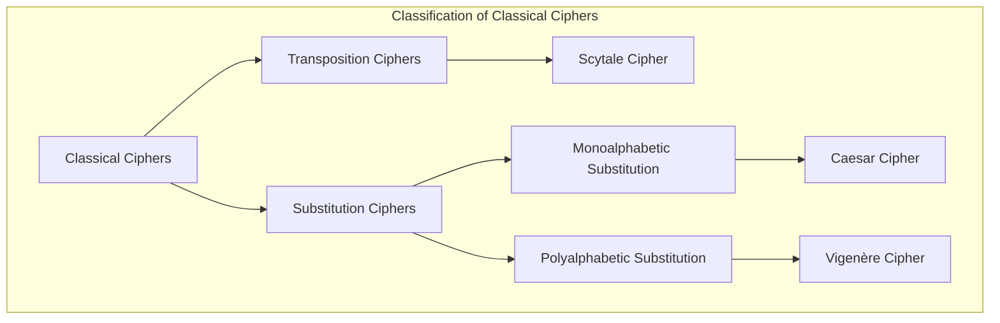
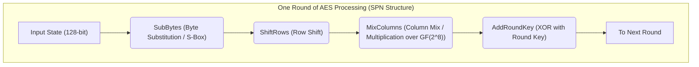
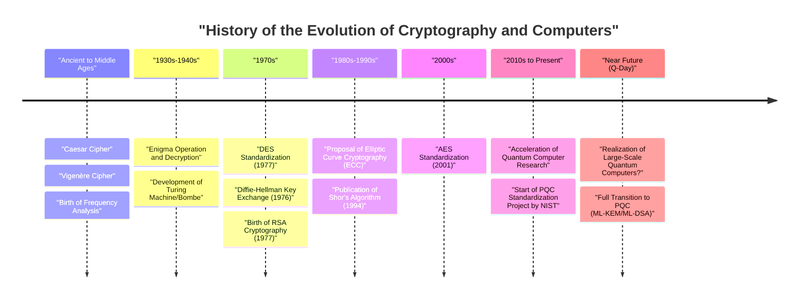

# 1. Introduction: What is Cryptography?

Cryptography is the technology used to maintain the confidentiality of information, and it has evolved alongside human history. From the transmission of secret commands in ancient wars to the protection of credit card information on the modern internet, the purpose of cryptography has remained consistent: "to ensure that only the intended recipient can understand the information, and that it cannot be deciphered by third parties."

In modern information security, cryptography goes beyond simple "information concealment (Confidentiality)" and plays crucial roles in ensuring data "Integrity," "Authentication," and "Non-repudiation."

In this article, we will thoroughly unravel the history of cryptographic evolution from a technical and mathematical perspective, starting from simple ancient substitution ciphers, through mechanical ciphers, modern symmetric and public-key cryptography, to the era of "Post-Quantum Cryptography (PQC)" brought about by the practical application of quantum computers.

---

# 2. The Era of Classical Cryptography: Letter Substitution and Transposition

The origins of cryptography date back to Before Christ (B.C.). Early cryptography mainly consisted of two approaches: "Transposition" and "Substitution."

## Scytale Cipher (Transposition Cipher)
The "Scytale," used in ancient Greece (Sparta) in the 5th century B.C., is one of the oldest cryptographic devices. A strip of parchment was wrapped around a wooden cylinder of a specific thickness, and a message was written across it horizontally. When the parchment was unwrapped, the letters were arranged in a meaningless order, but the recipient, who had a cylinder of the exact same thickness, could wrap the parchment around it again to read the original message.

## Caesar Cipher (Monoalphabetic Substitution Cipher)
The "Caesar cipher," believed to have been used by the ancient Roman hero Julius Caesar in the 1st century B.C., is a monoalphabetic substitution cipher that shifts the alphabet by a certain number of positions (usually 3 letters).

Mathematically, if we treat letters as numbers from $0$ to $25$, and let the shift amount be $K$, the transformation from plaintext $P$ to ciphertext $C$ is expressed by the following congruence:

$$C \equiv P + K \pmod{26}$$

Decryption is performed by the reverse operation.

$$P \equiv C - K \pmod{26}$$

```python
# Simple Python implementation example of the Caesar cipher
def caesar_cipher(text, shift, mode="encrypt"):
    result = ""
    if mode == "decrypt":
        shift = -shift
    
    for char in text:
        if char.isalpha():
            base = ord('A') if char.isupper() else ord('a')
            # Shift calculation
            result += chr((ord(char) - base + shift) % 26 + base)
        else:
            result += char
    return result

# Execution example
plaintext = "HELLO WORLD"
ciphertext = caesar_cipher(plaintext, 3, "encrypt")
print(f"Ciphertext: {ciphertext}") # KHOOR ZRUOG
```

## Frequency Analysis and the Vigenère Cipher
Monoalphabetic substitution ciphers became easily broken due to "Frequency Analysis," devised by the 9th-century Arab scholar Al-Kindi. It utilizes the statistical properties of a language, such as the fact that in English, letters like "E" and "T" appear frequently.

To counter this, the "Vigenère cipher" was invented in the 16th century. This is a polyalphabetic substitution cipher that periodically switches between multiple shifts (keys), and for about 300 years it was called the "indecipherable cipher (Le Chiffre Indéchiffrable)."

Mathematically, using the $i$-th letter of the plaintext $P_i$ and the $i$-th letter of the repeating key $K_i$, the encryption is performed as follows:

$$C_i \equiv P_i + K_i \pmod{26}$$

However, entering the 19th century, this cipher was also broken when Charles Babbage and Friedrich Kasiski discovered the "Kasiski examination," a method to deduce the key length from repeated patterns in the ciphertext.



---

# 3. Mechanical Ciphers and the World Wars: Enigma and its Decryption

Entering the 20th century, communication methods shifted from letters to telegraphs and radios, and speed and complexity in encryption became necessary. This is where "mechanical ciphers," combining rotors (rotating disks), made their appearance.

## The Threat of Enigma
During World War II, the "Enigma," used by Nazi Germany, became the most famous cipher machine in cryptographic history. Enigma consisted of multiple rotors (usually 3 to 4), a plugboard (Steckerbrett) to swap letter wirings, and a reflector (reversing rotor).

Because the rotors advanced with every letter typed on the keyboard, typing the same letter consecutively would output different ciphertext letters (the pinnacle of polyalphabetic ciphers). Its key space (combinations of settings) reached approximately $1.58 \times 10^{19}$ (about 15.8 quintillion), and with the technology of that time, brute-force decryption was considered impossible.

## Alan Turing and the "Bombe"
Challenging this impregnable Enigma was the decryption team at Bletchley Park in the UK, building upon the early achievements of Polish mathematician Marian Rejewski and others.

In particular, Alan Turing developed an electromechanical decryption machine called the "Bombe," which utilized guesses of the plaintext corresponding to parts of the ciphertext (Cribs). The Bombe quickly detected logical contradictions and successively eliminated impossible rotor settings, successfully breaking Enigma. It is said that this great achievement advanced the Allied victory by several years.

---

# 4. The Dawn of Modern Cryptography: Symmetric-key Cryptography (DES and AES)

After the war, with the advent of computers, cryptography underwent a dramatic paradigm shift from manipulating "letters" to manipulating "bits (0 and 1)."

## Claude Shannon and Information Theory
In 1949, Claude Shannon published the paper "Communication Theory of Secrecy Systems," laying the mathematical foundation for modern cryptography. He proposed "Confusion" and "Diffusion" as principles of secure cryptographic design.
- **Confusion**: Making the relationship between the key and the ciphertext as complex as possible. (Realized by substitution and S-boxes)
- **Diffusion**: Ensuring that changing one bit of the plaintext affects many bits in the ciphertext. (Realized by transposition and permutation)

## DES (Data Encryption Standard)
In 1977, the National Institute of Standards and Technology (NIST, then NBS) established "DES," based on an IBM design, as the standard cipher.
DES adopts an architecture called a "Feistel Network" and has a block length of 64 bits and a key length of 56 bits. It had the implementation advantage that the encryption and decryption algorithms were structurally almost identical.

However, as computer computational power improved, it became clear that a 56-bit key length (about $7.2 \times 10^{16}$ combinations) was insufficient. In 1998, the Electronic Frontier Foundation (EFF) developed a dedicated machine called "Deep Crack" and demonstrated that they could crack DES in just a few days.

## AES (Advanced Encryption Standard)
As a new standard to replace DES, "AES" was established in 2001. The "Rijndael" algorithm, submitted by Belgian cryptographers through an open competition, was adopted.

AES adopts an "SPN structure (Substitution-Permutation Network)" rather than a Feistel Network, and utilizes mathematical operations over the Galois field (finite field) $GF(2^8)$. The key length can be chosen from 128, 192, or 256 bits, and it continues to be widely used around the world today as the standard symmetric-key cipher.



---

# 5. The Public-key Cryptography Revolution: From Diffie-Hellman to RSA

Symmetric-key cryptography had a fatal weakness. It was the "Key Distribution Problem": how to securely share a "common key" with a distant party before starting encrypted communication. The "public-key cryptography" born in the 1970s solved this problem.

## Diffie-Hellman Key Exchange
In 1976, Whitfield Diffie and Martin Hellman published a groundbreaking paper, "New Directions in Cryptography." They proposed a method that allows for the secure sharing of keys even over wiretapped communication channels by utilizing the mathematical difficulty of the "Discrete Logarithm Problem."

1. Publish a large prime number $p$ and a generator $g$.
2. Alice chooses a secret value $a$ and sends $A = g^a \pmod{p}$ to Bob.
3. Bob chooses a secret value $b$ and sends $B = g^b \pmod{p}$ to Alice.
4. Alice calculates $K = B^a \pmod{p}$, and Bob calculates $K = A^b \pmod{p}$.
5. By the laws of exponents, $K = (g^b)^a = (g^a)^b = g^{ab} \pmod{p}$, and they successfully share the exact same key $K$.

## RSA Cryptography
The following year, in 1977, "RSA cryptography" was devised by Ron Rivest, Adi Shamir, and Leonard Adleman. It is based on the property that "factoring the product of two very large prime numbers is difficult."

**Mathematical Mechanism of RSA:**
1. Choose two large prime numbers $p$ and $q$, and calculate $n = p \times q$.
2. Calculate Euler's totient function $\phi(n) = (p-1)(q-1)$.
3. Choose an integer $e$ (public key) that is coprime to $\phi(n)$.
4. Calculate an integer $d$ (private key) such that $e \times d \equiv 1 \pmod{\phi(n)}$.

Encryption: For plaintext $M$, $C \equiv M^e \pmod{n}$
Decryption: For ciphertext $C$, $M \equiv C^d \pmod{n}$

```python
# Python code demonstrating the concept of RSA cryptography (not for practical use)
def ext_euclid(a, b):
    # Calculation of modular inverse using the Extended Euclidean Algorithm
    if b == 0: return 1, 0, a
    x, y, g = ext_euclid(b, a % b)
    return y, x - (a // b) * y, g

def rsa_example():
    # Example using small prime numbers
    p, q = 61, 53
    n = p * q
    phi = (p - 1) * (q - 1)
    
    e = 17 # Value coprime to phi
    d, _, _ = ext_euclid(e, phi)
    if d < 0: d += phi
        
    print(f"Public Key: (e={e}, n={n})")
    print(f"Private Key: (d={d}, n={n})")
    
    # Encryption and decryption of a message
    message = 65
    ciphertext = pow(message, e, n)
    decrypted = pow(ciphertext, d, n)
    
    print(f"Plaintext: {message} -> Ciphertext: {ciphertext} -> Decrypted: {decrypted}")

rsa_example()
```

---

# 6. The Rise of Elliptic Curve Cryptography (ECC)

While RSA cryptography is powerful, as computer performance improved, it became necessary to increase the key length to maintain security (currently 2048 or 3072 bits), which caused the problem of increased computational cost.

Thus, in 1985, "Elliptic Curve Cryptography (ECC)" was proposed. This utilizes point addition on elliptic curves over finite fields (generally of the form $y^2 = x^3 + ax + b$).

The Elliptic Curve Discrete Logarithm Problem (ECDLP) is known to be even harder to solve than the integer factorization problem, and **ECC can achieve security equivalent to a 3072-bit RSA key with a key length of only 256 bits**. This made fast and secure encrypted communication (such as ECDSA and ECDH) possible even in environments with limited computational resources, like smartphones and IoT devices.

---

# 7. The Threat of Quantum Computers and Post-Quantum Cryptography (PQC)

Cryptographic technology seemed rock-solid, but in 1994, a massive shockwave hit with the announcement of "Shor's Algorithm" by Peter Shor.

Quantum computers perform calculations utilizing the properties of quantum mechanics, namely "superposition" and "quantum entanglement." It was mathematically proven that if Shor's algorithm is executed on a sufficiently capable quantum computer, the integer factorization problem and the discrete logarithm problem could be solved in "polynomial time." This means that on the day a practical quantum computer is completed (Q-Day), all currently used public-key cryptosystems like RSA and ECC will instantaneously collapse.

## The Emergence of PQC (Post-Quantum Cryptography)
To prepare for this unprecedented threat, research is rapidly progressing on "Post-Quantum Cryptography (PQC)," based on new mathematical problems that are difficult to break even for quantum computers. NIST (National Institute of Standards and Technology) has been running a PQC standardization process for many years, and the following mathematical approaches are primarily considered the most promising.

### 1. Lattice-based Cryptography
This is currently the most promising approach and has been adopted in NIST's standardized algorithms (ML-KEM / Kyber, ML-DSA / Dilithium). It is based on the difficulty of problems like finding specific points on a "lattice" in a multi-dimensional space (Shortest Vector Problem: SVP, etc.) or the LWE (Learning With Errors) problem.

The concept of the LWE problem utilizes the property that if you intentionally add a "small noise (error)" to a system of linear equations, it suddenly becomes extremely difficult to find the solution.
System of equations: $\mathbf{A}\mathbf{s} + \mathbf{e} \equiv \mathbf{b} \pmod{q}$
($\mathbf{A}$ and $\mathbf{b}$ are public, $\mathbf{s}$ is the private key, and $\mathbf{e}$ is a tiny noise)

```python
# Conceptual pseudocode for the LWE problem (for educational purposes)
import numpy as np

n = 256  # Dimension
q = 3329 # Modulus
m = 512  # Number of equations

# Private key s and small error e
s = np.random.randint(0, 5, size=n)
e = np.random.randint(-1, 2, size=m)

# Public matrix A and public vector b
A = np.random.randint(0, q, size=(m, n))
b = (np.dot(A, s) + e) % q

# Even with a quantum computer, recovering s from A and b is considered extremely difficult
```

### 2. Hash-based Cryptography
This is a digital signature scheme that bases its security solely on the collision resistance of hash functions. Since it does not have a mathematical structure, it is resilient to quantum attacks, but the signature sizes tend to be large (e.g., SPHINCS+).

### 3. Code-based Cryptography
An encryption scheme based on the theory of error-correcting codes. The McEliece cryptosystem, proposed in 1978, is famous; it has a long history and an established reputation for security, but it faces the challenge of extremely large public key sizes (sometimes reaching several megabytes).



---

# 8. Conclusion: The Endless Battle of Shield and Spear

The history of cryptography is a history of an endless battle between the invention of new cryptographic schemes (the shield) and new decryption methods to break them (the spear).

The Caesar cipher was defeated by frequency analysis, and the invincible Enigma was defeated by Turing's genius mind and the power of machines. And now, the powerful ciphers like RSA and ECC that form the backbone of modern internet society are exposed to the threat of a new "spear," the quantum computer.

However, humanity is already looking towards the future beyond that and is preparing a new "shield" called Post-Quantum Cryptography (PQC). Currently, preparing for the transition from existing public-key cryptography to PQC (ensuring Crypto Agility) is an urgent task for IT infrastructures worldwide.

Cryptography is not just an arcane mathematical puzzle; it is the strongest defensive wall for protecting our privacy, property, and the social infrastructure itself.
